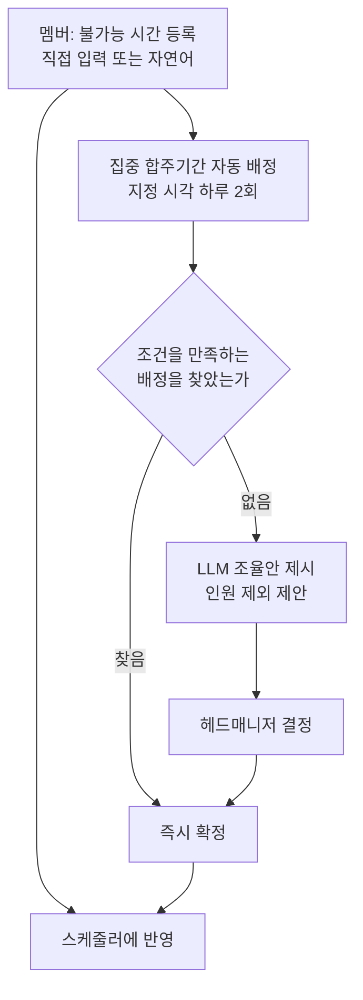

> 문서 버전: 1.3.0 draft



## Abstract

Banblit은 하나의 합주실을 여러 밴드 팀이 나눠 쓸 때 생기는 일정 충돌을 줄이기 위한 서비스다. 멤버는 자신이 합주에 참여할 수 없는 시간만 등록하고, 공연을 앞둔 집중 합주기간에는 시스템이 그 정보를 모아 팀별 합주 자리를 자동으로 배정한다. 자동 배정으로 답이 나오지 않으면 사람이 고를 수 있는 조율안을 만들어 관리자의 결정을 돕는다. 이 문서는 v1 기획의 전체 지도이며, 각 기능은 아래 하위 paper로 이어진다.

## Introduction

밴드 팀들이 하나의 합주실을 공유하면 팀 간 시간이 자주 겹친다. 특히 한 사람이 여러 팀에 속해 있을 때, 그 사람의 일정이 한 번 바뀌면 관련된 여러 팀의 일정이 연쇄로 무너진다. 이 조정을 사람이 손으로 처리하는 것이 가장 큰 병목이다. Banblit은 이 조정을 자동화하고, 자동으로 풀리지 않는 부분만 사람의 판단으로 넘긴다. 첫 사용자는 밴드 "IN SIX STRINGS"이며, 이후 다른 밴드에도 같은 방식으로 확장하는 것을 염두에 둔다.

## Related Work

- [계정과 역할](./accounts-and-roles/README.md) — 로그인·가입과 헤드매니저·일반멤버 권한 체계
- [팀과 소속](./teams/README.md) — 팀 생성, 참가, 사람·팀·포지션 소속 구조
- [합주실과 기간](./practice-room-and-periods/README.md) — 합주실 설정과 상시·집중 두 기간
- [스케줄러](./scheduler/README.md) — 메인 캘린더의 보기와 상호작용
- [자동 배정](./auto-assignment/README.md) — 집중 합주기간의 배정과 실패 시 조율안
- [스케줄링 API](./scheduling-api/README.md) — 자동 배정 계산을 바깥에서 부를 수 있게 여는 서버 통로
- [데이터 저장소](./database-layer/README.md) — 팀·소속·불가능시간·합주실·기간·배정을 남겨두고 규칙을 지키는 층
- [LLM 도우미](./llm-assistant/README.md) — 자연어 입력과 충돌 조율
- [게시판과 공지](./boards/README.md) — 팀 게시판과 전체 공지

## Description

Banblit의 기능은 다음과 같이 맞물린다. 멤버와 팀 정보가 바탕이 되고, 그 위에서 스케줄러가 일정을 보여주며, 집중기간에는 자동 배정이 일정을 만들고, 막힌 부분은 LLM과 헤드매니저가 함께 푼다.

```
[계정과 역할] ──▶ [팀과 소속] ──┬──▶ [스케줄러] ◀── [합주실과 기간]
      │                         │           ▲
      │                         └──▶ [자동 배정] ──▶ [LLM 도우미]
      │                                 ▲
      │                                 └── [스케줄링 API] (바깥에서 호출하는 통로)
      │
      ├──────────────▶ [게시판과 공지]
      │
      └──────────────▶ [데이터 저장소] (팀·소속·불가능시간·합주실·기간·배정을 남겨둠 — 아직 자동 배정과는 미연결)
```

- **바탕**: 사람은 계정으로 들어와 역할(헤드매니저/일반멤버)을 갖고, 팀에 소속된다.
- **보기**: 스케줄러가 팀 일정과 예약, 개인 일정을 한 화면에서 보여준다.
- **생성**: 집중 합주기간에는 자동 배정이 팀별 합주 자리를 만든다.
- **조정**: 자동 배정이 막히면 LLM이 조율안을 만들고 헤드매니저가 결정한다.
- **소통**: 팀 게시판과 전체 공지가 팀 안팎의 정보를 나눈다.
- **보존**: 데이터 저장소가 위 정보들을 요청과 무관하게 남겨두고, 저장 시점에 규칙을 지킨다.

각 부분의 자세한 규칙은 위 Related Work의 하위 paper에서 다룬다.

## Conclusion

Banblit의 핵심은 "멤버는 안 되는 시간만 넣고, 나머지는 시스템과 관리자가 푼다"이다. 전체 그림을 잡았으면, 이 서비스에서 가장 복잡한 두 부분인 [자동 배정](./auto-assignment/README.md)과 [LLM 도우미](./llm-assistant/README.md)를 먼저 읽는 것을 권한다. 부가 기능(통계, 공연 관리, 멤버 프로필 등)은 v1 이후 점진적으로 확장한다.
