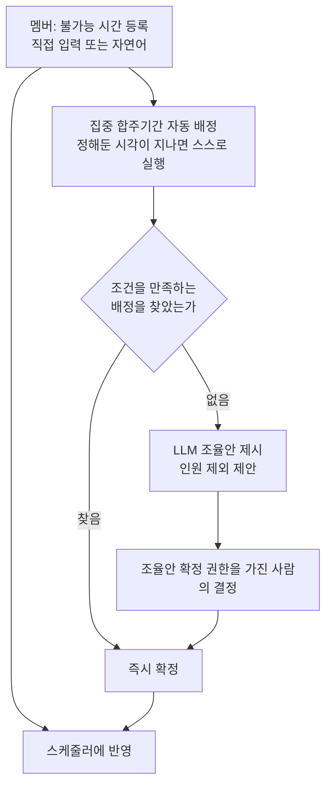

> 문서 버전: 1.8.0 draft



## Abstract

Banblit은 하나의 합주실을 여러 밴드 팀이 나눠 쓸 때 생기는 일정 충돌을 줄이기 위한 서비스다. 멤버는 자신이 합주에 참여할 수 없는 시간만 등록하고, 공연을 앞둔 집중 합주기간에는 시스템이 그 정보를 모아 팀별 합주 자리를 자동으로 배정한다. 자동 배정으로 답이 나오지 않으면 사람이 고를 수 있는 조율안을 만들어 관리자의 결정을 돕는다. 이 문서는 v1 기획의 전체 지도이며, 각 기능은 아래 하위 paper로 이어진다.

## Introduction

밴드 팀들이 하나의 합주실을 공유하면 팀 간 시간이 자주 겹친다. 특히 한 사람이 여러 팀에 속해 있을 때, 그 사람의 일정이 한 번 바뀌면 관련된 여러 팀의 일정이 연쇄로 무너진다. 이 조정을 사람이 손으로 처리하는 것이 가장 큰 병목이다. Banblit은 이 조정을 자동화하고, 자동으로 풀리지 않는 부분만 사람의 판단으로 넘긴다. 첫 사용자는 밴드 "IN SIX STRINGS"이며, 이후 다른 밴드에도 같은 방식으로 확장하는 것을 염두에 둔다.

## Related Work

- [계정과 역할](./accounts-and-roles/README.md) — 로그인·가입과, 항목을 켜고 끄는 권한 묶음 체계
- [팀과 소속](./teams/README.md) — 팀 생성, 참가, 사람·팀·포지션 소속 구조
- [합주실과 기간](./practice-room-and-periods/README.md) — 합주실 설정과 상시·집중 두 기간
- [스케줄러](./scheduler/README.md) — 메인 캘린더의 보기와 상호작용
- [자동 배정](./auto-assignment/README.md) — 집중 합주기간의 배정과 실패 시 조율안
- [스케줄링 API](./scheduling-api/README.md) — 자동 배정 계산을 바깥에서 부를 수 있게 여는 서버 통로
- [데이터 저장소](./database-layer/README.md) — 팀·소속·불가능시간·합주실·기간·배정을 남겨두고 규칙을 지키는 층
- [LLM 도우미](./llm-assistant/README.md) — 자연어 입력과 충돌 조율
- [게시판과 공지](./boards/README.md) — 팀 게시판과 전체 공지
- [화면](./screens/README.md) — 사람이 실제로 쓰는 앱과, 그 근거로 남겨둔 설계 원본

## Description

Banblit의 기능은 다음과 같이 맞물린다. 멤버와 팀 정보가 바탕이 되고, 그 위에서 스케줄러가 일정을 보여주며, 집중기간에는 자동 배정이 일정을 만들고, 막힌 부분은 LLM과 권한을 가진 사람이 함께 푼다.

```
[계정과 역할] ──▶ [팀과 소속] ──┬──▶ [스케줄러] ◀── [합주실과 기간]
      │                         │           ▲
      │                         └──▶ [자동 배정] ──▶ [LLM 도우미]
      │                                 ▲
      │                                 └── [스케줄링 API] (바깥에서 호출하는 통로)
      │                                          │
      │                                          ▼
      │                                  [데이터 저장소] (저장된 데이터로 배정을 돌리고 결과를 남긴다)
      │
      ├──────────────▶ [게시판과 공지]
      │
      └──────────────▶ [화면] (위 기능들을 사람이 실제로 쓰는 자리)

  ※ [계정과 역할]에서 뻗는 선은 그림에 그친 것이 아니다.
    서버가 요청마다 누가 보냈는지 확인한 뒤에야 나머지로 넘긴다.
```

- **바탕**: 사람은 계정으로 들어와 팀에 소속되고, 할 수 있는 일은 **권한 항목 열한 가지를 켜고 끈 묶음**이 정한다. 두 값짜리 역할(헤드매니저/일반멤버)은 없앴다. 이 권한과 소속은 문서에만 적힌 규칙이 아니라 서버가 통로마다 확인해 지키는 것이다 — 어느 자리에 무엇이 필요한지는 [계정과 역할](./accounts-and-roles/README.md)에서 다룬다.
- **되찾기**: 비밀번호를 잊었거나 아이디를 모를 때 **메일로 되찾는다**. 재설정 링크는 한 번만 쓰이고 30분이면 만료되며, 비밀번호를 바꾸면 그 계정의 로그인이 전부 끊긴다. 그 이메일로 가입한 계정이 있는지 없는지는 알려주지 않는다 — 자세한 것은 [계정과 역할](./accounts-and-roles/README.md)에 있다.
- **보기**: 스케줄러가 팀 일정과 예약, 개인 일정을 한 화면에서 보여준다.
- **생성**: 집중 합주기간에는 자동 배정이 팀별 합주 자리를 만든다. 기간마다 정해둔 하루 두 번의 계산 시각이 지나면 **사람이 아무것도 누르지 않아도 계산이 스스로 돈다** — 서버와 별도로 도는 서비스가 그 일을 맡는다. 자세한 것은 [자동 배정](./auto-assignment/README.md)에 있다.
- **조정**: 자동 배정이 막히면 LLM이 조율안을 만들고, 조율안 확정 항목을 가진 사람이 결정한다.
- **알림**: 계산이 돌아 시간표가 실제로 저장되면, 그 기간에 자리를 받은 팀의 사람에게 알림이 남는다. 자리를 못 받은 팀 사람과 팀이 없는 사람에게는 남지 않는다. 알림은 달력 화면 오른쪽 목록의 맨 위에 뜨고, 앱으로 밀어 보내는 알림은 아직 없다 — 언제 남는지는 [자동 배정](./auto-assignment/README.md)에, 화면 자리는 [스케줄러](./scheduler/README.md)에 있다.
- **소통**: 팀 게시판과 전체 공지가 팀 안팎의 정보를 나눈다. 글에 **파일을 붙일 수 있게 됐다** — 파일 하나에 300MB까지, 받을 종류만 적어두고 나머지는 거절하며, 서버 디스크에 둔다. 자세한 것은 [게시판과 공지](./boards/README.md)에 있다.
- **보존**: 데이터 저장소가 위 정보들을 요청과 무관하게 남겨두고, 저장 시점에 규칙을 지킨다.
- **사용**: 화면이 위 기능들을 사람이 쓸 수 있는 모양으로 내놓고, 아직 만들지 않은 통로가 무엇인지 드러낸다.

각 부분의 자세한 규칙은 위 Related Work의 하위 paper에서 다룬다. 이번에 들어온 세 가지 — 게시판 파일 첨부, 화면 안 알림, 메일로 하는 비밀번호 재설정·아이디 찾기 — 는 서버 검사 484개와 화면 검사 170개가 통과하고 타입 검사가 104개 파일에서 이상 없음을 확인했다. 첨부는 여기에 더해 실제로 파일을 올리고 다시 받아 한 바이트도 다르지 않은 것과, 허용하지 않은 종류가 거절되는 것과, 글을 지우면 파일이 사라지는 것을 눈으로 확인했다.

## Conclusion

Banblit의 핵심은 "멤버는 안 되는 시간만 넣고, 나머지는 시스템과 관리자가 푼다"이다. 전체 그림을 잡았으면, 이 서비스에서 가장 복잡한 두 부분인 [자동 배정](./auto-assignment/README.md)과 [LLM 도우미](./llm-assistant/README.md)를 먼저 읽는 것을 권한다. 부가 기능(통계, 공연 관리, 멤버 프로필 등)은 v1 이후 점진적으로 확장한다.
