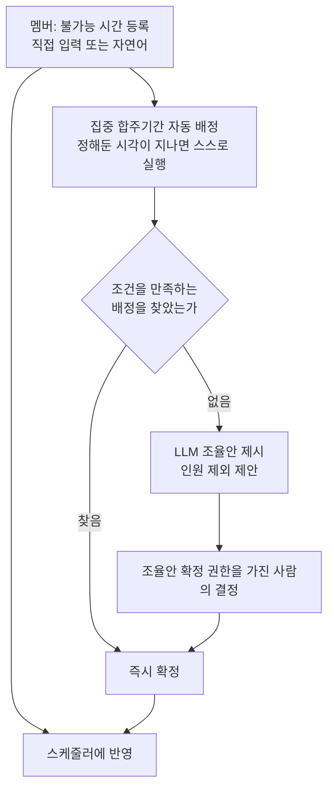

> 문서 버전: 2.0.0 draft



## Abstract

Banblit은 하나의 합주실을 여러 밴드 팀이 나눠 쓸 때 생기는 일정 충돌을 줄이려고 만든 서비스입니다. 멤버는 자신이 합주에 참여할 수 없는 시간만 등록하면 되고, 공연을 앞둔 집중 합주기간에는 시스템이 그 시간을 모아 팀별 합주 시간을 자동으로 배정합니다. 자동 배정으로 답이 나오지 않으면 사람이 고를 수 있는 조율안을 만들어 관리자의 결정을 돕습니다. 이 문서는 v1 기획의 전체 지도이고, 각 기능의 자세한 규칙은 아래 하위 paper에서 다룹니다.

## Introduction

밴드 팀들이 하나의 합주실을 공유하면 팀 간 시간이 자주 겹칩니다. 특히 한 사람이 여러 팀에 속해 있으면 그 사람의 일정이 한 번 바뀌는 것만으로 관련된 여러 팀의 일정이 연쇄로 무너지고, 그걸 손으로 맞추는 작업이 가장 큰 병목이었습니다.

그래서 Banblit은 일정 조정을 자동화하고, 자동으로 풀리지 않는 부분만 사람의 판단으로 넘기기로 했습니다. 첫 사용자는 밴드 "IN SIX STRINGS"이고, 이후 다른 밴드에도 같은 방식으로 확장하는 것을 염두에 두고 있습니다.

## Related Work

- [계정과 역할](./accounts-and-roles/README.md) — 로그인·가입과, 항목을 켜고 끄는 permission set 체계
- [팀과 포지션](./teams/README.md) — 팀 생성, 참가, 사람·팀·포지션 소속 구조
- [합주실과 기간](./practice-room-and-periods/README.md) — 합주실 설정과 집중 합주기간, 그 밖의 날은 예약제
- [스케줄러](./scheduler/README.md) — 메인 캘린더의 보기와 상호작용
- [자동 배정](./auto-assignment/README.md) — 집중 합주기간의 배정과 실패 시 조율안
- [스케줄링 API](./scheduling-api/README.md) — 자동 배정 계산을 바깥에서 부를 수 있게 여는 서버 endpoint
- [데이터 저장소](./database-layer/README.md) — 팀·소속·불가능시간·합주실·기간·배정을 남겨두고 규칙을 지키는 층
- [LLM 도우미](./llm-assistant/README.md) — 자연어 입력과 충돌 조율
- [게시판과 공지](./boards/README.md) — 팀 게시판과 전체 공지
- [화면](./screens/README.md) — 사람이 실제로 쓰는 앱과, 그 근거로 남겨둔 설계 원본
- [개발 환경 실행](./dev-environment/README.md) — 명령 하나로 서비스를 띄우고 준비 여부를 확인하는 절차

## Description

Banblit의 기능은 멤버와 팀 정보를 바탕으로 맞물립니다. 그 위에서 스케줄러가 일정을 보여주고, 집중기간에는 자동 배정이 일정을 만들고, 막힌 부분은 LLM과 권한을 가진 사람이 함께 풉니다.

```
[계정과 역할] ──▶ [팀과 포지션] ──┬──▶ [스케줄러] ◀── [합주실과 기간]
      │                         │           ▲
      │                         └──▶ [자동 배정] ──▶ [LLM 도우미]
      │                                 ▲
      │                                 └── [스케줄링 API] (바깥에서 호출하는 endpoint)
      │                                          │
      │                                          ▼
      │                                  [데이터 저장소] (저장된 데이터로 배정을 돌리고 결과를 남긴다)
      │
      ├──────────────▶ [게시판과 공지]
      │
      └──────────────▶ [화면] (위 기능들을 사람이 실제로 쓰는 자리)

  ※ [계정과 역할]에서 뻗는 선은 그림에 그친 것이 아니다.
    서버가 요청마다 누가 보냈는지 확인한 뒤에야 나머지로 넘긴다.
```

### 권한과 소속이 바탕을 이룹니다

사람은 계정으로 들어와 팀의 포지션을 맡고, 할 수 있는 일은 권한 항목 열여덟 가지를 켜고 끈 permission set이 정합니다. 두 값짜리 역할(헤드매니저/일반멤버)은 없앴습니다. 권한과 소속은 문서에만 적힌 규칙이 아니라 서버가 endpoint마다 확인해 지키는 것이고, 어느 endpoint에 무엇이 필요한지는 [계정과 역할](./accounts-and-roles/README.md)에서 다룹니다.

비밀번호를 잊었거나 아이디를 모를 때는 메일로 되찾습니다. 재설정 링크는 한 번만 쓰이고 30분이면 만료되며, 비밀번호를 바꾸면 그 계정의 로그인이 전부 끊깁니다. 그 이메일로 가입한 계정이 있는지 없는지는 알려주지 않습니다.

### 일정은 보여주고, 만들고, 조정합니다

스케줄러가 팀 일정과 예약, 개인 일정을 한 화면에서 보여줍니다. 집중 합주기간에는 자동 배정이 팀별 합주 시간을 만드는데, 기간마다 정해둔 하루 두 번의 계산 시각이 지나면 사람이 아무것도 누르지 않아도 계산이 스스로 실행됩니다. 서버와 별도로 동작하는 서비스가 그 일을 맡습니다. 자동 배정이 막히면 LLM이 조율안을 만들고, 조율안 확정 항목을 가진 사람이 결정합니다.

계산이 실행되어 시간표가 실제로 저장되면 그 기간에 배정을 받은 팀의 사람에게 알림이 남습니다. 배정을 받지 못한 팀 사람과 팀이 없는 사람에게는 남지 않습니다. 알림은 달력 화면 오른쪽 목록의 맨 위에 뜨고, 앱으로 밀어 보내는 알림은 아직 없습니다. 언제 남는지는 [자동 배정](./auto-assignment/README.md)에, 화면에서의 위치는 [스케줄러](./scheduler/README.md)에 있습니다.

### 나머지는 소통하고, 남기고, 내놓습니다

팀 게시판과 전체 공지가 팀 안팎의 정보를 나눕니다. 게시글에 파일을 붙일 수 있게 됐고, 파일 하나에 300MB까지 받으며, 받을 종류만 적어두고 나머지는 거절한 뒤 서버 디스크에 둡니다. 자세한 것은 [게시판과 공지](./boards/README.md)에 있습니다.

데이터 저장소는 위 정보들을 요청과 무관하게 남겨두면서 저장 시점에 규칙을 지킵니다. 화면은 이 기능들을 사람이 쓸 수 있는 모양으로 내놓고, 아직 만들지 않은 endpoint가 무엇인지 드러냅니다.

이번에 들어온 세 가지 — 게시판 파일 첨부, 화면 안 알림, 메일로 하는 비밀번호 재설정·아이디 찾기 — 는 서버 테스트 484개와 화면 테스트 170개가 통과하고 타입 검사가 104개 파일에서 이상 없음을 확인했습니다. 첨부는 여기에 더해 실제로 파일을 올리고 다시 받아 한 바이트도 다르지 않은 것, 허용하지 않은 종류가 거절되는 것, 게시글을 지우면 파일이 사라지는 것을 눈으로 확인했습니다.

## Conclusion

Banblit의 핵심은 "멤버는 안 되는 시간만 넣고, 나머지는 시스템과 관리자가 푼다"입니다. 전체 그림을 잡았다면 이 서비스에서 가장 복잡한 두 부분인 [자동 배정](./auto-assignment/README.md)과 [LLM 도우미](./llm-assistant/README.md)를 먼저 읽는 것을 권합니다. 부가 기능(통계, 공연 관리, 멤버 프로필 등)은 v1 이후 점진적으로 확장합니다.
