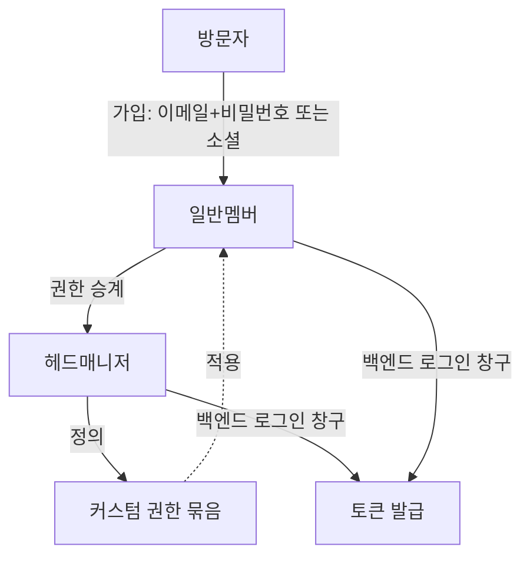

> 문서 버전: 1.1.0 draft



## Abstract

계정과 역할은 사람이 Banblit에 들어오는 입구이자, 각자가 무엇을 할 수 있는지를 정하는 바탕이다. 가입은 이메일과 비밀번호, 또는 소셜 로그인으로 한다. 역할은 크게 헤드매니저와 일반멤버로 나뉘며, 헤드매니저는 인원이 고정되지 않고 권한을 물려줄 수 있다. 또한 헤드매니저는 필요에 맞는 권한 묶음을 새로 정의할 수 있다.

## Introduction

밴드 조직은 회장·부회장처럼 운영을 맡는 사람과, 일반 멤버로 구성된다. 운영을 맡는 사람은 시간이 지나며 바뀌고, 권한도 다음 사람에게 넘어간다. 그래서 관리 권한을 특정 인원 수에 묶어두면 안 된다. 이 기능은 그런 조직의 변화를 담을 수 있도록, 역할과 권한을 유연하게 다룬다.

## Related Work

- [Banblit 개요](../README.md) — 전체 기능 지도
- [팀과 소속](../teams/README.md) — 계정이 팀에 참가하고 승인받는 흐름
- [게시판과 공지](../boards/README.md) — 헤드매니저가 작성하는 전체 공지와 권한
- [스케줄러](../scheduler/README.md) — 로그인한 뒤 처음 만나는 화면과 프로필 카드

## Description

**가입과 로그인.** 방문자는 이메일과 비밀번호로 직접 가입하거나, 소셜 로그인(구글·카카오 등)으로 가입한다. 로그인은 백엔드의 로그인 창구를 통해 이루어지고, 이후 요청은 발급받은 토큰으로 인증한다.

**로그인 화면.** 로그인과 회원가입은 같은 화면에서 오간다. 위쪽에 두 개를 나란히 두는 탭은 쓰지 않고, 서식 아래의 "계정이 없으신가요"·"이미 계정이 있으신가요" 한 줄로만 넘어간다. 들어가는 길이 두 군데면 어느 쪽을 눌러야 할지 잠깐 멈추게 되기 때문이다.

```
로그인                          회원가입
  이메일                          이름
  비밀번호                        이메일
  로그인 상태 유지 · 비밀번호 찾기   비밀번호 + 확인
  [ 로그인 ]                      맡는 포지션 (여러 개 선택)
  ── 또는 ──                     [ 가입하기 ]
  구글로 계속하기
  카카오로 계속하기
```

**가입할 때 정하는 것.** 이름, 이메일, 비밀번호, 그리고 맡는 포지션이다. 포지션은 정해진 목록에서 고르며 여러 개를 고를 수 있다. 팀마다 다른 포지션을 맡는 경우는 [팀과 소속](../teams/README.md)에서 다룬다.

**이름이 같아도 가입된다.** 동아리에는 동명이인이 있다. 기록 안에서 사람을 가르는 것은 이름이 아니라 계정마다 붙는 값이지만, 그 값은 화면에 내보내지 않는다. 사람이 보는 자리에서는 **맡은 포지션과 소속 팀**으로 구분한다 — 같은 이름이 둘이어도 한 사람은 새벽 네시의 드럼, 다른 한 사람은 파랑주의보의 기타이기 때문이다. 이 사실은 가입 화면에서 미리 알린다.

입력값은 보내기 전에 화면에서 한 번 거른다 — 빈칸, 이메일 형식, 비밀번호 길이, 두 비밀번호가 다른 경우, 포지션을 하나도 안 고른 경우. 문제가 있는 입력란 바로 아래에 무엇이 잘못됐는지 적는다.

**두 역할.**

| 역할 | 할 수 있는 일 |
| --- | --- |
| 헤드매니저 | 팀 생성, 멤버 관리, 합주실·운영시간·기간·연산 시각 설정, 조율안 결정, 공지 작성, 권한 정의 |
| 일반멤버 | 자신의 불가능 시간 관리, 팀 참가, 일정 확인 |

**헤드매니저의 특징.**

- **인원 고정 없음**: 처음에는 개발자·회장·부회장 정도가 맡지만, 수를 정해두지 않는다.
- **권한 승계**: 운영을 맡는 사람이 바뀌면 권한을 물려줄 수 있다.
- **커스텀 권한**: 고정된 두 역할에만 머무르지 않고, 필요한 권한을 묶어 새 권한을 정의할 수 있다.

## Conclusion

계정과 역할은 다른 모든 기능이 딛고 서는 바탕이다. 사람이 어떻게 팀에 들어가는지는 [팀과 소속](../teams/README.md)에서 이어서 다룬다.
