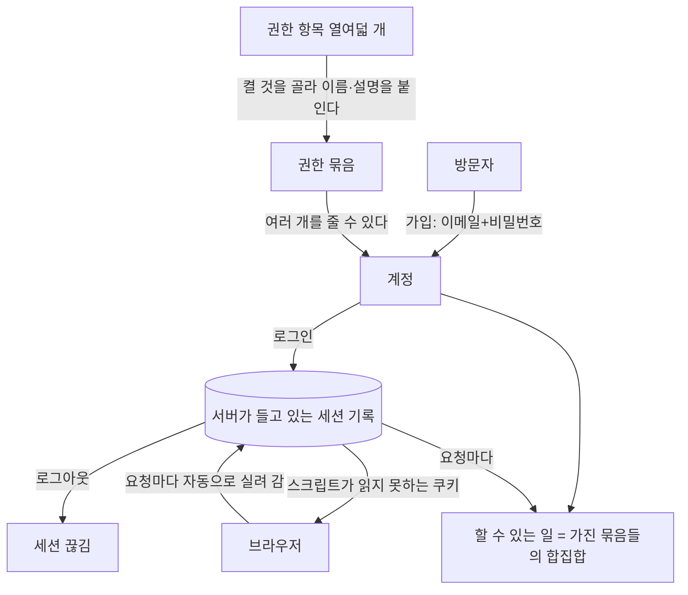
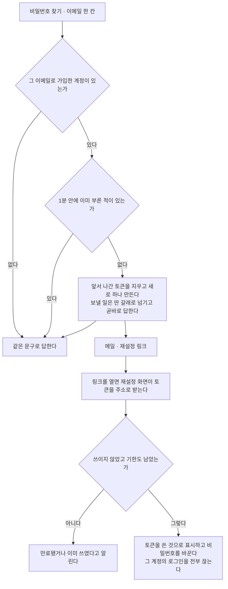
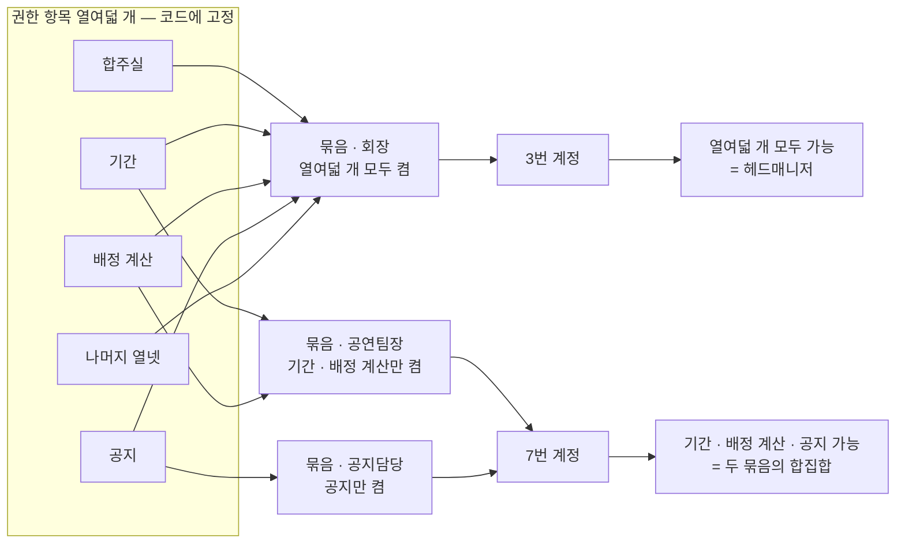
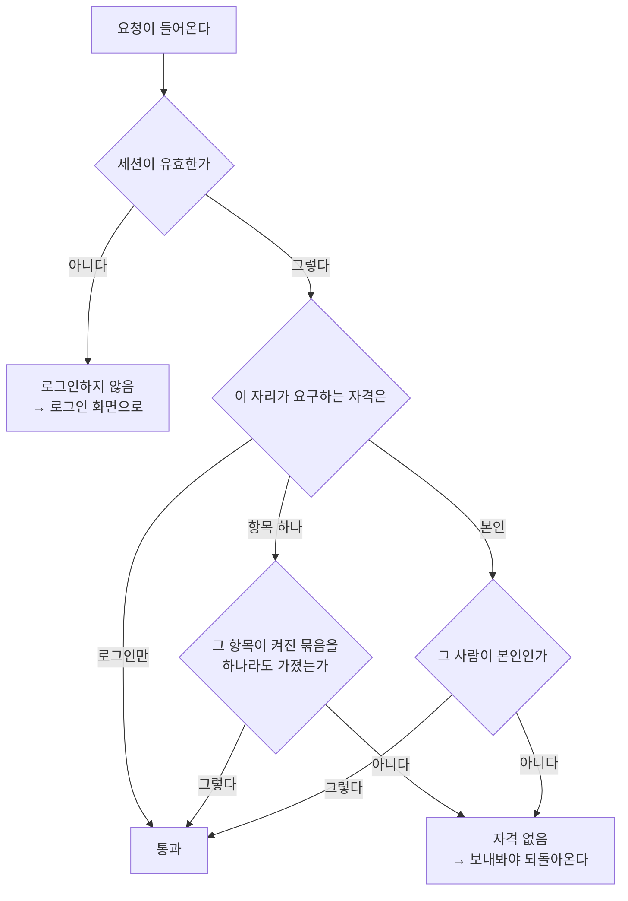

> 문서 버전: 3.0.0 draft



## Abstract

계정과 권한은 사람이 Banblit에 들어오는 입구이자, 각자가 무엇을 할 수 있는지를 정하는 바탕입니다. 가입은 이메일과 비밀번호로 합니다. 로그인한 뒤의 상태는 **서버가 직접 들고 있고**, 브라우저에는 그 상태를 가리키는 표시만 쿠키로 내려갑니다.

권한은 **정해진 항목 열여덟 개를 켜고 끄는 것**으로 정합니다. 켠 항목들을 이름과 함께 묶어 둔 것이 permission set입니다. 한 사람은 permission set을 여러 개 가질 수 있으며, 실제로 할 수 있는 일은 가진 permission set들의 합집합입니다. 헤드매니저는 따로 있는 값이 아니라 **열여덟 개가 모두 켜진 상태**를 부르는 이름이고, 그래서 권한을 물려주는 일이 곧 "모두 켜 주는 일"이 됩니다.

**이 구조가 지금 동작하는 것입니다.** 예전에 있던 헤드매니저·일반멤버 두 값짜리 역할은 없앴습니다 — 계정에 붙어 있던 역할 열 자체가 사라졌고, 서버는 요청마다 그 사람이 가진 permission set들을 합쳐 해당 endpoint가 요구하는 항목이 켜져 있는지만 봅니다.

## Introduction

밴드 조직은 회장·부회장처럼 운영을 맡는 사람과, 일반 멤버로 구성됩니다. 운영을 맡는 사람은 시간이 지나며 바뀌고, 권한도 다음 사람에게 넘어갑니다. 그래서 관리 권한을 특정 인원 수에 묶어두면 안 됩니다. 게다가 실제 조직에는 "공연만 챙기는 사람", "공지만 올리는 사람"처럼 운영을 통째로 맡지는 않는 역할이 있습니다. 이런 역할을 미리 이름 붙여 정해두면 조직이 바뀔 때마다 코드를 고쳐야 합니다. 그래서 이 기능은 역할을 몇 개 정해두는 대신, **할 수 있는 일을 항목으로 쪼개 켜고 끄게** 합니다.

여기에는 조직의 변화와 별개로 지켜야 할 것이 하나 더 있습니다. **"지금 요청을 보낸 사람이 누구인가"를 서버가 틀리지 않게 알아야** 게시판의 읽기 범위도, 항목을 가진 사람만 할 수 있다고 정해둔 일도 실제로 지켜집니다. 그 판단의 근거를 어디에 두는지가 이 문서 뒷부분의 주제입니다.

## Related Work

- [Banblit 개요](../README.md) — 전체 기능 지도
- [팀과 포지션](../teams/README.md) — 계정이 팀의 어느 자리를 맡는지
- [게시판과 공지](../boards/README.md) — 여기서 정한 "요청한 사람"을 실제로 쓰는 위치
- [스케줄러](../scheduler/README.md) — 로그인한 뒤 처음 만나는 화면과 프로필 카드
- [데이터 저장소](../database-layer/README.md) — 계정·세션과 재설정 토큰이 남는 위치
- [화면](../screens/README.md) — 아래 다섯 화면이 각자의 주소를 갖고 그려져 있는 위치

## Description

**가입과 로그인.** 방문자는 이메일과 비밀번호로 가입합니다. 가입과 로그인은 모두 서버의 endpoint를 거치며, 성공하면 그 endpoint에서 로그인 상태가 만들어집니다. 이 시점에 서버가 하는 일이 예전과 달라졌습니다.

### 로그인 상태를 서버가 들고 있습니다

로그인에 성공하면 서버는 **아무 뜻도 없는 무작위 문자열**을 하나 뽑아 브라우저에 줍니다. 그 문자열 자체에는 누구인지도, 언제까지 쓸 수 있는지도 적혀 있지 않습니다. 그런 정보는 전부 서버 쪽 세션 기록 한 줄에 들어갑니다 — 누구의 것인지, 언제 만들었는지, 언제까지 유효한지, 그리고 **끊겼는지**.

```
브라우저가 가진 것            서버가 가진 것
─────────────────           ─────────────────────────────────
무작위 문자열 하나     ──▶   그 문자열의 지문 · 누구 · 만든 시각
                             · 만료 시각 · 끊긴 시각
```

서버가 남기는 것은 문자열 원문이 아니라 **되돌릴 수 없게 줄인 지문**입니다. DB 내용이 통째로 새어도 그 값으로는 로그인할 수 없습니다.

요청이 들어올 때마다 서버는 브라우저가 보낸 문자열의 지문으로 이 기록을 찾습니다. 기록이 없거나, 끊긴 표시가 붙었거나, 기한이 지났으면 로그인하지 않은 것으로 봅니다. 유효 기한은 7일입니다.

**이 구조라서 서버가 로그인을 취소할 수 있습니다.** 예전에는 서버가 문자열에 자기 서명을 붙여 보내고, 돌아온 서명이 맞는지만 확인했습니다. 서명이 맞으면 무조건 통과였으므로, 한 번 나간 것을 기한 전에 되돌릴 방법이 없었습니다. 지금은 기록이 없으면 무효이므로 **서명이 더할 것이 없습니다** — 그래서 서명도, 서명에 쓰던 비밀 열쇠도 없앴습니다. 대신 기록 한 줄에 끊긴 표시를 남기는 것만으로 그 로그인이 즉시 무효가 됩니다.

### 토큰을 스크립트가 읽을 수 없는 위치로 옮겼습니다

예전에는 그 문자열을 응답 본문에 담아 내려보냈고, 화면이 그 문자열을 브라우저 저장소에 넣어 두었다가 요청마다 직접 실어 보냈습니다. 브라우저 저장소는 그 페이지에서 실행되는 **어떤 스크립트든 읽을 수 있는 위치**입니다. 화면에 주입된 스크립트가 하나라도 있으면 로그인 상태를 그대로 가져갈 수 있었습니다.

지금은 두 개의 쿠키로 나뉩니다.

| 쿠키 | 무엇이 들었나 | 스크립트가 읽을 수 있나 |
| --- | --- | --- |
| 세션 쿠키 | 서버 기록을 가리키는 무작위 문자열 | **읽지 못합니다** |
| 로그인 표시 쿠키 | "로그인했다"는 표시뿐 | 읽습니다 — 비밀이 아닙니다 |

세션 쿠키는 브라우저가 같은 곳으로 나가는 요청에 알아서 실어 보내므로 화면 코드가 손댈 일이 없습니다. **화면은 그 값을 보지도 만지지도 않습니다.** 다른 사이트가 유도한 요청에는 실리지 않도록 제한도 걸려 있습니다. 안전한 연결에서만 보내는 표시는 배포에서 켜고 개발에서는 끕니다 — 개발은 암호화되지 않은 연결이라 켜면 쿠키가 아예 붙지 않기 때문입니다.

두 번째 쿠키는 화면을 위한 것입니다. 로그인 뒤에만 볼 수 있는 화면들은 문지기로 감싸 두었는데, 문지기는 이 표시만 보고 없으면 로그인 화면으로 돌려보냅니다. 서버 응답을 기다렸다가 튕기면 빈 화면이 한 번 깜빡이기 때문입니다. 이 표시는 **화면을 빨리 정리하기 위한 것일 뿐 근거가 아닙니다** — 다른 기기에서 로그아웃해 세션이 이미 끊긴 경우, 표시가 남아 문지기는 통과하더라도 뒤이은 요청이 서버에서 거절됩니다.

### 로그아웃이 실제로 세션을 끊습니다

```
로그아웃 요청 ──▶ 세션 기록에 끊긴 표시를 남긴다
                └▶ 쿠키 둘을 지운다
                        │
                        ▼
             같은 문자열로 다시 물어도 거절된다
```

쿠키만 지우는 것과는 다릅니다. 쿠키를 지우면 그 브라우저만 잊을 뿐, 그 값을 어딘가 복사해 둔 쪽은 기한이 끝날 때까지 계속 쓸 수 있었습니다. 지금은 기록 자체가 끊기므로 어디서 부르든 무효입니다.

로그인하지 않은 상태에서 로그아웃을 불러도 성공으로 끝납니다. 이미 로그아웃된 것과 구분할 이유가 없고, 구분해서 알려주면 그 문자열이 유효했는지를 알려주는 셈이 됩니다.

### 비밀번호는 계산 강도까지 함께 보관합니다

비밀번호 원문은 어디에도 남기지 않습니다. 계정마다 다른 값을 섞어, 메모리를 많이 쓰도록 설계된 계산을 거친 결과만 저장합니다. 같은 비밀번호를 쓰는 두 사람의 저장값도 서로 다릅니다. 저장값에서 원문을 되짚는 것은 그 계산을 처음부터 다시 하는 것과 같습니다.

여기에 하나가 더 붙었습니다 — **그 값을 만들 때 쓴 계산 강도를 값 옆에 함께 적습니다.**

```
예전:  섞은 값 $ 계산 결과
지금:  방식 $ 강도(셋) $ 섞은 값 $ 계산 결과
```

강도를 적어두지 않으면 나중에 강도를 올리는 순간 기존 계정이 전부 로그인하지 못합니다. 그래서 강도를 올릴 수 없고, 시간이 지나 계산기가 빨라져도 그대로 둘 수밖에 없었습니다. 지금은 저장값이 자기 강도를 들고 있으므로, 기준 강도를 올려도 옛 계정은 자기가 저장될 때의 강도로 계속 검증됩니다.

**옮겨가는 것은 로그인하는 순간입니다.** 비밀번호 원문을 손에 쥘 수 있는 유일한 시점이 로그인 성공 직후이므로, 그때 지금 기준 강도로 다시 계산해 갈아 끼웁니다. 사용자는 아무것도 하지 않아도 다음 로그인부터 새 강도로 보관됩니다. 강도 표기가 아예 없는 옛 형식도 계속 검증되며, 같은 방식으로 한 번 로그인하면 새 형식으로 바뀝니다.

**틀린 이유는 알려주지 않습니다.** 이메일이 없는 것과 비밀번호가 다른 것을 같은 문장으로 거절합니다. 구분해서 알려주면 그 이메일이 가입돼 있는지를 알려주는 셈이 됩니다.

### 로그인 화면

로그인과 회원가입은 같은 화면에서 오갑니다. 위쪽에 두 개를 나란히 두는 탭은 쓰지 않고, 서식 아래의 "계정이 없으신가요"·"이미 계정이 있으신가요" 한 줄로만 넘어갑니다. 들어가는 길이 두 군데면 어느 쪽을 눌러야 할지 잠깐 멈추게 되기 때문입니다.

```
로그인                          회원가입
  이메일                          이름
  비밀번호                        이메일
  로그인 상태 유지 · 비밀번호 찾기   비밀번호 + 확인
  [ 로그인 ]                      맡는 포지션 (여러 개 선택)
  ── 또는 ──                     [ 가입하기 ]
  구글로 계속하기
  카카오로 계속하기
```

"로그인 상태 유지"는 아직 아무것도 바꾸지 않습니다. 켜든 끄든 유지 기간은 7일로 같습니다. 소셜 로그인 두 줄도 자리만 잡아둔 것이고 아직 이어져 있지 않습니다.

**가입할 때 정하는 것.** 이름, 이메일, 비밀번호, 그리고 맡는 포지션입니다. 포지션은 정해진 목록에서 고르며 여러 개를 고를 수 있습니다. 팀마다 다른 포지션을 맡는 경우는 [팀과 포지션](../teams/README.md)에서 다룹니다.

**이름이 같아도 가입됩니다.** 동아리에는 동명이인이 있습니다. 기록 안에서 사람을 가르는 것은 이름이 아니라 계정마다 붙는 값이지만, 그 값은 화면에 내보내지 않습니다. 사람이 보는 화면에서는 **맡은 포지션과 소속 팀**으로 구분합니다 — 같은 이름이 둘이어도 한 사람은 새벽 네시의 드럼, 다른 한 사람은 파랑주의보의 기타이기 때문입니다. 이 사실은 가입 화면에서 미리 알립니다. 겹칠 수 없는 것은 이메일뿐입니다.

입력값은 보내기 전에 화면에서 한 번 거릅니다 — 빈칸, 이메일 형식, 비밀번호 길이, 두 비밀번호가 다른 경우, 포지션을 하나도 안 고른 경우. 문제가 있는 입력란 바로 아래에 무엇이 잘못됐는지 적습니다. **서버도 같은 것을 다시 거릅니다.** 화면을 거치지 않고 들어오는 요청이 있기 때문입니다.

### 같은 사람인지는 네 값으로 가릅니다 (2026-09-08)

동명이인이 있습니다. 이름 하나로는 두 사람이 갈리지 않아, **이름·학과·학번·기수 네 가지가 모두 같으면 같은 사람**으로 봅니다. 그 조합이 겹치는 가입은 저장소가 거부합니다.

```
이름     학과        학번        기수
김민서   실용음악과   20231234    46      ← 이 넷이 모두 같아야 같은 사람
김민서   경영학과     20219876    43      ← 이름만 같고 다른 사람
```

이메일은 이와 별개로 계정 하나에 하나씩입니다 — 로그인할 때 쓰는 값이라 겹칠 수 없습니다. 그래서 가입이 거절되는 이유가 두 가지이고, 서버는 어느 조건에 걸렸는지에 따라 다른 문장으로 답합니다. "이미 가입된 이메일"과 "이미 가입된 사람"은 사람이 해야 할 일이 다릅니다 — 앞은 로그인하거나 비밀번호를 되찾을 일이고, 뒤는 자기 계정이 이미 있다는 뜻입니다.

이 조건이 생기기 전에 들어온 계정은 학과와 학번이 비어 있습니다. 저장소는 빈 값이 낀 조합을 겹침으로 보지 않으므로, 옛 계정끼리 서로 부딪히지 않습니다.

### 로그인 상태를 유지할지 사람이 고릅니다 (2026-09-08)

로그인 화면의 "로그인 상태 유지"를 켜면 브라우저를 닫아도 로그인이 남습니다. 끄면 브라우저를 닫는 순간 끊깁니다.

| | 서버가 들고 있는 세션 | 브라우저의 쿠키 |
| --- | --- | --- |
| 유지 안 함 | 7일 | 브라우저를 닫으면 사라짐 |
| 유지함 | 90일 | 90일까지 남음 |

**두 값을 함께 옮겨야 실제로 유지됩니다.** 서버 쪽 기한만 늘리고 쿠키를 브라우저 세션 쿠키로 두면, 창을 닫는 순간 쿠키가 사라져 살아 있는 세션을 가리킬 표시가 없어집니다. 반대로 쿠키만 오래 남기면 서버가 이미 끊은 세션을 가리키게 됩니다. 그래서 켰는지 여부가 두 값을 함께 정합니다.

### 계정을 지우면 그 사람이 남긴 것도 함께 지워집니다 (2026-09-08)

설정의 계정 탭에 탈퇴가 있습니다. 되돌릴 수 없어서, 누르는 것만으로는 안 되고 **자기 이름을 직접 적어야** 단추가 열립니다.

지우면 그 사람의 글·댓글·예약이 함께 사라집니다. 남겨 두는 쪽도 생각했지만 그러면 쓴 사람이 없는 글이 되고, 이름 자리에 무엇을 적을지를 또 정해야 합니다(사용자 결정 — "사람 날리면 싹 다 날린다"). 팀의 포지션은 사라지지 않고 **비워집니다** — 포지션은 팀의 구성이라, 한 사람이 나갔다고 팀에 구멍이 나면 안 됩니다.

```
계정 삭제
  ├─ 글 ─────────▶ 함께 삭제
  ├─ 댓글 ───────▶ 함께 삭제
  ├─ 예약 ───────▶ 함께 삭제
  ├─ 권한 묶음 ──▶ 그 사람에게 준 것만 회수(묶음 자체는 남음)
  └─ 팀 포지션 ──▶ 포지션은 남고 사람만 빠짐
```

### 잊은 비밀번호와 아이디는 메일로 되찾습니다 (2026-09-07)

비밀번호 찾기·아이디 찾기·재설정 세 화면은 오랫동안 **성공한 척만** 하고 있었습니다. 본인 확인 수단을 정하지 않았기 때문입니다. 수단을 **메일**로 정하고 만들었습니다. 이미 가입에서 이메일을 받고 있고, 그 메일함에 닿을 수 있는 것 자체가 본인 확인이 됩니다.



**정한 것.**

| 무엇 | 어떻게 | 왜 |
| --- | --- | --- |
| 쓸 수 있는 횟수 | 한 번. 쓰고 나면 무효가 됩니다 | 한 번 나간 링크가 계속 살아 있으면 메일함을 나중에 본 사람도 계정을 가져갈 수 있습니다 |
| 유효 기간 | 30분 | 로그인 상태(7일)와 다릅니다 — 아래에서 따로 다룹니다 |
| 저장하는 값 | 원문이 아니라 되돌릴 수 없게 줄인 지문 | 로그인 상태를 다루는 방식과 같습니다. DB가 통째로 새도 그 값으로는 비밀번호를 바꾸지 못합니다 |
| 한 계정에 살아 있는 토큰 | 언제나 하나 | 새로 만들 때 앞서 나간 것을 지웁니다 |
| 되풀이 요청 | 1분 안에 다시 부르면 새로 만들지도, 메일을 보내지도 않습니다 | 이 endpoint는 로그인 없이 열려 있어 누구든 되풀이해 부를 수 있습니다. 막지 않으면 남의 메일함에 재설정 링크를 계속 넣을 수 있습니다 |

**30분으로 잡은 이유.** 로그인 상태는 7일인데 이 토큰은 그보다 훨씬 짧습니다. 이 토큰 하나면 계정을 통째로 가져갈 수 있고, 그동안 메일함에 그대로 남아 있기 때문입니다. 덮어야 하는 시간은 **메일이 도착해 사람이 열어 보고 새 비밀번호를 정하는 동안**뿐입니다. 그 이상 살려둘 이유가 없습니다.

**비밀번호를 바꾸면 그 계정의 로그인이 전부 끊깁니다.** 안 끊으면, 비밀번호를 바꿔도 남이 이미 들고 있는 로그인이 새 비밀번호와 무관하게 계속 유지됩니다. 비밀번호를 바꾸는 이유가 대개 "누가 들어와 있는 것 같다"이므로, 바꾸는 일과 끊는 일은 한 몸이어야 합니다.

**그 이메일로 가입한 계정이 있는지 없는지 알려주지 않습니다.** 있든 없든 같은 응답을 줍니다. 갈라 답하면 그 이메일이 가입돼 있는지를 알려주는 셈이고, 그것만으로도 명단이 새기 때문입니다.

여기에는 눈에 잘 안 띄는 새는 구멍이 하나 더 있습니다. **답하는 데 걸리는 시간**입니다. 계정이 있을 때만 메일을 보내는데, 보내는 일을 끝까지 기다렸다가 답하면 계정이 있는 요청만 몇 초 느려집니다. 문구가 같아도 걸린 시간이 다르면 갈라낼 수 있습니다. 그래서 **보내는 일을 딴 갈래로 넘기고 곧바로 답합니다.**

```
계정이 없다  ──▶  곧바로 같은 문구
계정이 있다  ──▶  곧바로 같은 문구  (메일은 그 뒤에 따로 나간다)
```

**아이디 찾기는 이름과 이메일이 함께 맞을 때만** 그 주소로 안내 메일을 보냅니다. 화면에 아이디를 보여주지 않는 이유는 두 가지입니다 — 아이디가 곧 이메일이라 보여줄 것이 애초에 없고, 일부를 가려서 보여줘도 도메인과 앞 글자가 샙니다. 이름 하나만으로 찾게 두지 않는 것은 동아리에 동명이인이 있어서입니다. 이름만으로 훑으면 남의 이메일을 알아낼 수 있습니다. 메일함 주인만 볼 수 있는 곳으로 보내면 아무것도 새지 않습니다.

**메일 설정이 없으면 실제로 보내지 않습니다.** 개발과 배포가 다르게 동작합니다.

| 어디 | 메일 설정이 없을 때 | 왜 |
| --- | --- | --- |
| 개발 | 보낼 내용을 기록에 남깁니다 — 개발에서는 그 기록으로 메일 내용을 확인합니다 | 메일 계정 없이도 재설정 링크를 눌러 볼 수 있어야 합니다 |
| 배포 | 못 보냈다는 사실만 남기고 내용은 남기지 않습니다 | 본문에 재설정 링크가 들어 있습니다. 설정을 빠뜨린 배포에서 기록으로 새면 그것으로 계정을 가져갈 수 있습니다 |

**재설정 화면은 토큰을 주소로 받습니다.** 메일에 담긴 링크가 토큰을 달고 그 화면을 엽니다. 사람이 옮겨 적을 길이가 아니라 입력칸으로 받지 않습니다.

**확정된 시안이 바뀐 부분이 하나 있습니다.** 비밀번호 찾기 화면은 원래 **아이디와 전화번호를 받아 휴대전화로 본인 확인**하는 모양이었고, 머리글도 "가입한 휴대전화 번호로 찾기"였습니다. 본인 확인을 메일로 정하면서 이 화면은 **이메일 한 칸**이 됐고, 머리글도 "가입한 이메일로 재설정 링크 받기"로, 단추도 "재설정 메일 받기"로 함께 바뀌었습니다.

```
확정 시안                         지금
─────────────────────           ─────────────────────
아이디                           이메일
전화번호                          [ 재설정 메일 받기 ]
[ 휴대전화 인증 ]
"가입한 휴대전화 번호로 찾기"      "가입한 이메일로 재설정 링크 받기"
```

전화번호는 가입에서 받지도 않는 값이라, 그대로 두면 이 화면만 따로 전화번호를 모으고 문자 보내는 곳과 계약해야 했습니다. 설계 원본은 판정 기준이므로 고치지 않고 그대로 두었습니다 — 원본과 지금이 다른 부분이 여기라는 것을 이 문단이 대신합니다.

**소셜 로그인은 아직입니다.** 로그인 화면 아래 두 줄은 여전히 자리만 잡아둔 것입니다. 배포 주소가 정해져야 그쪽에 등록하고 돌아올 주소를 지정할 수 있습니다.

**table이 하나 늘었습니다.** 재설정 토큰을 담는 table이며, DB에서 어떤 제약이 걸려 있는지는 [데이터 저장소](../database-layer/README.md)에서 다룹니다.

**어떻게 확인했나.** 같은 토큰을 두 번 써 보면 두 번째가 거절되는지, 기한이 지난 토큰이 거절되는지, 가입한 이메일과 가입하지 않은 이메일이 같은 응답을 주는지, 1분 안에 다시 부르면 아무것도 새로 나가지 않는지, 비밀번호를 바꾼 뒤 그 계정의 예전 로그인이 전부 끊기는지, 이름이 다르면 아이디 안내가 나가지 않는지를 테스트에 담았습니다. 서버 테스트 486개가 통과하고, 타입 검사는 104개 파일에서 이상이 없습니다.

### 권한은 항목을 켜고 끄는 것으로 정합니다

관리 권한은 열여덟 개 항목으로 쪼갭니다. 각 항목은 켜져 있거나 꺼져 있습니다.

| 권한 항목 | 켜면 할 수 있는 일 |
| --- | --- |
| 합주실 만들기 | 합주실을 새로 만들기 |
| 합주실 수정 | 합주실의 여닫는 시각 고치기 |
| 기간 만들기 | 기간을 새로 만들기 |
| 기간 수정 | 기간과 그 계산 시각 고치기 |
| 팀 만들기 | 팀을 새로 만들기 |
| 팀 수정 | 팀 이름과 포지션 구성 고치기 |
| 팀 삭제 | 팀 지우기 |
| 멤버 추가 | 팀 포지션에 사람 넣기 |
| 멤버 삭제 | 팀 포지션에서 사람 빼기 |
| 공지 작성 | 공지 쓰기 |
| 게시판 관리 | 남이 쓴 글·댓글 수정·삭제 |
| 예약 관리 | 남의 예약 수정·삭제 |
| 배정 계산 | 배정 계산 실행 |
| 계산 결과 보기 | 계산 결과와 아직 확정되지 않은 조율안 보기 |
| 조율안 확정 | 조율안 하나를 골라 확정 |
| 되돌리기 | 이전 회차로 되돌리기, 지난 회차의 시간표 보기 |
| 권한 관리 | 권한 묶음 만들기·수정·삭제 |
| 권한 부여 | 사람에게 권한 묶음 주고 빼기 |

**만들기와 수정·삭제를 따로 둡니다.** 예전에는 "합주실"·"팀" 하나로 만들기와 고치기를 함께 열었습니다. 그러면 새로 만들 일만 맡은 사람에게 이미 있는 것을 고치고 지우는 힘까지 함께 주게 됩니다. 지금은 일어나는 동작 하나가 항목 하나입니다 — 만들기·수정·삭제·부여가 각각 자기 자리를 갖습니다.

**"권한 관리"와 "권한 부여"도 갈랐습니다.** 묶음을 정의하는 일과 그 묶음을 사람에게 붙이는 일은 다른 일입니다. 묶음만 설계하는 사람과, 정해진 묶음을 나눠 주기만 하는 사람을 따로 둘 수 있습니다.

**항목 목록은 코드에 고정합니다.** 포지션 목록은 데이터로 두었지만 항목 목록은 이유가 다릅니다. 항목이 하나 늘면 그 항목을 실제로 막는 서버 쪽 검사도 같이 늘어야 합니다. 목록만 데이터로 늘릴 수 있게 해두면 켜고 끌 수는 있는데 아무것도 막지 못하는 항목이 생깁니다. 실제로 막는 코드가 곧 목록이므로 둘을 떼어 놓지 않습니다.

**permission set.** 이름 하나, 설명 한 줄, 켜진 항목들을 담은 것입니다. "회장", "공연팀장" 같은 것을 만들어 둡니다. 설정 화면의 멤버 탭에서 새 묶음을 만들고, 켤 항목을 골라 이름과 설명을 적어 저장하면 묶음 하나가 생깁니다.

**설명은 반드시 적어야 합니다.** 항목 목록만 남기면 "이 묶음이 왜 있는가"가 사라집니다. 항목을 하나씩 읽어 의도를 되짚는 것과, 한 줄로 적힌 의도를 읽는 것은 다른 일입니다. 그래서 이름과 마찬가지로 빈 설명은 거부합니다.

**한 사람은 permission set을 여러 개 가질 수 있고, 실제로 할 수 있는 일은 가진 permission set들의 합집합입니다.** 가진 permission set 중 하나에서라도 켜져 있으면 할 수 있고, 어느 permission set에서도 켜져 있지 않으면 못 합니다. permission set끼리 서로 막지 않으므로 어느 쪽이 이기는지를 따로 정할 일이 없습니다.



**헤드매니저는 따로 있는 값이 아니라 열여덟 개가 모두 켜진 상태입니다.** 그런 permission set을 가진 사람이 헤드매니저입니다. 여러 명이 동시에 헤드매니저일 수 있습니다 — 인원을 고정하지 않는다는 기존 약속이 이 구조에서는 따로 정할 것 없이 따라옵니다. 그래서 **계정에 붙어 있던 역할 열은 없앴습니다.** 역할 열과 permission set이 둘 다 있으면 서로 어긋날 때 어느 쪽이 이기는지를 또 정해야 하고, 그것을 정하는 순간 사람이 화면에서 본 것과 서버가 지키는 것이 갈릴 여지가 생깁니다.

**화면에 나오는 "헤드매니저"라는 글자는 저장된 값이 아니라 셈해서 나온 것입니다.** 내 계정을 물으면 서버가 가진 항목 목록을 함께 주고, 그 목록이 열여덟 개를 다 채울 때만 그 이름을 붙입니다. 이름을 저장해 두면 항목을 하나 뺀 뒤에도 그 이름이 남아, 사람이 화면에서 본 것과 서버가 지키는 것이 갈립니다.

**권한을 바꿀 수 있는 사람은 "권한 변경" 항목을 가진 사람뿐입니다.** 그 사람은 누구의 permission set이든 주고 뺄 수 있습니다 — 자기 것도 포함입니다. 그 항목이 없으면 아무의 권한도 바꾸지 못하며 자기 것도 건드리지 못합니다. 본인이냐 남이냐로 가르는 예외는 두지 않습니다. 부분 권한만 받은 사람이 자기 권한을 스스로 올리지 못하는 것은, 그 사람에게 "권한 변경"이 꺼져 있기 때문이지 본인이라서가 아닙니다.

**아무도 없이 시작할 수는 없습니다.** 그래서 가장 먼저 가입하는 사람이 열여덟 개가 모두 켜진 permission set을 받습니다. 그런 permission set이 DB에 없으면 가입 시점에 하나 만들어 붙입니다. 두 번째부터 가입하는 사람은 아무 permission set도 받지 않습니다 — 누군가 줘야 갖습니다.

### 권한은 이렇게 넘어갑니다

개발자가 첫 번째 헤드매니저입니다. 개발이 끝나면 현재 회장에게 넘기고, 회장은 임기가 차면 다음 회장에게 넘깁니다. 넘기는 일은 두 걸음입니다 — **다음 사람에게 모두 켜 주고, 자기 것을 끕니다.**

```
① 개발자가 회장에게        ② 개발자가 자기 것을 끈다
   모두 켜진 묶음을 준다

개발자 [모두 켬]           개발자 [모두 켬]          개발자 [없음]
회장   [없음]        ──▶   회장   [모두 켬]   ──▶   회장   [모두 켬]

③ 회장이 다음 회장에게      ④ 회장이 자기 것을 끈다
   모두 켜진 묶음을 준다

회장     [모두 켬]         회장     [모두 켬]        회장     [없음]
다음회장 [없음]      ──▶   다음회장 [모두 켬]  ──▶   다음회장 [모두 켬]
```

②와 ④에서 자기 것을 끄는 데 별도의 예외가 필요하지 않습니다. 아직 "권한 변경"이 켜져 있는 동안 스스로 끄는 것이고, 끄고 나면 그다음부터는 자기 권한도 못 바꿉니다.

①과 ②, ③과 ④ 사이에는 **두 사람이 동시에 헤드매니저인 시점**이 있습니다. 이 시점은 피할 일이 아니라 필요한 것입니다. 넘기는 쪽이 먼저 내려놓으면 아무도 권한을 줄 수 없는 상태가 되어 조직 전체가 잠깁니다.

### 두 값짜리 역할에서 여기로 옮겨왔습니다 (2026-09-07)

옛 구조에서 이 구조로 갈아탄 부분을 나란히 놓으면 다음과 같습니다.

| | 예전 | 지금 |
| --- | --- | --- |
| 계정이 가진 것 | 헤드매니저·일반멤버 두 값 중 하나 | permission set 여럿 — 하나도 없을 수 있습니다 |
| 판정하는 방법 | 그 값이 헤드매니저인지 봅니다 | 가진 permission set 가운데 그 항목이 하나라도 켜져 있는지 봅니다 |
| permission set 만들기 | 없었습니다 | 설정 화면의 권한 탭에서 항목을 골라 이름을 붙여 저장합니다 |
| 권한 주고 빼기 | 없었습니다 — 첫 가입자 말고는 헤드매니저가 될 길이 아예 없었습니다 | "권한 변경" 항목을 가진 사람이 누구의 것이든 바꿉니다 |
| 막는 코드가 없는 항목 | — | 없습니다. 열여덟 개가 전부 실제로 막습니다 |

**이미 저장돼 있던 사람들은 저절로 옮겨졌습니다.** table을 새로 만드는 김에, 그때까지 헤드매니저였던 계정에게 항목이 모두 켜진 permission set을 붙이고 역할 열을 걷어냈습니다. 헤드매니저가 아직 없는 DB에도 그 permission set 자체는 심어 둡니다 — 나중에 첫 계정이 그 permission set을 받습니다.

```
옮기기 전                        옮긴 뒤
계정 3  역할 = 헤드매니저   ──▶   계정 3 ── [모두 켜진 묶음]
계정 7  역할 = 일반멤버     ──▶   계정 7 ── (아무 묶음도 없음)
                                  역할 열 자체가 사라진다
```

되돌리는 길도 함께 만들어 두었습니다. 되돌리면 모두 켜진 permission set을 가진 사람이 헤드매니저 역할로 돌아가고, 나머지는 일반멤버가 됩니다.

**permission set을 다루는 endpoint는 여섯이고 전부 같은 항목 하나로 막습니다.** 목록 보기, 만들기, 고치기, 지우기, 사람에게 주기, 사람에게서 빼기 — 여섯 모두 "권한 변경"이 켜진 사람만 부를 수 있습니다. 목록 보기까지 막는 것은, 그 목록에 누가 어떤 permission set을 가졌는지가 함께 들어 있기 때문입니다.

**permission set을 지우면 그 permission set을 가졌던 사람의 연결도 함께 사라집니다.** 지운 permission set을 계속 가리키는 줄이 남으면, 있지도 않은 permission set 때문에 권한을 셀 수 없게 됩니다.

**저장할 수 있는 항목 이름은 DB가 다시 거릅니다.** 모르는 이름이 섞인 요청은 endpoint에서 거절하고, 그 요청이 endpoint를 지나쳐도 DB의 제약이 한 번 더 막습니다. 켤 수는 있는데 아무것도 막지 못하는 항목이 데이터로 생기는 것을 두 겹으로 막는 것입니다.

**어떻게 확인했나.** 첫 가입자만 열여덟 개를 다 받고 그다음 가입자는 하나도 못 받는지, permission set 둘을 가진 사람의 권한이 그 합집합이 되는지, 항목 하나가 빠지면 그 endpoint가 막히는지, permission set을 빼거나 지우면 권한이 함께 돌아가는지, "권한 변경"을 가진 사람이 자기 permission set을 고치고 스스로 내려놓을 수 있는지, 그 항목이 없으면 자기 것도 못 건드리는지, 이름이 겹치거나 모르는 항목 이름이 섞인 요청이 거절되는지를 테스트에 담았습니다. 옮기는 마이그레이션은 따로, 헤드매니저였던 계정이 모두 켜진 permission set으로 옮겨가는지와 되돌렸을 때 역할이 제자리로 돌아오는지를 확인했습니다.

### 지금 서버가 지키고 있는 것

역할 구분은 오랫동안 **문서에만 있었습니다.** 서버는 요청을 보낸 사람이 누구인지 몰랐고, 그래서 헤드매니저만 할 수 있다고 적어둔 일도 아무나 부를 수 있었습니다. 로그인 상태를 서버가 직접 들고 있게 되면서 역할 구분이 실제 판정이 됐고, 그다음에 판정의 단위가 두 값짜리 역할에서 항목 열한 개로 갈렸다가, 다시 열여덟 개로 잘게 나뉘었습니다. **권한 항목 열여덟 개는 이 판정 지점을 하나씩 센 것입니다.** 처음 열한 개는 이미 막고 있던 지점에 이름을 붙인 것이었고, 그 뒤에 만들기와 수정·삭제를 가르면서 지점이 늘었습니다. 팀 참가 승인 항목은 참가 승인 자체가 없어지면서 함께 사라졌습니다.

자격은 다섯 갈래입니다.

| 누가 할 수 있나 | 어떤 일 |
| --- | --- |
| 로그인하지 않아도 | 서버가 살아 있는지 확인, 가입, 로그인, 로그아웃 — **이 넷뿐입니다** |
| 로그인한 사람 누구나 | 일정 확인, 합주실·기간 목록 보기, 명단과 포지션 보기, 예약 목록 보기, 공지 읽기 |
| 본인만 | 자기 불가능 시간 읽기·추가·삭제, 자기 예약 취소, 팀 참가 |
| 본인 또는 "팀에서 빼기"를 가진 사람 | 팀에서 빼기 |
| 그 항목이 켜진 사람만 | 위 항목표의 열여덟 줄 |

**마지막 줄은 endpoint마다 자기 항목을 따로 봅니다.** 예전에는 한 값을 보고 여덟 가지를 한꺼번에 열었습니다. 지금은 위 항목표의 열여덟 줄이 서버가 막는 지점과 하나씩 짝을 이룹니다 — 합주실 endpoint는 "합주실"만, 되돌리기 endpoint는 "되돌리기"만 봅니다.

```
예전                                  지금
                ┌─ 합주실 endpoint            합주실 항목 ──▶ 합주실 endpoint
                ├─ 기간 endpoint              기간 항목   ──▶ 기간 endpoint
역할 = 헤드매니저 ┼─ 배정 endpoint              배정 계산   ──▶ 배정 endpoint
                ├─ 되돌리기 endpoint          되돌리기    ──▶ 되돌리기 endpoint
                └─ …여덟 자리 전부            …열여덟 개가 각자 한 자리씩
```

두 항목만 짝이 조금 다릅니다. "되돌리기"는 되돌리는 endpoint와 **되돌릴 회차 목록을 보는 endpoint**를 함께 막습니다 — 그 목록에 나오는 회차가 곧 되돌릴 대상이기 때문입니다. "권한 변경"은 permission set을 다루는 여섯 endpoint를 통째로 막습니다.

열여덟 개를 다 가진 사람에게는 옛 헤드매니저와 똑같이 동작하므로, 옮겨오면서 할 수 있는 일이 줄어든 사람은 없습니다. 반대로 잘게 나누는 것이 실제로 쓸모가 있습니다 — 계산은 못 실행하지만 남이 실행한 결과를 검토만 하는 사람, 되돌리기만 맡은 사람을 따로 둘 수 있습니다.

**팀에서 빼기만 endpoint 전체를 막지 않습니다.** 본인이 스스로 나가는 것은 항목이 없어도 되기 때문입니다. 그래서 이 endpoint는 로그인만 확인해 들여보낸 뒤, 안에서 "본인인가"와 "그 항목을 가졌는가"를 함께 봅니다.

**불가능 시간은 열여덟 개를 다 켠 사람도 남의 것을 보지 못합니다.** 세 번째 줄의 "본인만"은 권한을 아예 보지 않는다는 뜻입니다. 항목을 다 켠 사람에게도 열리지 않습니다. 언제 못 나오는지에는 사정이 딸려 있어, 운영을 맡았다는 이유로 들여다볼 대상이 아닙니다. 배정 계산은 그 값을 쓰지만, 사람이 목록으로 읽는 것과는 다른 일입니다.

**로그인하지 않은 것과 자격이 없는 것을 다른 응답으로 가릅니다.** 사람이 다음에 해야 할 일이 다르기 때문입니다 — 앞은 로그인 화면으로 보내야 하고, 뒤는 보내봐야 같은 화면으로 되돌아옵니다.



### 요청에 사람 번호를 적어 보내지 않습니다

예전에는 "누구 이름으로 만들지"를 요청 안에 적어 보냈고, **서버는 그 값을 그대로 믿었습니다.** 팀 만들기, 팀 이름 바꾸기, 팀 참가, 예약 만들기, 예약 취소 — 다섯 endpoint가 그랬습니다. 적어 보내는 번호를 바꾸기만 하면 남의 이름으로 일을 벌일 수 있었습니다.

```
예전:  요청 { 만드는 사람 = 7, ... }  ──▶  서버가 7번으로 만든다
지금:  요청 { ... } + 세션 쿠키       ──▶  서버가 쿠키의 주인으로 만든다
```

지금은 다섯 endpoint 모두 **인증 쿠키의 주인**으로 정합니다. 요청 본문에서는 그 칸을 아예 없앴습니다. 화면에서도 그 값을 실어 보내던 세 곳을 지웠습니다 — 보내도 무시되는 값을 남겨두면 다음 사람이 그 값을 근거라고 오해합니다.

**팀은 이제 신청해서 들어가는 곳이 아닙니다.** 참가 승인은 없어졌습니다. 팀을 만들 때 악기별로 포지션을 몇 개 둘지 정하고, "멤버 추가"를 가진 사람이 그 포지션에 사람을 넣습니다. 빼는 것은 "멤버 삭제"입니다. 본인이 스스로 들어가거나 나가는 길은 두지 않았습니다 — 포지션 구성은 팀 전체의 배정에 직접 걸리는 값이라, 한 사람이 혼자 정할 일이 아닙니다.

### 자격을 새로 채운 두 곳

로그인을 붙이면서, 확인해야 하는데 확인하지 않고 있던 두 곳이 드러났습니다.

| 어디 | 예전 | 지금 |
| --- | --- | --- |
| 예약에 팀을 지정할 때 | 그런 팀이 있는지만 봤습니다 | **그 팀 소속인지 봅니다** |
| 배정 계산 결과를 읽을 때 | 로그인한 사람 누구나 | **"계산 결과 보기"를 가진 사람만** |

첫째 endpoint는 소속이 아닌 사람이 남의 팀 이름으로 합주실을 잡을 수 있었습니다. 전체 일정에는 그 팀이 그 시간을 쓴 것처럼 남습니다.

둘째 endpoint는 계산을 **시키는** 쪽만 막혀 있고 결과를 **읽는** 쪽은 열려 있었습니다. 그 결과 안에는 아직 확정되지 않은 조율안과, 거기서 빠지게 되는 사람의 이름이 들어 있습니다. 확정 전에 흘러나가면 이야기가 먼저 돌게 되므로 읽는 쪽도 함께 막았습니다. 지금은 이 둘이 별개 항목이라 더 잘게 나눌 수 있습니다 — "배정 계산"은 없고 "계산 결과 보기"만 켠 사람은 남이 실행한 결과를 검토만 합니다.

**어떻게 확인했나.** endpoint마다 세 가지 요청을 넣어 봅니다 — 로그인하지 않은 요청, 로그인했지만 자격이 없는 요청, 남의 번호를 적은 요청. 앞은 로그인하지 않음으로, 뒤 둘은 자격 없음으로 갈려야 합니다. 기능 이름별로 나뉜 테스트 파일들이 이 세 가지를 담고 있으며 위치는 맨 위 목록에 적혀 있습니다. 서버 테스트 486개가 통과하고, 타입 검사는 104개 파일에서 이상이 없습니다.

### 지금까지 그려진 화면

사람이 계정을 다루며 막다른 곳에 갇히지 않으려면 다섯 화면이 모두 있어야 합니다. 다섯은 서로를 오가는 길로 이어져 있습니다.

```
        로그인 ──┬──▶ 회원가입
                 ├──▶ 아이디 찾기 ◀──┐
                 └──▶ 비밀번호 찾기 ──┘
                          │ 본인 확인이 끝나면
                          ▼
                     비밀번호 재설정 ──▶ 로그인
```

비밀번호 찾기와 아이디 찾기는 서로 오갈 수 있습니다. 둘 중 무엇을 잊었는지 헷갈리는 사람이 처음 고른 자리에서 되돌아 나오지 않아도 되게 하기 위해서입니다.

입력이 틀렸다는 말은 그 칸 옆에서 합니다. 무엇이 틀렸는지를 화면 위쪽에 모아 보여주면 고쳐야 할 칸을 사람이 다시 찾아야 하기 때문입니다. 비밀번호는 길이가 모자란 것과 아예 비어 있는 것을 다른 말로 알리고, 비밀번호 확인은 "다시 입력해 달라"와 "일치하지 않는다"를 구분합니다. 같은 "틀렸다"라도 사람이 해야 할 일이 다르기 때문입니다.

다섯 화면 모두 서버에 물렸습니다. 가입·로그인·로그아웃과 "지금 로그인한 사람"에 이어, 아이디 찾기·비밀번호 찾기·재설정 세 화면도 위에서 정한 대로 실제로 메일을 띄우고 비밀번호를 바꿉니다. 아직 이어지지 않은 것은 소셜 로그인 두 줄뿐이고, 화면의 현재 상태는 [화면](../screens/README.md)에서 함께 다룹니다.

## Conclusion

계정과 권한은 다른 모든 기능이 딛고 서는 바탕입니다. 로그인 상태를 서버가 직접 들고 있게 바꾸면서 글로만 적혀 있던 역할 구분이 모든 endpoint에서 실제 판정이 됐고, 로그인 없이 부를 수 있는 것은 서버 상태 확인과 가입·로그인·로그아웃 넷뿐입니다.

그다음에 판정의 단위가 바뀌었습니다. 두 값짜리 역할을 없애고 항목을 켜고 끄는 묶음으로 옮겼고, 그 항목을 다시 동작 하나에 하나씩 열여덟 개로 쪼갰습니다. 헤드매니저는 그 열여덟 개를 모두 켠 사람을 부르는 이름일 뿐이고, 권한을 물려주는 일은 다음 사람에게 모두 켜 준 뒤 자기 것을 끄는 두 걸음입니다. 계정 쪽에 남은 것은 소셜 로그인 두 줄뿐입니다.

지금의 판정이 게시판에서 어떻게 쓰이는지는 [게시판과 공지](../boards/README.md)에서, 사람이 어떻게 팀의 포지션을 맡는지는 [팀과 포지션](../teams/README.md)에서 이어서 다룹니다.
