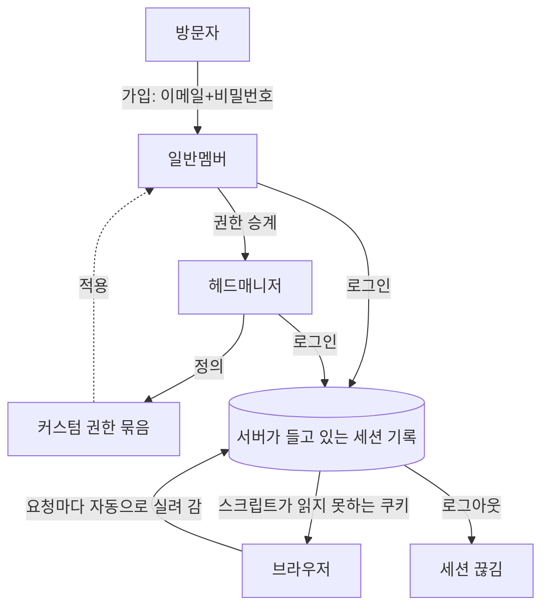

> 문서 버전: 1.4.0 draft



## Abstract

계정과 역할은 사람이 Banblit에 들어오는 입구이자, 각자가 무엇을 할 수 있는지를 정하는 바탕이다. 가입은 이메일과 비밀번호로 한다. 로그인한 뒤의 상태는 **서버가 직접 들고 있고**, 브라우저에는 그 상태를 가리키는 표만 쿠키로 내려간다. 역할은 크게 헤드매니저와 일반멤버로 나뉘며, 헤드매니저는 인원이 고정되지 않고 권한을 물려줄 수 있다. 또한 헤드매니저는 필요에 맞는 권한 묶음을 새로 정의할 수 있다.

## Introduction

밴드 조직은 회장·부회장처럼 운영을 맡는 사람과, 일반 멤버로 구성된다. 운영을 맡는 사람은 시간이 지나며 바뀌고, 권한도 다음 사람에게 넘어간다. 그래서 관리 권한을 특정 인원 수에 묶어두면 안 된다. 이 기능은 그런 조직의 변화를 담을 수 있도록, 역할과 권한을 유연하게 다룬다.

여기에는 조직의 변화와 별개로 지켜야 할 것이 하나 더 있다. **"지금 요청을 보낸 사람이 누구인가"를 서버가 틀리지 않게 알아야** 게시판의 읽기 범위도, 헤드매니저만 할 수 있는 일도 실제로 지켜진다. 그 판단의 근거를 어디에 두는지가 이 문서 뒷부분의 주제다.

## Related Work

- [Banblit 개요](../README.md) — 전체 기능 지도
- [팀과 소속](../teams/README.md) — 계정이 팀에 참가하고 승인받는 흐름
- [게시판과 공지](../boards/README.md) — 여기서 정한 "요청한 사람"을 실제로 쓰는 자리
- [스케줄러](../scheduler/README.md) — 로그인한 뒤 처음 만나는 화면과 프로필 카드
- [데이터 저장소](../database-layer/README.md) — 계정과 세션이 남는 자리
- [화면](../screens/README.md) — 아래 다섯 화면이 각자의 주소를 갖고 그려져 있는 자리

## Description

**가입과 로그인.** 방문자는 이메일과 비밀번호로 가입한다. 가입과 로그인은 모두 서버의 통로를 거치며, 성공하면 그 자리에서 로그인 상태가 만들어진다. 이 시점에 서버가 하는 일이 예전과 달라졌다.

### 로그인 상태를 서버가 들고 있다

로그인에 성공하면 서버는 **아무 뜻도 없는 무작위 문자열**을 하나 뽑아 브라우저에 준다. 그 문자열 자체에는 누구인지도, 언제까지 쓸 수 있는지도 적혀 있지 않다. 그런 정보는 전부 서버 쪽 세션 기록 한 줄에 들어간다 — 누구의 것인지, 언제 만들었는지, 언제까지 유효한지, 그리고 **끊겼는지**.

```
브라우저가 가진 것            서버가 가진 것
─────────────────           ─────────────────────────────────
무작위 문자열 하나     ──▶   그 문자열의 지문 · 누구 · 만든 시각
                             · 만료 시각 · 끊긴 시각
```

서버가 남기는 것은 문자열 원문이 아니라 **되돌릴 수 없게 줄인 지문**이다. 저장소 내용이 통째로 새어도 그 값으로는 로그인할 수 없다.

요청이 들어올 때마다 서버는 브라우저가 보낸 문자열의 지문으로 이 기록을 찾는다. 기록이 없거나, 끊긴 표시가 붙었거나, 기한이 지났으면 로그인하지 않은 것으로 본다. 유효 기한은 7일이다.

**이 구조라서 서버가 로그인을 취소할 수 있다.** 예전에는 서버가 문자열에 자기 서명을 붙여 보내고, 돌아온 서명이 맞는지만 확인했다. 서명이 맞으면 무조건 통과였으므로, 한 번 나간 것을 기한 전에 되돌릴 방법이 없었다. 지금은 기록이 없으면 무효이므로 **서명이 더할 것이 없다** — 그래서 서명도, 서명에 쓰던 비밀 열쇠도 없앴다. 대신 기록 한 줄에 끊긴 표시를 남기는 것만으로 그 로그인이 즉시 무효가 된다.

### 토큰이 스크립트가 읽을 수 없는 자리로 옮겨갔다

예전에는 그 문자열을 응답 본문에 담아 내려보냈고, 화면이 그것을 브라우저 저장소에 넣어 두었다가 요청마다 직접 실어 보냈다. 브라우저 저장소는 그 페이지에서 도는 **어떤 스크립트든 읽을 수 있는 자리**다. 화면에 주입된 스크립트가 하나라도 있으면 로그인 상태를 그대로 가져갈 수 있었다.

지금은 두 개의 쿠키로 나뉜다.

| 쿠키 | 무엇이 들었나 | 스크립트가 읽을 수 있나 |
| --- | --- | --- |
| 세션 쿠키 | 서버 기록을 가리키는 무작위 문자열 | **읽지 못한다** |
| 로그인 표시 쿠키 | "로그인했다"는 표시뿐 | 읽는다 — 비밀이 아니다 |

세션 쿠키는 브라우저가 같은 곳으로 나가는 요청에 알아서 실어 보내므로 화면 코드가 손댈 일이 없다. **화면은 그 값을 보지도 만지지도 않는다.** 다른 사이트가 유도한 요청에는 실리지 않도록 제한도 걸려 있고, 안전한 연결에서만 보내는 표시는 배포에서 켜고 개발에서는 끈다 — 개발은 암호화되지 않은 연결이라 켜면 쿠키가 아예 붙지 않기 때문이다.

두 번째 쿠키는 화면을 위한 것이다. 로그인 뒤에만 볼 수 있는 화면들은 문지기로 감싸 두었는데, 문지기는 이 표시만 보고 없으면 로그인 화면으로 돌려보낸다. 서버 응답을 기다렸다가 튕기면 빈 화면이 한 번 깜빡이기 때문이다. 이 표시는 **화면을 빨리 정리하기 위한 것일 뿐 근거가 아니다** — 다른 기기에서 로그아웃해 세션이 이미 끊긴 경우, 표시가 남아 문지기는 통과하더라도 뒤이은 요청이 서버에서 거절된다.

### 로그아웃이 실제로 세션을 끊는다

```
로그아웃 요청 ──▶ 세션 기록에 끊긴 표시를 남긴다
                └▶ 쿠키 둘을 지운다
                        │
                        ▼
             같은 문자열로 다시 물어도 거절된다
```

쿠키만 지우는 것과는 다르다. 쿠키를 지우면 그 브라우저만 잊을 뿐, 그 값을 어딘가 복사해 둔 쪽은 기한이 끝날 때까지 계속 쓸 수 있었다. 지금은 기록 자체가 끊기므로 어디서 부르든 무효다.

로그인하지 않은 상태에서 로그아웃을 불러도 성공으로 끝난다. 이미 로그아웃된 것과 구분할 이유가 없고, 구분해서 알려주면 그 문자열이 유효했는지를 알려주는 셈이 된다.

### 비밀번호는 계산 강도까지 함께 보관한다

비밀번호 원문은 어디에도 남기지 않는다. 계정마다 다른 값을 섞어, 메모리를 많이 쓰도록 설계된 계산을 거친 결과만 저장한다. 같은 비밀번호를 쓰는 두 사람의 저장값도 서로 다르고, 저장값에서 원문을 되짚는 것은 그 계산을 처음부터 다시 하는 것과 같다.

여기에 하나가 더 붙었다 — **그 값을 만들 때 쓴 계산 강도를 값 옆에 함께 적는다.**

```
예전:  섞은 값 $ 계산 결과
지금:  방식 $ 강도(셋) $ 섞은 값 $ 계산 결과
```

강도를 적어두지 않으면 나중에 강도를 올리는 순간 기존 계정이 전부 로그인하지 못한다. 그래서 강도를 올릴 수 없고, 시간이 지나 계산기가 빨라져도 그대로 둘 수밖에 없었다. 지금은 저장값이 자기 강도를 들고 있으므로, 기준 강도를 올려도 옛 계정은 자기가 저장될 때의 강도로 계속 검증된다.

**옮겨가는 것은 로그인하는 순간이다.** 비밀번호 원문을 손에 쥘 수 있는 유일한 시점이 로그인 성공 직후이므로, 그때 지금 기준 강도로 다시 계산해 갈아 끼운다. 사용자는 아무것도 하지 않아도 다음 로그인부터 새 강도로 보관된다. 강도 표기가 아예 없는 옛 형식도 계속 검증되며, 같은 방식으로 한 번 로그인하면 새 형식으로 바뀐다.

**틀린 이유는 알려주지 않는다.** 이메일이 없는 것과 비밀번호가 다른 것을 같은 문장으로 거절한다. 구분해서 알려주면 그 이메일이 가입돼 있는지를 알려주는 셈이 된다.

### 로그인 화면

로그인과 회원가입은 같은 화면에서 오간다. 위쪽에 두 개를 나란히 두는 탭은 쓰지 않고, 서식 아래의 "계정이 없으신가요"·"이미 계정이 있으신가요" 한 줄로만 넘어간다. 들어가는 길이 두 군데면 어느 쪽을 눌러야 할지 잠깐 멈추게 되기 때문이다.

```
로그인                          회원가입
  이메일                          이름
  비밀번호                        이메일
  로그인 상태 유지 · 비밀번호 찾기   비밀번호 + 확인
  [ 로그인 ]                      맡는 포지션 (여러 개 선택)
  ── 또는 ──                     [ 가입하기 ]
  구글로 계속하기
  카카오로 계속하기
```

"로그인 상태 유지"는 아직 아무것도 바꾸지 않는다. 켜든 끄든 유지 기간은 7일로 같다. 소셜 로그인 두 줄도 자리만 잡아둔 것이고 아직 이어져 있지 않다.

**가입할 때 정하는 것.** 이름, 이메일, 비밀번호, 그리고 맡는 포지션이다. 포지션은 정해진 목록에서 고르며 여러 개를 고를 수 있다. 팀마다 다른 포지션을 맡는 경우는 [팀과 소속](../teams/README.md)에서 다룬다.

**이름이 같아도 가입된다.** 동아리에는 동명이인이 있다. 기록 안에서 사람을 가르는 것은 이름이 아니라 계정마다 붙는 값이지만, 그 값은 화면에 내보내지 않는다. 사람이 보는 자리에서는 **맡은 포지션과 소속 팀**으로 구분한다 — 같은 이름이 둘이어도 한 사람은 새벽 네시의 드럼, 다른 한 사람은 파랑주의보의 기타이기 때문이다. 이 사실은 가입 화면에서 미리 알린다. 겹칠 수 없는 것은 이메일뿐이다.

입력값은 보내기 전에 화면에서 한 번 거른다 — 빈칸, 이메일 형식, 비밀번호 길이, 두 비밀번호가 다른 경우, 포지션을 하나도 안 고른 경우. 문제가 있는 입력란 바로 아래에 무엇이 잘못됐는지 적는다. **서버도 같은 것을 다시 거른다.** 화면을 거치지 않고 들어오는 요청이 있기 때문이다.

**두 역할.**

| 역할 | 할 수 있는 일 |
| --- | --- |
| 헤드매니저 | 팀 생성, 멤버 관리, 합주실·운영시간·기간·연산 시각 설정, 조율안 결정, 공지 작성, 권한 정의 |
| 일반멤버 | 자신의 불가능 시간 관리, 팀 참가, 일정 확인 |

**헤드매니저의 특징.**

- **인원 고정 없음**: 처음에는 개발자·회장·부회장 정도가 맡지만, 수를 정해두지 않는다.
- **권한 승계**: 운영을 맡는 사람이 바뀌면 권한을 물려줄 수 있다.
- **커스텀 권한**: 고정된 두 역할에만 머무르지 않고, 필요한 권한을 묶어 새 권한을 정의할 수 있다.

인원을 고정하지 않는다고 해서 아무도 없이 시작할 수는 없다. 그래서 **가장 먼저 가입하는 사람이 헤드매니저가 된다.** 그다음부터는 그 사람이 권한을 물려주거나 새로 정의한다.

### 지금까지 그려진 화면

사람이 계정을 다루며 막다른 곳에 갇히지 않으려면 다섯 자리가 모두 있어야 한다. 다섯은 서로를 오가는 길로 이어져 있다.

```
        로그인 ──┬──▶ 회원가입
                 ├──▶ 아이디 찾기 ◀──┐
                 └──▶ 비밀번호 찾기 ──┘
                          │ 본인 확인이 끝나면
                          ▼
                     비밀번호 재설정 ──▶ 로그인
```

비밀번호 찾기와 아이디 찾기는 서로 오갈 수 있다. 둘 중 무엇을 잊었는지 헷갈리는 사람이 처음 고른 자리에서 되돌아 나오지 않아도 되게 하기 위해서다.

**입력이 틀렸다는 말은 그 칸 옆에서 한다.** 무엇이 틀렸는지를 화면 위쪽에 모아 보여주면, 고쳐야 할 칸을 사람이 다시 찾아야 한다. 비밀번호는 길이가 모자란 것과 아예 비어 있는 것을 다른 말로 알리고, 비밀번호 확인은 "다시 입력해 달라"와 "일치하지 않는다"를 구분한다. 같은 "틀렸다"라도 사람이 해야 할 일이 다르기 때문이다.

**아직 이어지지 않은 자리.** 가입·로그인·로그아웃과 "지금 로그인한 사람"은 서버에 물려 있다. 아이디 찾기·비밀번호 찾기·재설정 세 화면은 본인 확인 수단을 정하지 않아 아직 화면 안의 입력 검사만 돈다. 소셜 로그인도 마찬가지다. 화면의 현재 상태는 [화면](../screens/README.md)에서 함께 다룬다.

## Conclusion

계정과 역할은 다른 모든 기능이 딛고 서는 바탕이다. 로그인 상태를 서버가 직접 들고 있게 바꾸면서, "요청한 사람이 누구인가"에 기대는 규칙들을 실제로 강제할 수 있게 됐다 — 그 규칙이 어떻게 쓰이는지는 [게시판과 공지](../boards/README.md)에서 볼 수 있다. 사람이 어떻게 팀에 들어가는지는 [팀과 소속](../teams/README.md)에서 이어서 다룬다.
