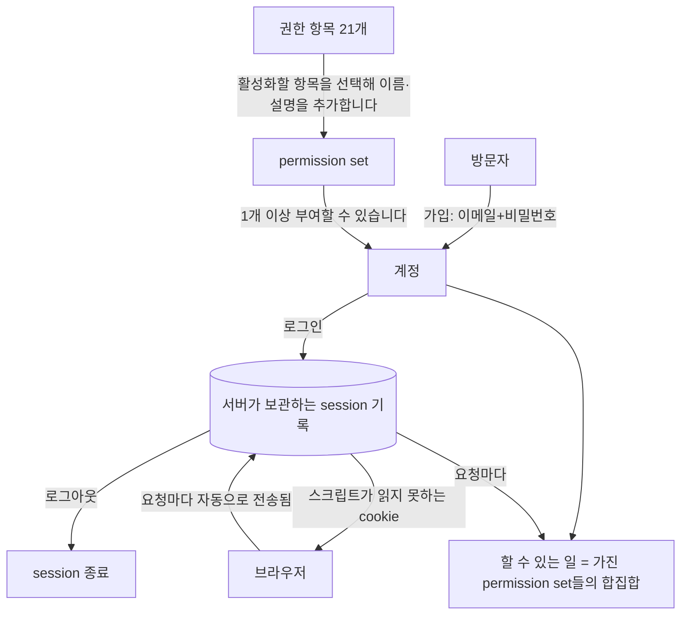
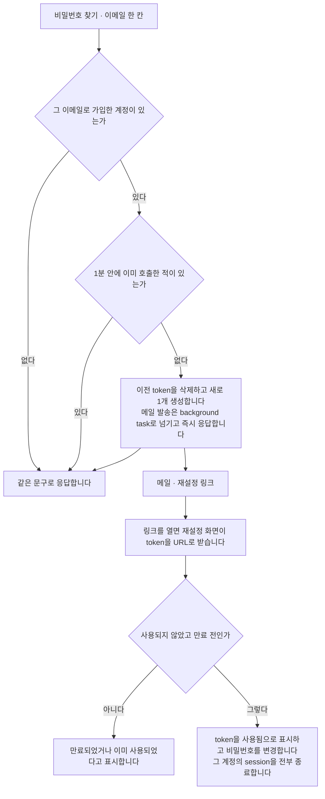
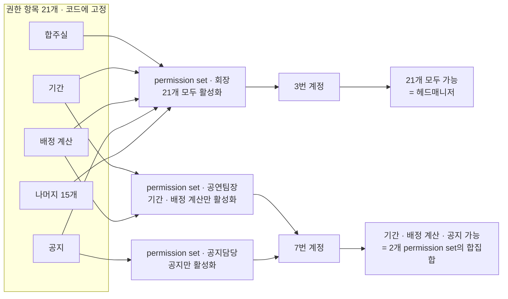
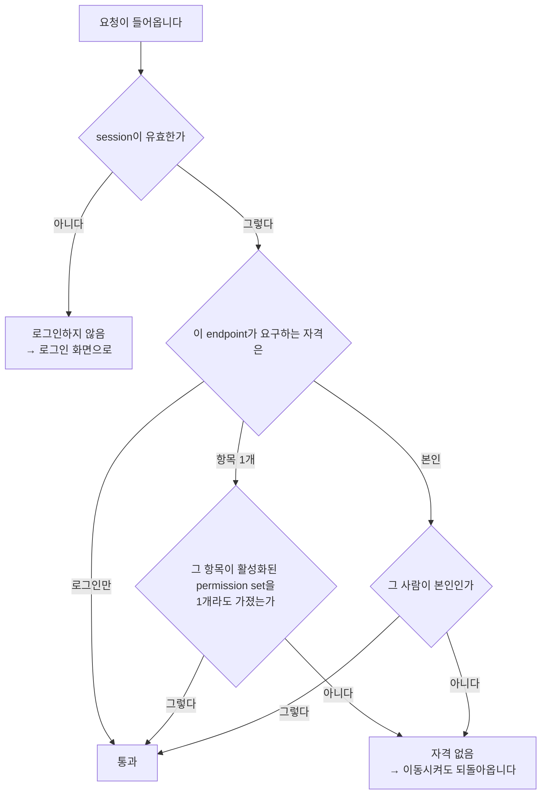

> 문서 버전: 3.1.0 draft



## Abstract

계정과 권한은 사람이 Banblit에 들어오는 입구이자, 각자가 수행할 수 있는 작업을 결정하는 바탕입니다. 가입은 이메일과 비밀번호로 진행합니다. 로그인 후 상태는 **서버가 직접 보관**하며, 브라우저에는 그 상태를 가리키는 값만 cookie(브라우저가 저장하고 같은 서버로 보내는 요청마다 자동으로 첨부하는 값)로 전달합니다.

권한은 **정해진 권한 항목 21개를 활성화하고 비활성화하는 것**으로 결정됩니다. 활성화한 항목들을 이름과 함께 묶은 것이 permission set(권한 집합)입니다. 한 사람은 permission set을 1개 이상 가질 수 있으며, 실제로 수행할 수 있는 작업은 가진 permission set들의 합집합입니다. 헤드매니저는 따로 있는 값이 아니라 **21개가 모두 활성화된 상태**를 부르는 이름이고, 따라서 권한을 물려주는 작업은 곧 "모두 활성화하는 작업"이 됩니다.

**이 구조가 현재 동작하는 구조입니다.** 이전에 있던 헤드매니저·일반멤버 2계층 역할은 제거했습니다. 계정에 붙어 있던 역할 열 자체가 삭제되었고, 서버는 요청마다 그 사람이 가진 permission set들을 합쳐 해당 endpoint가 요구하는 항목이 활성화되어 있는지만 확인합니다.

## Introduction

밴드 조직은 회장·부회장처럼 운영을 담당하는 사람과 일반 멤버로 구성됩니다. 운영을 담당하는 사람은 시간이 지나며 변경되고, 권한도 다음 사람에게 이전됩니다. 따라서 관리 권한을 특정 인원 수에 고정해서는 안 됩니다. 게다가 실제 조직에는 "공연만 담당하는 사람", "공지만 발행하는 사람"처럼 운영을 통째로 담당하지 않는 역할이 있습니다. 이런 역할을 미리 이름 붙여 정의하면 조직이 변경될 때마다 코드를 수정해야 합니다. 따라서 이 기능은 역할을 정해두는 대신, **수행할 수 있는 작업을 항목으로 세분화하여 활성화하고 비활성화**합니다.

이 구조에는 조직의 변화와 별개로 지켜야 할 사항이 하나 더 있습니다. **"현재 요청을 보낸 사람이 누구인지"를 서버가 정확히 파악**해야 게시판의 읽기 범위도, 특정 항목을 가진 사람만 수행할 수 있다고 정의한 작업도 실제로 적용됩니다. 그 판단의 근거를 어디에 두는지가 이 문서 뒷부분의 주제입니다.

## Related Work

- [Banblit 개요](../README.md) — 전체 기능 지도
- [팀과 포지션](../teams/README.md) — 계정이 팀의 어느 자리를 맡는지
- [게시판과 공지](../boards/README.md) — 이 문서에서 정한 "요청한 사람"을 실제로 쓰는 위치
- [스케줄러](../scheduler/README.md) — 로그인한 뒤 처음 만나는 화면과 프로필 카드
- [데이터 저장소](../database-layer/README.md) — 계정·session과 재설정 token이 저장되는 위치
- [화면](../screens/README.md) — 아래 5개 화면이 각자의 주소를 갖고 구현되어 있는 위치

## Description

**가입과 로그인.** 방문자는 이메일과 비밀번호로 가입합니다. 가입과 로그인은 모두 서버의 endpoint를 거치며, 성공하면 그 endpoint에서 로그인 상태가 만들어집니다. 이 시점에 서버가 하는 일이 예전과 달라졌습니다.

### 로그인 상태를 서버가 보관합니다

로그인에 성공하면 서버는 **아무 뜻도 없는 무작위 문자열** 1개를 생성해 브라우저에 전달합니다. 그 문자열 자체에는 누구인지도, 만료 시각도 포함되어 있지 않습니다. 그 정보(누구의 session(서버가 보관하는 로그인 상태 기록)인지, 생성 시각, 만료 시각, 그리고 **종료 여부**)는 전부 서버 쪽 session 기록 1행에 저장됩니다.

```
브라우저가 가진 것            서버가 가진 것
─────────────────           ─────────────────────────────────
무작위 문자열 하나     ──▶   그 문자열의 지문 · 누구 · 만든 시각
                             · 만료 시각 · 끊긴 시각
```

서버가 저장하는 값은 문자열 원문이 아니라 **hash(원문을 복원할 수 없는 고정 길이 값)**입니다. DB 내용이 전부 유출되어도 그 값으로는 로그인할 수 없습니다.

요청이 들어올 때마다 서버는 브라우저가 보낸 문자열의 hash로 이 기록을 조회합니다. 기록이 없거나, 종료 표시가 있거나, 만료 시각이 지났으면 로그인하지 않은 상태로 판정합니다. 유효 기간은 7일입니다.

**이 구조라서 서버가 로그인을 취소할 수 있습니다.** 예전에는 서버가 문자열에 서명을 추가해 보내고, 돌아온 서명이 일치하는지만 검증했습니다. 서명이 일치하면 무조건 통과였으므로, 한 번 발급한 문자열을 만료 전에 무효화할 방법이 없었습니다. 지금은 기록이 없으면 무효이므로 **서명이 필요 없습니다.** 그래서 서명과 서명에 쓰던 비밀 키를 삭제했습니다. 대신 기록 1행에 종료 표시를 저장하는 것만으로 그 로그인이 즉시 무효가 됩니다.

### token을 스크립트가 읽을 수 없는 위치로 옮겼습니다

예전에는 그 문자열을 응답 본문에 담아 반환했고, 화면이 그 문자열을 브라우저 저장소에 저장했다가 요청마다 직접 전송했습니다. 브라우저 저장소는 그 페이지에서 실행되는 **어떤 스크립트든 읽을 수 있는 위치**입니다. 화면에 주입된 스크립트가 1개라도 있으면 로그인 상태를 탈취할 수 있었습니다.

지금은 2개의 cookie로 나뉩니다.

| cookie | 무엇이 들었나 | 스크립트가 읽을 수 있나 |
| --- | --- | --- |
| session cookie | 서버 기록을 가리키는 무작위 문자열 | **읽지 못합니다** |
| 로그인 표시 cookie | "로그인했다"는 표시뿐 | 읽습니다. 비밀값이 아닙니다 |

session cookie는 브라우저가 같은 서버로 보내는 요청에 자동으로 첨부하므로 화면 코드가 처리할 부분이 없습니다. **화면은 그 값을 읽지도 수정하지도 않습니다.** 다른 사이트가 유도한 요청에는 첨부되지 않도록 제한도 설정되어 있습니다. Secure 속성(암호화된 연결에서만 cookie를 보내는 설정)은 배포에서 활성화하고 개발에서는 비활성화합니다. 개발은 암호화되지 않은 연결이라 활성화하면 cookie가 저장되지 않기 때문입니다.

2번째 cookie는 화면이 사용합니다. 로그인 뒤에만 볼 수 있는 화면들은 로그인 확인 컴포넌트로 감싸 두었는데, 이 컴포넌트는 이 표시만 확인하고 없으면 로그인 화면으로 이동시킵니다. 서버 응답을 기다린 뒤 이동시키면 빈 화면이 1회 표시되기 때문입니다. 이 표시는 **화면 이동을 빠르게 하기 위한 값일 뿐 인증 근거가 아닙니다.** 다른 기기에서 로그아웃해 session이 이미 종료된 경우, 표시가 남아 로그인 확인 컴포넌트는 통과하더라도 뒤이은 요청이 서버에서 거절됩니다.

### 로그아웃이 실제로 session을 종료합니다

```
로그아웃 요청 ──▶ 세션 기록에 끊긴 표시를 남긴다
                └▶ 쿠키 둘을 지운다
                        │
                        ▼
             같은 문자열로 다시 물어도 거절된다
```

cookie만 삭제하는 방식과는 다릅니다. cookie를 삭제하면 그 브라우저에서만 사라질 뿐, 그 값을 복사해 둔 쪽은 만료 시각까지 계속 사용할 수 있었습니다. 지금은 기록 자체가 종료되므로 어디서 요청하든 무효입니다.

로그인하지 않은 상태에서 로그아웃을 호출해도 성공을 반환합니다. 이미 로그아웃된 상태와 구분할 이유가 없고, 구분해서 응답하면 그 문자열이 유효했는지를 알려주게 됩니다.

### 비밀번호는 계산 강도까지 함께 보관합니다

비밀번호 원문은 어디에도 저장하지 않습니다. 계정마다 다른 salt(비밀번호에 섞는 계정별 무작위 값)를 섞어, 메모리를 많이 쓰도록 설계된 hash 계산을 거친 결과만 저장합니다. 같은 비밀번호를 쓰는 2명의 저장값도 서로 다릅니다. 저장값에서 원문을 복원하는 작업은 그 계산을 처음부터 다시 실행하는 작업과 같습니다.

이 저장 방식에 1가지가 추가되었습니다. **그 값을 생성할 때 쓴 계산 강도를 값 옆에 함께 저장합니다.**

```
예전:  섞은 값 $ 계산 결과
지금:  방식 $ 강도(셋) $ 섞은 값 $ 계산 결과
```

강도를 저장하지 않으면 강도를 올리는 순간 기존 계정이 전부 로그인하지 못합니다. 그래서 강도를 올릴 수 없고, 시간이 지나 하드웨어가 빨라져도 그대로 둘 수밖에 없었습니다. 지금은 저장값이 자기 강도를 포함하므로, 기준 강도를 올려도 기존 계정은 저장될 때의 강도로 계속 검증됩니다.

**새 강도로 이전하는 시점은 로그인 순간입니다.** 비밀번호 원문을 서버가 받는 유일한 시점이 로그인 성공 직후이므로, 그때 현재 기준 강도로 다시 계산해 저장값을 교체합니다. 사용자는 아무것도 하지 않아도 다음 로그인부터 새 강도로 보관됩니다. 강도 표기가 없는 이전 형식도 계속 검증되며, 같은 방식으로 1회 로그인하면 새 형식으로 교체됩니다.

**실패 이유는 알려주지 않습니다.** 이메일이 없는 경우와 비밀번호가 다른 경우를 같은 문장으로 거절합니다. 구분해서 응답하면 그 이메일이 가입되어 있는지를 알려주게 됩니다.

### 로그인 화면

로그인과 회원가입은 같은 화면에서 이동합니다. 위쪽에 2개를 나란히 두는 탭은 쓰지 않고, 서식 아래의 "계정이 없으신가요"·"이미 계정이 있으신가요" 1줄로만 이동합니다. 진입 경로가 2곳이면 어느 쪽을 눌러야 할지 판단하는 시간이 생기기 때문입니다.

```
로그인                          회원가입
  이메일                          이름
  비밀번호                        이메일
  로그인 상태 유지 · 비밀번호 찾기   비밀번호 + 확인
  [ 로그인 ]                      맡는 포지션 (1개 이상 선택)
  ── 또는 ──                     [ 가입하기 ]
  구글로 계속하기
  카카오로 계속하기
```

"로그인 상태 유지"는 아직 아무것도 변경하지 않습니다. 활성화하든 비활성화하든 유지 기간은 7일로 같습니다. 소셜 로그인 2줄도 자리만 확보한 상태이고 아직 연결되지 않았습니다.

**가입할 때 정하는 값.** 이름, 이메일, 비밀번호, 그리고 맡는 포지션입니다. 포지션은 정해진 목록에서 선택하며 1개 이상 선택할 수 있습니다. 팀마다 다른 포지션을 맡는 경우는 [팀과 포지션](../teams/README.md)에서 다룹니다.

**이름이 같아도 가입됩니다.** 동아리에는 동명이인이 있습니다. 기록 안에서 사람을 구분하는 값은 이름이 아니라 계정마다 부여되는 번호이지만, 그 번호는 화면에 표시하지 않습니다. 사람이 보는 화면에서는 **맡은 포지션과 소속 팀**으로 구분합니다. 같은 이름이 2명이어도 1명은 새벽 네시의 드럼, 다른 1명은 파랑주의보의 기타이기 때문입니다. 이 사실은 가입 화면에서 미리 안내합니다. 중복될 수 없는 값은 이메일뿐입니다.

입력값은 보내기 전에 화면에서 1차로 검증합니다. 검증 항목은 빈칸, 이메일 형식, 학번(숫자 8자리), 기수(1에서 100 사이), 비밀번호 규칙, 2개 비밀번호가 다른 경우, 포지션을 1개도 선택하지 않은 경우입니다. 문제가 있는 입력란 바로 아래에 무엇이 잘못되었는지 표시합니다. **서버도 같은 항목을 다시 검증합니다.** 화면을 거치지 않고 들어오는 요청이 있기 때문입니다.

### 같은 사람인지는 4개 값으로 구분합니다 (2026-09-08)

동명이인이 있습니다. 이름 1개로는 2명이 구분되지 않아, **이름·학과·학번·기수 4가지가 모두 같으면 같은 사람**으로 판정합니다. 그 조합이 중복되는 가입은 저장소가 거절합니다.

```
이름     학과        학번        기수
김민서   실용음악과   20231234    46      ← 이 넷이 모두 같아야 같은 사람
김민서   경영학과     20219876    43      ← 이름만 같고 다른 사람
```

이메일은 이와 별개로 계정 1개에 1개씩입니다. 로그인할 때 쓰는 값이라 중복될 수 없습니다. 그래서 가입이 거절되는 이유가 2가지이고, 서버는 어느 조건에 해당하는지에 따라 다른 문장으로 응답합니다. "이미 가입된 이메일"과 "이미 가입된 사람"은 사람이 해야 할 일이 다릅니다. "이미 가입된 이메일"은 로그인하거나 비밀번호를 재설정할 일이고, "이미 가입된 사람"은 자기 계정이 이미 있다는 뜻입니다.

이 조건이 생기기 전에 가입한 계정은 학과와 학번이 비어 있습니다. 저장소는 빈 값이 포함된 조합을 중복으로 판정하지 않으므로, 기존 계정끼리 서로 충돌하지 않습니다.

### 로그인 상태를 유지할지 사람이 선택합니다 (2026-09-08)

로그인 화면의 "로그인 상태 유지"를 활성화하면 브라우저를 닫아도 로그인이 유지됩니다. 비활성화하면 브라우저를 닫는 순간 종료됩니다.

| | 서버가 보관하는 session | 브라우저의 cookie |
| --- | --- | --- |
| 유지 안 함 | 7일 | 브라우저를 닫으면 삭제됨 |
| 유지함 | 90일 | 90일까지 유지됨 |

**2개 값을 함께 변경해야 실제로 유지됩니다.** 서버 쪽 만료 시각만 늘리고 cookie를 브라우저 session cookie(브라우저를 닫으면 삭제되는 cookie)로 두면, 창을 닫는 순간 cookie가 삭제되어 유효한 session을 가리킬 값이 없어집니다. 반대로 cookie만 오래 유지하면 서버가 이미 종료한 session을 가리키게 됩니다. 그래서 활성화 여부가 2개 값을 함께 정합니다.

### 계정을 삭제하면 그 사람의 글·댓글·예약도 함께 삭제됩니다 (2026-09-08)

설정의 계정 탭에 탈퇴가 있습니다. 되돌릴 수 없어서, 클릭만으로는 실행되지 않고 **자기 이름을 직접 입력해야** 버튼이 활성화됩니다.

삭제하면 그 사람의 글·댓글·예약이 함께 삭제됩니다. 남겨 두는 방식도 검토했지만 그러면 작성자가 없는 글이 되고, 이름 자리에 무엇을 표시할지를 또 정해야 합니다(사용자 결정: "사람 날리면 싹 다 날립니다"). 팀의 포지션은 삭제되지 않고 **비워집니다.** 포지션은 팀의 구성이라, 1명이 탈퇴했다고 팀의 포지션이 삭제되면 안 됩니다.

```
계정 삭제
  ├─ 글 ─────────▶ 함께 삭제
  ├─ 댓글 ───────▶ 함께 삭제
  ├─ 예약 ───────▶ 함께 삭제
  ├─ 권한 묶음 ──▶ 그 사람에게 준 것만 회수(묶음 자체는 남음)
  └─ 팀 포지션 ──▶ 포지션은 남고 사람만 빠짐
```

### 멤버 추방은 계정 삭제와 같습니다 (2026-09-14)

권한 항목 "멤버 추방"을 가진 사람은 설정 화면의 멤버 탭에서 다른 사람의 계정을 삭제할 수 있습니다. 추방은 탈퇴와 같은 삭제 규칙을 따릅니다(사용자 결정 2026-09-14). 위 그림과 같이 글·댓글·예약·session 이 함께 삭제되고, permission set 은 그 사람에게 부여한 연결만 회수되며, 팀 포지션은 비워지고 유지됩니다. 추방된 사람의 session 이 삭제되므로 그 사람이 다음에 보내는 요청은 로그인하지 않음(401)으로 거절됩니다.

| 요청 | 서버의 응답 |
| --- | --- |
| "멤버 추방" 항목이 없는 사람의 요청 | 자격 없음(403) |
| 자기 자신을 추방하는 요청 | 거절(422). 자기 계정은 탈퇴로만 삭제합니다 |
| 21개가 모두 활성화된 permission set 의 마지막 보유자를 추방하는 요청 | 거절(422). 권한을 부여할 사람이 0명이 됩니다 |
| 존재하지 않는 번호를 추방하는 요청 | 거절(422) |
| 그 밖의 요청 | 삭제 후 본문 없이 성공(204) |

자기 자신을 추방할 수 없게 한 이유는, 탈퇴는 자기 이름을 직접 입력해야 실행되는 반면 추방은 확인 1회로 실행되기 때문입니다. 마지막 헤드매니저가 확인 1회로 자기 계정을 삭제하는 일을 막습니다.

마지막 보유자를 거절하는 이유는 자기 자신 거절만으로는 부족하기 때문입니다. "멤버 추방" 항목만 가진 사람이 남의 계정을 지우는 경로가 남아 있어, 그 대상이 마지막 보유자이면 권한을 부여할 사람이 0명이 됩니다. 검사 위치는 `permission_service.require_another_full_set_holder` 이고, 보유 행을 계정 번호 오름차순으로 잠가 두 추방 요청이 같은 순간에 각각 1명씩 지우는 경우도 막습니다.

화면은 멤버 명단 표의 행마다 삭제 아이콘 버튼을 표시하고, 로그인한 본인의 행에는 표시하지 않습니다. 버튼을 누르면 "<이름>을/를 추방할까요? 계정과 글·댓글·예약이 함께 삭제돼요." 라고 1회 확인하고, 삭제가 끝나면 멤버 명단과 permission set 목록을 서버에서 다시 조회합니다.

**어떻게 확인했나.** 항목이 없는 사람의 요청이 403 으로 거절되는지, 삭제 후 계정이 사라지고 그 사람이 맡던 포지션이 비워지며 그 사람의 session 으로 보낸 요청이 401 이 되는지, 자기 자신과 존재하지 않는 번호가 422 로 거절되는지, 21개를 모두 가진 permission set 의 마지막 보유자가 422 로 거절되고 보유자가 2명이면 1명이 추방되는지를 `backend/tests/integration/db/test_member_expel_endpoints.py` 에 담았습니다. 남이 마지막 보유자에게서 회수하는 요청이 422 로 거절되고 보유자가 2명이면 1명에게서 회수되는지는 `backend/tests/integration/db/test_permission_endpoints.py` 가 확인합니다. 화면의 호출은 `frontend/src/lib/pipeline.test.ts` 가 확인합니다.

### 잊은 비밀번호와 아이디는 메일로 복구합니다 (2026-09-07)

비밀번호 찾기·아이디 찾기·재설정 3개 화면은 오랫동안 **서버 호출 없이 성공 화면만** 표시했습니다. 본인 확인 수단을 정하지 않았기 때문입니다. 수단을 **메일**로 정하고 구현했습니다. 이미 가입에서 이메일을 받고 있고, 그 메일함을 열 수 있다는 사실 자체가 본인 확인이 됩니다.



**정한 규칙.**

| 무엇 | 어떻게 | 왜 |
| --- | --- | --- |
| 사용할 수 있는 횟수 | 1회. 사용하면 무효가 됩니다 | 발송된 링크가 계속 유효하면 메일함을 나중에 본 사람도 계정을 탈취할 수 있습니다 |
| 유효 기간 | 30분 | 로그인 상태(7일)와 다릅니다. 아래에서 따로 다룹니다 |
| 저장하는 값 | 원문이 아니라 hash | 로그인 상태를 다루는 방식과 같습니다. DB가 전부 유출되어도 그 값으로는 비밀번호를 변경하지 못합니다 |
| 1개 계정에 유효한 token(1회용 인증 문자열) | 언제나 1개 | 새로 생성할 때 이전 token을 삭제합니다 |
| 반복 요청 | 1분 안에 다시 호출하면 token을 생성하지도, 메일을 보내지도 않습니다 | 이 endpoint는 로그인 없이 호출할 수 있어 누구든 반복 호출할 수 있습니다. 제한하지 않으면 다른 사용자의 메일함에 재설정 링크를 계속 보낼 수 있습니다 |

**30분으로 정한 이유.** 로그인 상태는 7일인데 이 token은 그보다 훨씬 짧습니다. 이 token 1개로 계정을 탈취할 수 있고, 그동안 메일함에 그대로 남아 있기 때문입니다. 유효해야 하는 시간은 **메일이 도착해 사람이 열어 보고 새 비밀번호를 정하는 동안**뿐입니다. 그 이상 유효하게 둘 이유가 없습니다.

**비밀번호를 변경하면 그 계정의 session이 전부 종료됩니다.** 종료하지 않으면, 비밀번호를 변경해도 다른 사람이 이미 가진 session이 새 비밀번호와 무관하게 계속 유지됩니다. 비밀번호를 변경하는 이유가 대개 "다른 사람이 로그인한 것 같다"이므로, 비밀번호 변경과 session 종료는 함께 실행되어야 합니다.

**그 이메일로 가입한 계정이 있는지 없는지 알려주지 않습니다.** 있든 없든 같은 응답을 반환합니다. 구분해서 응답하면 그 이메일이 가입되어 있는지를 알려주게 되고, 그 정보만으로도 가입자 명단이 유출되기 때문입니다.

이 응답에는 유출 경로가 1개 더 있습니다. **응답에 걸리는 시간**입니다. 계정이 있을 때만 메일을 보내는데, 발송을 끝까지 기다린 뒤 응답하면 계정이 있는 요청만 몇 초 느려집니다. 문구가 같아도 걸린 시간이 다르면 구분할 수 있습니다. 그래서 **발송을 background task(응답을 반환한 뒤 별도로 실행되는 작업)로 넘기고 즉시 응답합니다.**

```
계정이 없다  ──▶  곧바로 같은 문구
계정이 있다  ──▶  곧바로 같은 문구  (메일은 그 뒤에 따로 나간다)
```

**아이디 찾기는 이름과 이메일이 함께 맞을 때만** 그 주소로 안내 메일을 보냅니다. 화면에 아이디를 표시하지 않습니다. 표시하면 이름과 이메일을 맞힌 사람 누구에게나 그 계정의 아이디가 넘어갑니다. 이름 1개만으로 찾게 두지 않는 이유는 동아리에 동명이인이 있어서입니다. 이름만으로 조회하면 다른 사용자의 이메일을 알아낼 수 있습니다. 메일함 주인만 볼 수 있는 메일로 보내면 아무 정보도 유출되지 않습니다.

### 프로필 사진은 계정 1개에 1장입니다 (2026-09-23)

사진 파일은 게시판 첨부와 **같은 폴더**(`ATTACHMENT_DIR`)에 저장합니다. 저장하는 방식도 같습니다 —
서버가 만든 무작위 파일명, 조각 단위 쓰기, 폴더 밖 경로 차단. 사진에만 다른 것은 두 가지입니다.

| 무엇 | 첨부 | 사진 |
| --- | --- | --- |
| 받는 형식 | 30종(문서·소리·영상 포함) | 그림 5종(jpg·jpeg·png·gif·webp) |
| 크기 제한 | 글 1개에 붙은 합계 300MB | 1장 5MB |

**SVG 는 받지 않습니다.** 그림처럼 보이지만 안에 스크립트를 담을 수 있어, 화면에 표시하는 순간
실행됩니다. 첨부가 SVG 를 표시하지 않는 이유와 같습니다.

**파일 내용은 검사하지 않습니다.** 확장자만 봅니다. 그림이 아닌 파일을 `.png` 로 바꿔 올리면 저장은
되지만, 화면에는 깨진 그림으로 보일 뿐입니다 — 응답에 서버가 형식을 고정해 붙이고 브라우저가 내용을
보고 형식을 다시 정하지 못하게 막기 때문입니다. 내용까지 검사하려면 그림 처리 의존성을 새로 설치해야
해서 넣지 않았습니다.

**사진을 바꾸는 동안 그 계정의 행을 잠급니다.** 잠그지 않으면 거의 동시에 들어온 업로드 2건이 서로
commit 하기 전의 파일명을 읽어, 각자 새 파일을 남긴 채 같은 옛 파일만 지웁니다. 어느 행에서도
참조하지 않는 파일이 디스크에 쌓입니다. 첨부가 글 1개의 크기 합계를 셀 때 쓰는 잠금과 같은 방식입니다.

**남의 사진도 로그인한 사람이면 볼 수 있습니다.** 명단과 검색 화면에서 서로의 사진을 표시하기
위해서입니다. 로그인하지 않은 사람은 볼 수 없습니다.

**메일 설정이 없으면 실제로 보내지 않습니다.** 개발과 배포가 다르게 동작합니다.

| 어디 | 메일 설정이 없을 때 | 왜 |
| --- | --- | --- |
| 개발 | 보낼 내용을 log에 저장합니다. 개발에서는 그 log로 메일 내용을 확인합니다 | 메일 계정 없이도 재설정 링크를 눌러 볼 수 있어야 합니다 |
| 배포 | 발송 실패 사실만 log에 저장하고 내용은 저장하지 않습니다 | 본문에 재설정 링크가 들어 있습니다. 설정을 빠뜨린 배포에서 log로 유출되면 그 링크로 계정을 탈취할 수 있습니다 |

**보냈는지 안 보냈는지를 log에 남깁니다 (2026-09-23).** "메일을 받지 못했다"는 문의가 들어왔을 때, 서버가 조건 때문에 보내지 않은 것인지 보냈는데 받는 쪽에 도착하지 않은 것인지 구분할 방법이 없었습니다. 두 경우는 해야 할 일이 다릅니다 — 앞은 입력한 값을 다시 확인해야 하고, 뒤는 스팸함을 확인해야 합니다. 그래서 4가지 경우를 각각 log에 남깁니다.

| log에 남는 문구 | 뜻 | 다음에 할 일 |
| --- | --- | --- |
| 비밀번호 재설정 메일을 발송했습니다 — 계정 12 | 발송까지 정상입니다 | 받는 쪽 스팸함을 확인합니다 |
| … 사유: 일치하는 계정 없음 | 그 이메일로 가입한 계정이 없습니다 | 입력한 이메일을 확인합니다 |
| … 사유: 재발송 제한 1분 이내, 계정 12 | 1분 안에 다시 호출했습니다 | 1분 뒤에 다시 요청합니다 |
| 아이디 안내 메일을 발송하지 않았습니다 — 사유: 이름 불일치, 계정 12 | 이메일은 맞고 이름이 다릅니다 | 가입할 때 적은 이름을 확인합니다 |

**계정 번호만 남기고 이메일 주소와 token은 남기지 않습니다.** 이 log는 서버 운영자가 보는 기록이고, 누구인지는 번호로 DB를 조회하면 확인됩니다. 주소를 적어 두면 기록을 보는 것만으로 가입자 주소를 읽게 됩니다.

**log의 수준(level)은 이 기록이 필요한 모듈이 직접 올립니다.** `backend` 아래 전체를 INFO로 올리면 개발용 메일 본문 기록(재설정 token이 들어 있습니다)까지 함께 출력됩니다. 출력 경로만 `api/app.py`가 만들고, 수준은 `services/password_reset.py`가 자기 것만 올립니다. 확인 명령은 `COMMAND.md` 의 `3-1-3` 입니다.

이 구분은 환경 이름이 아니라 **개발 설정이 활성화하는 환경변수 1개**가 정합니다. 기본값은 비활성화라, 환경변수를 활성화하지 않은 환경은 전부 배포와 같이 동작합니다. 개발용 설정 파일에만 활성화되어 있다는 사실이 곧 "배포에는 적용되지 않는다"는 보장입니다. 조건문으로 환경 이름을 비교하면 그 이름이 잘못 설정된 환경에서 본문이 유출되기 때문입니다.

**재설정 화면은 token을 URL로 받습니다.** 메일에 담긴 링크가 token을 포함한 채 그 화면을 엽니다. 사람이 옮겨 적을 길이가 아니라 입력칸으로 받지 않습니다.

**확정된 시안이 변경된 부분이 1곳 있습니다.** 비밀번호 찾기 화면은 원래 **아이디와 전화번호를 받아 휴대전화로 본인 확인**하는 구성이었고, 머리글도 "가입한 휴대전화 번호로 찾기"였습니다. 본인 확인을 메일로 정하면서 이 화면은 **이메일 한 칸**이 됐고, 머리글도 "가입한 이메일로 재설정 링크 받기"로, 버튼도 "재설정 메일 받기"로 함께 바뀌었습니다.

```
확정 시안                         지금
─────────────────────           ─────────────────────
아이디                           이메일
전화번호                          [ 재설정 메일 받기 ]
[ 휴대전화 인증 ]
"가입한 휴대전화 번호로 찾기"      "가입한 이메일로 재설정 링크 받기"
```

전화번호는 가입에서 받지 않는 값이라, 그대로 두면 이 화면만 따로 전화번호를 수집하고 문자 발송 업체와 계약해야 했습니다. 확정 시안과 현재가 다른 부분이 이 화면이라는 사실을 이 문단이 기록합니다.

**소셜 로그인은 미구현입니다.** 로그인 화면 아래 2줄은 여전히 자리만 확보한 상태입니다. 배포 주소가 정해져야 소셜 로그인 제공자에 등록하고 redirect URL(로그인 후 돌아올 주소)을 지정할 수 있습니다.

**table이 1개 추가되었습니다.** 재설정 token을 저장하는 table이며, DB에서 어떤 제약이 적용되어 있는지는 [데이터 저장소](../database-layer/README.md)에서 다룹니다.

**어떻게 확인했나.** 같은 token을 2회 사용하면 2번째가 거절되는지, 만료된 token이 거절되는지, 가입한 이메일과 가입하지 않은 이메일이 같은 응답을 반환하는지, 1분 안에 다시 호출하면 메일이 발송되지 않는지, 비밀번호를 변경한 뒤 그 계정의 이전 session이 전부 종료되는지, 이름이 다르면 아이디 안내 메일이 발송되지 않는지를 테스트에 담았습니다. 서버 테스트 468개가 통과하고, 타입 검사는 94개 파일에서 이상이 없습니다.

### 권한은 항목을 활성화하고 비활성화하는 방식으로 정합니다

관리 권한은 21개 항목으로 분할합니다. 각 항목은 활성화 또는 비활성화 상태입니다.

| 권한 항목 | 활성화하면 할 수 있는 일 |
| --- | --- |
| 합주실 만들기 | 합주실 추가 |
| 합주실 수정 | 합주실의 여는 시각·닫는 시각 수정 |
| 기간 만들기 | 기간 추가 |
| 기간 수정 | 기간과 계산 시각 수정 |
| 기간 삭제 | 기간 삭제. 그 기간의 배정 결과·계산 기록·이전 배정기록이 함께 삭제됩니다 |
| 팀 만들기 | 팀 추가 |
| 팀 수정 | 팀 이름과 포지션 구성 수정 |
| 팀 삭제 | 팀 삭제 |
| 멤버 추가 | 팀 포지션에 사람 추가 |
| 멤버 삭제 | 팀 포지션에서 사람 삭제 |
| 멤버 추방 | 다른 사람의 계정 삭제. 글·댓글·예약이 함께 삭제되고 포지션은 비워집니다 |
| 공지 작성 | 공지 작성 |
| 게시판 관리 | 다른 사용자가 작성한 글·댓글 수정·삭제 |
| 예약 관리 | 다른 사용자의 예약 수정·삭제 |
| 배정 계산 | 배정 계산 실행 |
| 계산 결과 보기 | 계산 결과와 아직 확정되지 않은 조율안 조회 |
| 조율안 확정 | 조율안 1개를 선택해 확정 |
| 되돌리기 | 이전 배정기록으로 되돌리기, 이전 배정기록의 시간표 조회 |
| 권한 관리 | permission set 추가·수정·삭제 |
| 권한 부여 | 사람에게 permission set 부여·회수 |

**추가와 수정·삭제를 별도 항목으로 둡니다.** 예전에는 "합주실"·"팀" 항목 1개로 추가와 수정을 함께 허용했습니다. 그러면 추가만 맡은 사람에게 기존 합주실·팀을 수정하고 삭제하는 권한까지 함께 부여하게 됩니다. 지금은 동작 1개가 항목 1개입니다. 추가·수정·삭제·부여가 각각 별도 항목입니다.

**"권한 관리"와 "권한 부여"도 분리했습니다.** permission set을 정의하는 작업과 그 permission set을 사람에게 부여하는 작업은 다른 작업입니다. permission set만 설계하는 사람과, 정해진 permission set을 부여만 하는 사람을 따로 둘 수 있습니다.

**항목 목록은 코드에 고정합니다.** 포지션 목록은 데이터로 두었지만 항목 목록은 이유가 다릅니다. 항목이 1개 추가되면 그 항목을 실제로 검증하는 서버 쪽 코드도 같이 추가되어야 합니다. 목록만 데이터로 추가할 수 있게 두면 활성화·비활성화는 되는데 아무 endpoint도 검증하지 않는 항목이 생깁니다. 실제로 검증하는 코드가 곧 목록이므로 둘을 분리하지 않습니다.

**permission set.** 이름 1개, 설명 1줄, 활성화된 항목 목록을 담은 단위입니다. "회장", "공연팀장" 같은 permission set을 만들어 둡니다. 설정 화면의 멤버 탭에서 새 permission set을 추가하고, 활성화할 항목을 선택해 이름과 설명을 입력해 저장하면 permission set 1개가 생성됩니다.

**설명은 반드시 입력해야 합니다.** 항목 목록만 저장하면 "이 permission set이 왜 있는가"가 사라집니다. 항목을 1개씩 읽어 의도를 추론하는 작업과, 1줄로 적힌 의도를 읽는 작업은 다른 작업입니다. 그래서 이름과 마찬가지로 빈 설명은 거절합니다.

**한 사람은 permission set을 1개 이상 가질 수 있고, 실제로 할 수 있는 일은 가진 permission set들의 합집합입니다.** 가진 permission set 중 1개에서라도 활성화되어 있으면 할 수 있고, 어느 permission set에서도 활성화되어 있지 않으면 할 수 없습니다. permission set끼리 서로 제한하지 않으므로 우선순위를 따로 정할 필요가 없습니다.



**헤드매니저는 별도로 저장된 값이 아니라 21개가 모두 활성화된 상태입니다.** 그런 permission set을 가진 사람이 헤드매니저입니다. 2명 이상이 동시에 헤드매니저일 수 있습니다. 인원을 고정하지 않는다는 기존 약속이 이 구조에서는 별도 규칙 없이 충족됩니다. 그래서 **계정에 있던 역할 열은 삭제했습니다.** 역할 열과 permission set이 둘 다 있으면 서로 다를 때 우선순위를 또 정해야 하고, 우선순위를 정하는 순간 사람이 화면에서 본 값과 서버가 검증하는 값이 달라질 여지가 생깁니다.

**화면의 프로필 카드에 표시되는 역할 문구는 그 사람이 가진 permission set 의 이름입니다(사용자 결정 2026-09-11).** 내 계정을 조회하면 서버가 가진 permission set 의 이름 목록을 permission set 번호 오름차순으로 함께 반환하고, 화면은 그 이름들을 ", " 로 이어 표시합니다. permission set 이 0개이면 "일반멤버" 를 표시합니다. 관리자코드로 가입한 사람이 받는 permission set 의 이름이 "헤드매니저" 이므로 그 사람에게는 "헤드매니저" 가 표시되고, 그 permission set 의 이름을 수정하면 표시되는 문구도 함께 수정됩니다. 예전에는 가진 항목이 18개 전부일 때만 "헤드매니저" 를 표시하도록 화면이 계산했는데, 그 계산은 삭제했습니다.

**권한을 변경할 수 있는 사람은 "권한 변경" 항목을 가진 사람뿐입니다.** 그 사람은 누구의 permission set이든 부여하고 회수할 수 있습니다. 자기 permission set도 포함입니다. 그 항목이 없으면 누구의 권한도 변경하지 못하며 자기 권한도 변경하지 못합니다. 본인인지 다른 사용자인지로 구분하는 예외는 두지 않습니다. 부분 권한만 받은 사람이 자기 권한을 스스로 올리지 못하는 이유는, 그 사람에게 "권한 변경"이 비활성화되어 있기 때문이지 본인이라서가 아닙니다.

**권한을 가진 사람이 0명인 상태로 시작할 수는 없습니다. 그래서 가입 화면에 관리자코드를 넣는 칸을 두었습니다(사용자 결정 2026-09-16).** 그 칸에 환경변수 `ADMIN_SIGNUP_CODE` 와 같은 값을 넣고 가입하면 21개가 모두 활성화된 permission set을 받습니다. 그런 permission set이 DB에 없으면 가입 시점에 1개 생성해 부여합니다. 코드를 넣지 않았거나 값이 다르면 아무 permission set도 받지 않고, "권한 부여"를 가진 사람이 부여해야 갖습니다. **틀린 값으로 가입을 거절하지는 않습니다(사용자 결정 2026-09-16)** — 일반 멤버로 가입됩니다. 환경변수가 비어 있으면 어떤 값도 통과하지 않아 관리자 가입 경로가 닫힙니다.

코드 값은 개발자가 정하고 `.env` 에 둡니다. 저장소에는 넣지 않습니다(`.env.example` 2-1절). 비교는 `hmac.compare_digest` 로 하고 UTF-8 바이트로 넘깁니다. `==` 는 다른 글자를 만나면 즉시 멈춰서 응답 시간의 차이로 앞자리를 한 글자씩 맞혀 나갈 수 있고, `compare_digest` 는 ASCII 밖의 글자를 거절하기 때문입니다. 반복 시도는 가입 요청 제한(1시간 5회, 발신 주소 단위)이 막습니다.

**예전에는 계정이 0개인 DB 의 첫 가입자가 자동으로 전부 받았습니다.** 배포 직후 개발자보다 먼저 가입한 사람이 모든 권한을 받는 경로라 없앴습니다.

### 권한은 이렇게 이전합니다

개발자가 1번째 헤드매니저입니다. 개발이 끝나면 현재 회장에게 이전하고, 회장은 임기가 끝나면 다음 회장에게 이전합니다. 이전은 2단계입니다. **다음 사람에게 모두 활성화된 permission set을 부여하고, 자기 permission set을 회수합니다.**

```
① 개발자가 회장에게        ② 개발자가 자기 것을 끈다
   모두 켜진 묶음을 줍니다

개발자 [모두 켬]           개발자 [모두 켬]          개발자 [없음]
회장   [없음]        ──▶   회장   [모두 켬]   ──▶   회장   [모두 켬]

③ 회장이 다음 회장에게      ④ 회장이 자기 것을 끈다
   모두 켜진 묶음을 줍니다

회장     [모두 켬]         회장     [모두 켬]        회장     [없음]
다음회장 [없음]      ──▶   다음회장 [모두 켬]  ──▶   다음회장 [모두 켬]
```

②와 ④에서 자기 permission set을 회수하는 데 별도의 예외가 필요하지 않습니다. 아직 "권한 변경"이 활성화되어 있는 동안 스스로 회수하는 동작이고, 회수한 뒤에는 자기 권한도 변경하지 못합니다.

①과 ②, ③과 ④ 사이에는 **2명이 동시에 헤드매니저인 시점**이 있습니다. 이 시점은 피할 대상이 아니라 필요한 상태입니다. 이전하는 쪽이 먼저 회수하면 아무도 권한을 부여할 수 없는 상태가 되어 조직 전체가 권한을 변경할 수 없게 됩니다.

**모든 항목이 활성화된 마지막 permission set 은 삭제하거나 항목을 비활성화할 수 없습니다(사용자 결정 2026-09-11).** 기준은 사람이 아니라 permission set 입니다. 21개가 모두 활성화된 permission set 이 DB 에 1개뿐일 경우, 그 permission set 의 삭제 요청과 항목을 1개라도 비활성화하는 수정 요청을 거절(422)합니다. 이름과 설명만 수정하는 요청은 허용합니다. 21개가 모두 활성화된 permission set 이 2개 이상이면 그중 1개를 삭제하거나 항목을 비활성화할 수 있습니다. 사람에게서 permission set 을 회수하는 동작은 이 규칙과 무관하게 허용되므로, 위 ②와 ④는 그대로 실행됩니다.

**추방과 "남의 권한 회수" 는 별도의 검사를 1개 더 수행합니다.** 위 규칙은 permission set 이 남는지만 확인합니다. 추방은 계정을 삭제하므로 permission set 은 남고 가진 사람만 0명이 될 수 있습니다. 그래서 21개가 모두 활성화된 permission set 의 보유자가 1명뿐일 경우 그 사람의 추방 요청을 거절(422)합니다(`services/roster_service.py` 의 `expel_member` 가 `permission_service.require_another_full_set_holder` 를 호출). 보유자가 2명 이상이면 1명은 추방됩니다. 이 검사가 없으면 "멤버 추방" 항목만 가진 사람이 마지막 보유자를 추방해 권한을 부여할 사람이 0명이 되고, 되돌릴 방법이 없습니다.

**같은 검사를 권한 회수에도 적용합니다. 단 남의 것을 회수할 때만입니다**(`permission_service.revoke_permission_set`). "권한 부여" 항목만 가진 사람이 마지막 보유자에게서 회수하는 경로가 추방과 같은 결과를 만듭니다. 자기 자신에게서 permission set 을 회수하는 요청(`member_id` 와 요청한 사람이 같은 요청)은 확인하지 않습니다 — 본인의 결정이고, 위 ④가 그 경로이며 그 시점에는 다음 사람이 이미 받았으므로 보유자가 0명이 되지 않습니다.

**탈퇴(`DELETE /me`)와 자기 자신에게서 permission set 을 회수하는 요청에는 이 검사를 두지 않았습니다.** 본인의 결정이고, 되돌릴 길이 있기 때문입니다 — 관리자코드를 아는 사람이 계정을 하나 만들면 다시 전체 권한을 받고, 권한을 잃은 사람에게 permission set 을 다시 부여할 수 있습니다. 탈퇴한 본인도 같은 이메일로 재가입해 코드를 넣으면 됩니다(계정 행이 삭제되어 이메일 중복 제약이 풀립니다). 남이 시키는 경로(추방·남의 권한 회수)만 막습니다.

**이 검사는 조회한 행을 잠근 상태에서 수행합니다.** 모두 활성화된 permission set 이 2개 남은 상태에서 두 요청이 각각 1개씩 같은 순간에 삭제하면, 잠그지 않을 경우 두 요청이 모두 "다른 1개가 있다" 로 통과해 0개가 됩니다. 0개가 되면 권한을 부여할 수 있는 사람이 사라지고 되돌릴 방법이 없습니다. 그래서 검사할 때 모두 활성화된 행 전체를 번호 오름차순으로 잠그고, 뒤에 도착한 요청은 앞의 요청이 끝날 때까지 기다렸다가 다시 셉니다. 기다린 요청은 남은 1개를 보고 거절(422)됩니다. 번호 순서로 잠그는 이유는 두 요청이 서로를 기다리는 상태를 만들지 않기 위해서입니다.

이 규칙으로 "이전하는 쪽이 먼저 회수하면" 발생하는 문제 가운데 permission set 자체가 사라지는 경우는 발생하지 않습니다. 모두 활성화된 permission set 은 언제나 1개 이상 남으므로, "권한 부여" 를 가진 사람이 그 permission set 을 다음 사람에게 부여할 수 있습니다. 모두 활성화된 permission set 을 가진 사람이 0명이 되는 경우는 이 규칙이 막지 않습니다.

### 2개 값 역할에서 이 구조로 이전했습니다 (2026-09-07)

이전 구조에서 이 구조로 변경한 부분을 비교하면 다음과 같습니다.

| | 예전 | 지금 |
| --- | --- | --- |
| 계정이 가진 값 | 헤드매니저·일반멤버 2개 값 중 1개 | permission set 0개 이상 |
| 판정하는 방법 | 그 값이 헤드매니저인지 확인합니다 | 가진 permission set 가운데 그 항목이 1개라도 활성화되어 있는지 확인합니다 |
| permission set 추가 | 없었습니다 | 설정 화면의 권한 탭에서 항목을 선택해 이름을 입력해 저장합니다 |
| 권한 부여·회수 | 없었습니다. 첫 가입자 외에는 헤드매니저가 될 방법이 없었습니다 | "권한 변경" 항목을 가진 사람이 누구의 권한이든 변경합니다 |
| 검증 코드가 없는 항목 | 해당 없음 | 없습니다. 21개 전부 서버가 실제로 검증합니다 |

**이미 저장되어 있던 사람들은 마이그레이션이 자동으로 이전했습니다.** table을 추가하는 마이그레이션에서, 그때까지 헤드매니저였던 계정에게 항목이 모두 활성화된 permission set을 부여하고 역할 열을 삭제했습니다. 헤드매니저가 없는 DB에도 그 permission set 자체는 생성해 둡니다. 나중에 첫 계정이 그 permission set을 받습니다.

```
옮기기 전                        옮긴 뒤
계정 3  역할 = 헤드매니저   ──▶   계정 3 ── [모두 켜진 묶음]
계정 7  역할 = 일반멤버     ──▶   계정 7 ── (아무 묶음도 없음)
                                  역할 열 자체가 사라진다
```

되돌리는 마이그레이션도 함께 작성했습니다. 되돌리면 모두 활성화된 permission set을 가진 사람이 헤드매니저 역할로 돌아가고, 나머지는 일반멤버가 됩니다.

**permission set을 다루는 endpoint는 6개이고 전부 같은 항목 1개로 검증합니다.** 목록 조회, 추가, 수정, 삭제, 사람에게 부여, 사람에게서 회수 6개 모두 "권한 변경"이 활성화된 사람만 호출할 수 있습니다. 목록 조회까지 제한하는 이유는, 그 목록에 누가 어떤 permission set을 가졌는지가 함께 포함되어 있기 때문입니다.

**permission set을 삭제하면 그 permission set을 가졌던 사람과의 연결도 함께 삭제됩니다.** 삭제한 permission set을 계속 가리키는 행이 남으면, 존재하지 않는 permission set 때문에 권한을 계산할 수 없게 됩니다.

**저장할 수 있는 항목 이름은 DB가 다시 검증합니다.** 정의되지 않은 이름이 포함된 요청은 endpoint에서 거절하고, 그 요청이 endpoint를 통과해도 DB의 제약이 1회 더 거절합니다. 활성화는 되는데 아무 endpoint도 검증하지 않는 항목이 데이터로 생기는 상황을 2겹으로 막습니다.

**어떻게 확인했나.** 관리자코드가 맞은 가입만 21개를 전부 받고 코드가 없거나 틀리거나 환경변수가 비어 있으면 0개로 가입하는지, permission set 2개를 가진 사람의 권한이 그 합집합이 되는지, 항목 1개가 없으면 그 endpoint가 거절하는지, permission set을 회수하거나 삭제하면 권한이 함께 회수되는지, "권한 변경"을 가진 사람이 자기 permission set을 수정하고 스스로 회수할 수 있는지, 그 항목이 없으면 자기 permission set도 변경하지 못하는지, 이름이 중복되거나 정의되지 않은 항목 이름이 포함된 요청이 거절되는지, 모두 활성화된 마지막 permission set 의 삭제와 항목 비활성화가 거절되고 이름 수정은 허용되는지, 모두 활성화된 permission set 이 2개가 되면 1개를 삭제할 수 있는지, 2개를 같은 순간에 1개씩 삭제해도 1개가 남는지, 내 계정 조회가 가진 permission set 의 이름을 반환하는지를 `backend/tests/integration/db/test_permission_endpoints.py` 에 담았습니다. 화면이 그 이름을 역할 문구로 변환하는 규칙은 `frontend/src/lib/account.test.ts` 가 확인합니다. 이전 마이그레이션은 별도로, 헤드매니저였던 계정이 모두 활성화된 permission set으로 이전되는지와 되돌렸을 때 역할이 복원되는지를 확인했습니다.

### 지금 서버가 검증하는 규칙

역할 구분은 오랫동안 **문서에만 있었습니다.** 서버는 요청을 보낸 사람이 누구인지 확인하지 않았고, 그래서 헤드매니저만 할 수 있다고 정의한 작업도 누구나 호출할 수 있었습니다. 로그인 상태를 서버가 직접 보관하게 되면서 역할 구분이 실제 판정이 되었고, 그다음에 판정의 단위가 2개 값 역할에서 항목 11개로 분할되었다가, 다시 18개로 세분화되었고, 2026-09-14 에 "멤버 추방" 이 추가되어 19개, 2026-09-15 에 "집중합주 기간 삭제" 가 추가되어 20개, 2026-09-19 에 "합주실 삭제" 가 추가되어 21개가 되었습니다. **권한 항목 21개는 이 판정 지점을 1개씩 센 결과입니다.** 처음 11개는 이미 검증하던 지점에 이름을 부여한 것이었고, 그 뒤에 추가와 수정·삭제를 분리하면서 지점이 늘었습니다. 팀 참가 승인 항목은 참가 승인 자체가 삭제되면서 함께 삭제되었습니다. 항목을 추가하는 마이그레이션("멤버 추방"·"집중합주 기간 삭제"·"합주실 삭제")은 그 시점의 항목을 전부 가진 permission set 에만 새 항목을 추가합니다. 그 permission set 은 "할 수 있는 일 전부" 라는 뜻이기 때문입니다.

자격은 5가지입니다.

| 누가 할 수 있나 | 어떤 일 |
| --- | --- |
| 로그인하지 않아도 | 서버 상태 확인, 가입, 로그인, 로그아웃. **이 4개뿐입니다** |
| 로그인한 사람 누구나 | 일정 조회, 합주실·기간 목록 조회, 명단과 포지션 조회, 예약 목록 조회, 공지 조회 |
| 본인만 | 자기 불가능 시간 조회·추가·삭제, 자기 예약 취소, 팀 참가 |
| 본인 또는 "멤버 삭제"를 가진 사람 | 팀에서 삭제 |
| 그 항목이 활성화된 사람만 | 위 항목표의 20행 |

**마지막 행은 endpoint마다 자기 항목을 따로 검증합니다.** 예전에는 값 1개를 확인하고 8가지 작업을 한꺼번에 허용했습니다. 지금은 위 항목표의 20행이 서버가 검증하는 지점과 1개씩 대응합니다. 합주실 endpoint는 "합주실"만, 되돌리기 endpoint는 "되돌리기"만 검증합니다.

```
예전                                  지금
                ┌─ 합주실 endpoint            합주실 항목 ──▶ 합주실 endpoint
                ├─ 기간 endpoint              기간 항목   ──▶ 기간 endpoint
역할 = 헤드매니저 ┼─ 배정 endpoint              배정 계산   ──▶ 배정 endpoint
                ├─ 되돌리기 endpoint          되돌리기    ──▶ 되돌리기 endpoint
                └─ …8개 지점 전부             …20개가 각자 1개 지점씩
```

2개 항목만 대응이 다릅니다. "되돌리기"는 되돌리는 endpoint와 **되돌릴 배정기록 목록을 조회하는 endpoint**를 함께 검증합니다. 그 목록에 나오는 배정기록이 곧 되돌릴 대상이기 때문입니다. "권한 변경"은 permission set을 다루는 6개 endpoint 전부를 검증합니다.

21개를 전부 가진 사람에게는 이전 헤드매니저와 똑같이 동작하므로, 이전하면서 할 수 있는 작업이 줄어든 사람은 없습니다. 반대로 세분화가 실제로 쓸모가 있습니다. 계산은 실행하지 못하지만 다른 사용자가 실행한 결과를 검토만 하는 사람, 되돌리기만 맡은 사람을 따로 둘 수 있습니다.

**멤버 삭제만 endpoint 전체를 항목으로 검증하지 않습니다.** 본인이 스스로 탈퇴하는 동작은 항목이 없어도 허용되기 때문입니다. 그래서 이 endpoint는 로그인만 확인해 통과시킨 뒤, 내부에서 "본인인가"와 "그 항목을 가졌는가"를 함께 검증합니다.

**불가능 시간은 21개를 전부 활성화한 사람도 다른 사용자의 불가능 시간을 조회하지 못합니다.** 3번째 행의 "본인만"은 권한을 확인하지 않는다는 뜻입니다. 항목을 전부 활성화한 사람에게도 허용되지 않습니다. 불가능 시간에는 개인 사정이 포함되어 있어, 운영을 맡았다는 이유로 조회할 대상이 아닙니다. 배정 계산은 그 값을 사용하지만, 사람이 목록으로 읽는 동작과는 다른 동작입니다.

**로그인하지 않은 요청과 자격이 없는 요청을 다른 응답으로 구분합니다.** 사람이 다음에 해야 할 일이 다르기 때문입니다. 로그인하지 않은 사람은 로그인 화면으로 이동시켜야 하고, 자격이 없는 사람은 이동시켜도 같은 화면으로 되돌아옵니다.



### 요청에 사람 번호를 적어 보내지 않습니다

예전에는 "누구 이름으로 생성할지"를 요청 본문에 포함해 보냈고, **서버는 그 값을 검증 없이 사용했습니다.** 팀 추가, 팀 이름 수정, 팀 참가, 예약 추가, 예약 취소 5개 endpoint가 그랬습니다. 보내는 번호를 변경하기만 하면 다른 사용자의 이름으로 작업을 실행할 수 있었습니다.

```
예전:  요청 { 만드는 사람 = 7, ... }  ──▶  서버가 7번으로 만든다
지금:  요청 { ... } + 세션 쿠키       ──▶  서버가 쿠키의 주인으로 만든다
```

지금은 5개 endpoint 모두 **session cookie의 주인**으로 정합니다. 요청 본문에서는 그 필드를 삭제했습니다. 화면에서도 그 값을 보내던 3곳을 삭제했습니다. 보내도 무시되는 값을 남겨두면 다음 개발자가 그 값을 근거라고 오해합니다.

**팀은 이제 신청해서 참가하는 구조가 아닙니다.** 참가 승인은 삭제되었습니다. 팀을 추가할 때 포지션별로 자리 개수를 정하고, "멤버 추가"를 가진 사람이 그 포지션에 사람을 추가합니다. 삭제는 "멤버 삭제"입니다. 본인이 스스로 참가하거나 탈퇴하는 경로는 두지 않았습니다. 포지션 구성은 팀 전체의 배정에 직접 영향을 주는 값이라, 1명이 혼자 정할 값이 아닙니다.

### 자격 검증을 추가한 2곳

로그인을 구현하면서, 검증해야 하는데 검증하지 않던 2곳이 드러났습니다.

| 어디 | 예전 | 지금 |
| --- | --- | --- |
| 예약에 팀을 지정할 때 | 그 팀이 존재하는지만 확인했습니다 | **그 팀 소속인지 확인합니다** |
| 배정 계산 결과를 읽을 때 | 로그인한 사람 누구나 | **"계산 결과 보기"를 가진 사람만** |

1번째 endpoint는 소속이 아닌 사람이 다른 팀 이름으로 합주실을 예약할 수 있었습니다. 전체 일정에는 그 팀이 그 시간을 쓴 것처럼 남습니다.

2번째 endpoint는 계산을 **실행하는** 쪽만 검증하고 결과를 **조회하는** 쪽은 검증하지 않았습니다. 그 결과에는 아직 확정되지 않은 조율안과, 조율안에서 제외되는 사람의 이름이 포함되어 있습니다. 확정 전에 유출되면 확정되지 않은 내용이 먼저 알려지므로 조회하는 쪽도 함께 검증했습니다. 지금은 이 2개가 별개 항목이라 더 세분화할 수 있습니다. "배정 계산"은 없고 "계산 결과 보기"만 활성화한 사람은 다른 사용자가 실행한 결과를 검토만 합니다.

**어떻게 확인했나.** endpoint마다 3가지 요청을 보냅니다. 로그인하지 않은 요청, 로그인했지만 자격이 없는 요청, 다른 사용자의 번호를 포함한 요청입니다. 로그인하지 않은 요청은 로그인하지 않음으로, 나머지 2개는 자격 없음으로 구분되어야 합니다. 기능 이름별로 나뉜 테스트 파일들이 이 3가지를 담고 있으며 위치는 맨 위 목록에 적혀 있습니다. 서버 테스트 468개가 통과하고, 타입 검사는 94개 파일에서 이상이 없습니다.

### 지금까지 그려진 화면

사람이 계정을 다루며 진행할 수 없는 상태에 빠지지 않으려면 5개 화면이 모두 있어야 합니다. 5개 화면은 서로 이동하는 링크로 연결되어 있습니다.

```
        로그인 ──┬──▶ 회원가입
                 ├──▶ 아이디 찾기 ◀──┐
                 └──▶ 비밀번호 찾기 ──┘
                          │ 본인 확인이 끝나면
                          ▼
                     비밀번호 재설정 ──▶ 로그인
```

비밀번호 찾기와 아이디 찾기는 서로 이동할 수 있습니다. 2개 중 무엇을 잊었는지 헷갈리는 사람이 처음 선택한 화면에서 뒤로 이동하지 않아도 되게 하기 위해서입니다.

입력이 잘못되었다는 안내는 그 입력칸 옆에 표시합니다. 무엇이 잘못되었는지를 화면 위쪽에 모아 표시하면 수정해야 할 입력칸을 사람이 다시 찾아야 하기 때문입니다. 비밀번호는 길이가 부족한 경우와 비어 있는 경우를 다른 문구로 안내하고, 비밀번호 확인은 "다시 입력해 달라"와 "일치하지 않는다"를 구분합니다. 같은 오류라도 사람이 해야 할 일이 다르기 때문입니다.

5개 화면 모두 서버 endpoint에 연결되었습니다. 가입·로그인·로그아웃과 "지금 로그인한 사람"에 이어, 아이디 찾기·비밀번호 찾기·재설정 3개 화면도 위에서 정한 대로 실제로 메일을 발송하고 비밀번호를 변경합니다. 아직 연결되지 않은 부분은 소셜 로그인 2줄뿐이고, 화면의 현재 상태는 [화면](../screens/README.md)에서 함께 다룹니다.

## Conclusion

계정과 권한은 다른 모든 기능의 바탕입니다. 로그인 상태를 서버가 직접 보관하도록 변경하면서 문서에만 있던 역할 구분이 모든 endpoint에서 실제 판정이 되었고, 로그인 없이 호출할 수 있는 endpoint는 서버 상태 확인과 가입·로그인·로그아웃 4개뿐입니다.

그다음에 판정의 단위가 변경되었습니다. 2개 값 역할을 삭제하고 항목을 활성화하고 비활성화하는 permission set으로 이전했고, 그 항목을 다시 동작 1개에 1개씩 20개로 분할했습니다. 헤드매니저는 그 20개를 모두 활성화한 사람을 부르는 이름일 뿐이고, 권한 이전은 다음 사람에게 모두 활성화된 permission set을 부여한 뒤 자기 permission set을 회수하는 2단계입니다. 모두 활성화된 permission set 은 마지막 1개를 삭제하거나 항목을 비활성화할 수 없고, 화면의 역할 문구는 가진 permission set 의 이름입니다. 계정 쪽에 남은 미구현은 소셜 로그인 2줄뿐입니다.

지금의 판정이 게시판에서 어떻게 쓰이는지는 [게시판과 공지](../boards/README.md)에서, 사람이 어떻게 팀의 포지션을 맡는지는 [팀과 포지션](../teams/README.md)에서 이어서 다룹니다.
