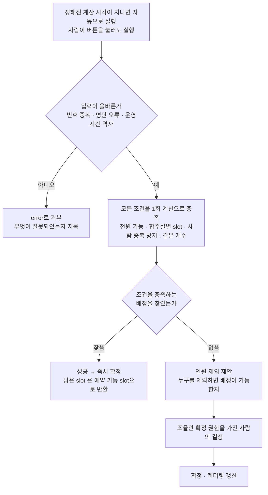
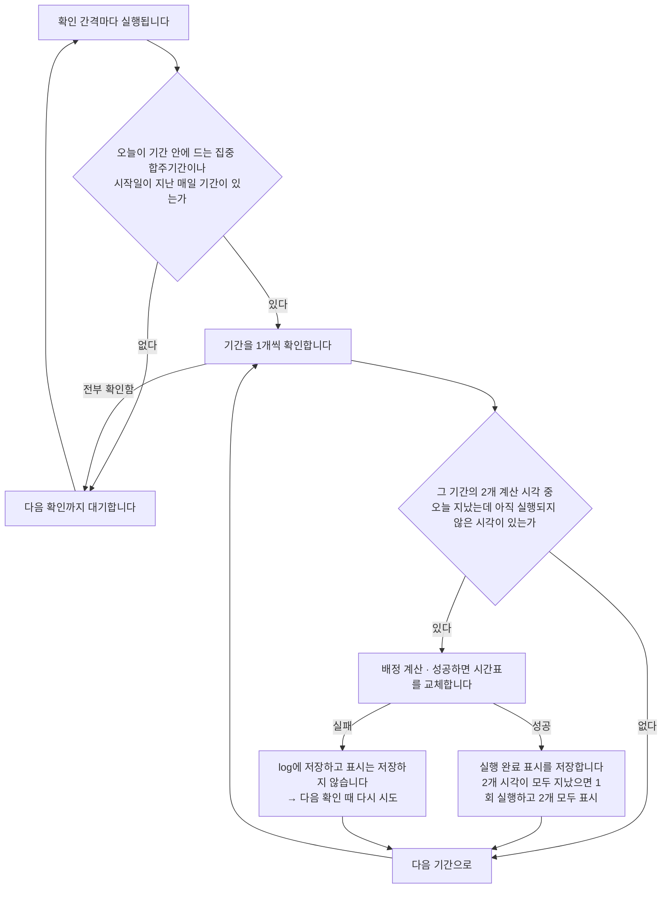
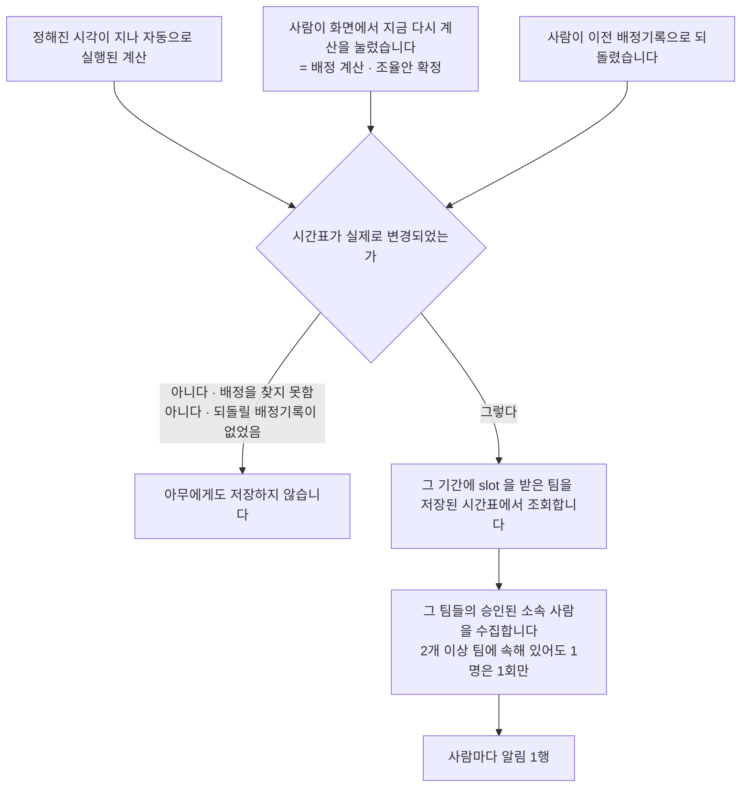

> 문서 버전: 3.5.1 draft



## Abstract

자동 배정은 집중 합주기간에만 실행되는 계산입니다. 멤버들의 불가능 시간을 모아 각 팀이 전원 참석할 수 있는 시간에 합주 slot을 채웁니다. 기간마다 정해둔 고정 시각에 하루 2회 자동으로 실행되고, 사람이 버튼을 눌러 실행할 수도 있습니다. 계산은 모든 조건을 동시에 충족하는 배정을 1회 계산으로 찾는 방식이고, 그런 배정이 없으면 "누구를 제외하면 배정이 가능한지"를 제안으로 출력합니다. 배정 결과에는 어느 합주실의 어느 시간인지가 함께 담기며, 아무도 쓰지 않은 slot은 예약 가능한 자리로 함께 나옵니다.

## Introduction

집중 합주기간에는 모든 팀이 골고루 연습해야 하는데, 멤버가 2개 이상 팀을 겸하고 각자 불가능한 시간이 달라 수동으로 조정하기 어렵습니다. 자동 배정은 이 조정을 대신합니다. 다만 모든 조건을 충족하는 배정이 항상 존재하지는 않아서, 답을 찾는 경우와 사람이 판단해야 하는 경우를 나눴습니다.

## Related Work

- [Banblit 개요](../README.md) — 전체 기능 지도
- [합주실과 기간](../practice-room-and-periods/README.md) — 합주실별 운영 시간과 1시간 slot 규칙
- [팀과 포지션](../teams/README.md) — 배정의 대상이 되는 팀과 그 포지션 구성
- [LLM 도우미](../llm-assistant/README.md) — 배정이 막혔을 때 조율안을 제시하는 역할
- [계정과 역할](../accounts-and-roles/README.md) — 계산·결과 보기·확정·되돌리기를 가르는 권한 항목의 정본
- [데이터 저장소](../database-layer/README.md) — 배정 결과와 자동 실행 기록이 남는 자리
- [스케줄러](../scheduler/README.md) — 확정된 배정이 표시되는 화면
- [스케줄링 API](../scheduling-api/README.md) — 서버 endpoint(API의 요청 주소 단위) 전체가 따르는 공통 규칙(인증·오류 응답 형식·상태 확인)
- [화면](../screens/README.md) — 확정된 시간표와 조율안이 실제로 그려지는 화면

## Description

### 언제 돌고, 무엇을 단위로 삼는가

기간마다 지정해 둔 고정 시각에 하루 2회 실행되고, 그 시각이 지나면 사람이 아무것도 하지 않아도 계산이 자동으로 진행됩니다. 어떻게 진행되는지는 아래 "사람이 버튼을 누르지 않아도 실행되는 자동 계산" 절에서 따로 다룹니다.

slot(1시간 단위 시간 칸)은 합주실별로 생성됩니다. 각 합주실이 여는 시간을 1시간 단위로 분할하고 그 slot 1개가 배정의 최소 단위이며, 합주실마다 여는 시간이 달라도 slot의 경계는 모든 합주실이 공유합니다. slot의 길이는 서버의 `SLOT_MINUTES` 상수 1개로 정의되어 있어, 변경할 경우 수정할 위치가 1곳입니다.

```
                18:00   18:30   19:00   19:30   20:00
1번방(18~20시)    ■       ■       ■       ■
2번방(19~21시)                    ■       ■       ■  …
```

### 대상은 이름이 아니라 번호로 구분합니다

계산은 합주실·팀·사람을 모두 번호로만 구분하고 이름은 계산에 들어가지 않습니다. 사람은 동명이인이 있어 이름으로는 구분되지 않고, 합주실은 같은 합주실이 날짜마다 다시 쓰이므로 이름 1개로는 날짜를 구별할 수 없기 때문입니다. slot 1개는 합주실 번호와 시작 시각 2개 값이 함께 가리키고, 그 2개 값이 같은 slot이 2회 나오면 계산 전에 거부합니다.

```
slot 하나를 가리키는 값
┌──────────────┬────────────────────────┐
│ 합주실 번호   │ 시작 시각               │
├──────────────┼────────────────────────┤
│      7       │ 2026-08-01 18:00       │  ← 서로 다른 slot
│      7       │ 2026-08-02 18:00       │  ← 같은 방, 다른 날
│      9       │ 2026-08-01 18:00       │  ← 같은 시각, 다른 방
└──────────────┴────────────────────────┘
```

이름은 계산이 끝난 뒤 결과를 사람에게 표시할 때만 다시 추가하고, 그 추가는 [스케줄링 API](../scheduling-api/README.md)가 맡습니다.

### 조건을 1회 계산으로 충족합니다

| 조건 | 뜻 |
| --- | --- |
| 전원 가능 | 팀은 그 팀 멤버 전원이 가능한 시간에만 배치 |
| slot 1개에 팀 1개 | 같은 합주실의 같은 slot에는 팀 1개만 |
| 팀 1개는 합주실 1곳에 | 팀 1개가 같은 시간에 합주실 2곳을 동시에 쓸 수 없음 |
| 사람 중복 방지 | 2개 이상 팀에 속한 사람이 같은 시간에 2곳에 있을 수 없음 |
| 같은 개수 | 모든 팀이 정확히 같은 개수의 slot을 가짐 |

마지막 조건은 "공정하게 잘 나눈다"는 계산이 아니라 "모두 같은 개수"라는 단순한 규칙이고, 개수를 채우지 못하는 팀이 1개라도 있으면 배정 전체가 실패로 처리됩니다.

결과에는 팀별로 배정된 slot 목록이 담기며 각 slot은 어느 합주실의 어느 시간인지를 함께 담습니다. 여기에 팀들이 slot을 받고 남은 예약 가능한 slot 목록이 추가되는데, 예약할 수 있는 slot으로 화면에 표시됩니다.

배정을 찾으면 성공으로 판정하고 즉시 확정합니다. "팀 간 시간 교환"처럼 slot을 서로 맞바꿔야 하는 경우도 이 1회의 계산 안에서 이미 반영되므로 교환은 별도 단계가 아닙니다. 어떤 배정으로도 조건을 충족할 수 없으면 1명씩 제외해 보아 그 사람을 제외하면 배정이 가능해지는 경우를 찾아 "이 인원을 제외하면 됩니다"라는 제안을 생성합니다. 이 제안을 [LLM 도우미](../llm-assistant/README.md)가 헤드매니저에게 전달하고, 헤드매니저가 승인하면 확정하고 화면을 갱신합니다.

불가능 시간은 어느 경우에도 무시되지 않습니다. "인원 제외"는 그 인원의 불가능을 무시하는 것이 아니라, 사람이 검토해 결정하는 선택지로만 제시됩니다.

### 잘못된 입력은 계산 전에 거부합니다

설정이 잘못된 채로 계산이 실행되면 잘못된 배정안이 정답처럼 확정되어 사람에게 전달됩니다. 특히 위험한 경우는 명단 오류가 "이 사람을 제외하라"는 조율안으로 출력되는 경우여서, 다음은 계산에 들어가기 전에 거부합니다.

| 거부하는 입력 | 거부하지 않으면 발생하는 일 |
| --- | --- |
| 같은 합주실의 같은 slot이 2회 세어짐 | slot 1개가 2개로 처리되어 같은 합주실·같은 시간에 팀 2개가 배정됨 |
| 팀 번호가 중복됨 | 팀 1개가 결과에서 전부 삭제됨 |
| 팀 1개 명단에 같은 사람이 2회 | 배정 전체가 실패하고, 문제없는 사람을 제외하라는 제안이 출력됨 |
| 멤버가 없는 팀 | 아무도 없는 팀이 모든 시간에 "가능"으로 처리됨 |
| 팀당 slot 개수가 음수 | 호출하는 쪽의 실수가 "일정이 맞지 않는다"로 출력됨 |
| 운영 시간이 정시를 벗어남 | 존재하지 않는 slot이 생성되거나 정시 미만의 나머지 시간이 error 없이 삭제됨 |
| tzinfo(시간대 정보)가 있는 시각 | 같은 시각이 서로 다른 시각으로 처리되어 중복 방지가 전부 무효화됨 |

시간대는 현재 지원하지 않습니다. 지원하려면 여름시간제까지 함께 다뤄야 하므로 부분적으로 허용하는 대신 명시적으로 거부하기로 했습니다.

이 계산은 [기간 자동 배정](../scheduling-api/period-assignment/README.md) endpoint 가 저장된 팀·합주실·불가능 시간을 읽어 호출합니다. 그 endpoint 는 위 표의 검증 규칙을 다시 구현하지 않고, 계산이 거부한 입력은 그대로 거부된 결과로 반환합니다. 이름을 직접 입력해 보내던 이전 endpoint(`POST /assign`)는 2026-09-08 에 제거했습니다. 그 endpoint 를 호출할 수 있는 사람의 조건은 아래에서 다룹니다.

### 계산을 기다리는 방식 (2026-09-04)

배정 요청은 이제 접수만 하고 즉시 반환합니다. 요청을 보낸 쪽은 작업 번호를 받고 그 번호로 완료 여부를 refetch(같은 요청을 다시 보내 결과를 갱신하는 동작)하고, 계산은 그동안 background에서 진행됩니다.

이렇게 변경한 이유는 3가지입니다. 1번째, 계산이 오래 걸립니다. 조율안까지 가면 20초를 넘긴 실측이 있는데 화면은 8초에 요청을 중단하므로, 사람의 판단이 가장 필요한 경우에만 화면이 먼저 요청을 중단했습니다. 2번째, 계산이 실행되는 동안 그 요청을 받은 worker(요청을 처리하는 서버 process) 1개가 전부 점유되어 요청이 worker 수만큼 겹치면 서버가 상태 확인 요청에도 응답하지 못했습니다. 3번째, 기획의 하루 2회 자동 연산은 애초에 사람이 기다리지 않는 작업이라 동기 endpoint를 유지하면 같은 기능을 2개 만들게 됩니다.

동시에 실행되는 계산의 개수에는 상한이 있습니다. 상한 없이 받으면 요청이 몰릴 때 서버가 중단되기 때문입니다. 작업 기록은 서버 메모리에 저장되고 서버를 다시 시작하면 삭제되는데, 계산 자체가 이어지지 않으므로 기록만 저장해도 결과가 돌아오지 않기 때문입니다.

**계산 1회에도 시간 상한을 설정했습니다.** 해결되지 않는 입력 1개가 worker를 무기한 점유하는 상황을 막기 위한 설정으로, 실측 최댓값의 약 3배에서 중단하고 그때까지 찾은 배정안으로 응답합니다. 아무것도 찾지 못했으면 "찾지 못했다"로 응답하므로, 배정이 없는 경우와 시간이 부족한 경우를 사람은 같은 화면에서 봅니다.

### 사람이 버튼을 누르지 않아도 실행되는 자동 계산 (2026-09-07)

기간마다 하루 2회의 계산 시각을 정해 두는 기능은 처음부터 있었지만, 그 시각에 계산을 실행하는 서비스가 없었습니다. 시각은 저장만 되고 실제 계산은 사람이 화면에서 버튼을 눌러야만 진행되었는데, 이제 그 시각이 지나면 자동으로 실행됩니다.



서버와 같은 프로그램 package를 사용하지만 시작 명령만 다른 별도의 서비스로 시작합니다. 서버에 포함하지 않은 이유는 1가지인데, 서버를 2대 이상으로 확장하면 그 대수만큼 같은 계산이 동시에 실행되기 때문입니다. 따로 분리해 두면 서버는 몇 대로 확장하든 이 서비스만 1대로 유지하면 됩니다.

서버의 endpoint도 거치지 않습니다. 저장소 연결을 직접 열고 계산 함수를 직접 호출하므로 로그인을 통과할 필요도 없고 서버가 실행 중이 아니어도 계산은 실행됩니다. 사람이 버튼을 눌러 호출하는 경로와 이 경로는 같은 계산을 호출하는 서로 다른 진입점이며, 계산 자체와 그 앞의 검증은 1벌만 있습니다.

확인과 계산은 순차적으로 진행됩니다. 정해진 간격마다 실행되어 실행할 계산이 있는지 확인하고, 있으면 계산이 끝날 때까지 기다린 뒤에야 다음 확인으로 넘어갑니다. 계산은 조율안까지 가면 22.2초까지 걸린 실측이 있는데(2026-08-28), 확인 간격이 그보다 짧아도 앞의 계산이 끝나야 다음 확인이 시작하므로 2개 계산이 겹치지 않습니다.

놓친 시각은 늦게라도 실행됩니다. 서비스가 잠깐 중단되어 있었거나 저장소 연결이 끊겨 있었다면 그 시각을 건너뛰지 않고 다시 시작된 뒤에 실행하는데(사용자 결정), 다만 소급은 오늘까지만입니다.

| | 어떻게 하나 | 왜 |
| --- | --- | --- |
| 오늘 지난 시각이 아직 미실행 | 지금 실행합니다 | 늦더라도 오늘 시간표는 생성되어야 합니다 |
| 오늘 2개 시각이 모두 미실행 | **1회만** 실행합니다 | 배정은 기간 전체를 다시 계산하므로 2회 실행해도 같은 결과가 나옵니다 |
| 어제 시각을 놓쳤음 | 실행하지 않습니다 | 어제 시각의 계산을 지금 실행하는 결과와 오늘 시각의 계산을 지금 실행하는 결과가 같습니다 |

실행 완료 표시는 계산이 끝난 뒤에 저장합니다. 시작할 때 저장하면 도중에 중단되었을 때 그 시각이 계속 미실행 상태로 남으므로, 어느 시점에 표시를 저장하는 방식이 손실이 적은지를 비교해 선택했습니다.

| 표시를 저장하는 시점 | 도중에 중단되면 | 손실 |
| --- | --- | --- |
| 시작할 때 | 그 시각은 다시 시도되지 않습니다 | 그 기간의 그날 배정이 생성되지 않고, 다음 계산 시각(최대 반나절 뒤)까지 아무도 시간표를 조회할 수 없습니다 |
| **끝난 뒤 (선택된 방식)** | 다음 확인 때 다시 시도됩니다 | 계산 1회와 백업 배정기록 1개를 추가로 소비합니다. 결과는 변하지 않습니다 |

기간 1개가 실패해도 서비스는 계속 진행됩니다. 계산이 error를 발생시킨 기간은 그 시점에 log에 저장하고 진행 중이던 저장 작업을 되돌린 뒤 다음 기간으로 넘어가며, 실패한 기간에는 실행 완료 표시를 저장하지 않으므로 다음 확인 때 다시 시도됩니다.

**"매일" 옵션이 켜진 집중 합주기간은 종료일 없이 계속 실행됩니다(사용자 결정 2026-09-11).** 실행 대상 기간의 조건은 "시작일이 오늘 이전이고, 매일 옵션이 켜져 있거나 종료일이 오늘 이후" 입니다. 매일 옵션이 켜진 기간은 저장된 종료일이 지나도 계산 시각마다 실행되고, 1회 계산이 배정하는 날짜는 기간 전체가 아니라 실행한 그날 하루입니다. 실행 완료 표시는 (기간, 실행한 날짜, 계산 시각) 1행이므로 매일 기간에는 날마다 새 행이 저장됩니다. 옵션의 뜻은 [합주실과 기간](../practice-room-and-periods/README.md)에서 다룹니다.

자동 실행은 등록된 팀 전부와 합주실 전부를 대상으로 합니다. 사람이 버튼을 누를 때는 화면이 어느 팀과 어느 합주실로 계산할지 선택해 보내지만 자동 실행에는 선택할 사람이 없어서 지금은 등록된 팀과 합주실을 전부 사용합니다. 일부만 계산하려면 "이 기간은 이 합주실만 사용한다"를 저장하는 table이 먼저 있어야 하고, 그 table이 없는 지금은 오늘이 기간 안에 드는 집중 합주기간이 2개 이상이면 서로 같은 slot을 배정하려다 1개가 실패로 기록됩니다.

활성화·비활성화는 환경 설정으로 제어합니다. 배포에서는 활성화되고 개발에서는 비활성화되는데, 활성화하면 테스트가 설정한 기간을 이 서비스가 자동으로 다시 계산해 테스트 결과가 달라지기 때문입니다. 개발 PC에서 직접 확인할 때만 활성화해서 시작합니다.

어느 시각이 실행되었는지를 기록하는 table이 1개 추가되었습니다. 어느 기간의, 어느 날짜의, 2개 시각 중 어느 시각이 실행되었는지를 1행으로 저장하고, 그 3개 값이 같은 행은 2회 저장할 수 없게 제약이 설정되어 있어 같은 시각이 2회 기록되지 않습니다. 자세한 내용은 [데이터 저장소](../database-layer/README.md)에서 다룹니다.

검증은 이렇게 했습니다. 계산 시각이 지난 시각만 실행되고 아직 지나지 않은 시각은 실행되지 않는지, 이미 실행된 시각은 다시 실행되지 않는지, 오늘 2개 시각이 모두 미실행일 때 계산이 1회만 실행되는지, 어제 놓친 시각은 실행되지 않는지, 오늘이 기간 범위 밖인 기간은 건너뛰는지, 기간 1개가 error를 발생시켜도 다음 기간이 계속 진행되는지, 매일 옵션이 켜진 기간이 저장된 종료일 뒤에도 실행되어 그날 하루만 배정하는지를 시각값을 직접 주입해 `backend/tests/integration/db/test_auto_assign.py` 에서 테스트했습니다. 추가로 실제 container를 시작해 직접 확인했는데, 계산 시각을 방금 지난 시각으로 설정한 기간을 생성해 서비스가 이를 감지하고 계산한 뒤 실행 완료 표시를 남기고 그 이후로는 다시 실행되지 않는 것을 확인했습니다. 이 서비스를 시작하고, 기록을 조회하고, 어느 시각이 실행되었는지 확인하는 명령어는 저장소의 COMMAND.md 13절에 기술해 두었습니다.

### 시간표가 새로 저장되면 알림이 저장됩니다 (2026-09-07)

사용자가 정한 요구는 "정해진 시각에 계산이 실행되었다는 알림만 전달하면 된다"였습니다. 알림을 발송할 수단이 없어 미뤄 두었는데, 화면 내 알림 기능을 구현해 이 요구를 충족했습니다. 모바일 앱으로 발송하는 푸시 알림은 여전히 미구현입니다.

알림이 발생하는 경우는 처음에 1가지였다가 지금은 3가지입니다. 정해진 시각에 자동으로 실행되는 계산만 알리던 것을 시간표가 새로 저장되는 모든 경우로 확대했습니다. 자동 계산만 알리면 사람이 화면에서 수동으로 다시 계산해 시간표를 변경해도 그 팀 사람들은 아무 소식 없이 이전 시간표를 계속 보게 되는데, 변경 사항을 알아야 하는 이유는 누가 변경했는지와 무관하기 때문입니다.



| 시간표가 변경되는 경로 | 알리는가 |
| --- | --- |
| 정해진 시각이 지나 자동으로 실행된 계산이 저장됨 | 알립니다 |
| 사람이 "지금 다시 계산"을 눌러 저장됨 | 알립니다 |
| 사람이 조율안 1개를 선택해 확정해 저장됨 | 알립니다. 접수하는 endpoint가 다시 계산과 같은 1곳이라 알리는 위치도 1곳입니다 |
| 계산은 실행되었지만 배정을 찾지 못해 조율안만 출력됨 | 알리지 않습니다 |
| 되돌리기가 실제로 이전 배정기록을 복원함 | 알립니다 |
| 되돌릴 백업 배정기록이 없어 아무것도 변경되지 않음 | 알리지 않습니다 |
| 저장하지 않는 계산을 호출함 | 알리지 않습니다. 저장하는 내용 자체가 없습니다 |

3개 경로에 공통된 규칙은 1가지입니다. 저장이 실제로 된 뒤에만 알림을 저장하고, 배정을 찾지 못해 저장되지 않았거나 되돌릴 배정기록이 없어 아무것도 변경되지 않았으면 저장하지 않습니다. 사람이 보던 시간표가 그대로라 알릴 내용이 없기 때문입니다.

실행 순서를 정한 경로는 자동으로 실행되는 계산뿐입니다. 이 경로는 실행 완료 표시를 저장한 뒤에 알림을 저장하는데, 알림 저장이 실패해도 그 표시는 이미 저장되어 있어 22초 계산이 알림 때문에 재실행되지 않습니다. 사람이 수동으로 실행하는 경로에는 그런 표시 자체가 없습니다. 다음 확인 때 자동으로 재시도되는 구조가 아니라 사람이 다시 요청하는 구조이므로 알림 저장 순서를 따로 정할 필요가 없습니다.

알림은 그 기간에 실제로 slot을 받은 팀의 사람에게만 저장합니다.

| 누구 | 저장되는가 | 왜 |
| --- | --- | --- |
| slot을 받은 팀의 소속 | 저장됩니다 | 그 사람의 시간표가 실제로 변경되었습니다 |
| slot을 못 받은 팀의 소속 | 저장되지 않습니다 | 시간표가 그대로라 알릴 내용이 없습니다 |
| 어느 팀에도 없는 사람 | 저장되지 않습니다 | 하루 2회씩 내용 없는 행만 쌓입니다 |
| 승인을 기다리는 신청자 | 저장되지 않습니다 | 아직 그 팀 소속이 아닙니다 |
| 2개 이상 팀에 속한 사람 | **1행만** 저장됩니다 | 시간표가 1회 변경된 것이지 팀 수만큼 변경된 것이 아닙니다 |

대상은 계산에 넘긴 팀 목록이 아니라 저장된 시간표에서 조회한 팀입니다. 넘긴 목록을 쓰면 slot을 못 받은 팀에게도 알림이 저장됩니다.

읽음 여부는 알림마다 1개씩 저장합니다. "언제까지 읽었다"를 사람마다 값 1개로 두는 방법도 있었는데, table이 1개 적은 대신 나중에 알림을 1개씩 읽는 화면이 생기면 그 구조로는 표현되지 않아 table을 다시 만들어야 합니다. 지금 1행씩 저장하면 그때도 table은 그대로입니다.

table에는 무슨 일이 있었는지 종류(type)만 저장되고, 사용자가 읽을 문장은 화면이 생성합니다. 문구를 table에 저장해 두면 문구를 수정했을 때 이미 저장된 알림은 이전 문장 그대로 남지만, 종류만 저장하면 문구를 수정하는 순간 저장된 알림까지 함께 업데이트되고 table에는 마이그레이션이 필요 없습니다. 화면이 알 수 없는 종류가 전달되면(서버가 더 최신 버전이면 발생할 수 있습니다) 종류 이름을 그대로 표시하지 않고 "새로운 소식이 있습니다"로 표시합니다. 개발용 용어가 사용자에게 노출되지 않게 하기 위함입니다.

화면 위치는 [스케줄러](../scheduler/README.md)가 정본이고, 오른쪽 목록의 맨 위에 표시되며 읽지 않은 알림이 있으면 개수와 표시가 나타납니다.

오래된 알림을 삭제하는 기능은 미구현입니다. 자동으로 실행되는 계산만으로는 사람 1명에게 하루 2행까지 쌓이고 사람이 버튼을 눌러 다시 계산하거나 되돌린 만큼 더 쌓이는데, 지금 규모에서 처리되는 양이라 삭제하는 기능을 먼저 만들지 않았습니다. 쌓이는 속도가 문제가 되면 그때 오래된 알림을 삭제하는 기능을 추가합니다.

table이 1개 추가되었고, 저장소에서 어떤 제약이 적용되어 있는지는 [데이터 저장소](../database-layer/README.md)에서 다룹니다.

확인은 저장에 성공했을 때만 저장되는지, slot을 받은 팀의 사람에게만 저장되는지, 팀이 없는 사람과 승인 대기 중인 사람은 제외되는지, 2개 이상 팀에 속한 사람에게 1행만 저장되는지, 읽음 표시가 읽지 않은 행에만 저장되는지를 테스트에 담아서 했습니다. 여기에 사람이 버튼을 눌러 다시 계산해도 알림이 저장되는지와 되돌리기에도 알림이 저장되는지 2가지를 추가했습니다. 테스트 파일은 맨 위 목록의 알림 시나리오 파일 1개이고, 서버 테스트 전체 468개가 통과하며 타입 검사는 94개 파일에서 이상이 없습니다.

### 누가 계산을 실행할 수 있는가 (2026-09-07)

계산 실행, 결과 조회, 조율안 확정, 저장된 시간표 되돌리기는 권한이 있는 사람만 할 수 있습니다. 예전에는 로그인하지 않은 사람도 계산을 실행할 수 있었습니다.

판정 기준은 이제 "헤드매니저인가"가 아니라 그 사람에게 그 항목이 활성화되어 있는가입니다. 항목이 무엇이고 어떻게 활성화하고 비활성화하는지는 [계정과 역할](../accounts-and-roles/README.md)이 정본이고, 이 문서에서는 이 계산에 관련된 4개 endpoint만 적습니다.

| 하는 일 | 요구하는 항목 |
| --- | --- |
| 기간의 배정 계산을 실행합니다 | 배정 계산 항목 |
| 그 계산의 결과를 조회합니다 | 계산 결과 보기 항목 |
| 조율안 1개를 선택해 확정합니다 | 조율안 확정 항목 |
| 저장된 시간표를 이전 배정기록으로 되돌립니다 | 되돌리기 항목 |
| 확정된 시간표를 조회합니다 | 로그인만 |
| 저장하지 않는 계산을 호출합니다 | 로그인만 |

4개 endpoint를 서로 다른 항목으로 분리한 구조가 실제로 쓸모가 있습니다. 계산은 실행하지 못하지만 다른 사용자가 실행한 결과를 검토만 하는 사람, 되돌리기만 맡은 사람을 따로 둘 수 있습니다. 항목을 모두 활성화한 사람에게는 예전과 똑같이 동작하므로 이전하면서 할 수 있는 작업이 줄어든 사람은 없습니다.

결과를 조회하는 endpoint도 함께 권한을 요구하도록 변경했습니다. 계산 결과에는 아직 확정되지 않은 조율안과 그 조율안에서 제외될 사람의 이름이 포함되어 있는데, 조율안을 확정하는 endpoint만 권한을 요구하고 결과를 조회하는 endpoint를 로그인만으로 허용하면 제한한 정보가 조회 endpoint로 그대로 유출되기 때문입니다.

저장하지 않는 계산도 로그인을 요구합니다. 아무것도 저장하지 않으므로 로그인 없이 허용해도 될 것 같지만, 위에 적은 대로 이 계산은 20초를 넘긴 실측이 있습니다. 로그인하지 않은 사람이 호출할 수 있으면 그 endpoint 1개로 서버의 worker를 전부 점유할 수 있습니다.

로그인하지 않은 요청과 로그인했지만 권한이 없는 요청은 서로 다른 응답으로 구분해 반환합니다. endpoint별 전체 규칙과 이를 구분하는 이유는 [스케줄링 API](../scheduling-api/README.md)에 있습니다.

검증은 6개 endpoint 모두 로그인하지 않은 요청을 거절하는지, 그중 항목을 요구하는 4개 endpoint는 그 항목이 없는 사람의 요청을 다른 오류로 거절하고 항목을 가진 사람만 통과시키는지를 테스트로 확인했습니다. 서버 테스트 전체 468개가 통과하고 타입 검사는 94개 파일에서 문제 없으며, 실행 명령어는 [스케줄링 API](../scheduling-api/README.md)에 기술해 두었습니다.

## Conclusion

자동 배정은 해결 가능한 경우는 자동으로 확정하고, 불가능한 경우만 "누구를 제외하면 되는지" 제안으로 사람에게 제시합니다. 잘못된 설정은 계산 전에 거부해 오류 있는 배정이 확정되는 일을 방지합니다. 이제는 실행 시작까지 자동화되었습니다. 정해진 시각이 지나면 아무도 개입하지 않아도 계산이 실행되고, 시간표가 실제로 변경된 사람에게는 그 사실이 알림으로 전달됩니다. 모바일 앱 푸시 알림만 미구현으로 남아 있습니다. 생성된 제안을 사람에게 전달하는 방법은 [LLM 도우미](../llm-assistant/README.md)에서 계속됩니다.
