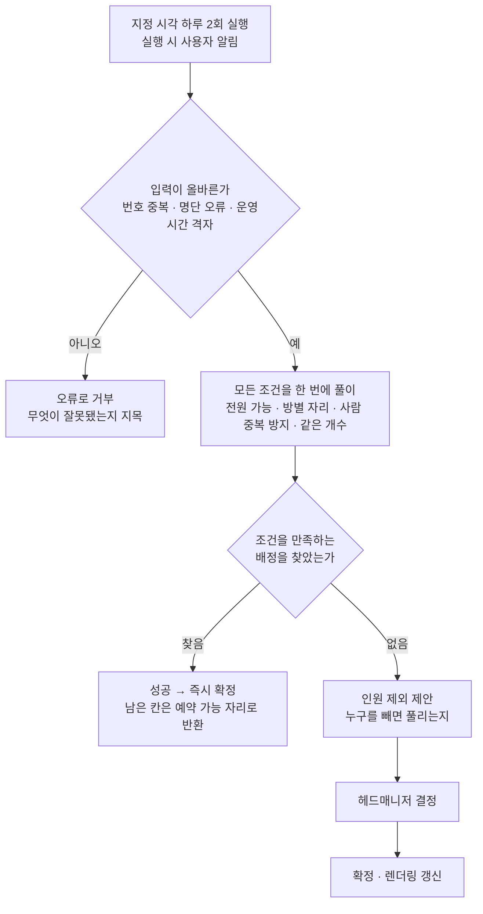

> 문서 버전: 2.3.0 draft



## Abstract

자동 배정은 집중 합주기간에만 실행되는 계산이다. 멤버들의 불가능 시간을 모아, 각 팀이 전원 참석할 수 있는 시간에 합주 자리를 채운다. 헤드매니저가 정한 고정 시각에 하루 두 번 돌고, 실행될 때 사용자에게 알린다. 계산은 여러 조건을 동시에 만족하는 배정을 한 번에 찾는 방식이며, 그런 배정이 없으면 "누구를 빼면 풀리는지"를 제안으로 내놓는다. 배정 결과에는 어느 합주실의 어느 시간인지가 함께 담기고, 아무도 쓰지 않은 자리는 예약 가능한 자리로 함께 나온다.

## Introduction

집중 합주기간에는 모든 팀이 골고루 연습해야 하는데, 멤버가 여러 팀을 겸하고 각자 안 되는 시간이 달라, 손으로 맞추기 어렵다. 자동 배정은 이 짜맞추기를 대신한다. 다만 모든 조건을 만족하는 답이 늘 존재하지는 않는다. 그래서 답을 찾는 경우와, 사람이 판단해야 하는 경우를 나눈다.

## Related Work

- [Banblit 개요](../README.md) — 전체 기능 지도
- [합주실과 기간](../practice-room-and-periods/README.md) — 합주실별 운영 시간과 30분 칸 규칙
- [팀과 소속](../teams/README.md) — 배정의 대상이 되는 팀과 멤버 구성
- [LLM 도우미](../llm-assistant/README.md) — 배정이 막혔을 때 조율안을 제시하는 역할
- [스케줄러](../scheduler/README.md) — 확정된 배정이 표시되는 화면
- [스케줄링 API](../scheduling-api/README.md) — 이 계산을 바깥에서 호출할 수 있게 여는 서버 통로
- [화면 프로토타입](../screen-prototypes/README.md) — 확정된 시간표와 조율안이 실제로 그려지는 화면
- [개발용 시드 데이터](../screen-prototypes/dev-seed/README.md) — 성사와 불가 두 경우를 일부러 함께 만들어 이 계산을 눈으로 확인하는 장치

## Description

**언제 도는가.** 헤드매니저가 지정한 고정 시각에 하루 두 번 실행하고, 그 시각에 사용자에게 알림을 준다.

**자리의 단위.** 자리는 합주실별로 만들어진다. 각 합주실이 여는 시간을 30분 칸으로 쪼개고, 그 칸 하나가 배정의 최소 단위다. 방마다 여는 시간이 달라도 칸의 경계는 모든 방이 공유한다.

```
                18:00   18:30   19:00   19:30   20:00
1번방(18~20시)    ■       ■       ■       ■
2번방(19~21시)                    ■       ■       ■  …
```

**무엇으로 대상을 가리는가.** 계산은 합주실·팀·사람을 모두 **번호**로만 가린다. 이름은 계산에 들어가지 않는다. 사람은 동명이인이 있어 이름으로는 갈리지 않고, 합주실은 같은 방이 날짜마다 다시 쓰이므로 이름 하나로는 날짜를 구별할 수 없기 때문이다. 한 자리는 **합주실 번호와 시작 시각 두 값이 함께** 가리키며, 그 둘이 같은 자리가 두 번 나오면 계산 전에 거부한다.

```
자리 하나를 가리키는 값
┌──────────────┬────────────────────────┐
│ 합주실 번호   │ 시작 시각               │
├──────────────┼────────────────────────┤
│      7       │ 2026-08-01 18:00       │  ← 서로 다른 자리
│      7       │ 2026-08-02 18:00       │  ← 같은 방, 다른 날
│      9       │ 2026-08-01 18:00       │  ← 같은 시각, 다른 방
└──────────────┴────────────────────────┘
```

이름은 계산이 끝난 뒤 결과를 사람에게 보일 때만 다시 붙는다. 그 되붙이기는 [스케줄링 API](../scheduling-api/README.md)가 맡는다.

**한 번에 푸는 조건들.**

| 조건 | 뜻 |
| --- | --- |
| 전원 가능 | 팀은 그 팀 멤버 전원이 가능한 시간에만 배치 |
| 한 자리에 한 팀 | 같은 합주실의 같은 칸에는 팀 하나만 |
| 한 팀은 한 곳에 | 한 팀이 같은 시간에 두 합주실을 동시에 쓸 수 없음 |
| 사람 중복 방지 | 여러 팀에 속한 사람이 같은 시간에 두 곳에 있을 수 없음 |
| 같은 개수 | 모든 팀이 정확히 같은 개수의 자리를 가짐 |

마지막 조건은 "공정하게 잘 나눈다"는 계산이 아니라 "모두 같은 개수"라는 단순한 규칙이다. 개수를 채우지 못하는 팀이 하나라도 있으면 배정 전체가 실패로 처리된다.

**결과에 담기는 것.**

- 팀별로 배정된 자리 목록. 각 자리는 **어느 합주실의 어느 시간**인지를 함께 담는다.
- **예약 가능한 자리 목록**. 팀들이 자리를 받고 남은 칸이다. 상시 예약으로 쓸 수 있는 자리로 화면에 보인다.

**두 갈래의 결과.**

- **배정을 찾으면 성공으로 보고 즉시 확정**한다. "팀 간 시간 교환"처럼 자리를 서로 맞바꿔야 푸는 경우도, 이 한 번의 계산 안에서 이미 반영된다. 그래서 교환은 별도 단계가 아니다.
- **어떤 배정으로도 조건을 못 맞추면**, 한 명씩 빼 보아 그 사람을 제외하면 배정이 가능해지는 경우를 찾아, **"이 인원을 제외하면 됩니다"라는 제안**을 만든다. 이 제안을 [LLM 도우미](../llm-assistant/README.md)가 헤드매니저에게 전하고, 헤드매니저가 승인하면 확정하고 화면을 갱신한다.

불가능 시간은 어느 경우에도 무시되지 않는다. "인원 제외"는 그 인원의 불가능을 무시하는 것이 아니라, 사람이 검토해 결정하는 선택지로만 제시된다.

**잘못된 입력은 계산 전에 거부한다.** 설정이 잘못된 채로 계산이 돌면, 틀린 답이 정답처럼 확정되어 사람에게 전달된다. 특히 위험한 것은 명단 오류가 "이 사람을 빼라"는 조율안으로 둔갑하는 경우다. 그래서 다음은 계산에 들어가기 전에 막는다.

| 거부하는 입력 | 막지 않으면 벌어지는 일 |
| --- | --- |
| 같은 합주실의 같은 칸이 두 번 세어짐 | 한 자리가 둘로 보여 같은 방·같은 시간에 두 팀이 배정됨 |
| 팀 번호가 겹침 | 한 팀이 결과에서 통째로 사라짐 |
| 한 팀 명단에 같은 사람이 두 번 | 배정이 통째로 실패하고, 멀쩡한 사람을 빼라는 제안이 나옴 |
| 멤버가 없는 팀 | 아무도 없는 팀이 모든 시간에 "가능"으로 취급됨 |
| 팀당 자리 개수가 음수 | 부르는 쪽의 실수가 "일정이 안 맞는다"로 위장됨 |
| 운영 시간이 30분 격자를 벗어남 | 존재하지 않는 자리가 만들어지거나 자투리가 조용히 사라짐 |
| 시간대가 붙은 시각 | 같은 시각이 서로 다른 시각으로 취급되어 중복 방지가 통째로 풀림 |

시간대는 현재 지원하지 않는다. 지원하려면 여름시간제까지 함께 다뤄야 하므로, 어설프게 허용하는 대신 명시적으로 거부한다.

**바깥에서의 호출.** 이 계산은 이제 [스케줄링 API](../scheduling-api/README.md)를 통해 같은 프로그램 바깥에서도 호출할 수 있다. 그 통로는 요청의 형태만 확인하고 계산이 쓰는 값으로 옮길 뿐, 위 표의 검증 규칙을 다시 만들지 않는다. 계산이 거부한 입력은 그 통로에서도 그대로 거부된 것으로 전달된다.

## Conclusion

자동 배정은 풀 수 있는 것은 스스로 확정하고, 못 푸는 것만 "누구를 빼면 되는지" 제안으로 사람에게 넘긴다. 잘못된 설정은 계산 전에 막아, 틀린 답이 확정되는 일을 없앤다. 넘겨진 제안을 사람에게 전하는 방법은 [LLM 도우미](../llm-assistant/README.md)에서 이어진다.
