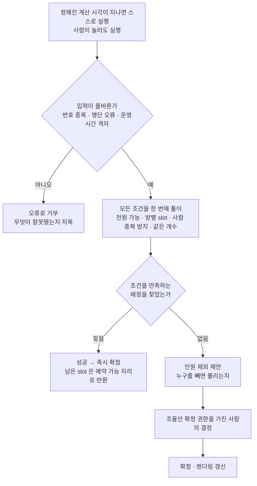
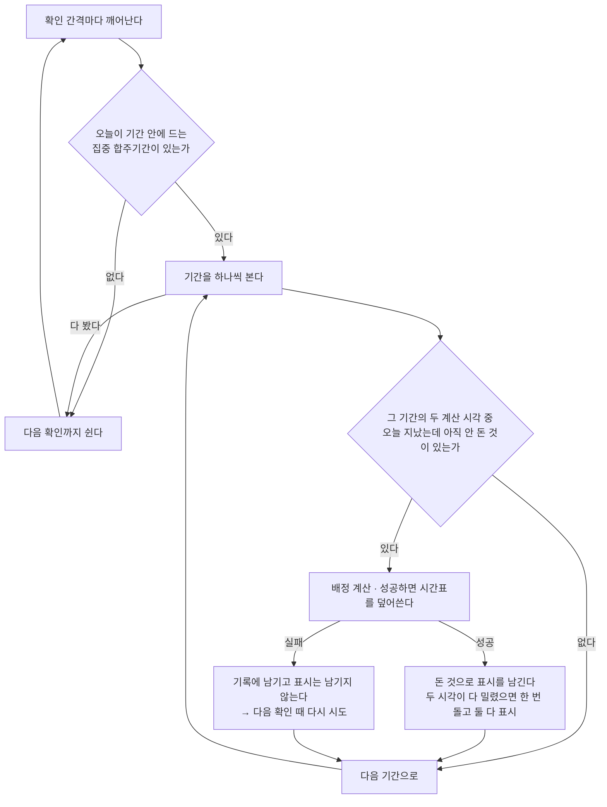
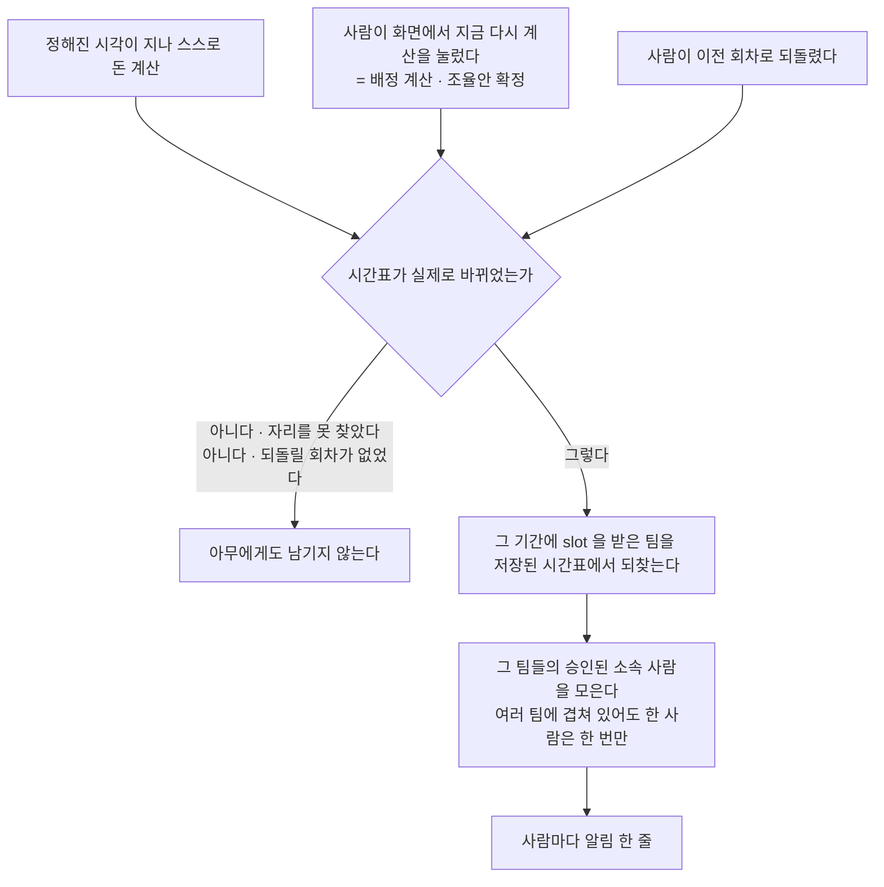

> 문서 버전: 3.5.0 draft



## Abstract

자동 배정은 집중 합주기간에만 실행되는 계산입니다. 멤버들의 불가능 시간을 모아 각 팀이 전원 참석할 수 있는 시간에 합주 slot을 채웁니다. 기간마다 정해둔 고정 시각에 하루 두 번 스스로 돌고, 사람이 눌러서 돌릴 수도 있습니다. 계산은 여러 조건을 동시에 만족하는 배정을 한 번에 찾는 방식이고, 그런 배정이 없으면 "누구를 빼면 풀리는지"를 제안으로 내놓습니다. 배정 결과에는 어느 합주실의 어느 시간인지가 함께 담기며, 아무도 쓰지 않은 slot은 예약 가능한 자리로 함께 나옵니다.

## Introduction

집중 합주기간에는 모든 팀이 골고루 연습해야 하는데, 멤버가 여러 팀을 겸하고 각자 안 되는 시간이 달라 손으로 맞추기 어렵습니다. 자동 배정은 이 짜맞추기를 대신합니다. 다만 모든 조건을 만족하는 답이 늘 존재하지는 않아서, 답을 찾는 경우와 사람이 판단해야 하는 경우를 나눴습니다.

## Related Work

- [Banblit 개요](../README.md) — 전체 기능 지도
- [합주실과 기간](../practice-room-and-periods/README.md) — 합주실별 운영 시간과 1시간 slot 규칙
- [팀과 포지션](../teams/README.md) — 배정의 대상이 되는 팀과 그 포지션 구성
- [LLM 도우미](../llm-assistant/README.md) — 배정이 막혔을 때 조율안을 제시하는 역할
- [계정과 역할](../accounts-and-roles/README.md) — 계산·결과 보기·확정·되돌리기를 가르는 권한 항목의 정본
- [데이터 저장소](../database-layer/README.md) — 배정 결과와 자동 실행 기록이 남는 자리
- [스케줄러](../scheduler/README.md) — 확정된 배정이 표시되는 화면
- [스케줄링 API](../scheduling-api/README.md) — 서버 endpoint 전체가 따르는 공통 규칙(문·오류 모양·상태 확인)
- [화면](../screens/README.md) — 확정된 시간표와 조율안이 실제로 그려지는 화면

## Description

### 언제 돌고, 무엇을 단위로 삼는가

기간마다 지정해 둔 고정 시각에 하루 두 번 실행하고, 그 시각이 지나면 사람이 아무것도 하지 않아도 계산이 돕니다. 어떻게 도는지는 아래 "사람이 누르지 않아도 도는 자동 계산" 절에서 따로 다룹니다.

slot은 합주실별로 만들어집니다. 각 합주실이 여는 시간을 1시간 slot으로 쪼개고 그 slot 하나가 배정의 최소 단위이며, 방마다 여는 시간이 달라도 slot의 경계는 모든 방이 공유합니다. 칸의 길이는 서버에 값 하나로 적혀 있어, 바꿀 일이 생기면 고칠 곳이 한 자리입니다.

```
                18:00   18:30   19:00   19:30   20:00
1번방(18~20시)    ■       ■       ■       ■
2번방(19~21시)                    ■       ■       ■  …
```

### 대상은 이름이 아니라 번호로 가립니다

계산은 합주실·팀·사람을 모두 번호로만 가리고 이름은 계산에 들어가지 않습니다. 사람은 동명이인이 있어 이름으로는 갈리지 않고, 합주실은 같은 방이 날짜마다 다시 쓰이므로 이름 하나로는 날짜를 구별할 수 없기 때문입니다. 한 slot은 합주실 번호와 시작 시각 두 값이 함께 가리키고, 그 둘이 같은 slot이 두 번 나오면 계산 전에 거부합니다.

```
slot 하나를 가리키는 값
┌──────────────┬────────────────────────┐
│ 합주실 번호   │ 시작 시각               │
├──────────────┼────────────────────────┤
│      7       │ 2026-08-01 18:00       │  ← 서로 다른 slot
│      7       │ 2026-08-02 18:00       │  ← 같은 방, 다른 날
│      9       │ 2026-08-01 18:00       │  ← 같은 시각, 다른 방
└──────────────┴────────────────────────┘
```

이름은 계산이 끝난 뒤 결과를 사람에게 보일 때만 다시 붙고, 그 되붙이기는 [스케줄링 API](../scheduling-api/README.md)가 맡습니다.

### 조건을 한 번에 풉니다

| 조건 | 뜻 |
| --- | --- |
| 전원 가능 | 팀은 그 팀 멤버 전원이 가능한 시간에만 배치 |
| 한 slot에 한 팀 | 같은 합주실의 같은 slot에는 팀 하나만 |
| 한 팀은 한 곳에 | 한 팀이 같은 시간에 두 합주실을 동시에 쓸 수 없음 |
| 사람 중복 방지 | 여러 팀에 속한 사람이 같은 시간에 두 곳에 있을 수 없음 |
| 같은 개수 | 모든 팀이 정확히 같은 개수의 slot을 가짐 |

마지막 조건은 "공정하게 잘 나눈다"는 계산이 아니라 "모두 같은 개수"라는 단순한 규칙이고, 개수를 채우지 못하는 팀이 하나라도 있으면 배정 전체가 실패로 처리됩니다.

결과에는 팀별로 배정된 slot 목록이 담기며 각 slot은 어느 합주실의 어느 시간인지를 함께 담습니다. 여기에 팀들이 slot을 받고 남은 예약 가능한 자리 목록이 따라붙는데, 예약으로 잡을 수 있는 자리로 화면에 보입니다.

배정을 찾으면 성공으로 보고 즉시 확정합니다. "팀 간 시간 교환"처럼 slot을 서로 맞바꿔야 푸는 경우도 이 한 번의 계산 안에서 이미 반영되므로 교환은 별도 단계가 아닙니다. 어떤 배정으로도 조건을 못 맞추면 한 명씩 빼 보아 그 사람을 제외하면 배정이 가능해지는 경우를 찾아 "이 인원을 제외하면 됩니다"라는 제안을 만듭니다. 이 제안을 [LLM 도우미](../llm-assistant/README.md)가 헤드매니저에게 전하고, 헤드매니저가 승인하면 확정하고 화면을 갱신합니다.

불가능 시간은 어느 경우에도 무시되지 않습니다. "인원 제외"는 그 인원의 불가능을 무시하는 것이 아니라, 사람이 검토해 결정하는 선택지로만 제시됩니다.

### 잘못된 입력은 계산 전에 거부합니다

설정이 잘못된 채로 계산이 돌면 틀린 답이 정답처럼 확정되어 사람에게 전달됩니다. 특히 위험한 것은 명단 오류가 "이 사람을 빼라"는 조율안으로 둔갑하는 경우여서, 다음은 계산에 들어가기 전에 막습니다.

| 거부하는 입력 | 막지 않으면 벌어지는 일 |
| --- | --- |
| 같은 합주실의 같은 slot이 두 번 세어짐 | 한 slot이 둘로 보여 같은 방·같은 시간에 두 팀이 배정됨 |
| 팀 번호가 겹침 | 한 팀이 결과에서 통째로 사라짐 |
| 한 팀 명단에 같은 사람이 두 번 | 배정이 통째로 실패하고, 멀쩡한 사람을 빼라는 제안이 나옴 |
| 멤버가 없는 팀 | 아무도 없는 팀이 모든 시간에 "가능"으로 취급됨 |
| 팀당 slot 개수가 음수 | 부르는 쪽의 실수가 "일정이 안 맞는다"로 위장됨 |
| 운영 시간이 정시를 벗어남 | 존재하지 않는 slot이 만들어지거나 자투리가 조용히 사라짐 |
| 시간대가 붙은 시각 | 같은 시각이 서로 다른 시각으로 취급되어 중복 방지가 통째로 풀림 |

시간대는 현재 지원하지 않습니다. 지원하려면 여름시간제까지 함께 다뤄야 하므로 어설프게 허용하는 대신 명시적으로 거부하기로 했습니다.

이 계산은 [기간 자동 배정](../scheduling-api/period-assignment/README.md) endpoint 가 저장된 팀·합주실·못 나오는 시간을 읽어 부릅니다. 그 endpoint 는 위 표의 검증 규칙을 다시 만들지 않고, 계산이 거부한 입력은 그대로 거부된 것으로 전달됩니다. 이름으로 직접 적어 보내던 옛 입구(`POST /assign`)는 2026-09-08 에 걷어냈습니다. 그 endpoint 를 아무나 부를 수 있는 것은 아닌데, 아래에서 다룹니다.

### 계산을 기다리는 방식 (2026-09-04)

배정 요청은 이제 접수만 하고 곧바로 답합니다. 요청을 보낸 쪽은 작업 번호를 받고 그 번호로 끝났는지 되묻고, 계산은 그동안 뒤에서 돕니다.

이렇게 바꾼 까닭은 세 가지입니다. 첫째, 계산에 시간 상한이 없습니다. 조율안까지 가면 20초를 넘긴 실측이 있는데 화면은 8초에 요청을 끊으므로, 사람의 판단이 가장 필요한 경우에만 화면이 먼저 포기하는 꼴이었습니다. 둘째, 계산이 도는 동안 그 요청을 받은 일꾼 하나가 통째로 묶여서 요청이 몇 개만 겹쳐도 서버가 정상 확인조차 못 받았습니다. 셋째, 기획의 하루 두 번 자동 연산은 애초에 사람이 기다리지 않는 일이라 동기 endpoint를 유지하면 같은 일을 두 벌 만들게 됩니다.

동시에 도는 계산의 개수에는 상한이 있습니다. 상한 없이 받으면 요청이 몰릴 때 서버가 죽기 때문입니다. 작업 기록은 서버가 들고 있고 서버를 다시 띄우면 사라지는데, 계산 자체가 이어지지 않으므로 기록만 남겨도 결과가 돌아오지 않기 때문입니다.

### 사람이 누르지 않아도 도는 자동 계산 (2026-09-07)

기간마다 하루 두 번의 계산 시각을 정해 두는 것은 처음부터 있었지만, 그 시각에 계산을 돌리는 것이 없었습니다. 시각은 저장만 되고 실제 계산은 사람이 화면에서 단추를 눌러야만 돌았는데, 이제 그 시각이 지나면 스스로 돕니다.



서버와 같은 프로그램 package를 쓰지만 시작 명령만 다른 별도의 서비스로 띄웁니다. 서버 안에 넣지 않은 까닭은 하나인데, 서버를 여러 대로 늘리면 그 대수만큼 같은 계산이 동시에 돌기 때문입니다. 따로 떼어 두면 서버는 몇 대로 늘리든 이 서비스만 한 대로 두면 됩니다.

서버의 endpoint도 거치지 않습니다. 자기 저장소 연결을 직접 열고 계산을 곧바로 부르므로 로그인을 통과할 필요도 없고 서버가 떠 있지 않아도 계산은 돕니다. 사람이 단추를 눌러 부르는 길과 이 길은 같은 계산에 이르는 서로 다른 입구이며, 계산 자체와 그 앞의 검증은 한 벌만 있습니다.

확인과 계산은 한 줄기로 돕니다. 정해진 간격마다 깨어나 돌 것이 있는지 보고, 있으면 계산이 끝날 때까지 그 자리에서 기다린 뒤에야 다음 확인으로 넘어갑니다. 계산은 조율안까지 가면 22.2초까지 걸린 실측이 있는데(2026-08-28), 확인 간격이 그보다 짧아도 앞의 계산이 끝나야 다음 확인이 시작하므로 두 계산이 겹치지 않습니다.

놓친 시각은 늦게라도 돌립니다. 서비스가 잠깐 멈춰 있었거나 저장소가 끊겨 있었다면 그 시각을 그냥 흘려보내지 않고 다시 살아난 뒤에 돌리는데(사용자 결정), 다만 소급은 오늘까지만입니다.

| | 어떻게 하나 | 왜 |
| --- | --- | --- |
| 오늘 지난 시각이 아직 안 돌았다 | 지금 돌린다 | 늦더라도 오늘 시간표는 나와야 한다 |
| 오늘 두 시각이 다 밀려 있다 | **한 번만** 돌린다 | 배정은 기간 전체를 다시 푸는 계산이라 두 번 돌려도 같은 답이 나온다 |
| 어제 시각을 놓쳤다 | 돌리지 않는다 | 어제 것을 지금 돌리는 것과 오늘 것을 지금 돌리는 것이 같은 계산이다 |

돌았다는 표시는 계산이 끝난 뒤에 남깁니다. 시작할 때 남기면 도중에 죽었을 때 그 시각이 영영 안 돈 채로 지나가므로, 어느 쪽으로 틀리는 것이 덜 나쁜지를 견줘 고른 것입니다.

| 표시를 남기는 시점 | 도중에 죽으면 | 잃는 것 |
| --- | --- | --- |
| 시작할 때 | 그 시각은 다시 시도되지 않는다 | 그 기간의 그날 배정이 통째로 비고, 다음 계산 시각(최대 반나절 뒤)까지 아무도 시간표를 못 본다 |
| **끝난 뒤 (고른 쪽)** | 다음 확인 때 다시 시도된다 | 계산 한 번과 백업 회차 하나를 더 쓴다. 결과는 달라지지 않는다 |

한 기간이 실패해도 서비스는 계속 돕니다. 계산이 터진 기간은 그 자리에서 기록에 남기고 하던 것을 되돌린 뒤 다음 기간으로 넘어가며, 실패한 기간에는 표시를 남기지 않으므로 다음 확인 때 다시 시도됩니다.

자동 실행은 등록된 팀 전부와 합주실 전부를 대상으로 합니다. 사람이 단추를 누를 때는 화면이 어느 팀과 어느 합주실로 풀지 골라 보내지만 자동 실행에는 골라 줄 사람이 없어서 지금은 등록된 것을 전부 씁니다. 일부만 돌리려면 "이 기간은 이 합주실만 쓴다"를 남기는 테이블이 먼저 있어야 하고, 그 테이블이 없는 지금은 오늘이 기간 안에 드는 집중 합주기간이 둘 이상이면 서로 같은 slot을 잡으려다 하나가 실패로 기록됩니다.

켜고 끄는 것과 확인 간격은 바깥에서 줍니다. 배포에서는 켜져 있고 개발에서는 꺼져 있는데, 켜 두면 테스트가 심어 둔 기간을 이 서비스가 제멋대로 다시 계산해 테스트 결과가 흔들리기 때문입니다. 개발 PC에서 눈으로 볼 때만 켜서 띄웁니다.

어느 시각이 돌았는지를 남기는 테이블이 하나 늘었습니다. 어느 기간의, 어느 날짜의, 두 시각 중 어느 것이 돌았는지를 한 줄로 남기고, 그 세 값이 같은 줄은 두 번 들어갈 수 없게 막혀 있어 같은 시각이 두 번 돈 것으로 기록되지 않습니다. 자세한 것은 [데이터 저장소](../database-layer/README.md)에서 다룹니다.

확인은 이렇게 했습니다. 계산 시각이 지난 것만 돌고 아직 안 된 것은 안 도는지, 이미 돈 시각은 다시 안 도는지, 오늘 두 시각이 다 밀렸을 때 계산이 한 번만 도는지, 어제 놓친 시각은 돌지 않는지, 오늘이 기간 밖인 기간은 건너뛰는지, 한 기간이 터져도 다음 기간이 계속 도는지를 시각을 직접 넣어보는 테스트로 확인했습니다. 여기에 더해 실제로 컨테이너를 띄워 눈으로 봤는데, 계산 시각을 방금 지난 시각으로 둔 기간을 만들어 서비스가 그것을 집어 계산하고 돈 표시를 남기고 그 뒤로는 다시 돌지 않는 것을 확인했습니다. 이 서비스를 띄우고, 기록을 보고, 어느 시각이 돌았는지 확인하는 커맨드는 저장소의 커맨드 문서 13절에 적어 뒀습니다.

### 시간표가 새로 짜이면 알림이 남습니다 (2026-09-07)

사용자가 정한 것은 "정해진 시각에 계산이 돌았다는 알림만 주면 된다"였습니다. 알림을 보낼 수단이 없어 미뤄 두었는데, 화면 안에 남는 알림을 만들어 그 자리를 채웠습니다. 앱으로 밀어 보내는 알림은 여전히 앱 단계로 미뤄져 있습니다.

알림이 나가는 자리는 처음에 하나였다가 지금은 셋입니다. 정해진 시각에 스스로 도는 계산만 알리던 것을 시간표가 새로 저장되는 모든 경우로 넓혔습니다. 스스로 돈 계산만 알리면 사람이 화면에서 다시 계산해 시간표를 갈아엎어도 그 팀 사람들은 아무 소식 없이 옛 시간표를 계속 보게 되는데, 바뀐 것을 알아야 하는 이유는 누가 바꿨는지와 무관하기 때문입니다.



| 시간표가 바뀌는 길 | 알리는가 |
| --- | --- |
| 정해진 시각이 지나 스스로 돈 계산이 저장됐다 | 알린다 |
| 사람이 "지금 다시 계산"을 눌러 저장됐다 | 알린다 |
| 사람이 조율안 하나를 골라 확정해 저장됐다 | 알린다 — 접수하는 자리가 다시 계산과 같은 한 곳이라 알리는 자리도 하나다 |
| 계산은 돌았지만 자리를 못 찾아 조율안만 나왔다 | 알리지 않는다 |
| 되돌리기가 실제로 이전 회차를 되살렸다 | 알린다 |
| 되돌릴 백업 회차가 없어 아무것도 안 바뀌었다 | 알리지 않는다 |
| 저장하지 않는 계산을 불렀다 | 알리지 않는다 — 남기는 것 자체가 없다 |

세 길에 공통된 규칙은 하나입니다. 저장이 실제로 된 뒤에만 남기고, 자리를 못 찾아 저장이 안 됐거나 되돌릴 회차가 없어 아무것도 안 바뀌었으면 남기지 않습니다. 사람이 보던 시간표가 그대로라 알릴 것이 없기 때문입니다.

순서를 따지는 것은 스스로 도는 계산뿐입니다. 그쪽은 돈 표시를 남긴 뒤에 알리는데, 알리는 쪽이 터져도 그 표시는 이미 남아 있어 22초짜리 계산을 알림 때문에 되풀이하지 않습니다. 사람이 눌러 도는 길에는 그런 표시 자체가 없습니다. 다음 확인 때 다시 시도되는 구조가 아니라 사람이 다시 누르는 것이므로 알리는 순서를 따로 정할 것이 없습니다.

알림은 그 기간에 실제로 slot을 받은 팀의 사람에게만 남깁니다.

| 누구 | 남는가 | 왜 |
| --- | --- | --- |
| slot을 받은 팀의 소속 | 남는다 | 그 사람의 시간표가 실제로 바뀌었다 |
| slot을 못 받은 팀의 소속 | 안 남는다 | 시간표가 그대로라 알릴 것이 없다 |
| 어느 팀에도 없는 사람 | 안 남는다 | 하루 두 번씩 아무 내용 없는 줄만 쌓인다 |
| 승인을 기다리는 신청자 | 안 남는다 | 아직 그 팀 소속이 아니다 |
| 여러 팀에 겹쳐 있는 사람 | **한 줄만** 남는다 | 시간표가 한 번 바뀐 것이지 팀 수만큼 바뀐 것이 아니다 |

대상은 계산에 넘긴 팀 목록이 아니라 저장된 시간표에서 되찾은 팀입니다. 넘긴 목록을 쓰면 slot을 못 받은 팀에게도 알림이 갑니다.

읽음은 알림마다 하나씩 들고 있습니다. "언제까지 읽었다"를 사람마다 한 값으로 두는 방법도 있었는데, 테이블이 하나 적은 대신 나중에 알림을 하나씩 읽는 화면이 생기면 그 구조로는 표현되지 않아 테이블을 다시 만들어야 합니다. 지금 한 줄씩 들고 있으면 그때도 테이블은 그대로입니다.

테이블에는 무슨 일이 있었는지 종류만 남고, 사람이 읽을 문장은 화면이 만듭니다. 문구를 저장해 두면 문구를 고쳤을 때 이미 쌓인 알림은 옛 문장 그대로 남지만, 종류만 남기면 문구를 고치는 순간 쌓인 것까지 함께 바뀌고 테이블에는 손댈 일이 없습니다. 화면이 모르는 종류가 오면 — 서버가 더 나중 판이면 그럴 수 있습니다 — 종류 이름을 그대로 내보이지 않고 "새 소식이 있습니다"로 대신합니다. 개발용 낱말이 사람 앞에 나오지 않게 하려는 것입니다.

화면 자리는 [스케줄러](../scheduler/README.md)가 정본이고, 오른쪽 목록의 맨 위에 붙었으며 안 읽은 것이 있으면 개수와 표시가 뜹니다.

오래된 알림을 지우는 자리는 두지 않았습니다. 스스로 도는 계산만으로는 사람 한 명에게 하루 두 줄까지 쌓이고 사람이 눌러 다시 계산하거나 되돌린 만큼 그 위에 더 쌓이는데, 지금 규모에서 감당되는 양이라 정리하는 장치를 먼저 만들지 않았습니다. 쌓이는 속도가 문제가 되면 그때 오래된 것을 걷어내는 자리를 붙이려고 합니다.

테이블이 하나 늘었고, 저장소에서 어떤 제약이 걸려 있는지는 [데이터 저장소](../database-layer/README.md)에서 다룹니다.

확인은 저장에 성공했을 때만 남는지, slot을 받은 팀의 사람에게만 남는지, 팀이 없는 사람과 승인 대기 중인 사람은 빠지는지, 여러 팀에 겹친 사람에게 한 줄만 남는지, 읽음 표시가 안 읽은 줄에만 채워지는지를 테스트에 담아서 했습니다. 여기에 사람이 눌러 다시 계산해도 알림이 남는지와 되돌리기에도 알림이 남는지 두 가지를 더했습니다. 테스트 파일은 맨 위 목록의 알림 시나리오 파일 하나이고, 서버 테스트 전체 486개가 통과하며 타입 검사는 104개 파일에서 이상이 없습니다.

### 누가 계산을 시킬 수 있는가 (2026-09-07)

계산을 시키는 것도, 그 결과를 되묻는 것도, 조율안을 확정하는 것도, 저장된 시간표를 되돌리는 것도 아무나 할 수 없습니다. 예전에는 로그인하지 않은 사람도 계산을 시킬 수 있었습니다.

가르는 기준은 이제 "헤드매니저인가"가 아니라 그 사람에게 그 항목이 켜져 있는가입니다. 항목이 무엇이고 어떻게 켜고 끄는지는 [계정과 역할](../accounts-and-roles/README.md)이 정본이고, 여기서는 이 계산에 걸린 네 자리만 적습니다.

| 하는 일 | 요구하는 것 |
| --- | --- |
| 기간의 배정 계산을 시킨다 | 배정 계산 항목 |
| 그 계산이 끝났는지 결과를 되묻는다 | 계산 결과 보기 항목 |
| 조율안 하나를 골라 확정한다 | 조율안 확정 항목 |
| 저장된 시간표를 이전 회차로 되돌린다 | 되돌리기 항목 |
| 확정된 시간표를 읽는다 | 로그인만 |
| 저장하지 않는 계산을 부른다 | 로그인만 |

네 자리를 서로 다른 항목으로 나눈 것이 실제로 쓸모가 있습니다. 계산은 못 돌리지만 남이 돌린 결과를 검토만 하는 사람, 되돌리기만 맡은 사람을 따로 둘 수 있습니다. 항목을 모두 켠 사람에게는 예전과 똑같이 동작하므로 옮겨오면서 할 수 있는 일이 줄어든 사람은 없습니다.

결과를 되묻는 자리도 함께 올렸습니다. 계산 결과에는 아직 확정되지 않은 조율안과 그 안에서 제외될 사람의 이름이 들어 있는데, 조율안을 확정하는 자리가 따로 잠겨 있으면서 결과를 읽는 쪽을 열어 두면 막아 둔 것을 옆문으로 그대로 내주는 셈이 되기 때문입니다.

저장하지 않는 계산도 로그인을 요구합니다. 아무것도 남기지 않으므로 열어 두어도 될 것 같지만, 위에 적은 대로 이 계산에는 시간 상한이 없어 최대 22.2초까지 걸린 실측이 있습니다(2026-08-28). 로그인하지 않은 사람이 부를 수 있으면 그 endpoint 하나로 서버를 묶을 수 있습니다.

로그인하지 않은 요청과 로그인했지만 권한이 없는 요청은 서로 다른 답으로 갈라 돌려줍니다. endpoint별 전체 규칙과 그렇게 가르는 이유는 [스케줄링 API](../scheduling-api/README.md)에 있습니다.

검증은 여섯 자리 모두 로그인하지 않은 요청을 거절하는지, 그중 항목을 요구하는 네 자리는 그 항목이 없는 사람의 요청을 그와 다른 답으로 거절하고 항목을 가진 사람만 통과시키는지를 확인하는 테스트로 했습니다. 서버 테스트 전체 486개가 통과하고 타입 검사는 104개 파일에서 이상이 없으며, 실행 커맨드는 [스케줄링 API](../scheduling-api/README.md)에 적어 뒀습니다.

## Conclusion

자동 배정은 풀 수 있는 것은 스스로 확정하고, 못 푸는 것만 "누구를 빼면 되는지" 제안으로 사람에게 넘깁니다. 잘못된 설정은 계산 전에 막아 틀린 답이 확정되는 일을 없앴습니다. 그리고 이제는 시작하는 것까지 스스로 합니다. 정해둔 시각이 지나면 아무도 누르지 않아도 계산이 돌고, 시간표가 실제로 바뀐 사람에게는 그 사실이 알림으로 남습니다. 앱으로 밀어 보내는 알림만 뒷단계로 남아 있습니다. 넘겨진 제안을 사람에게 전하는 방법은 [LLM 도우미](../llm-assistant/README.md)에서 이어집니다.
