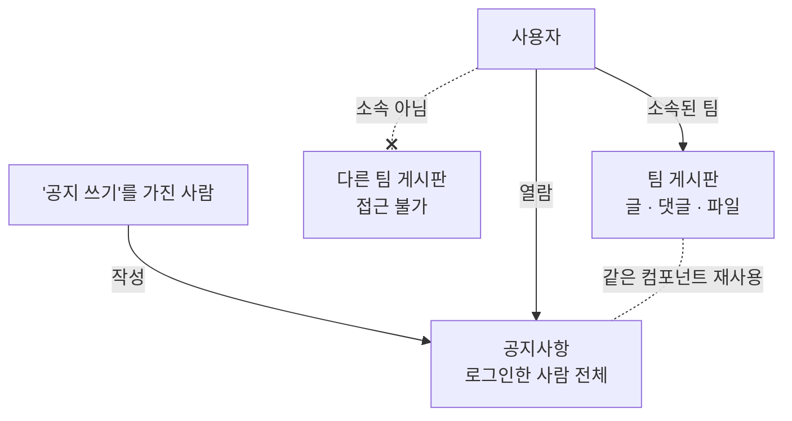
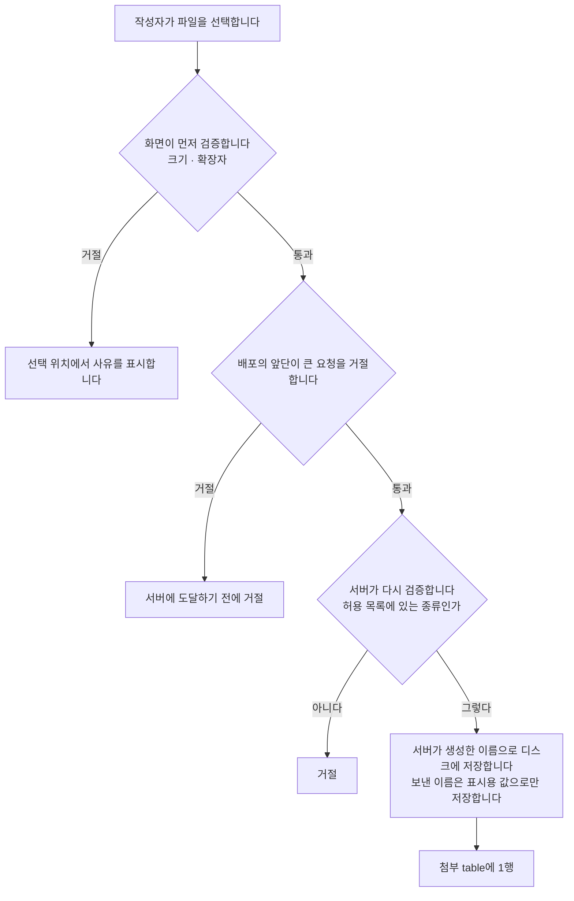

> 문서 버전: 2.3.0 draft



## Abstract

게시판과 공지는 팀 안팎의 소통을 담습니다. 팀마다 글과 댓글, 파일을 나누는 게시판이 있고 소속되지 않은 팀의 게시판에는 접근할 수 없습니다. 공지사항은 그 예외로, "공지 쓰기" 항목을 가진 사람이 작성해 로그인한 사람 전체에게 공개합니다. 공지는 팀 게시판과 같은 구조를 재사용하되 공개 범위만 전체로 뒀습니다.

## Introduction

팀 연습에는 악보나 녹음 파일, 공지 같은 정보가 오갑니다. 이 정보를 팀 안에서만 공유할 수 있어야 하고, 동시에 전체에게 알릴 소식은 따로 있어야 합니다. 2가지를 별개 구조로 만들면 관리가 늘어나서, 게시판 구조 1개를 두고 접근 범위만 다르게 적용하기로 했습니다.

## Related Work

- [Banblit 개요](../README.md) — 전체 기능 지도
- [팀과 포지션](../teams/README.md) — 팀 게시판 접근을 가르는 기준
- [계정과 역할](../accounts-and-roles/README.md) — 요청한 사람을 판정하는 로그인 session과 항목별 권한
- [화면](../screens/README.md) — 이 글들이 실제로 표시되는 화면
- [데이터 저장소](../database-layer/README.md) — 글·댓글·첨부가 저장되는 table과 그 table에 적용된 제약
- [스케줄링 API](../scheduling-api/README.md) — 글과 댓글을 주고받는 endpoint(API의 요청 주소 단위)가 함께 있는 서버

## Description

### 팀 게시판과 공지는 범위만 다릅니다

각 팀은 일반적인 게시판을 갖고, 글과 댓글을 쓰고 파일을 함께 나눕니다. 접근은 그 팀에 소속된 사람으로 제한되므로 소속되지 않은 팀의 게시판은 볼 수 없습니다.

공지사항은 "공지 쓰기" 항목을 가진 사람이 작성하며 로그인한 사람 전체에게 공개되고, 팀에 속하지 않은 사람도 봅니다. 팀 게시판과 같은 구조(글·댓글·파일)를 그대로 쓰되 공개 범위만 전체로 둬서, 화면과 동작을 재사용할 수 있습니다.

공지는 메인 화면에서도 표시됩니다. 최근 글 3개가 [스케줄러](../scheduler/README.md) 캘린더 오른쪽 목록에 함께 표시되는데, 공지 화면에 따로 들어가지 않아도 확인할 수 있게 하기 위해서입니다. 목록에서 글을 누르면 공지사항 화면으로 이동합니다. 팀 게시판은 소속되지 않은 사람에게 표시되면 안 되므로 메인 화면에 노출하지 않습니다.

| 대상 | 작성 | 열람 |
| --- | --- | --- |
| 팀 게시판 | 해당 팀 소속 | 해당 팀 소속만 |
| 공지사항 | "공지 쓰기"를 가진 사람 | 로그인한 사람 전체 |

일정 공유 기능은 v1 범위에서 제외했습니다.

### table 1개에 2가지를 저장합니다

팀 게시판과 공지가 같은 구조라는 말은 문서에서만 그런 것이 아닙니다. 글은 1종류만 있고, 팀 번호가 비어 있으면 그 글이 공지입니다.

```
글
├─ 어느 팀 것인지 비어 있음  ──▶  공지사항 (전체 공개)
└─ 어느 팀 것인지 적혀 있음  ──▶  그 팀 게시판
```

이렇게 두면 글을 읽고 쓰는 endpoint도 글을 표시하는 화면도 1벌이면 됩니다. 단점은 1가지인데, 공지 목록을 조회하는 모든 위치가 "팀 번호가 비어 있음"이라는 조건을 빠짐없이 추가해야 하고 빠뜨리면 팀 글이 공지에 포함됩니다.

되돌릴 수 있는 선택이라고 판단했습니다. "공지도 팀별로 나누자" 같은 요구가 오면 이 구조로는 표현되지 않아 다시 설계해야 하지만, 지금은 글 수가 적어 이전 비용이 작습니다.

### 접근 범위는 이제 실제로 지켜집니다

로그인 상태를 서버가 직접 보관하게 되면서 위 표의 접근 범위가 전부 강제됩니다.

| 규칙 | 지금 |
| --- | --- |
| 팀 게시판에 **쓰는** 사람은 그 팀 소속만 | 지켜집니다 |
| 팀 게시판을 **읽는** 사람은 그 팀 소속만 | 지켜집니다. 소속이 아니면 목록을 반환하지 않습니다 |
| 공지를 **쓰는** 사람은 "공지 쓰기"를 가진 사람만 | 지켜집니다 |
| 공지를 **읽는** 사람은 로그인한 사람 전체 | 지켜집니다. 팀이 없어도 조회합니다 |

공지의 "전체"는 팀을 구분하지 않는다는 뜻이지 로그인하지 않은 사람까지 조회한다는 뜻이 아닙니다. 공지 목록이 놓인 위치가 로그인 뒤의 메인 캘린더 오른쪽이라 방문자는 그 화면에 접근할 수 없고, 방문자가 보는 화면은 랜딩 화면과 로그인 화면뿐입니다. 그래서 어느 팀에도 속하지 않은 사람은 조회하고, 로그인하지 않은 사람은 조회하지 못합니다.

4개 endpoint 모두 "로그인하지 않았다"와 "로그인했지만 권한이 없다"를 다른 응답으로 구분합니다. 로그인하지 않은 사람은 로그인 화면으로 이동시켜야 하고, 권한이 없는 사람은 이동시켜도 같은 화면으로 되돌아오기 때문입니다. 요청한 사람을 무엇으로 판정하는지는 [계정과 역할](../accounts-and-roles/README.md)에서 다룹니다.

### 파일 첨부 (2026-09-07)

파일 저장 위치를 정하지 못해 미뤄 두었던 첨부를 구현했습니다. 파일은 서버 디스크에 저장하고 외부 저장소는 쓰지 않습니다. container(Docker가 실행하는 격리된 프로세스 단위)를 다시 생성해도 내용이 유지되는 volume(container 밖에 남는 저장 공간)을 별도로 연결했는데, 이 방식은 DB 데이터가 유지되는 방식과 같습니다.



| 무엇 | 어떻게 |
| --- | --- |
| 크기 | 파일 1개에 300MB까지. 글 1개에 붙은 첨부의 합계도 300MB까지 |
| 받는 종류 | 이미지·소리·영상과, 흔히 주고받는 문서(md·txt·pdf·docx·ppt·hwp·xlsx·zip 등) |
| 검증 방식 | **허용 목록만 정의하고 나머지는 전부 거절합니다.** 차단 목록을 정의하지 않습니다 |
| 업로드 | 그 글의 작성자만 |
| 삭제 | 그 글의 작성자, 또는 "타 멤버 글 삭제 및 블라인드" 권한을 가진 사람. 화면도 이 2가지 경우에만 삭제 버튼을 표시합니다(글·댓글의 삭제 버튼도 같습니다) |
| 다운로드 | 그 글을 읽을 수 있는 사람. 팀 게시판이면 그 팀 소속, 공지면 로그인한 사람 누구나 |

차단 목록을 정의하지 않는 이유는 다음과 같습니다. 위험한 종류를 1개씩 정의해 차단하면 정의하지 않은 새 종류는 전부 통과하므로, 목록 누락이 곧 보안 취약점이 됩니다. 허용 목록만 정의하면 누락은 "업로드 불가"로 끝나고, 사람이 누락을 확인해 목록에 추가하면 됩니다.

이미지이지만 의도적으로 제외한 종류가 1개 있는데 벡터 이미지(svg)입니다. 그림 파일처럼 보이지만 파일 안에 스크립트를 포함할 수 있고, 브라우저가 svg를 그림이 아니라 문서로 열면 스크립트가 이 서비스 화면의 권한으로 실행됩니다. 아래에서 다루는 "열지 않고 다운로드하게 한다"와 2겹으로 차단하고 있지만 2겹 중 1개가 나중에 완화될 수 있으므로 svg는 허용하지 않기로 했습니다. 이 판단은 코드에 기록하지 않았습니다. 이 저장소의 주석 규칙은 "무엇을 왜 제외했는가" 같은 배경을 코드에 두지 않으므로, 이 문서에 기록합니다.

저장하는 이름은 서버가 생성합니다. 업로드한 사람이 보낸 이름을 그대로 파일 이름으로 쓰면 이름 안에 상위 폴더로 이동하는 표기를 포함해 정해둔 폴더 바깥에 파일을 쓸 수 있습니다. 서버는 무작위 문자열과 확장자로 새 이름을 생성해 그 이름만 디스크에 쓰고, 보낸 이름은 화면에 표시할 값으로만 table에 저장합니다.

```
보낸 이름   "../../etc/passwd"   ──▶  화면에 보여줄 값으로만 남는다
저장 이름   서버가 지은 무작위 글자 + 확장자  ──▶  정해둔 폴더 안에만 놓인다
```

다운로드할 때는 브라우저가 열지 않고 다운로드하게 합니다. 브라우저가 파일을 열면 파일 안의 스크립트가 이 서비스 화면 주소의 권한으로 실행되기 때문입니다. 그래서 다운로드 응답에는 "다운로드할 파일"이라는 표시를 추가하고, 종류도 1가지로 통일해 반환하며, 브라우저가 내용을 분석해 종류를 다시 판정하지 못하게 차단합니다.

크기는 3곳에서 검증합니다.

| 어디 | 무엇을 하나 | 왜 |
| --- | --- | --- |
| 화면 | 파일을 선택하는 위치에서 크기와 종류를 먼저 검증합니다 | 300MB를 전부 업로드한 뒤에 거절되면 그 시간이 전부 낭비됩니다 |
| 배포의 앞단 | 상한을 넘는 요청을 애플리케이션에 도달하기 전에 거절합니다 | 애플리케이션까지 들어와야 거절되면, 거절할 요청 1개가 서버 worker(요청을 처리하는 서버 process)를 그동안 점유합니다 |
| 서버 | 이미 붙어 있는 첨부의 합계에 이번 파일을 더한 값이 300MB를 넘으면 거절합니다 | 파일 1개의 상한만 있으면 같은 글에 300MB 파일을 반복해서 붙여 디스크를 채울 수 있습니다 |

개발 구성에는 그 앞단이 없습니다. 개발에서는 화면 개발 서버가 앞단을 대신하는데 요청 크기를 검증하지 않아서, 상한을 넘는 파일이 애플리케이션까지 들어옵니다. 화면을 거치면 검증되지만 화면을 거치지 않는 요청은 검증되지 않으므로, 배포에서만 2겹이 됩니다.

글을 삭제하면 파일도 삭제됩니다. table의 행은 글이 삭제될 때 함께 삭제되지만 디스크의 파일은 자동으로 삭제되지 않으므로, 글을 삭제하는 코드는 table의 행이 삭제되기 전에 디스크의 파일을 먼저 삭제합니다. 순서를 바꾸면 어느 파일이 그 글에 속하는지 알 수 없어져 아무도 삭제할 수 없는 참조되지 않는 파일이 계속 쌓입니다.

글을 삭제하는 endpoint는 새로 추가되었고 그 글을 작성한 사람만 호출할 수 있습니다. 아직 화면에 버튼은 없고 서버 endpoint만 구현되어 있습니다. table도 1개 추가되었는데, 파일의 내용은 디스크에 있고 table에는 파일의 저장 위치·표시 이름·크기·파일 종류만 저장됩니다. 저장소에서 어떤 제약이 적용되어 있는지는 [데이터 저장소](../database-layer/README.md)에서 다룹니다.

확인은 실제로 파일을 업로드하고 다시 다운로드해 1바이트도 다르지 않은 결과를 확인하고, 허용하지 않은 확장자가 거절되는 결과와 글을 삭제했을 때 디스크의 파일이 함께 삭제되는 결과를 직접 확인하는 방식으로 했습니다. endpoint마다 로그인하지 않은 요청·작성자가 아닌 사람의 요청·읽을 권한이 없는 사람의 요청을 보내 구분되는지도 테스트에 담았습니다. 서버 테스트 468개가 통과하고, 타입 검사는 94개 파일에서 이상이 없으며, 화면 테스트 202개가 통과합니다.

### 블라인드는 지우지 않고 가립니다 (2026-09-16)

부적절한 글을 처리하는 방법이 삭제뿐이었습니다. 삭제는 되돌릴 수 없고 내용도 남지 않아, 판단이
갈리는 글에 쓰기에는 너무 셉니다. 그래서 지우지 않고 가리는 블라인드를 추가했습니다.

```
글에 "가려진 시각"이 비어 있음  ──▶  평소대로 보입니다
글에 "가려진 시각"이 적혀 있음  ──▶  목록·상세에서 빠집니다 (작성자 본인도 볼 수 없습니다)
                                  └▶  설정 화면의 블라인드 탭에만 보입니다
```

**작성자 본인도 볼 수 없습니다.** 글 전체를 격리하는 것이 목적이라 예외를 두지 않았습니다. 댓글에는
따로 표시를 두지 않았습니다 — 댓글은 글에 딸린 것이라 글이 가려지면 함께 가려집니다.

가린 사람도 함께 남깁니다. 권한자가 여럿일 때 사후에 누가 처리했는지 확인할 수 없으면, 잘못 가린
글을 두고 서로 확인할 방법이 없습니다. 해제하면 가려진 시각과 함께 이 값도 비웁니다. 가린 사람의
계정이 삭제되면 이 값만 비고 글은 그대로 남습니다 — 글 작성자와 달리 함께 삭제하지 않습니다.

가려진 글을 요청하면 없는 글과 같은 문장으로 거절합니다. 문장을 나누면 "그 글은 있지만 가려졌다"는
사실이 드러나, 가리는 의미가 줄어듭니다.

| 무엇 | 누가 |
| --- | --- |
| 가리기·되돌리기 | "타 멤버 글 삭제 및 블라인드"(board_moderate)를 가진 사람 |
| 가려진 글 목록 보기 | 같은 사람. 제목·본문과 **누가 가렸는지**가 함께 표시됩니다 |
| 자기 글 수정 | 작성자 본인만 |
| 남의 글 수정 | **아무도 할 수 없습니다.** 권한자도 못 합니다 |
| 남의 글 삭제 | 권한자 |

남의 글 내용을 고치는 것을 권한자에게도 막았습니다(사용자 결정 2026-09-16). 고칠 수 있으면 누가 쓴
말인지가 흐려집니다. 처리해야 할 글은 가리거나 지웁니다.

**권한자는 자기가 속하지 않은 팀의 글도 처리합니다**(사용자 결정 2026-09-16). 팀 소속을 확인하면
그 팀에 속하지 않은 관리자가 부적절한 글을 아무것도 처리할 수 없어, 이 권한이 팀 게시판에서는
쓸모가 없어집니다. 그래서 가리기·되돌리기·삭제와 가려진 글 목록은 팀 소속을 보지 않습니다.

표의 "업로드는 그 글의 작성자만" 은 이번에야 실제로 지켜집니다. 권한자 판정이 팀 소속 확인까지
건너뛰게 되면서, 막지 않으면 권한자가 어느 팀의 어느 글에도 파일을 붙일 수 있었습니다(2026-09-16
코드 리뷰에서 발견). 업로드만 권한자 우회를 끄고, 삭제는 표대로 권한자도 할 수 있게 두었습니다.

**어떻게 확인했나.** 가린 글이 작성자 본인의 목록과 상세에서 사라지는지, 권한이 없는 사람이 가리지
못하는지, 되돌리면 원래 목록으로 돌아오는지, 가려진 글 목록을 권한자만 조회하는지, 권한자가 남의 글을
수정하지 못하고 삭제는 되는지를 `backend/tests/integration/db/test_board_endpoints.py` 의
"===== 블라인드 =====" 아래에 담았습니다. 화면까지 이어지는지는 `frontend/e2e/notices.spec.ts` 의
"공지를 블라인드하면 목록에서 사라지고 설정에서 되돌린다" 가 확인합니다. 권한자가 남의 글에 파일을
붙이지 못하는지는 `backend/tests/integration/db/test_attachment_endpoints.py` 의
`test_a_moderator_cannot_attach_to_someone_elses_post` 가 확인합니다. 누가 가렸는지가 목록에 실리고 해제하면 비워지는지는
`test_the_blinded_list_shows_who_blinded_each_post` 가 확인합니다. 서버 테스트 593개,
화면 테스트 322개가 통과합니다.

### 글은 작성 페이지에서 쓰고, 초안으로 시작합니다 (2026-09-16)

**작성 폼을 목록 아래에서 떼어내 자기 주소를 가진 화면으로 옮겼습니다**(사용자 결정). 공지는 `/notices/new`, 팀 게시판은 `/board/{팀 번호}/new` 입니다. 목록의 "글쓰기" 는 그 화면으로 가는 링크입니다. 목록과 작성은 하는 일이 다르고, 붙여 두면 목록이 길어질수록 폼이 밀리며 작성 화면을 주소로 가리킬 수도 없습니다.

**작성 화면이 열리면 제목과 본문이 빈 글을 먼저 만듭니다.** 본문에 파일을 넣으려면 글 번호가 있어야 하는데, 첨부 업로드가 `POST /posts/{id}/attachments` 라 글이 없으면 쓰는 중에 올릴 수 없기 때문입니다.

`posts.published_at` 이 비어 있는 글이 초안입니다. 목록에 나오지 않고, 쓰는 사람 말고는 번호를 맞혀도 열지 못합니다(403). 제목·본문이 비어 있어도 되도록 DB 의 CHECK 도 `published_at IS NULL OR ...` 로 바꿨습니다. 발행(`POST /posts/{id}/publish`)이 제목·본문을 채우고 `published_at` 을 넣으면 그때부터 목록에 나옵니다.

| 상태 | 목록 | 남이 상세 조회 | 제목·본문 |
|---|---|---|---|
| 초안 | 안 나옴 | 403 | 비어 있어도 됨 |
| 발행 | 나옴 | 열림 | 있어야 함 |

**쓰지 않고 나간 초안은 두 단계로 지웁니다.** 화면이 떠날 때 `DELETE /posts/{id}` 를 보내고, 탭을 닫거나 연결이 끊겨 그 요청이 가지 못한 행은 하루 뒤 자동 배정 확인이 함께 지웁니다(`backend/src/backend/jobs/auto_assign.py` 의 `DRAFT_LIFETIME`).

**어떻게 확인했나.** 초안이 비어 있고 목록에 나오지 않는지, 발행하면 목록에 나오는지, 남이 초안을 열지 못하는지, 공지 초안이 `notice_write` 를 요구하는지, 하루 지난 초안만 지워지는지를 `backend/tests/integration/db/test_board_endpoints.py` 의 "===== 초안 =====" 아래에 담았습니다.

### 본문에 파일을 떨구면 그 자리에 보입니다 (2026-09-16)

본문에 파일을 드래그하거나 붙여넣으면 초안 번호로 올린 뒤, 받은 주소를 확장자에 따라 다른 모양으로 넣습니다. 도구 막대의 "파일" 버튼도 같은 경로입니다.

| 확장자 | 본문에 들어가는 모양 |
|---|---|
| jpg·jpeg·png·gif·webp | 그림(``) |
| mp3·wav·m4a·aac·ogg | 재생기(`<audio controls>`) |
| pdf | 브라우저 내장 뷰어(`<iframe>`) |
| 그 밖 | 본문에 넣지 않고 첨부 목록에만 둡니다 |

유튜브 주소를 붙여넣으면 그 자리에서 재생기가 됩니다.

브라우저마다 갈리는 형식(heic·flac·mov·avi·mkv)은 본문에 넣지 않습니다. 깨진 그림이 뜨는 것보다 이름 줄이 낫습니다. 첨부 파일로는 그대로 올라갑니다.

파일을 잡는 것과 그리는 것은 Tiptap 공식 확장이 합니다 — `@tiptap/extension-file-handler`(떨구기·붙여넣기), `@tiptap/extension-audio`, `@tiptap/extension-youtube`, `@tiptap/extension-image`. PDF 만 공식·오픈소스 노드가 없어 `<iframe>` 노드 하나를 만들었습니다. 뷰어 자체는 브라우저에 내장돼 있어 라이브러리를 더하지 않았습니다.

**본문은 HTML 로 저장되고, 화면에 넣기 직전에 허용 목록에 없는 태그와 속성을 제거합니다**(`frontend/src/lib/richText.ts` 의 `sanitizeBody`). `iframe` 은 태그만 허용하면 어떤 주소든 열리므로 주소를 직접 확인해, 첨부 주소(`/` 로 시작)와 유튜브 임베드가 아니면 태그째 지웁니다.

**본문에 넣은 파일은 첨부 목록에도 남습니다.** 같은 파일이 두 군데 보이지만 그대로 두었습니다(사용자 결정) — 목록에서 빼면 그 파일을 받을 방법이 없어집니다. 첨부 목록은 이름과 크기만 표시하고, 이름을 누르면 받아집니다.

**어떻게 확인했나.** 확장자별로 어떤 모양이 되는지와 `iframe` 주소 제한은 `frontend/src/lib/richText.test.ts` 가 확인합니다. 화면까지 이어지는지는 `frontend/e2e/notices.spec.ts` 의 "본문에 그림을 넣으면 미리보기로 보인다" 가 확인합니다 — 올린 주소가 첨부 주소인지, 발행한 뒤 읽기 화면에도 남는지를 봅니다.

### 글을 작성한 사람은 삭제할 수 없습니다

사람을 삭제하면 그 사람의 소속과 불가능 시간은 함께 삭제되지만, 글과 댓글은 함께 삭제되지 않고 그 사람의 삭제를 거절합니다.

게시판은 오간 이야기가 남아 있어야 뜻이 있습니다. 1명이 탈퇴했다고 대화의 절반이 삭제되면 남은 사람들이 읽던 맥락이 끊기므로, 사람을 삭제하려면 그 사람의 글을 먼저 어떻게 처리할지 정해야 합니다.

아직 사람을 삭제하는 기능 자체가 없습니다. 그 기능을 만들 때 이 규칙을 다시 검토해야 합니다.

## Conclusion

게시판과 공지는 소속을 바탕으로 소통 범위를 나눕니다. 전체 기능이 어떻게 맞물리는지는 [Banblit 개요](../README.md)에서 다시 확인할 수 있습니다.
