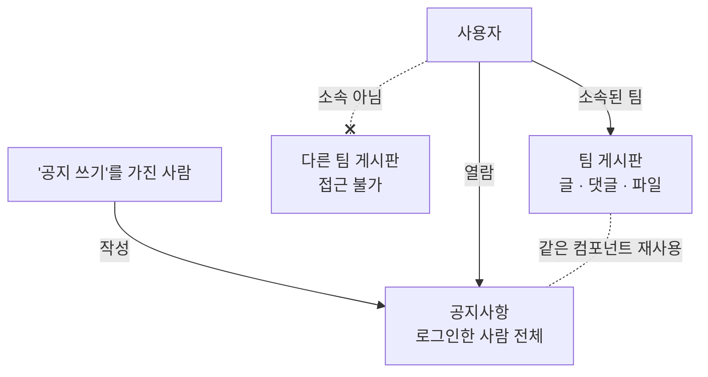
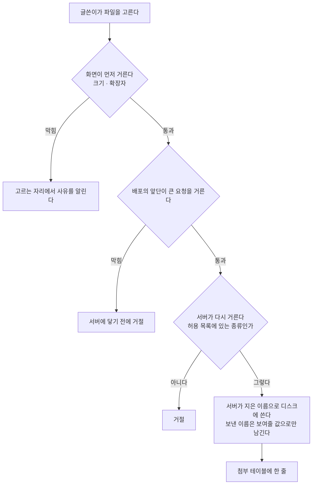

> 문서 버전: 2.2.1 draft



## Abstract

게시판과 공지는 팀 안팎의 소통을 담습니다. 팀마다 글과 댓글, 파일을 나누는 게시판이 있고 소속되지 않은 팀의 게시판에는 접근할 수 없습니다. 공지사항은 그 예외로, "공지 쓰기" 항목을 가진 사람이 작성해 로그인한 사람 전체에게 공개합니다. 공지는 팀 게시판과 같은 구조를 재사용하되 공개 범위만 전체로 뒀습니다.

## Introduction

팀 연습에는 악보나 녹음 파일, 공지 같은 정보가 오갑니다. 이걸 팀 안에서만 나눌 수 있어야 하고, 동시에 전체에게 알릴 소식은 따로 있어야 합니다. 두 가지를 별개 구조로 만들면 관리가 늘어나서, 하나의 게시판 구조를 두고 접근 범위만 다르게 적용하기로 했습니다.

## Related Work

- [Banblit 개요](../README.md) — 전체 기능 지도
- [팀과 포지션](../teams/README.md) — 팀 게시판 접근을 가르는 기준
- [계정과 역할](../accounts-and-roles/README.md) — 요청한 사람을 가려내는 로그인 세션과 항목별 권한
- [화면](../screens/README.md) — 이 글들이 실제로 그려지는 자리
- [데이터 저장소](../database-layer/README.md) — 글·댓글·첨부가 남는 자리와 거기 걸린 제약
- [스케줄링 API](../scheduling-api/README.md) — 글과 댓글을 주고받는 endpoint가 함께 있는 서버

## Description

### 팀 게시판과 공지는 범위만 다릅니다

각 팀은 일반적인 게시판을 갖고, 글과 댓글을 쓰고 파일을 함께 나눕니다. 접근은 그 팀에 소속된 사람으로 제한되므로 소속되지 않은 팀의 게시판은 볼 수 없습니다.

공지사항은 "공지 쓰기" 항목을 가진 사람이 작성하며 로그인한 사람 전체에게 공개되고, 팀에 속하지 않은 사람도 봅니다. 팀 게시판과 같은 구조(글·댓글·파일)를 그대로 쓰되 공개 범위만 전체로 둬서, 화면과 동작을 재사용할 수 있습니다.

공지는 메인 화면에서도 보입니다. 최근 글 몇 개가 [스케줄러](../scheduler/README.md) 캘린더 오른쪽 목록에 함께 뜨는데, 공지를 보러 따로 들어가지 않아도 눈에 들어오게 하기 위해서입니다. 목록에서 글을 누르면 공지사항 화면으로 넘어갑니다. 팀 게시판은 소속되지 않은 사람에게 보이면 안 되므로 이렇게 노출하지 않습니다.

| 대상 | 작성 | 열람 |
| --- | --- | --- |
| 팀 게시판 | 해당 팀 소속 | 해당 팀 소속만 |
| 공지사항 | "공지 쓰기"를 가진 사람 | 로그인한 사람 전체 |

일정 공유 기능은 v1 범위에서 제외했습니다.

### 한 테이블에 둘을 담습니다

팀 게시판과 공지가 같은 구조라는 말은 문서에서만 그런 것이 아닙니다. 글은 한 종류만 있고, 어느 팀 것인지가 비어 있으면 그것이 공지입니다.

```
글
├─ 어느 팀 것인지 비어 있음  ──▶  공지사항 (전체 공개)
└─ 어느 팀 것인지 적혀 있음  ──▶  그 팀 게시판
```

이렇게 두면 글을 읽고 쓰는 endpoint도 그것을 그리는 화면도 한 벌이면 됩니다. 대가는 하나인데, 공지 목록을 뽑는 모든 자리가 "팀이 비어 있는 것"이라는 조건을 빠짐없이 넣어야 하고 빠뜨리면 팀 글이 공지에 섞입니다.

되돌릴 수 있는 선택이라고 봤습니다. "공지도 팀별로 나누자" 같은 요구가 오면 이 구조로는 표현되지 않아 다시 짜야 하지만, 지금은 글이 몇 개뿐이라 옮기는 비용이 거의 없습니다.

### 접근 범위는 이제 실제로 지켜집니다

로그인 상태를 서버가 직접 들고 있게 되면서 위 표의 접근 범위가 전부 강제됩니다.

| 규칙 | 지금 |
| --- | --- |
| 팀 게시판에 **쓰는** 것은 그 팀 소속만 | 지켜진다 |
| 팀 게시판을 **읽는** 것은 그 팀 소속만 | 지켜진다 — 소속이 아니면 목록을 돌려주지 않는다 |
| 공지를 **쓰는** 것은 "공지 쓰기"를 가진 사람만 | 지켜진다 |
| 공지를 **읽는** 것은 로그인한 사람 전체 | 지켜진다 — 팀이 없어도 본다 |

공지의 "전체"는 팀을 가리지 않는다는 뜻이지 로그인하지 않은 사람까지 본다는 뜻이 아닙니다. 공지 목록이 놓인 자리가 로그인 뒤의 메인 캘린더 오른쪽이라 방문자는 애초에 그 화면에 닿지 않고, 방문자가 보는 것은 랜딩 화면과 로그인 화면뿐입니다. 그래서 어느 팀에도 속하지 않은 사람은 보고, 로그인하지 않은 사람은 못 봅니다.

네 자리 모두 "로그인하지 않았다"와 "로그인했지만 권한이 없다"를 다른 응답으로 가릅니다. 앞은 로그인 화면으로 보내야 할 사람이고, 뒤는 보내봐야 같은 자리로 되돌아오기 때문입니다. 요청한 사람을 무엇으로 가려내는지는 [계정과 역할](../accounts-and-roles/README.md)에서 다룹니다.

### 파일 첨부 (2026-09-07)

파일을 어디에 둘지 정하지 못해 미뤄 두었던 첨부가 들어왔습니다. 파일은 서버 디스크에 두고 바깥 보관소는 쓰지 않습니다. 컨테이너를 다시 만들어도 내용이 남는 자리를 따로 붙여 뒀는데, 이것은 저장소 데이터가 남는 방식과 같습니다.



| 무엇 | 어떻게 |
| --- | --- |
| 크기 | 파일 하나에 300MB까지 |
| 받는 종류 | 이미지·소리·영상과, 흔히 주고받는 문서(md·txt·pdf·docx·ppt·hwp·xlsx·zip 같은 것) |
| 거르는 방식 | **받을 것만 적어두고 그 밖은 전부 거절한다** — 막을 것을 세지 않는다 |
| 올리기·지우기 | 그 글의 글쓴이만 |
| 받기 | 그 글을 읽을 수 있는 사람 — 팀 게시판이면 그 팀 소속, 공지면 로그인한 사람 누구나 |

막을 것을 세지 않는 이유는 이렇습니다. 위험한 종류를 하나씩 적어 막으면 적어두지 않은 새 종류는 전부 통과하므로, 목록을 빠뜨린 쪽이 열리는 셈이라 빠뜨림이 곧 구멍이 됩니다. 받을 것만 적어두면 빠뜨림은 "못 올린다"로 끝나고, 사람이 그것을 알아채 목록에 더하면 됩니다.

이미지지만 일부러 뺀 것이 하나 있는데 벡터 이미지(svg)입니다. 그림 파일처럼 보이지만 그 안에 스크립트를 넣을 수 있고, 브라우저가 그것을 그림이 아니라 문서로 열면 스크립트가 우리 화면의 권한으로 돕니다. 아래에서 다루는 "열지 않고 내려받게 한다"와 겹쳐 막고 있지만 두 겹 중 하나가 나중에 느슨해질 수 있으므로 아예 받지 않기로 했습니다. 이 판단은 코드에 적어 두지 않았습니다. 이 저장소의 주석 규칙은 "무엇을 왜 뺐는가" 같은 배경을 코드에 두지 않게 해서, 여기 남깁니다.

저장하는 이름은 서버가 짓습니다. 올린 사람이 보낸 이름을 그대로 파일 이름으로 쓰면 이름 안에 상위 폴더로 올라가는 표기를 섞어 정해둔 자리 바깥에 파일을 쓸 수 있습니다. 서버는 무작위 글자와 확장자로 새 이름을 지어 그것만 디스크에 쓰고, 보낸 이름은 화면에 보여줄 값으로만 테이블에 남깁니다.

```
보낸 이름   "../../etc/passwd"   ──▶  화면에 보여줄 값으로만 남는다
저장 이름   서버가 지은 무작위 글자 + 확장자  ──▶  정해둔 폴더 안에만 놓인다
```

받을 때는 브라우저가 열지 않고 내려받게 합니다. 브라우저가 파일을 열어 버리면 그 안에 든 스크립트가 우리 화면 주소의 권한으로 돌기 때문입니다. 그래서 받는 응답에는 "이건 내려받을 것"이라는 표시를 붙이고, 종류도 하나로 뭉뚱그려 내려보내며, 브라우저가 내용을 들여다보고 종류를 제 맘대로 다시 정하지 못하게 막습니다.

크기는 두 자리에서 막습니다.

| 어디 | 무엇을 하나 | 왜 |
| --- | --- | --- |
| 화면 | 파일을 고르는 자리에서 크기와 종류를 먼저 본다 | 300MB를 다 올려보낸 뒤에 거절당하면 그 시간이 통째로 버려진다 |
| 배포의 앞단 | 상한을 넘는 요청을 애플리케이션에 닿기 전에 거절한다 | 애플리케이션까지 들어와야 거절되면, 거절할 요청 하나가 서버 일꾼을 그동안 붙잡는다 |

개발 구성에는 그 앞단이 없습니다. 개발에서는 화면 개발 서버가 앞단을 대신하는데 요청 크기를 재지 않아서, 상한을 넘는 파일이 애플리케이션까지 들어옵니다. 화면을 거치면 걸리지만 화면을 거치지 않는 요청은 걸리지 않으므로, 배포에서만 두 겹이 됩니다.

글을 지우면 파일도 지웁니다. 테이블의 줄은 글이 사라질 때 함께 사라지지만 디스크의 파일은 저절로 사라지지 않으므로, 글을 지우는 자리는 테이블의 줄이 사라지기 전에 디스크의 파일부터 지웁니다. 순서를 바꾸면 어느 파일이 그 글의 것이었는지 알 방법이 없어져 아무도 지울 수 없는 파일이 계속 쌓입니다.

글을 지우는 자리는 새로 생겼고 그 글을 쓴 사람만 지웁니다. 아직 화면에 단추는 없고 서버 쪽 자리만 열려 있습니다. 테이블도 하나 늘었는데, 파일의 내용은 디스크에 있고 테이블에는 그 자리와 보여줄 이름·크기·종류만 남습니다. 저장소에서 어떤 제약이 걸려 있는지는 [데이터 저장소](../database-layer/README.md)에서 다룹니다.

확인은 실제로 파일을 올리고 다시 받아 한 바이트도 다르지 않은 것을 보고, 허용하지 않은 확장자가 거절되는 것과 글을 지웠을 때 디스크의 파일이 함께 사라지는 것을 눈으로 하는 식으로 했습니다. endpoint마다 로그인하지 않은 요청·글쓴이가 아닌 사람의 요청·읽을 권한이 없는 사람의 요청을 넣어 갈리는지도 테스트에 담았습니다. 서버 테스트 468개가 통과하고, 타입 검사는 94개 파일에서 이상이 없으며, 화면 테스트 202개가 통과합니다.

### 글을 쓴 사람은 지울 수 없습니다

사람을 지우면 그 사람의 소속과 못 나오는 시간은 함께 사라지지만, 글과 댓글은 함께 사라지지 않고 오히려 그 사람을 지우지 못하게 막습니다.

게시판은 오간 이야기가 남아 있어야 뜻이 있습니다. 한 사람이 나갔다고 대화의 절반이 사라지면 남은 사람들이 읽던 맥락이 끊기므로, 사람을 지우려면 그 사람의 글을 먼저 어떻게 할지 정해야 합니다.

아직 사람을 지우는 기능 자체가 없습니다. 그것을 만들 때 이 규칙을 다시 꺼내 봐야 합니다.

## Conclusion

게시판과 공지는 소속을 바탕으로 소통 범위를 나눕니다. 전체 기능이 어떻게 맞물리는지는 [Banblit 개요](../README.md)에서 다시 확인할 수 있습니다.
