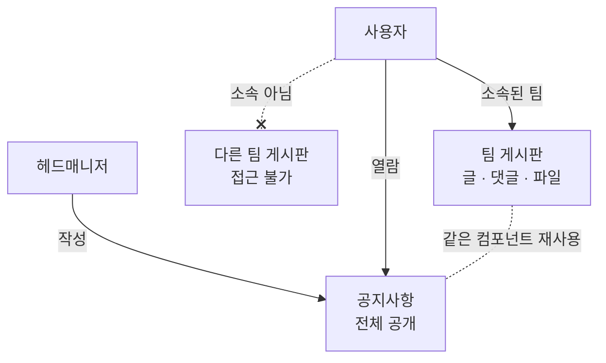

> 문서 버전: 1.0.0 draft

## Abstract

게시판과 공지는 팀 안팎의 소통을 담는다. 팀마다 글과 댓글, 파일을 나누는 게시판이 있으며, 소속되지 않은 팀의 게시판에는 접근할 수 없다. 공지사항은 그 예외로, 헤드매니저가 작성해 전체에게 공개한다. 공지는 팀 게시판과 같은 구조를 재사용하되 공개 범위만 전체로 둔다.

## Introduction

팀 연습에는 악보나 녹음 파일, 공지 같은 정보가 오간다. 이걸 팀 안에서만 나눌 수 있어야 하고, 동시에 전체에게 알릴 소식은 따로 있어야 한다. 두 가지를 별개 구조로 만들면 관리가 늘어난다. 그래서 하나의 게시판 구조를 두고, 접근 범위만 다르게 적용한다.

## Related Work

- [Banblit 개요](../README.md) — 전체 기능 지도
- [팀과 소속](../teams/README.md) — 게시판 접근을 가르는 소속
- [계정과 역할](../accounts-and-roles/README.md) — 공지를 작성하는 헤드매니저 권한

## Description

**팀 게시판.** 각 팀은 일반적인 게시판을 갖는다. 글과 댓글을 쓰고, 파일을 함께 나눈다. 접근은 그 팀에 소속된 사람으로 제한된다. 소속되지 않은 팀의 게시판은 볼 수 없다.

**공지사항.** 헤드매니저가 작성하며 전체에게 공개된다. 팀 게시판과 같은 구조(글·댓글·파일)를 그대로 쓰되, 공개 범위만 전체로 둔다. 덕분에 화면과 동작을 재사용할 수 있다.

**접근 범위 정리.**

| 대상 | 작성 | 열람 |
| --- | --- | --- |
| 팀 게시판 | 해당 팀 소속 | 해당 팀 소속만 |
| 공지사항 | 헤드매니저 | 전체 |

일정 공유 기능은 v1 범위에서 제외한다.

## Conclusion

게시판과 공지는 소속을 바탕으로 소통 범위를 나눈다. 전체 기능이 어떻게 맞물리는지는 [Banblit 개요](../README.md)에서 다시 확인할 수 있다.
