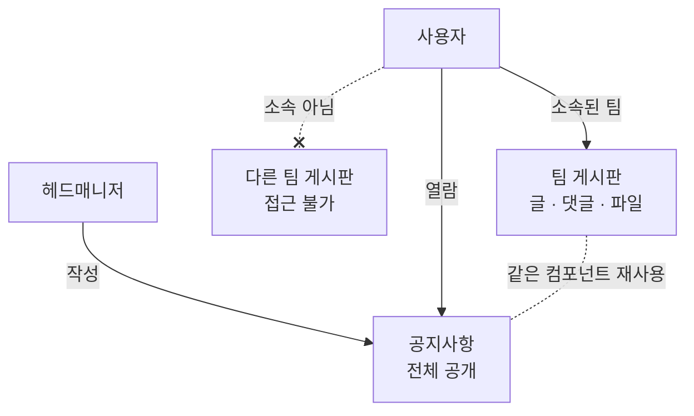

> 문서 버전: 2.1.0 draft



## Abstract

게시판과 공지는 팀 안팎의 소통을 담는다. 팀마다 글과 댓글, 파일을 나누는 게시판이 있으며, 소속되지 않은 팀의 게시판에는 접근할 수 없다. 공지사항은 그 예외로, 헤드매니저가 작성해 전체에게 공개한다. 공지는 팀 게시판과 같은 구조를 재사용하되 공개 범위만 전체로 둔다.

## Introduction

팀 연습에는 악보나 녹음 파일, 공지 같은 정보가 오간다. 이걸 팀 안에서만 나눌 수 있어야 하고, 동시에 전체에게 알릴 소식은 따로 있어야 한다. 두 가지를 별개 구조로 만들면 관리가 늘어난다. 그래서 하나의 게시판 구조를 두고, 접근 범위만 다르게 적용한다.

## Related Work

- [Banblit 개요](../README.md) — 전체 기능 지도
- [팀과 소속](../teams/README.md) — 게시판 접근을 가르는 소속
- [계정과 역할](../accounts-and-roles/README.md) — 요청한 사람을 가려내는 로그인 세션과 헤드매니저 권한
- [화면](../screens/README.md) — 이 글들이 실제로 그려지는 자리
- [스케줄링 API](../scheduling-api/README.md) — 글과 댓글을 주고받는 통로가 함께 있는 서버

## Description

**팀 게시판.** 각 팀은 일반적인 게시판을 갖는다. 글과 댓글을 쓰고, 파일을 함께 나눈다. 접근은 그 팀에 소속된 사람으로 제한된다. 소속되지 않은 팀의 게시판은 볼 수 없다.

**공지사항.** 헤드매니저가 작성하며 전체에게 공개된다. 팀 게시판과 같은 구조(글·댓글·파일)를 그대로 쓰되, 공개 범위만 전체로 둔다. 덕분에 화면과 동작을 재사용할 수 있다.

**공지는 메인 화면에서도 보인다.** 최근 글 몇 개가 [스케줄러](../scheduler/README.md) 캘린더 오른쪽 목록에 함께 뜬다. 공지를 보러 따로 들어가지 않아도 눈에 들어오게 하기 위해서다. 목록에서 글을 누르면 공지사항 화면으로 넘어간다. 팀 게시판은 이렇게 노출하지 않는다 — 소속되지 않은 사람에게 보이면 안 되기 때문이다.

**접근 범위 정리.**

| 대상 | 작성 | 열람 |
| --- | --- | --- |
| 팀 게시판 | 해당 팀 소속 | 해당 팀 소속만 |
| 공지사항 | 헤드매니저 | 전체 |

일정 공유 기능은 v1 범위에서 제외한다.

### 한 표에 둘을 담는다

팀 게시판과 공지가 같은 구조라는 말은 문서에서만 그런 것이 아니다. **글은 한 종류만 있고, 어느 팀 것인지가 비어 있으면 그것이 공지다.**

```
글
├─ 어느 팀 것인지 비어 있음  ──▶  공지사항 (전체 공개)
└─ 어느 팀 것인지 적혀 있음  ──▶  그 팀 게시판
```

이렇게 두면 글을 읽고 쓰는 통로도, 그것을 그리는 화면도 한 벌이면 된다. 대가는 하나다 — 공지 목록을 뽑는 모든 자리가 "팀이 비어 있는 것" 이라는 조건을 빠짐없이 넣어야 한다. 빠뜨리면 팀 글이 공지에 섞인다.

되돌릴 수 있는 선택이다. "공지도 팀별로 나누자" 같은 요구가 오면 이 구조로는 표현되지 않아 다시 짜야 하는데, 지금은 글이 몇 개뿐이라 옮기는 비용이 거의 없다.

### 접근 범위는 이제 실제로 지켜진다

**서버가 요청을 보낸 사람이 누구인지 안다.** 로그인 상태를 서버가 직접 들고 있게 되면서, 위 표의 접근 범위가 전부 강제된다.

| 규칙 | 지금 |
| --- | --- |
| 팀 게시판에 **쓰는** 것은 그 팀 소속만 | 지켜진다 |
| 팀 게시판을 **읽는** 것은 그 팀 소속만 | 지켜진다 — 소속이 아니면 목록을 돌려주지 않는다 |
| 공지를 **쓰는** 것은 헤드매니저만 | 지켜진다 |

공지를 **읽는** 것만 로그인 없이 열려 있다. 전체 공개가 원래 뜻이므로 그대로 둔다.

세 자리 모두 "로그인하지 않았다"와 "로그인했지만 자격이 없다"를 다른 응답으로 가른다. 앞은 로그인 화면으로 보내야 할 사람이고, 뒤는 보내봐야 같은 자리로 되돌아오기 때문이다. 요청한 사람을 무엇으로 가려내는지는 [계정과 역할](../accounts-and-roles/README.md)에서 다룬다.

파일 첨부는 아직 없다 — 파일을 어디에 둘지 정하지 않았기 때문이다.

### 글을 쓴 사람은 지울 수 없다

사람을 지우면 그 사람의 소속과 못 나오는 시간은 함께 사라진다. 그런데 **글과 댓글은 함께 사라지지 않고, 오히려 그 사람을 지우지 못하게 막는다.**

게시판은 오간 이야기가 남아 있어야 뜻이 있다. 한 사람이 나갔다고 대화의 절반이 사라지면 남은 사람들이 읽던 맥락이 끊긴다. 그래서 사람을 지우려면 그 사람의 글을 먼저 어떻게 할지 정해야 한다.

아직 사람을 지우는 기능 자체가 없다. 그것을 만들 때 이 규칙을 다시 꺼내 봐야 한다.

## Conclusion

게시판과 공지는 소속을 바탕으로 소통 범위를 나눈다. 전체 기능이 어떻게 맞물리는지는 [Banblit 개요](../README.md)에서 다시 확인할 수 있다.
