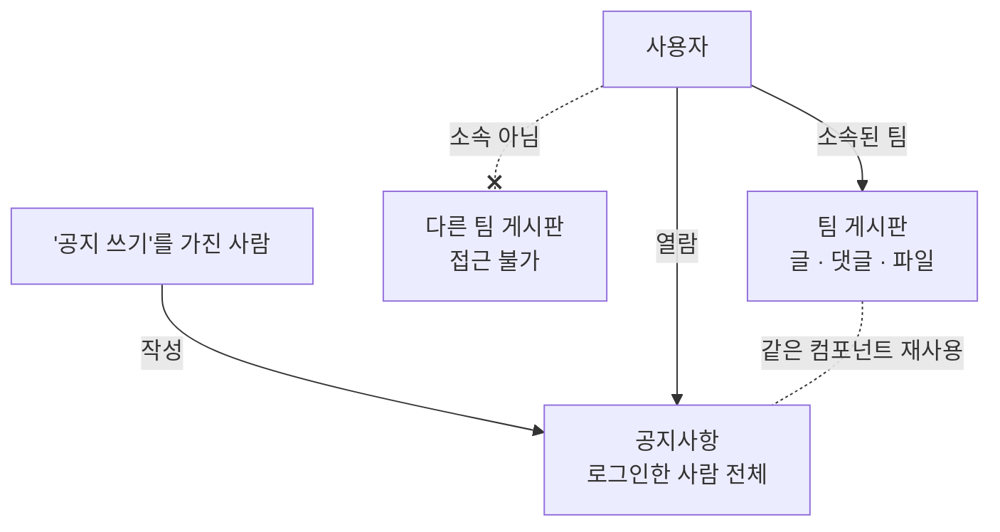

> 문서 버전: 2.2.3 draft



## Abstract

게시판과 공지는 팀 안팎의 소통을 담습니다. 팀마다 글과 댓글, 파일을 나누는 게시판이 있고 소속되지 않은 팀의 게시판에는 접근할 수 없습니다. 공지사항은 그 예외로, "공지 쓰기" 항목을 가진 사람이 작성해 로그인한 사람 전체에게 공개합니다. 공지는 팀 게시판과 같은 구조를 재사용하되 공개 범위만 전체로 뒀습니다.

## Introduction

팀 연습에는 악보나 녹음 파일, 공지 같은 정보가 오갑니다. 이 정보를 팀 안에서만 공유할 수 있어야 하고, 동시에 전체에게 알릴 소식은 따로 있어야 합니다. 2가지를 별개 구조로 만들면 관리가 늘어나서, 게시판 구조 1개를 두고 접근 범위만 다르게 적용하기로 했습니다.

## Related Work

- [Banblit 개요](../README.md) — 전체 기능 지도
- [팀과 포지션](../teams/README.md) — 팀 게시판 접근을 가르는 기준
- [계정과 역할](../accounts-and-roles/README.md) — 요청한 사람을 판정하는 로그인 session과 항목별 권한
- [화면](../screens/README.md) — 이 글들이 실제로 표시되는 화면
- [데이터 저장소](../database-layer/README.md) — 글·댓글·첨부가 저장되는 table과 그 table에 적용된 제약
- [스케줄링 API](../scheduling-api/README.md) — 글과 댓글을 주고받는 endpoint(API의 요청 주소 단위)가 함께 있는 서버

## Description

### 팀 게시판과 공지는 범위만 다릅니다

각 팀은 일반적인 게시판을 갖고, 글과 댓글을 쓰고 파일을 함께 나눕니다. 접근은 그 팀에 소속된 사람으로 제한되므로 소속되지 않은 팀의 게시판은 볼 수 없습니다.

공지사항은 "공지 쓰기" 항목을 가진 사람이 작성하며 로그인한 사람 전체에게 공개되고, 팀에 속하지 않은 사람도 봅니다. 팀 게시판과 같은 구조(글·댓글·파일)를 그대로 쓰되 공개 범위만 전체로 둬서, 화면과 동작을 재사용할 수 있습니다.

공지는 메인 화면에서도 표시됩니다. 최근 글 3개가 [스케줄러](../scheduler/README.md) 캘린더 오른쪽 목록에 함께 표시되는데, 공지 화면에 따로 들어가지 않아도 확인할 수 있게 하기 위해서입니다. 목록에서 글을 누르면 공지사항 화면으로 이동합니다. 팀 게시판은 소속되지 않은 사람에게 표시되면 안 되므로 메인 화면에 노출하지 않습니다.

| 대상 | 작성 | 열람 |
| --- | --- | --- |
| 팀 게시판 | 해당 팀 소속 | 해당 팀 소속만 |
| 공지사항 | "공지 쓰기"를 가진 사람 | 로그인한 사람 전체 |

일정 공유 기능은 v1 범위에서 제외했습니다.

### table 1개에 2가지를 저장합니다

팀 게시판과 공지가 같은 구조라는 말은 문서에서만 그런 것이 아닙니다. 글은 1종류만 있고, 팀 번호가 비어 있으면 그 글이 공지입니다.

```
글
├─ 어느 팀 것인지 비어 있음  ──▶  공지사항 (전체 공개)
└─ 어느 팀 것인지 적혀 있음  ──▶  그 팀 게시판
```

이렇게 두면 글을 읽고 쓰는 endpoint도 글을 표시하는 화면도 1벌이면 됩니다. 단점은 1가지인데, 공지 목록을 조회하는 모든 위치가 "팀 번호가 비어 있음"이라는 조건을 빠짐없이 추가해야 하고 빠뜨리면 팀 글이 공지에 포함됩니다.

되돌릴 수 있는 선택이라고 판단했습니다. "공지도 팀별로 나누자" 같은 요구가 오면 이 구조로는 표현되지 않아 다시 설계해야 하지만, 지금은 글 수가 적어 이전 비용이 작습니다.

### 접근 범위는 이제 실제로 지켜집니다

로그인 상태를 서버가 직접 보관하게 되면서 위 표의 접근 범위가 전부 강제됩니다.

| 규칙 | 지금 |
| --- | --- |
| 팀 게시판에 **쓰는** 사람은 그 팀 소속만 | 지켜집니다 |
| 팀 게시판을 **읽는** 사람은 그 팀 소속만 | 지켜집니다. 소속이 아니면 목록을 반환하지 않습니다 |
| 공지를 **쓰는** 사람은 "공지 쓰기"를 가진 사람만 | 지켜집니다 |
| 공지를 **읽는** 사람은 로그인한 사람 전체 | 지켜집니다. 팀이 없어도 조회합니다 |

공지의 "전체"는 팀을 구분하지 않는다는 뜻이지 로그인하지 않은 사람까지 조회한다는 뜻이 아닙니다. 공지 목록이 놓인 위치가 로그인 뒤의 메인 캘린더 오른쪽이라 방문자는 그 화면에 접근할 수 없고, 방문자가 보는 화면은 랜딩 화면과 로그인 화면뿐입니다. 그래서 어느 팀에도 속하지 않은 사람은 조회하고, 로그인하지 않은 사람은 조회하지 못합니다.

4개 endpoint 모두 "로그인하지 않았다"와 "로그인했지만 권한이 없다"를 다른 응답으로 구분합니다. 로그인하지 않은 사람은 로그인 화면으로 이동시켜야 하고, 권한이 없는 사람은 이동시켜도 같은 화면으로 되돌아오기 때문입니다. 요청한 사람을 무엇으로 판정하는지는 [계정과 역할](../accounts-and-roles/README.md)에서 다룹니다.

### 파일 첨부 (2026-09-07)

파일 저장 위치를 정하지 못해 미뤄 두었던 첨부를 구현했습니다. 파일은 서버 디스크에 저장하고 외부 저장소는 쓰지 않습니다. container(Docker가 실행하는 격리된 프로세스 단위)를 다시 생성해도 내용이 유지되는 volume(container 밖에 남는 저장 공간)을 별도로 연결했는데, 이 방식은 DB 데이터가 유지되는 방식과 같습니다.


| 무엇 | 어떻게 |
| --- | --- |
| 크기 | 파일 1개에 300MB까지 |
| 받는 종류 | 이미지·소리·영상과, 흔히 주고받는 문서(md·txt·pdf·docx·ppt·hwp·xlsx·zip 등) |
| 검증 방식 | **허용 목록만 정의하고 나머지는 전부 거절합니다.** 차단 목록을 정의하지 않습니다 |
| 업로드 | 그 글의 작성자만 |
| 삭제 | 그 글의 작성자, 또는 "타 멤버 글 수정 및 삭제" 권한을 가진 사람. 화면도 이 2가지 경우에만 삭제 버튼을 표시합니다(글·댓글의 삭제 버튼도 같습니다) |
| 다운로드 | 그 글을 읽을 수 있는 사람. 팀 게시판이면 그 팀 소속, 공지면 로그인한 사람 누구나 |

차단 목록을 정의하지 않는 이유는 다음과 같습니다. 위험한 종류를 1개씩 정의해 차단하면 정의하지 않은 새 종류는 전부 통과하므로, 목록 누락이 곧 보안 취약점이 됩니다. 허용 목록만 정의하면 누락은 "업로드 불가"로 끝나고, 사람이 누락을 확인해 목록에 추가하면 됩니다.

이미지이지만 의도적으로 제외한 종류가 1개 있는데 벡터 이미지(svg)입니다. 그림 파일처럼 보이지만 파일 안에 스크립트를 포함할 수 있고, 브라우저가 svg를 그림이 아니라 문서로 열면 스크립트가 이 서비스 화면의 권한으로 실행됩니다. 아래에서 다루는 "열지 않고 다운로드하게 한다"와 2겹으로 차단하고 있지만 2겹 중 1개가 나중에 완화될 수 있으므로 svg는 허용하지 않기로 했습니다. 이 판단은 코드에 기록하지 않았습니다. 이 저장소의 주석 규칙은 "무엇을 왜 제외했는가" 같은 배경을 코드에 두지 않으므로, 이 문서에 기록합니다.

저장하는 이름은 서버가 생성합니다. 업로드한 사람이 보낸 이름을 그대로 파일 이름으로 쓰면 이름 안에 상위 폴더로 이동하는 표기를 포함해 정해둔 폴더 바깥에 파일을 쓸 수 있습니다. 서버는 무작위 문자열과 확장자로 새 이름을 생성해 그 이름만 디스크에 쓰고, 보낸 이름은 화면에 표시할 값으로만 table에 저장합니다.

```
보낸 이름   "../../etc/passwd"   ──▶  화면에 보여줄 값으로만 남는다
저장 이름   서버가 지은 무작위 글자 + 확장자  ──▶  정해둔 폴더 안에만 놓인다
```

다운로드할 때는 브라우저가 열지 않고 다운로드하게 합니다. 브라우저가 파일을 열면 파일 안의 스크립트가 이 서비스 화면 주소의 권한으로 실행되기 때문입니다. 그래서 다운로드 응답에는 "다운로드할 파일"이라는 표시를 추가하고, 종류도 1가지로 통일해 반환하며, 브라우저가 내용을 분석해 종류를 다시 판정하지 못하게 차단합니다.

크기는 2곳에서 검증합니다.

| 어디 | 무엇을 하나 | 왜 |
| --- | --- | --- |
| 화면 | 파일을 선택하는 위치에서 크기와 종류를 먼저 검증합니다 | 300MB를 전부 업로드한 뒤에 거절되면 그 시간이 전부 낭비됩니다 |
| 배포의 앞단 | 상한을 넘는 요청을 애플리케이션에 도달하기 전에 거절합니다 | 애플리케이션까지 들어와야 거절되면, 거절할 요청 1개가 서버 worker(요청을 처리하는 서버 process)를 그동안 점유합니다 |

개발 구성에는 그 앞단이 없습니다. 개발에서는 화면 개발 서버가 앞단을 대신하는데 요청 크기를 검증하지 않아서, 상한을 넘는 파일이 애플리케이션까지 들어옵니다. 화면을 거치면 검증되지만 화면을 거치지 않는 요청은 검증되지 않으므로, 배포에서만 2겹이 됩니다.

글을 삭제하면 파일도 삭제됩니다. table의 행은 글이 삭제될 때 함께 삭제되지만 디스크의 파일은 자동으로 삭제되지 않으므로, 글을 삭제하는 코드는 table의 행이 삭제되기 전에 디스크의 파일을 먼저 삭제합니다. 순서를 바꾸면 어느 파일이 그 글에 속하는지 알 수 없어져 아무도 삭제할 수 없는 참조되지 않는 파일이 계속 쌓입니다.

글을 삭제하는 endpoint는 새로 추가되었고 그 글을 작성한 사람만 호출할 수 있습니다. 아직 화면에 버튼은 없고 서버 endpoint만 구현되어 있습니다. table도 1개 추가되었는데, 파일의 내용은 디스크에 있고 table에는 파일의 저장 위치·표시 이름·크기·파일 종류만 저장됩니다. 저장소에서 어떤 제약이 적용되어 있는지는 [데이터 저장소](../database-layer/README.md)에서 다룹니다.

확인은 실제로 파일을 업로드하고 다시 다운로드해 1바이트도 다르지 않은 결과를 확인하고, 허용하지 않은 확장자가 거절되는 결과와 글을 삭제했을 때 디스크의 파일이 함께 삭제되는 결과를 직접 확인하는 방식으로 했습니다. endpoint마다 로그인하지 않은 요청·작성자가 아닌 사람의 요청·읽을 권한이 없는 사람의 요청을 보내 구분되는지도 테스트에 담았습니다. 서버 테스트 468개가 통과하고, 타입 검사는 94개 파일에서 이상이 없으며, 화면 테스트 202개가 통과합니다.

### 글을 작성한 사람은 삭제할 수 없습니다

사람을 삭제하면 그 사람의 소속과 불가능 시간은 함께 삭제되지만, 글과 댓글은 함께 삭제되지 않고 그 사람의 삭제를 거부합니다.

게시판은 오간 이야기가 남아 있어야 뜻이 있습니다. 1명이 탈퇴했다고 대화의 절반이 삭제되면 남은 사람들이 읽던 맥락이 끊기므로, 사람을 삭제하려면 그 사람의 글을 먼저 어떻게 처리할지 정해야 합니다.

아직 사람을 삭제하는 기능 자체가 없습니다. 그 기능을 만들 때 이 규칙을 다시 검토해야 합니다.

## Conclusion

게시판과 공지는 소속을 바탕으로 소통 범위를 나눕니다. 전체 기능이 어떻게 맞물리는지는 [Banblit 개요](../README.md)에서 다시 확인할 수 있습니다.
