> 문서 버전: 2.0.1 draft

```mermaid
erDiagram
    Member ||--o{ MemberPermissionSet : "permission set을 받습니다"
    PermissionSet ||--o{ MemberPermissionSet : "사람에게 부여됩니다"
    Member ||--o{ Membership : "가집니다"
    Team ||--o{ Membership : "가집니다"
    Position ||--o{ Membership : "맡습니다"
    Member ||--o{ MemberPosition : "가입할 때 선택합니다"
    Position ||--o{ MemberPosition : "선택할 수 있는 값이 됩니다"
    Member ||--o{ UnavailableTime : "등록합니다"
    Member ||--o{ LoginSession : "로그인합니다"
    Member ||--o{ Notification : "알림을 받습니다"
    Member ||--o{ PasswordResetToken : "재설정 링크를 받습니다"
    Room ||--o{ Assignment : "장소가 됩니다"
    Team ||--o{ Assignment : "배정받습니다"
    Period ||--o{ Assignment : "기간 안에 속합니다"
    Period ||--o{ AssignmentRun : "실행 시각이 저장됩니다"
    Room ||--o{ AssignmentBackup : "장소가 됩니다"
    Team ||--o{ AssignmentBackup : "배정받습니다"
    Period ||--o{ AssignmentBackup : "기간 안에 속합니다"
    Room ||--o{ Reservation : "장소가 됩니다"
    Member ||--o{ Reservation : "예약합니다"
    Team |o--o{ Reservation : "팀 이름으로 예약됩니다"
    Team |o--o{ Post : "게시판을 가집니다"
    Member ||--o{ Post : "작성합니다"
    Post ||--o{ Comment : "달립니다"
    Member ||--o{ Comment : "작성합니다"
    Post ||--o{ Attachment : "파일이 첨부됩니다"

    Member { int id PK }
    PermissionSet { string name }
    MemberPermissionSet { int member_id FK }
    Position { string name }
    Team {
        string name
        string join_policy "2개 값 중 1개"
    }
    Membership {
        int member_id FK
        string status "2개 값 중 1개"
    }
    MemberPosition { int position_id FK }
    UnavailableTime { datetime starts_at }
    Room { time opens_at }
    Period { string kind }
    Assignment { datetime starts_at }
    AssignmentRun { date run_on }
    AssignmentBackup { datetime saved_at }
    Reservation { datetime starts_at }
    Post { int team_id FK }
    Comment { int post_id FK }
    Attachment { string stored_name }
    Notification { datetime read_at }
    PasswordResetToken { datetime used_at }
    LoginSession { datetime expires_at }
```



팀 쪽 선이 `|o` 로 그려진 관계(글, 예약)는 팀 번호가 비어 있을 수 있다는 뜻입니다. 팀이 비어 있는 글이 공지사항이고, 팀이 비어 있는 예약이 개인 예약입니다.

현재 시간표(배정)와 그 백업(이전 시간표 배정기록들)은 [배정 이력과 롤백](./schedule-versioning/README.md)에서 따로 다루므로, 이 문서에서는 2개 table이 저장소 안에 함께 있다는 사실까지만 표시합니다.

사람에 연결되는 2개 table(permission set(권한 집합), 사람↔permission set)과 기간에 연결되는 1개 table(자동 실행 기록)이 이번에 추가되었습니다. 무엇을 활성화하고 비활성화하는지는 [계정과 역할](../accounts-and-roles/README.md)이, 언제 무엇이 실행되었다고 기록하는지는 [자동 배정](../auto-assignment/README.md)이 정본이고, 이 문서에서는 그 규칙이 저장소에서 어떻게 강제되는지만 다룹니다.

참가 승인은 그 뒤에 전부 삭제했습니다. 소속 table이 삭제되고 **팀 포지션** table이 추가되었는데, 팀이 포지션별로 몇 자리를 갖는지가 팀의 정의가 되고 사람은 그 자리를 채웁니다. 무엇이 왜 변경되었는지는 [팀과 포지션](../teams/README.md)이 정본이고, 이 문서에서는 저장소가 그 구조를 어떻게 지키는지만 다룹니다.

이번에 table이 3개 추가되어 20개가 되었습니다. 글에 연결되는 첨부, 사람에게 저장되는 알림, 비밀번호 재설정 token(1회용 인증 문자열)입니다. 무엇을 어떤 규칙으로 받는지는 [게시판과 공지](../boards/README.md)·[자동 배정](../auto-assignment/README.md)·[계정과 역할](../accounts-and-roles/README.md)이 각각 정본이고, 이 문서에서는 그 규칙이 저장소에서 어떻게 지켜지는지만 다룹니다.

## Abstract

데이터 저장소는 기획 문서로만 존재하던 규칙(팀 포지션, 정시 격자, 동명이인 구분 등)을 실제로 저장하고 지키는 층입니다. PostgreSQL container(Docker가 실행하는 격리된 프로세스 단위) 위에 table을 두고 스키마 변경 이력은 마이그레이션으로 관리합니다. 이 층 자체는 저장하고 규칙을 지키는 역할까지만 맡고, 이 저장소에 저장된 데이터를 읽어 배정을 계산하고 그 결과를 다시 이 저장소에 저장하는 순서는 [기간 자동 배정](../scheduling-api/period-assignment/README.md)이 맡습니다.

## Introduction

지금까지 [팀과 포지션](../teams/README.md), [합주실과 기간](../practice-room-and-periods/README.md), [자동 배정](../auto-assignment/README.md)이 정한 규칙들은 서버가 요청 사이의 상태를 기억하지 않았기 때문에 코드 안에서만, 그러니까 요청 한 번의 계산 중에만 지켜졌습니다. 실제 서비스가 되려면 팀·소속·불가능시간 같은 정보가 요청과 무관하게 남아 있어야 하고, 그 정보 자체도 규칙을 어긴 채로 들어오면 안 됩니다.

데이터 저장소는 이 2가지, "남겨두기"와 "규칙을 지키게 만들기"를 데이터베이스 층에서 담당합니다. 규칙을 지키는 책임 일부를 애플리케이션 코드가 아니라 데이터베이스 제약조건으로 옮긴 것이 이 층의 특징입니다.

## Related Work

- [Banblit 개요](../README.md) — 전체 기능 지도
- [팀과 포지션](../teams/README.md) — 사람·팀·포지션 개념의 근거
- [합주실과 기간](../practice-room-and-periods/README.md) — 합주실 운영시간·기간 종류·선착순 예약의 근거
- [계정과 역할](../accounts-and-roles/README.md) — 로그인 계정·역할·session 기록으로 무효를 판정하는 방식의 근거
- [게시판과 공지](../boards/README.md) — 글 table 1개로 팀 게시판과 공지를 겸하는 구조의 근거
- [기간 자동 배정](../scheduling-api/period-assignment/README.md) — 이 저장소에 저장된 데이터를 읽어 배정을 계산하고, 성공하면 그 결과를 다시 이 저장소에 저장하는 endpoint(API의 요청 주소 단위)
- [자동 배정](../auto-assignment/README.md) — 그 endpoint가 호출하는 계산 자체의 규칙
- [개발 환경 실행](../dev-environment/README.md) — 이 table들을 최신 상태로 맞춘 뒤 서비스를 시작하는 절차
- [배정 이력과 롤백](./schedule-versioning/README.md) — 현재 시간표를 다시 짤 때 이전 시간표를 백업으로 보관하고 되돌리는 저장 규칙(하위 기능)

## Description

### 기획 규칙을 table 제약으로 옮겼습니다

각 table은 기획이 이미 정한 규칙 1개씩을 데이터베이스 제약조건으로 옮긴 결과입니다. 애플리케이션 코드가 매번 확인하지 않아도 규칙을 어기는 데이터는 저장 자체가 거부됩니다.

| 기획 규칙 | 대응 table / 제약 |
| --- | --- |
| 소속 = 사람 + 팀 + 포지션 1개 조합, 같은 사람이 같은 팀에 2회 소속될 수 없습니다 | 소속 table이 사람·팀·포지션을 1행에 묶고, "사람 + 팀" 조합에 중복 금지 조건을 걸었습니다 |
| 팀은 포지션 구성으로 정의됩니다([팀과 포지션](../teams/README.md)이 정본) | 팀 포지션 table이 (팀 + 포지션 + 몇 번째)를 가지며, 그 조합에 중복 금지 조건을 걸었습니다. 포지션은 정해진 6가지 밖으로 나가면 거부되고, 몇 번째는 1 이상이어야 합니다. 사람이 배정되지 않은 자리는 비어 있을 수 있습니다. 사람 없는 포지션이 정상 상태입니다. 1명이 같은 팀의 2개 포지션을 맡지 못하도록 (팀 + 사람)에도 중복 금지 조건을 걸었습니다 |
| 승인을 기다리는 사람은 아직 소속이 아닙니다. 소속과 신청을 table 1개에 담되 상태로 구분합니다 | 소속 table에 상태 열을 두고, 그 값이 승인됨과 대기 중 2가지 밖으로 나가면 저장을 거부하는 조건을 걸었습니다. 값을 입력하지 않으면 승인됨으로 설정되며, 열이 생기기 전부터 있던 소속도 그 기본값으로 채워집니다. "사람 + 팀" 중복 금지 조건은 상태를 구분하지 않으므로, 같은 팀에 신청과 소속이 중복되지 않습니다. 대기 중인 행을 명단·인원 수에서 제외하는 판단은 저장소가 아니라 서버가 합니다 |
| 동명이인은 이름이 아니라 사람마다 부여된 고유 번호로 구분합니다 | 사람 table의 이름에는 중복 금지 조건을 걸지 않습니다. 기존 배정 계산이 이름을 사람과 동일시하던 한계를 저장소 층에서부터 제거했습니다 |
| 포지션은 정해진 목록에서 선택하며, 그 목록은 데이터로 관리해 코드 수정 없이 변경할 수 있습니다 | 포지션 table에 이름 중복 금지 조건을 걸고, 마이그레이션이 기본 5종(보컬·기타·베이스·드럼·키보드)을 미리 삽입했습니다 |
| 팀 이름·합주실 이름은 식별자이므로 중복될 수 없습니다 | 팀 table과 합주실 table 모두 이름에 중복 금지 조건을 걸었습니다 |
| 합주실의 여는 시각·닫는 시각은 정시여야 합니다(사용자 결정. slot이 1시간이 되면서 좁혔습니다) | 합주실 table에 여는 시각·닫는 시각의 분이 0인지 검사하는 조건을 걸었습니다 |
| 합주실은 닫는 시각이 여는 시각보다 뒤여야 합니다(뒤집힌 영업시간 금지) | 합주실 table에 "닫는 시각 > 여는 시각" 조건을 걸었습니다 |
| 기간은 2종류뿐이고, 종류와 무관하게 하루 2회 연산 시각은 반드시 지정합니다 | 기간 table이 종류를 2개 값 중 1개로만 제한하고, 2개 연산 시각 열을 반드시 채우도록 강제합니다. 예약할 수 있는 날인지는 저장된 기간이 아니라 서버가 판정합니다. 집중 합주기간이 포함하지 않은 날이면 예약제입니다 |
| 불가능시간은 반복 등록(매주 반복 + 반복 종료일)을 지원하며, 종료 시각이 시작 시각보다 앞설 수 없습니다 | 불가능시간 table이 매주 반복 여부와 반복 종료일을 가지고, 시작·종료 시각이 뒤집힌 구간은 저장을 거부합니다 |
| 모든 점유는 1시간 slot(1시간 단위 시간 칸) 단위이고, slot 1개에는 배정이 1개만 들어갑니다(선착순 1개, 이중 예약 금지) | 배정 table이 "합주실 + 시작 시각" 조합에 중복 금지 조건을 걸어, 같은 slot에 팀 2개가 동시에 들어가는 저장 자체를 거부합니다. 점유가 항상 정시에서만 시작한다는 규칙이 지켜지는 한, 시작 시각이 다른 2개 배정끼리 시간이 겹치는 경우는 발생하지 않습니다. 별도의 구간 겹침 방지 장치는 두지 않습니다. 예약도 같은 slot 구조 위에 저장됩니다 |
| 예약도 배정과 같은 1시간 slot 구조 위에 저장합니다 | 예약 table이 배정 table과 같은 구조입니다. "합주실 + 시작 시각" 조합에 중복 금지 조건을 걸어 slot 1개에 예약 1개만 들어가게 하고, 종료 시각이 시작 시각보다 앞선 예약은 거부합니다. 2개 이상 slot을 이어 쓴 예약은 slot 수만큼 행으로 저장됩니다. 팀 번호는 비워둘 수 있으며, 비어 있으면 그 예약은 개인이 직접 예약한 예약입니다 |
| 로그인은 서버가 언제든 취소할 수 있어야 합니다(종료된 로그인은 즉시 무효) | 로그인 session table이 session 1건마다 주인·생성 시각·만료 시각·종료 시각을 담습니다. 종료 시각이 채워졌거나 만료 시각이 지났으면 무효입니다. 기록이 근거이므로 서명 검증이 필요 없습니다. 브라우저에 전달한 문자열은 원문이 아니라 hash(원문을 복원할 수 없는 고정 길이 값)로만 저장하고, 그 hash에 중복 금지 조건을 걸었습니다 |
| 가입할 때 선택한 포지션은 팀에 매이지 않는 계정 전체 기준이며, 1개 이상 선택할 수 있습니다 | 가입 포지션 table이 사람과 포지션을 다대다로 연결하고, "사람 + 포지션" 조합에 중복 금지 조건을 걸어 같은 포지션을 2회 담지 못하게 합니다. 팀마다 다른 포지션은 소속 table이 따로 가지고 있습니다 |
| 로그인 계정은 이메일이 중복될 수 없지만 이름은 중복될 수 있습니다 | 사람 table이 이메일과 비밀번호 보관값을 함께 가지고, 이메일에만 중복 금지 조건을 걸었습니다. 스케줄링에만 등장하고 아직 가입하지 않은 사람은 이 2개 열이 비어 있습니다 |
| 권한은 2개 값 역할이 아니라 정해진 항목 18가지를 활성화하고 비활성화하는 permission set으로 정합니다([계정과 역할](../accounts-and-roles/README.md)이 정본) | 사람 table에 있던 역할 열을 삭제했습니다. 대신 permission set table이 이름 1개와 설명 1줄과 활성화된 항목 목록을 가지고, 이름에 중복 금지 조건을, 항목 목록에는 "정해진 18가지 밖의 이름이 포함되면 거부"라는 조건을 걸었습니다. 설명은 비워 둘 수 없습니다. 항목 목록 자체는 데이터가 아니라 코드가 고정합니다. 항목이 추가되면 그 항목을 실제로 검증하는 서버 코드도 같이 추가되어야 하므로, 데이터로만 추가할 수 있게 두면 활성화는 되는데 아무 endpoint도 검증하지 않는 항목이 생깁니다 |
| 1명은 permission set을 1개 이상 가질 수 있고, 같은 permission set을 2회 가질 수는 없습니다 | 사람과 permission set을 연결하는 table이 그 2개를 1행에 묶고, "사람 + permission set" 조합에 중복 금지 조건을 걸었습니다. 실제로 할 수 있는 일이 가진 permission set들의 합집합이라는 판단은 저장소가 아니라 서버가 합니다. 저장소는 누가 어느 permission set을 가졌는지까지만 지킵니다 |
| 정해진 시각에 자동으로 실행되는 계산은 같은 시각을 2회 실행하지 않습니다([자동 배정](../auto-assignment/README.md)) | 자동 실행 기록 table이 어느 기간의·어느 날짜의·2개 시각 중 어느 시각이 실행되었는지를 1행으로 저장하고, 그 3개 값 조합에 중복 금지 조건을 걸었습니다. 시각 열은 1번째·2번째 2개 값 중 1개로만 제한합니다. 계산이 **끝난** 시각도 함께 저장합니다 |
| 글은 1종류만 두고, 팀 번호가 비어 있으면 그 글이 공지사항입니다. 제목·본문·댓글이 비어 있는 글은 저장할 수 없습니다 | 글 table이 팀 번호를 비워둘 수 있게 하고, 제목·본문에 "공백을 제거한 길이가 0보다 크다"는 조건을 걸었습니다. 댓글 table도 본문에 같은 조건을 걸었습니다. 팀 번호와 댓글이 달린 글 번호에는 목록 조회용 색인을 추가했습니다. 공지 목록(팀 번호가 비어 있는 글)과 팀 게시판 목록 모두 이 1개 열로 검사합니다 |
| 글에 첨부하는 파일의 내용은 서버 디스크에 두고, 저장하는 이름은 서버가 생성합니다([게시판과 공지](../boards/README.md)가 정본) | 첨부 table이 글 번호와, 표시할 이름·디스크에 저장된 이름·크기·종류·업로드 시각을 1행에 담습니다. 파일의 내용 자체는 이 table에 저장되지 않습니다. 디스크에 저장된 이름에는 중복 금지 조건을 걸어 1행이 다른 글의 파일을 가리키지 못하게 하고, 표시할 이름에는 "공백을 제거한 길이가 0보다 크다", 크기에는 "0 이상"이라는 조건을 걸었습니다. 글 번호에는 목록 조회용 색인을 추가했습니다. 첨부는 언제나 "이 글의 첨부"로만 읽습니다. 어떤 종류를 받고 무엇을 거절하는지는 저장소가 아니라 서버가 정합니다 |
| 알림은 사람마다 1행씩 쌓이고, 읽음 여부도 그 행이 1개씩 보관합니다([자동 배정](../auto-assignment/README.md)이 정본) | 알림 table이 받는 사람과 무슨 일이 있었는지(종류), 저장 시각, 읽은 시각을 1행에 담습니다. 종류는 정해진 값 밖으로 나가면 저장을 거부합니다. 화면이 문장으로 변환할 수 없는 값이 쌓이는 상황을 막습니다. 사람이 읽을 문장은 저장하지 않습니다. 읽은 시각은 비워둘 수 있고, 비어 있으면 아직 읽지 않은 알림입니다. 받는 사람 번호에는 색인을 추가했습니다. 이 table의 조회는 언제나 "자기 알림만"입니다 |
| 같은 사람이 2회 가입할 수 없습니다. 이름·학과·학번·기수 4가지가 모두 같으면 같은 사람입니다(사용자 결정) | 사람 table의 그 4개 열 조합에 중복 금지 조건을 걸었습니다. 이 조건이 생기기 전에 가입한 행은 학과·학번이 비어 있는데, 저장소가 빈 값이 포함된 조합을 중복으로 판정하지 않아 기존 행끼리는 충돌하지 않습니다 |
| 사람을 삭제하면 그 사람이 작성한 글·댓글·예약도 함께 삭제됩니다(사용자 결정) | 글·댓글·예약이 사람을 가리키는 연결을 cascade delete(참조 대상과 함께 삭제)로 설정했습니다. 이전에는 RESTRICT(삭제 거부)였는데, 외래키 참조가 있으면 탈퇴가 거부됩니다. 팀 포지션만 예외로 SET NULL(NULL 처리)로 설정합니다. 포지션은 팀의 구성이라 사람이 탈퇴했다고 삭제되면 안 됩니다 |
| 비밀번호 재설정 token은 1회만 사용되고 30분 후 만료됩니다. 저장할 때 원문을 저장하지 않습니다([계정과 역할](../accounts-and-roles/README.md)이 정본) | 재설정 token table이 로그인 session table과 같은 구조입니다. 브라우저(메일)로 전달한 문자열의 원문이 아니라 hash만 저장하고, 그 hash에 중복 금지 조건을 걸었습니다. 만료 시각과 생성 시각을 함께 가지고, 사용 시각을 비워둔 채로 시작합니다. 사용 시각이 채워졌거나 만료 시각이 지났으면 무효입니다. 1개 계정에 유효한 token을 1개로 유지하는 규칙과 30분이라는 길이는 저장소가 아니라 서버가 정합니다 |
| 시간표를 다시 계산할 때 이전 배정기록을 잃지 않습니다 | 배정 백업 table이 같은 저장소 안에 함께 있습니다. 무엇을 언제 옮기고 배정기록을 몇 개까지 보관하는지는 [배정 이력과 롤백](./schedule-versioning/README.md)이 다룹니다 |
| 시각은 시간대 없는 값으로 다룹니다([자동 배정](../auto-assignment/README.md)의 `TimeInterval` 계약과 동일) | 시각을 담는 모든 열이 시간대 없는 값으로 저장됩니다 |

### 삭제 정책은 table마다 명시했습니다

사람·팀·포지션·합주실·기간·글 중 1개가 삭제될 때 삭제된 행을 참조하던 다른 행을 어떻게 처리할지는 table마다 다릅니다. 기본값(참조하는 행이 남아 있으면 삭제 자체를 거부)에 의존하지 않고, table마다 의도를 명시적으로 정했습니다.

| 참조하는 table → 참조 대상 | 삭제 정책 | 이유 |
| --- | --- | --- |
| 소속 → 사람 | 사람과 함께 삭제 | 사람이 탈퇴하면 그 사람의 소속 관계도 의미가 없어집니다(사용자 결정: "인원이 탈퇴하면 일정도 삭제") |
| 소속 → 팀 | 팀과 함께 삭제 | 팀이 삭제되면 그 팀에 연결된 소속 관계도 함께 삭제됩니다 |
| 소속 → 포지션 | 삭제 거부 | 그 포지션으로 소속되어 있는 사람이 1명이라도 있으면 포지션 자체는 삭제할 수 없습니다. 사용 중인 분류값이 error 없이 삭제되는 상황을 막습니다 |
| 불가능시간 → 사람 | 사람과 함께 삭제 | 사람이 탈퇴하면 등록해 둔 불가능시간도 함께 삭제합니다(같은 사용자 결정) |
| 배정 → 팀 / 합주실 / 기간 | 참조 대상과 함께 삭제 | 팀·합주실·기간 중 1개가 삭제되면, 그 대상을 근거로 존재하던 배정 결과도 더는 성립하지 않으므로 함께 삭제합니다 |
| 가입 포지션 → 사람 | 사람과 함께 삭제 | 사람이 탈퇴하면 그 사람이 가입할 때 선택한 포지션 목록도 남을 이유가 없습니다 |
| 가입 포지션 → 포지션 | 삭제 거부 | 소속 → 포지션과 같은 이유입니다. 그 포지션을 선택한 계정이 1개라도 있으면 포지션 자체는 삭제할 수 없습니다 |
| 배정 백업 → 팀 / 합주실 / 기간 | 참조 대상과 함께 삭제 | 현행 배정과 같은 이유입니다. 근거가 삭제된 이전 배정기록을 남겨두면 되돌릴 수 없는 시간표가 이력에만 남습니다 |
| 글 / 댓글 → 사람 | 삭제 거부 | 그 사람이 작성한 글이나 댓글이 1개라도 있으면 사람 자체는 삭제할 수 없습니다. 게시판은 오간 이야기가 남아 있어야 뜻이 있고, 1명이 탈퇴했다고 대화의 절반이 삭제되면 남은 사람들이 읽던 맥락이 끊깁니다 |
| 글 → 팀 | 팀과 함께 삭제 | 팀이 삭제되면 그 팀 게시판의 글도 소속될 게시판이 없습니다. 팀 번호가 비어 있는 글(공지사항)은 어느 팀에도 연결되어 있지 않으므로 이 정책에 해당하지 않습니다 |
| 댓글 → 글 | 글과 함께 삭제 | 원글이 삭제된 댓글은 읽을 맥락이 없습니다 |
| 첨부 → 글 | 글과 함께 삭제 | 원글이 삭제된 파일은 어디에도 연결되어 있지 않습니다. 다만 이 정책이 삭제하는 대상은 table 의 행뿐이라, 디스크의 파일은 글을 삭제하는 코드가 행이 삭제되기 전에 먼저 삭제합니다. 순서를 바꾸면 어느 파일이 그 글의 첨부였는지 알 방법이 없어져 아무도 삭제하지 못하는 파일이 쌓입니다 |
| 알림 → 사람 | 사람과 함께 삭제 | 계정이 삭제되면 그 계정 앞으로 온 알림도 읽을 사람이 없습니다. 알림은 그 사람에게만 표시되는 데이터라 남겨둘 이유가 없습니다 |
| 재설정 token → 사람 | 사람과 함께 삭제 | 로그인 session과 같은 이유입니다. 계정이 삭제되면 그 계정의 비밀번호를 변경할 수 있는 링크도 그 시점에 함께 무효가 되어야 합니다 |
| 예약 → 합주실 / 팀 | 참조 대상과 함께 삭제 | 합주실이 삭제되면 그 합주실의 slot 을 예약한 행도 성립하지 않고, 팀이 삭제되면 그 팀 이름으로 예약한 행도 마찬가지입니다 |
| 예약 → 사람 | 삭제 거부 | 예약의 주인은 언제나 예약한 본인이라, 주인이 삭제된 예약은 취소할 사람도 책임질 사람도 없어집니다. 사람을 삭제하려면 그 사람의 예약을 먼저 정리해야 합니다 |
| 로그인 session → 사람 | 사람과 함께 삭제 | 계정이 삭제되면 그 계정으로 유효하던 로그인도 즉시 함께 삭제되어야 합니다 |
| 사람↔permission set → 사람 | 사람과 함께 삭제 | 계정이 삭제되면 그 계정이 무엇을 할 수 있었는지도 남을 이유가 없습니다 |
| 사람↔permission set → permission set | permission set과 함께 삭제 | permission set 삭제는 곧 그 permission set으로 부여한 권한을 회수하는 작업입니다. permission set만 삭제하고 사람에게 부여된 기록을 남기면 가리키는 대상이 없는 권한이 남습니다 |
| 자동 실행 기록 → 기간 | 기간과 함께 삭제 | 기간이 삭제되면 그 기간의 계산 시각도 함께 삭제되므로, "그 시각이 실행되었다"는 기록만 남을 이유가 없습니다 |

팀에 소속된 사람이 탈퇴할 때 그 파트의 대체자를 누가 지정할지는 아직 결정하지 않았고, 알림 기능이 생긴 뒤 다룰 사항으로 남겨 뒀습니다.

### 규칙을 검증하는 층이 이동했습니다

```
지금까지: 요청 한 번 안에서만 규칙을 검사 (계산 코드가 그 순간에만 확인)
                    │
                    ▼
이제: 저장하는 순간에도 규칙을 검사 (데이터베이스 제약조건이 항상 확인)
```

이 변화로 저장된 데이터를 나중에 계산에 연결하더라도 "저장은 됐는데 규칙을 어긴 데이터"가 있을 걱정을 계산 코드가 다시 하지 않아도 됩니다. 저장이 성립한 순간 규칙은 이미 지켜진 것입니다.

### 접속 주소가 없으면 즉시 실패합니다

애플리케이션은 접속 주소 1개(환경변수로 전달)로 데이터베이스에 접속합니다. 이 값이 없으면 접속 시도 자체를 하지 않고 즉시 error를 발생시키는데, 접속 정보가 빠진 채로 error 없이 다른 DB에 접속하거나 원인을 알 수 없는 error가 나중에 발생하는 상황을 막기 위해서입니다.

스키마를 변경하는 이력(마이그레이션)은 별도로 관리되며, 실행할 때마다 "지금 접속해야 할 주소가 명시적으로 지정되어 있는가"를 먼저 확인하고 없을 때만 접속 주소 환경변수를 대신 씁니다. 이 순서가 중요한 이유는 아래 트러블슈팅 1번에 있습니다.

### TDD로 검증했습니다

이 층도 테스트를 먼저 실패시키고 통과시키는 방식으로 만들었습니다. 테스트는 가짜(mock) 데이터베이스가 아니라 전용 테스트 데이터베이스에 실제 마이그레이션을 적용해 실행되는데, 마이그레이션 자체에 문제가 있어도 테스트가 검출할 수 있게 하기 위함입니다.

| 테스트 파일 | 커버하는 시나리오 |
| --- | --- |
| `backend/tests/integration/db/test_db_connection.py` | 접속 주소로 실제 접속이 성립하는지 |
| `backend/tests/integration/db/test_db_core.py` | 포지션 기본 5종이 삽입되어 있는지, 동명이인 2명이 함께 저장되는지, 팀 이름 중복이 거부되는지, 같은 사람이 같은 팀에 2회 소속되는 저장이 거부되는지, 1명이 서로 다른 포지션으로 2개 팀에 소속되는 저장은 허용되는지 |
| `backend/tests/integration/db/test_db_schedule_inputs.py` | 매주 반복되는 불가능시간이 그대로 저장·조회되는지, 뒤집힌 불가능시간 구간이 거부되는지, 합주실 이름 중복이 거부되는지, 정시를 벗어난 합주실 운영시간이 거부되는지 |
| `backend/tests/integration/db/test_db_periods.py` | 하루 2회 연산 시각을 가진 집중기간이 그대로 저장·조회되는지, 정해지지 않은 기간 종류가 거부되는지, 같은 합주실의 같은 시작 시각에 배정이 2회 들어가는 저장이 거부되는지 |
| `backend/tests/integration/db/test_db_policies.py` | 닫는 시각이 여는 시각보다 앞선 합주실이 거부되는지, 사람을 삭제하면 그 사람의 소속·불가능시간이 함께 삭제되는지, 팀을 삭제하면 그 팀의 배정이 함께 삭제되는지, 소속되어 있는 포지션은 삭제가 거부되는지, 2개 연산 시각 중 1개라도 비어 있는 기간이 거부되는지 |
| `backend/tests/integration/db/test_permission_migration.py` | 역할 열을 삭제하는 마이그레이션이 기존 헤드매니저를 항목이 모두 활성화된 permission set으로 이전하는지, 되돌리는 마이그레이션이 그 permission set을 가진 사람만 다시 헤드매니저로 설정하는지. 이미 사용 중인 저장소를 이전하는 작업이라 이전과 되돌리기를 둘 다 확인합니다 |

실행 커맨드(저장소 루트에서):

```
docker compose run --rm dev pytest -q
```

위 파일들을 포함한 서버 테스트 468개가 통과하고, 타입 검사는 94개 파일에서 이상이 없으며, 화면 테스트 202개가 통과함을 확인했습니다.

이번에 추가된 3개 table은 다음을 직접 확인했습니다. 첨부는 실제로 파일을 업로드하고 다시 다운로드해 1바이트도 다르지 않은 결과, 허용하지 않은 종류가 거절되는 결과, 글을 삭제하면 디스크의 파일까지 삭제되는 결과를 확인했습니다. 알림은 시간표가 실제로 저장되었을 때만, 그리고 slot을 받은 팀의 소속에게만 행이 생성되는지를 테스트가 확인합니다. 재설정 token은 같은 값을 2회 사용하면 2번째가 거절되고, 만료된 token이 거절되며, 비밀번호를 변경하면 그 계정의 이전 session이 전부 종료되는지를 확인합니다.

2개 열을 추가하는 마이그레이션은 데이터를 저장해 둔 채로 적용하고 되돌려 왕복해 확인했습니다. 되돌리면 대기 중인 신청은 삭제되며, 승인된 소속만 남습니다. 되돌리는 마이그레이션이 대기 중인 행을 먼저 삭제하기 때문입니다. 삭제하지 않으면 상태 열이 삭제되는 순간 신청이던 행이 전부 소속으로 처리됩니다. 이 층만 따로 확인하려면:

```
docker compose run --rm dev pytest tests/integration/db/test_db_connection.py tests/integration/db/test_db_core.py tests/integration/db/test_db_schedule_inputs.py tests/integration/db/test_db_periods.py tests/integration/db/test_db_policies.py -q
```

### 트러블슈팅

**문제 1. 테스트가 잘못된 데이터베이스에 마이그레이션을 적용함**

- **언제**: 핵심 table과 테스트 픽스처를 만든 뒤, 처음으로 관련 테스트를 실행했을 때
- **어디서**: 테스트 픽스처가 전용 테스트 데이터베이스 주소를 마이그레이션 실행기에 명시적으로 지정하는 지점과, 마이그레이션 실행기가 접속 주소를 최종 결정하는 지점 사이
- **무엇이 벌어졌나**: 테스트 코드에서 실행한 조회가 "해당 table이 존재하지 않는다"는 error로 실패했습니다. 마이그레이션은 실행되고 성공한 것처럼 보였는데도 table이 없었습니다
- **왜 그런가**: container 안에서는 메인 데이터베이스용 접속 주소가 환경변수로 항상 설정되어 있습니다. 마이그레이션 실행기가 "환경변수 값을 무조건 우선한다"는 순서로 작성되어 있었기 때문에, 테스트 픽스처가 테스트 전용 데이터베이스 주소를 따로 지정해도 그 값이 error 없이 무시되고 매번 메인 데이터베이스 주소로 되돌아갔습니다. 그 결과 마이그레이션은 이미 최신 상태인 메인 데이터베이스에 대해 "할 일 없음"으로 error 없이 끝났고, 비어 있는 테스트 전용 데이터베이스에는 아무 table도 생성되지 않았습니다
- **어떻게 확인**: 실행 log를 상세 출력하니 "적용할 마이그레이션 없음" 판정이 남아 있었고, 테스트 전용 데이터베이스에 직접 접속해 table 목록을 조회하니 애플리케이션 table이 0개임을 확인했습니다
- **어떻게 해결했나**: 마이그레이션 실행기가 접속 주소를 결정하는 순서를 변경했습니다. 호출하는 쪽이 명시적으로 지정한 주소가 있으면 그 주소를 최우선하고, 지정된 주소가 없을 때만 환경변수 값으로 대신하도록 했습니다. 테스트 픽스처도 이 명시적 지정 경로를 통해 테스트 전용 데이터베이스 주소를 넘기도록 함께 수정했습니다
- **남는 영향**: 이후 새 table을 추가하는 작업(불가능시간·합주실, 기간·배정)도 같은 픽스처를 그대로 재사용했고, 이 수정이 유지된 채로 매번 올바른 데이터베이스에 마이그레이션이 적용되었습니다

**문제 2. 수정 직후에는 통과했지만, 같은 테스트를 연달아 2회 실행하면 2번째에 다시 실패함**

- **언제**: 문제 1을 수정한 직후, 결과가 우연이 아닌지 확인하려고 같은 테스트 명령을 연속으로 2회 실행했을 때
- **어디서**: 테스트 픽스처가 pytest session(테스트 실행 1회 전체) 시작 시 기존 table을 삭제하고 마이그레이션을 다시 적용하는 부분
- **무엇이 벌어졌나**: 1번째 실행은 통과했지만, 곧바로 이어서 실행한 2번째 실행은 다시 "table이 존재하지 않는다"는 error로 실패했습니다
- **왜 그런가**: 테스트 픽스처는 매 pytest session 시작 시 애플리케이션 table을 삭제하고 마이그레이션을 처음부터 다시 적용하도록 되어 있었습니다. 그런데 table을 삭제하는 처리는 애플리케이션이 정의한 table(멤버·팀·포지션·소속 등)만 삭제했고, 마이그레이션 자신이 "어디까지 적용했는지" 기록해 두는 이력 table은 삭제하지 않았습니다. 데이터베이스 container 자체는 실행 사이에 계속 실행 중인 상태로 재사용되므로, 2번째 실행 시작 시점에는 애플리케이션 table은 방금 삭제되었는데 이력 table에는 "이미 최신 상태"라는 기록이 그대로 남아 있었습니다. 마이그레이션 실행기는 이 기록만 보고 "더 적용할 마이그레이션 없음"으로 판단해 아무 table도 다시 생성하지 않았습니다
- **어떻게 확인**: 테스트 전용 데이터베이스에 직접 접속해 table 목록을 조회하니, 마이그레이션 이력 table 1개만 남아 있고 애플리케이션 table 4개는 모두 없는 상태를 확인했습니다
- **어떻게 해결했나**: 애플리케이션 table을 삭제하는 직후에 마이그레이션 이력 table도 함께 삭제하도록 픽스처를 수정했습니다. 이렇게 하면 매 pytest session이 이력 기록 없이 처음부터 마이그레이션을 다시 적용하게 됩니다. 수정 후 같은 명령을 연속 2회 실행해 매번 통과함을 확인했습니다
- **남는 영향**: 이후 table이 추가되어도(불가능시간·합주실, 기간·배정 table) 같은 픽스처를 재사용했으므로, 이 수정이 유지되지 않으면 같은 증상이 다시 나타날 수 있는 지점으로 남아 있습니다

## Conclusion

데이터 저장소는 기획 규칙을 데이터베이스 제약조건으로 옮겨, 저장이 성립하는 순간 규칙이 이미 지켜지도록 만듭니다. 이 층은 더 이상 단독으로 동작하지 않습니다. 저장된 데이터를 읽어 [자동 배정](../auto-assignment/README.md) 계산을 호출하는 연결은 [기간 자동 배정](../scheduling-api/period-assignment/README.md)이 맡고 있고, 이제는 정해진 시각이 지나면 사람 없이도 그 연결이 자동으로 실행되어 결과와 실행 기록을 이 저장소에 저장합니다.
