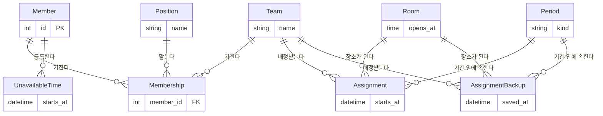

> 문서 버전: 1.4.0 draft



현재 시간표(배정)와 그 백업(이전 시간표 회차들)은 [배정 이력과 롤백](./schedule-versioning/README.md)에서 따로 다룬다 — 여기서는 두 테이블이 저장소 안에 함께 있다는 것까지만 표시한다.

## Abstract

데이터 저장소는 지금까지 기획 문서로만 존재하던 규칙(소속, 이름 식별자, 30분 격자, 동명이인 구분 등)을 실제로 저장하고 지키는 층이다. PostgreSQL 컨테이너 위에 8개 테이블을 두고, 스키마 변경 이력은 마이그레이션으로 관리한다. 이 층 자체는 저장하고 규칙을 지키는 역할까지만 맡는다 — 여기 남은 데이터를 읽어 배정을 계산하고 그 결과를 다시 여기 남기는 순서는 [기간 자동 배정](../scheduling-api/period-assignment/README.md)이 맡는다.

## Introduction

지금까지 [팀과 소속](../teams/README.md), [합주실과 기간](../practice-room-and-periods/README.md), [자동 배정](../auto-assignment/README.md)이 정한 규칙들은 코드 안에서만(요청 한 번의 계산 중에만) 지켜졌다. 서버가 요청 사이의 상태를 기억하지 않았기 때문이다. 실제 서비스가 되려면 팀·소속·불가능시간 같은 정보가 요청과 무관하게 남아 있어야 하고, 그 정보 자체도 규칙을 어긴 채로 들어오면 안 된다. 데이터 저장소는 이 두 가지 — "남겨두기"와 "규칙을 지키게 만들기" — 를 데이터베이스 층에서 담당한다. 규칙을 지키는 책임 일부를 애플리케이션 코드가 아니라 데이터베이스 제약조건으로 옮긴 것이 이 층의 특징이다.

## Related Work

- [Banblit 개요](../README.md) — 전체 기능 지도
- [팀과 소속](../teams/README.md) — 사람·팀·포지션·소속 개념의 근거
- [합주실과 기간](../practice-room-and-periods/README.md) — 합주실 운영시간·기간 종류의 근거
- [기간 자동 배정](../scheduling-api/period-assignment/README.md) — 여기 저장된 데이터를 읽어 배정을 계산하고, 성공하면 그 결과를 다시 여기 남기는 통로
- [자동 배정](../auto-assignment/README.md) — 그 통로가 부르는 계산 자체의 규칙
- [개발용 시드 데이터](../screens/dev-seed/README.md) — 화면을 열어보려고 이 표들을 미리 채우는 장치
- [배정 이력과 롤백](./schedule-versioning/README.md) — 현재 시간표를 다시 짤 때 이전 시간표를 백업으로 보관하고 되돌리는 저장 규칙(하위 기능)

## Description

### 기획 규칙과 테이블의 대응

각 테이블은 기획이 이미 정한 규칙 하나씩을 데이터베이스 제약조건으로 옮긴 것이다. 애플리케이션 코드가 매번 확인하지 않아도, 규칙을 어기는 데이터는 저장 자체가 거부된다.

| 기획 규칙 | 대응 테이블 / 제약 |
| --- | --- |
| 소속 = 사람 + 팀 + 포지션 한 묶음, 같은 사람이 같은 팀에 두 번 소속될 수 없음 | 소속 테이블이 사람·팀·포지션을 한 행에 묶고, "사람 + 팀" 조합에 중복 금지 조건을 건다 |
| 동명이인은 이름이 아니라 사람마다 부여된 고유 번호로 구분한다 | 사람 테이블의 이름에는 중복 금지 조건을 걸지 않는다 — 기존 배정 계산이 이름을 사람과 동일시하던 한계를 저장소 층에서부터 없앤다 |
| 포지션은 정해진 목록에서 고르며, 그 목록은 데이터로 관리해 코드 수정 없이 바꿀 수 있다 | 포지션 테이블에 이름 중복 금지 조건을 걸고, 마이그레이션이 기본 5종(보컬·기타·베이스·드럼·키보드)을 미리 심어 둔다 |
| 팀 이름·합주실 이름은 식별자이므로 겹치면 안 된다 | 팀 테이블과 합주실 테이블 모두 이름에 중복 금지 조건을 건다 |
| 합주실의 여닫는 시각은 정시·30분 두 지점(30분 격자) 위에만 있어야 한다 | 합주실 테이블에 여는 시각·닫는 시각이 각각 30분 격자 위에 있는지 검사하는 조건을 건다 |
| 합주실은 닫는 시각이 여는 시각보다 뒤여야 한다(뒤집힌 영업시간 금지) | 합주실 테이블에 "닫는 시각 > 여는 시각" 조건을 건다 |
| 기간은 상시(open)·집중(focused) 두 종류뿐이고, 종류와 무관하게 하루 2회 연산 시각은 반드시 지정한다(사용자 결정 — 상시 기간도 연산 시각을 비워둘 수 없다) | 기간 테이블이 종류를 두 값 중 하나로만 제한하고, 두 연산 시각 열을 반드시 채우도록 강제한다 |
| 불가능시간은 반복 등록(매주 반복 + 반복 종료일)을 지원하며, 끝나는 시각이 시작 시각보다 앞설 수 없다 | 불가능시간 테이블이 매주 반복 여부와 반복 종료일을 갖고, 시작·끝 시각이 뒤집힌 구간은 저장을 거부한다 |
| 모든 점유는 30분 칸 단위이고, 칸 하나에는 배정이 하나만 들어간다(선착순 1개, 이중 예약 금지) | 배정 테이블이 "합주실 + 시작 시각" 조합에 중복 금지 조건을 걸어, 같은 칸에 두 팀이 동시에 들어가는 저장 자체를 막는다. 점유가 항상 30분 칸 경계에서만 시작한다는 규칙(사용자 결정)이 지켜지는 한, 시작 시각이 다른 두 배정끼리 시간이 겹치는 일은 애초에 생기지 않는다 — 별도의 구간 겹침 방지 장치는 두지 않는다. 이후 추가될 상시 예약 기능도 같은 칸 구조 위에 얹기로 확정했다 |
| 시각은 시간대 없는 값으로 다룬다([자동 배정](../auto-assignment/README.md)의 `TimeInterval` 계약과 동일) | 시각을 담는 모든 열이 시간대 없는 값으로 저장된다 |

### 삭제 정책

사람·팀·포지션·합주실·기간 중 하나가 지워질 때, 그것을 참조하던 다른 행을 어떻게 처리할지는 표마다 다르다. 기본값(참조하는 행이 남아 있으면 삭제 자체를 거부)에 기대지 않고, 표마다 의도를 명시적으로 정했다.

| 참조하는 테이블 → 참조 대상 | 삭제 정책 | 이유 |
| --- | --- | --- |
| 소속 → 사람 | 사람과 함께 삭제 | 사람이 탈퇴하면 그 사람의 소속 관계도 의미가 없어진다(사용자 결정: "인원이 탈퇴하면 일정도 삭제") |
| 소속 → 팀 | 팀과 함께 삭제 | 팀이 없어지면 그 팀에 걸린 소속 관계도 함께 사라진다 |
| 소속 → 포지션 | 삭제 거부 | 그 포지션으로 소속돼 있는 사람이 하나라도 있으면, 포지션 자체는 지울 수 없다 — 사용 중인 분류값이 조용히 없어지는 것을 막는다 |
| 불가능시간 → 사람 | 사람과 함께 삭제 | 사람이 탈퇴하면 등록해 둔 불가능시간도 함께 지운다(같은 사용자 결정) |
| 배정 → 팀 / 합주실 / 기간 | 참조 대상과 함께 삭제 | 팀·합주실·기간 중 하나가 없어지면, 그것을 근거로 존재하던 배정 결과도 더는 성립하지 않으므로 함께 지운다 |
| 글 / 댓글 → 사람 | 삭제 거부 | 그 사람이 쓴 글이나 댓글이 하나라도 있으면 사람 자체는 지울 수 없다 — 게시판은 오간 이야기가 남아 있어야 뜻이 있고, 한 사람이 나갔다고 대화의 절반이 사라지면 남은 사람들이 읽던 맥락이 끊긴다 |

팀에 소속된 사람이 탈퇴할 때 그 파트의 대체자를 누가 지정할지는 아직 결정되지 않았다 — 알림 기능이 생긴 뒤 다룰 사항으로 남겨 두었다.

### 규칙을 지키는 층이 옮겨간 위치

```
지금까지: 요청 한 번 안에서만 규칙을 검사 (계산 코드가 그 순간에만 확인)
                    │
                    ▼
이제: 저장하는 순간에도 규칙을 검사 (데이터베이스 제약조건이 항상 확인)
```

이 변화로, 저장된 데이터를 나중에 계산에 연결하더라도 "저장은 됐는데 규칙을 어긴 데이터"가 있을 걱정을 계산 코드가 다시 하지 않아도 된다. 저장이 성립한 순간 규칙은 이미 지켜진 것이다.

### 접속 방식

애플리케이션은 접속 주소 하나(환경변수로 전달)로 데이터베이스에 붙는다. 이 값이 없으면 접속 시도 자체를 하지 않고 곧바로 실패를 알린다 — 접속 정보가 빠진 채로 조용히 다른 곳에 붙거나, 알 수 없는 오류로 나중에 터지는 것을 막기 위해서다.

스키마를 바꾸는 이력(마이그레이션)은 별도로 관리되며, 실행할 때마다 "지금 접속해야 할 주소가 명시적으로 지정돼 있는가"를 먼저 보고, 없을 때만 접속 주소 환경변수를 대신 쓴다. 이 순서가 중요한 이유는 아래 트러블슈팅 1번에 있다.

### TDD 검증

이 층도 테스트를 먼저 실패시키고 통과시키는 방식으로 만들었다. 테스트는 가짜(mock) 데이터베이스가 아니라, 전용 테스트 데이터베이스에 실제 마이그레이션을 적용해 돌아간다 — 마이그레이션 자체에 문제가 있어도 테스트가 잡아낼 수 있도록 하기 위함이다.

| 테스트 파일 | 커버하는 시나리오 |
| --- | --- |
| `backend/tests/integration/db/test_db_connection.py` | 접속 주소로 실제 접속이 성립하는지 |
| `backend/tests/integration/db/test_db_core.py` | 포지션 기본 5종이 심어져 있는지, 동명이인 두 사람이 함께 저장되는지, 팀 이름 중복이 거부되는지, 같은 사람이 같은 팀에 두 번 소속되는 것이 거부되는지, 한 사람이 서로 다른 포지션으로 두 팀에 소속되는 것은 허용되는지 |
| `backend/tests/integration/db/test_db_schedule_inputs.py` | 매주 반복되는 불가능시간이 그대로 저장·조회되는지, 뒤집힌 불가능시간 구간이 거부되는지, 합주실 이름 중복이 거부되는지, 30분 격자를 벗어난 합주실 운영시간이 거부되는지 |
| `backend/tests/integration/db/test_db_periods.py` | 하루 2회 연산 시각을 가진 집중기간이 그대로 저장·조회되는지, 정해지지 않은 기간 종류가 거부되는지, 같은 합주실의 같은 시작 시각에 배정이 두 번 들어가는 것이 거부되는지 |
| `backend/tests/integration/db/test_db_policies.py` | 닫는 시각이 여는 시각보다 앞선 합주실이 거부되는지, 사람을 지우면 그 사람의 소속·불가능시간이 함께 지워지는지, 팀을 지우면 그 팀의 배정이 함께 지워지는지, 소속돼 있는 포지션은 삭제가 거부되는지, 두 연산 시각 중 하나라도 비어 있는 기간이 거부되는지 |

실행 커맨드(저장소 루트에서):

```
docker compose run --rm dev pytest -q
```

위 다섯 파일을 포함한 전체 66개 테스트가 통과함을 확인했다. 이 층만 따로 확인하려면:

```
docker compose run --rm dev pytest tests/integration/db/test_db_connection.py tests/integration/db/test_db_core.py tests/integration/db/test_db_schedule_inputs.py tests/integration/db/test_db_periods.py tests/integration/db/test_db_policies.py -q
```

### 트러블슈팅

**문제 1 — 테스트가 엉뚱한 데이터베이스에 마이그레이션을 적용함**

- **언제**: 핵심 테이블과 테스트 픽스처를 만든 뒤, 처음으로 관련 테스트를 실행했을 때
- **어디서**: 테스트 픽스처가 전용 테스트 데이터베이스 주소를 마이그레이션 실행기에 명시적으로 지정하는 지점과, 마이그레이션 실행기가 접속 주소를 최종 결정하는 지점 사이
- **무엇이 벌어졌나**: 테스트 코드에서 실행한 조회가 "해당 테이블이 존재하지 않는다"는 오류로 실패했다. 마이그레이션은 분명히 실행되고 성공한 것처럼 보였는데도 테이블이 없었다
- **왜 그런가**: 컨테이너 안에서는 메인 데이터베이스용 접속 주소가 환경변수로 항상 설정돼 있다. 마이그레이션 실행기가 "환경변수 값을 무조건 우선한다"는 순서로 짜여 있었기 때문에, 테스트 픽스처가 테스트 전용 데이터베이스 주소를 따로 지정해도 그 값이 조용히 무시되고 매번 메인 데이터베이스 주소로 되돌아갔다. 그 결과 마이그레이션은 이미 최신 상태인 메인 데이터베이스에 대해 "할 일 없음"으로 조용히 끝났고, 정작 비어 있는 테스트 전용 데이터베이스에는 아무 테이블도 만들어지지 않았다
- **어떻게 확인**: 실행 로그를 자세히 찍어보니 "적용할 마이그레이션 없음" 판정이 남아 있었고, 테스트 전용 데이터베이스에 직접 접속해 테이블 목록을 조회하니 애플리케이션 테이블이 하나도 없음을 확인했다
- **어떻게 해결했나**: 마이그레이션 실행기가 접속 주소를 결정하는 순서를 바꿨다 — 호출하는 쪽이 명시적으로 지정한 주소가 있으면 그것을 최우선하고, 지정된 것이 없을 때만 환경변수 값으로 대신하도록 했다. 테스트 픽스처도 이 명시적 지정 경로를 통해 테스트 전용 데이터베이스 주소를 넘기도록 함께 수정했다
- **남는 영향**: 이후 새 테이블을 추가하는 작업(불가능시간·합주실, 기간·배정)도 같은 픽스처를 그대로 재사용했고, 이 수정이 유지된 채로 매번 올바른 데이터베이스에 마이그레이션이 적용됐다

**문제 2 — 수정 직후에는 통과했지만, 같은 테스트를 연달아 두 번 돌리면 두 번째에 다시 실패함**

- **언제**: 문제 1을 고친 직후, 결과가 우연이 아닌지 확인하려고 같은 테스트 명령을 연속으로 두 번 실행했을 때
- **어디서**: 테스트 픽스처가 세션 시작 시 기존 테이블을 지우고 마이그레이션을 다시 적용하는 부분
- **무엇이 벌어졌나**: 첫 번째 실행은 통과했지만, 곧바로 이어서 실행한 두 번째 실행은 다시 "테이블이 존재하지 않는다"는 오류로 실패했다
- **왜 그런가**: 테스트 픽스처는 매 세션 시작 시 애플리케이션 테이블을 지우고 마이그레이션을 처음부터 다시 적용하도록 되어 있었다. 그런데 테이블을 지우는 처리는 애플리케이션이 정의한 테이블(멤버·팀·포지션·소속 등)만 지웠고, 마이그레이션 자신이 "어디까지 적용했는지" 기록해 두는 이력 테이블은 지우지 않았다. 데이터베이스 컨테이너 자체는 실행 사이에 계속 떠 있는 상태로 재사용되므로, 두 번째 실행 시작 시점에는 애플리케이션 테이블은 방금 지워졌는데 이력 테이블에는 "이미 최신 상태"라는 기록이 그대로 남아 있었다. 마이그레이션 실행기는 이 기록만 보고 "더 적용할 것 없음"으로 판단해 아무 것도 다시 만들지 않았다
- **어떻게 확인**: 테스트 전용 데이터베이스에 직접 접속해 테이블 목록을 조회하니, 마이그레이션 이력 테이블 하나만 남아 있고 애플리케이션 테이블 4개는 모두 없는 상태를 확인했다
- **어떻게 해결했나**: 애플리케이션 테이블을 지우는 직후에 마이그레이션 이력 테이블도 함께 지우도록 픽스처를 수정했다. 이렇게 하면 매 세션이 이력 기록 없이 완전히 처음부터 마이그레이션을 다시 적용하게 된다. 수정 후 같은 명령을 연속 두 번 실행해 매번 통과함을 확인했다
- **남는 영향**: 이후 Task가 늘어도(불가능시간·합주실, 기간·배정 테이블 추가) 같은 픽스처를 재사용했으므로, 이 수정이 유지되지 않으면 같은 증상이 다시 나타날 수 있는 지점으로 남아 있다

## Conclusion

데이터 저장소는 기획 규칙을 데이터베이스 제약조건으로 옮겨, 저장이 성립하는 순간 규칙이 이미 지켜지도록 만든다. 다만 이 층은 아직 혼자 서 있다 — 저장된 데이터를 읽어 [자동 배정](../auto-assignment/README.md) 계산을 부르는 연결은 이 저장소가 아니라 다음 작업의 몫이다.
