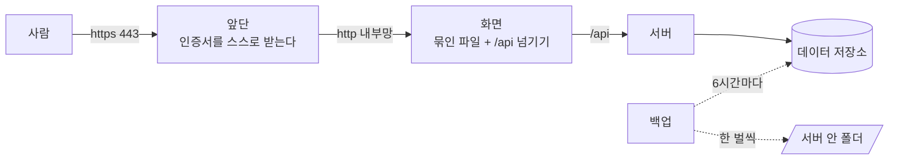

> 문서 버전: 1.0.0 draft



## Abstract

배포는 개발과 **같은 구성에서 덮개를 하나 걷어낸 것**입니다. 한 벌의 정의가 배포용이고,
개발에서만 그 위에 다른 값을 얹습니다. 배포에만 있는 것은 둘입니다 — 바깥에서 들어오는
문을 하나로 모으고 인증서를 맡는 앞단, 그리고 데이터를 주기적으로 한 벌씩 떠 두는 자리.
여기에 값을 맞혀 보는 요청을 거르는 문지기가 로그인 계열 다섯 자리에 걸려 있습니다.

## Introduction

개발과 배포가 다른 파일을 각자 들고 있으면, 한쪽에만 넣은 설정이 다른 쪽에서 조용히
빠집니다. 그래서 정의는 한 벌만 두고 **배포용을 바탕으로 삼습니다.** 바탕을 개발용으로
두면 개발 전용 표시를 빠뜨린 것이 그대로 현장에 나가고, 배포용으로 두면 반대로 빠뜨려도
개발 기계에 하나 더 뜨는 것으로 끝납니다.

배포에서 반드시 성립해야 하는 것이 하나 있습니다. **로그인 쿠키에 Secure 표시가 붙습니다.**
브라우저는 그 표시가 붙은 쿠키를 암호화되지 않은 연결에서는 저장하지 않습니다. 그러므로
암호화 없이 띄우면 화면은 멀쩡히 뜨는데 로그인만 성립하지 않습니다 — 화면도 서버도 오류를
내지 않아 원인을 찾기 어려운 종류입니다. 앞단이 이 문서에 있는 이유가 그것입니다.

## Related Work

- [Banblit 개요](../README.md) — 전체 기능 지도
- [개발 환경 실행](../dev-environment/README.md) — 같은 구성을 개발에서 띄우는 절차
- [계정과 역할](../accounts-and-roles/README.md) — 문지기가 지키는 로그인·가입·재설정의 규칙
- [데이터 저장소](../database-layer/README.md) — 백업이 떠 가는 표들과 그 제약
- [스케줄링 API](../scheduling-api/README.md) — 앞단 뒤에서 실제로 답하는 서버
- [화면](../screens/README.md) — 앞단이 내보내는 앱

## Description

### 한 벌을 두고, 개발에서만 덮습니다

```
     정의 한 벌 (배포용)          개발에서 얹는 것
     ─────────────────           ─────────────────
     쿠키에 Secure 붙임     ──▶  끔 (개발은 암호화 없이 돈다)
     자동 배정 켜짐         ──▶  끔 (검사가 심어 둔 값을 흔든다)
     메일 본문 안 남김      ──▶  남김 (재설정 링크를 눌러 봐야 한다)
     앞단·백업 있음         ──▶  뜨지 않게 표시
```

개발에서 앞단과 백업을 **지우지 않고 꺼 둡니다.** 지우면 배포용 정의에서도 사라지기
때문입니다. 끄는 표시만 얹으면 정의는 한 곳에 그대로 남습니다.

### 들어오는 문은 하나입니다

앞단만 바깥을 향해 열려 있고, 화면과 서버는 기계 안에서만 닿습니다. 화면 쪽에 남겨 둔
자리는 기계 자신에게만 열려 있어, 서버에 직접 들어간 사람만 확인용으로 씁니다.

앞단은 인증서를 스스로 받고 갱신합니다. 받으려면 **주소가 이미 이 기계를 가리키고 있어야**
합니다 — 발급하는 쪽이 그 주소로 확인하러 오기 때문입니다. 그래서 순서가 정해져 있습니다:
주소를 먼저 걸고, 전파를 확인하고, 그다음에 띄웁니다. 실패를 반복하면 발급하는 쪽이 한동안
거절하므로, 원인을 고친 뒤에 다시 시도합니다.

받아 둔 인증서는 따로 남겨 둡니다. 컨테이너를 다시 만들 때마다 새로 받으면 같은 이유로
곧 거절당합니다.

### 백업은 저장 공간 바깥에 둡니다

```
   데이터 저장소 ─┐
                  ├─▶ 6시간마다 한 벌 ─▶ 기계 안 폴더 (14일치)
   첨부파일     ─┘
```

뜬 파일을 **저장 공간이 아니라 기계의 폴더에 둡니다.** 저장 공간이 사라지는 것이 백업이
막아야 할 바로 그 상황이라, 같은 곳에 두면 함께 없어집니다. 같은 이유로 데이터 저장소와
다른 디스크에 두는 편이 낫습니다.

데이터베이스와 첨부파일을 각각 뜹니다. 데이터베이스에는 올린 파일의 이름만 있고 알맹이는
따로 있어, 한쪽만 떠서는 되살려도 첨부가 비어 있습니다.

**쓰다 만 파일을 남기지 않습니다.** 뜨는 도중에 실패하면 반쯤 쓰인 파일을 지우고 다음
주기를 기다립니다. 지우는 것은 뜨는 데 성공한 뒤에만 합니다 — 실패한 날에 오래된 것까지
지우면 성한 백업이 하나도 남지 않을 수 있습니다.

지금 없는 것이 하나 있습니다. **뜬 파일이 기계 안에만 있습니다.** 기계째 잃는 경우까지
막으려면 다른 곳으로 내려받는 자리가 따로 있어야 합니다.

### 값을 맞혀 보는 요청을 거릅니다

로그인은 맞을 때까지 넣어 볼 수 있는 자리입니다. 한 번에 하나씩 넣어 보는 것을 막지
못하면 짧은 비밀번호는 시간 문제입니다. 그래서 부르는 곳마다 최근 몇 번 왔는지를 세고,
상한을 넘으면 기다릴 시간을 알려주며 돌려보냅니다.

| 자리 | 왜 이 상한인가 |
| --- | --- |
| 로그인 | 사람이 오타를 몇 번 내는 것은 통과하고, 값을 훑는 것은 걸리는 선 |
| 가입 | 계정을 무더기로 만드는 것을 막는다 |
| 아이디 찾기 · 재설정 요청 | **메일이 나가는 자리**라 더 낮다. 남의 주소로 메일을 퍼붓는 데 쓰일 수 있다 |
| 재설정 확인 | 메일로 간 토큰을 찍어 맞히는 것을 막는다 |

**몇 번 남았는지는 알려주지 않습니다.** 상한을 알면 그 아래로 맞춰 계속 두드릴 수 있기
때문입니다. 알려주는 것은 "잠시 뒤에 다시" 와 그 시간뿐입니다.

**막힌 요청은 세지 않습니다.** 세면 계속 두드리는 동안 창이 계속 밀려 영영 풀리지
않습니다. 이것은 사람이 실수로 몰아친 경우에 그대로 벌이 됩니다.

누가 보냈는지는 **앞단이 본 상대**로 가릅니다. 요청을 보낸 쪽이 스스로 적어 넣은 값은
믿지 않습니다 — 그것을 믿으면 값을 바꿔 가며 상한을 무한히 피할 수 있습니다. 앞단이 하나
더 늘면 이 판정도 함께 고쳐야 합니다.

세는 자리는 서버 한 대의 기억 안입니다. 서버를 여러 대로 늘리면 대마다 따로 세므로 실제
상한이 대수만큼 커집니다. 지금은 한 대로 띄우므로 그대로 두고, 늘릴 때 세는 자리를 바깥으로
옮깁니다. 기억이 무한히 쌓이지 않도록 기억할 곳의 개수에도 상한을 두었습니다 — 주소를
바꿔 가며 두드리는 것 자체가 공격이 되기 때문입니다.

### 구조를 바꿀 때는 순서가 있습니다

```
   git pull  ─▶  이미지 만들기  ─▶  마이그레이션  ─▶  서비스 교체
                                    ↑
                          이 순서를 뒤집으면 새 코드가
                          아직 없는 열을 읽어 500 이 난다
```

개발에서는 띄우는 명령이 마이그레이션을 자동으로 넣습니다. **배포에서는 손으로 합니다.**
데이터가 들어 있는 곳에서 자동으로 도는 마이그레이션은 되돌릴 자리가 없기 때문입니다.

## Conclusion

배포는 새 구성이 아니라 개발이 덮고 있던 것을 걷어낸 상태입니다. 걷어내면 암호화가
필수가 되고, 데이터가 실물이 되며, 바깥에서 아무나 두드릴 수 있게 됩니다 — 앞단·백업·문지기
셋이 각각 그 셋에 대응합니다.

아직 남은 것은 셋입니다. 뜬 백업을 기계 밖으로 내보내는 자리, 되살리기를 실제로 해 본
기록, 그리고 서버를 여러 대로 늘릴 때 문지기가 셈을 나눠 갖는 방법입니다.
