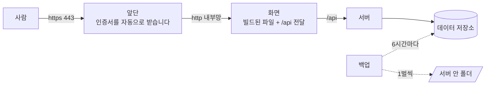

> 문서 버전: 1.1.0 draft



## Abstract

배포는 개발과 **같은 구성에서 개발 전용 설정을 제거한 상태**입니다. 1벌의 정의가 배포용이고,
개발에서만 그 위에 다른 값을 덮어씁니다. 배포에만 있는 구성은 2개입니다. 외부 요청을 1개 진입점으로
모으고 인증서를 관리하는 앞단(reverse proxy, 외부 요청을 먼저 받아 내부 서비스로 전달하는 서버), 그리고 데이터를 주기적으로 1벌씩 백업하는 서비스입니다.
이 2개 구성에 더해 비밀번호 추측 공격을 방어하는 rate limit(일정 시간 안의 요청 횟수 제한)이 로그인 관련 5개 endpoint(API의 요청 주소 단위)에 적용되어 있습니다.

## Introduction

개발과 배포가 다른 파일을 각자 가지고 있으면, 한쪽에만 추가한 설정이 다른 쪽에서 error 없이 누락됩니다. 그래서 정의는 1벌만 두고 **배포용을 정본으로 삼습니다.** 정본을 개발용으로 두면 개발 전용 표시를 빠뜨린 설정이 그대로 배포에 적용되고, 배포용으로 두면 반대로 빠뜨려도 개발 환경에 서비스 1개가 더 실행되는 결과로 끝납니다.

배포에서 반드시 성립해야 하는 조건이 1가지 있습니다. **로그인 cookie(브라우저가 저장하고 같은 서버로 보내는 요청마다 자동으로 첨부하는 값)에 Secure 속성이 추가됩니다.** 브라우저는 이 속성이 있는 cookie를 암호화되지 않은 연결에서는 저장하지 않습니다. 그러므로 암호화 없이 실행하면 화면은 정상으로 표시되는데 로그인만 작동하지 않습니다. 이 경우 화면도 서버도 error를 발생시키지 않아 원인을 찾기 어렵습니다. 앞단이 이 문서에 설명된 이유가 이 조건입니다.

## Related Work

- [Banblit 개요](../README.md) — 전체 기능 지도
- [개발 환경 실행](../dev-environment/README.md) — 같은 구성을 개발에서 시작하는 절차
- [계정과 역할](../accounts-and-roles/README.md) — rate limit이 적용되는 로그인·가입·재설정의 규칙
- [데이터 저장소](../database-layer/README.md) — 백업 대상 table과 그 제약
- [스케줄링 API](../scheduling-api/README.md) — 앞단 뒤에서 실제로 응답하는 서버
- [화면](../screens/README.md) — 앞단이 제공하는 앱

## Description

### 1벌을 두고, 개발에서만 덮어씁니다

```
     정의 한 벌 (배포용)          개발에서 얹는 값
     ─────────────────           ─────────────────
     쿠키에 Secure 붙임     ──▶  비활성화 (개발은 암호화 없이 실행)
     자동 배정 켜짐         ──▶  비활성화 (테스트는 임의의 값으로 변경)
     메일 본문 안 남김      ──▶  저장 (재설정 링크를 클릭해 검증)
     역할 계층·백업 있음    ──▶  실행하지 않도록 표시
```

개발에서 앞단과 백업을 **삭제하지 않고 비활성화합니다.** 삭제하면 배포용 정의에서도 삭제되기 때문입니다. 비활성화 표시만 덮어쓰면 정의는 1곳에 그대로 남습니다.

### 진입점은 1개입니다

앞단만 외부에 열려 있고, 화면 서버와 API 서버는 container(Docker가 실행하는 격리된 프로세스 단위) 내부 네트워크에서만 통신합니다. 화면 서버에 남겨 둔 포트는 container 내부에만 열려 있어, API 서버에 직접 접근해야 하는 경우에만 사용합니다.

앞단은 인증서를 자동으로 받고 갱신합니다. 인증서를 받으려면 **도메인이 이미 이 서버를 가리키고 있어야** 합니다. 인증서 발급 기관이 도메인 소유권을 확인하기 위해 그 주소로 요청을 보내기 때문입니다. 그래서 순서가 정해져 있습니다. 도메인을 먼저 지정하고, DNS 전파를 확인한 뒤에 앞단을 실행합니다. 인증서 발급에 반복 실패하면 발급 기관이 일시적으로 요청을 거절하므로, 원인을 수정한 뒤 다시 시도합니다.

받은 인증서는 volume(container 밖에 남는 저장 공간)에 별도로 보관합니다. container를 다시 생성할 때마다 새로 받으면 같은 이유로 거절됩니다.

### 백업은 volume 바깥에 둡니다

```
   데이터 저장소 ─┐
                  ├─▶ 6시간마다 한 벌 ─▶ 서버 내부 폴더 (14일분 보관)
   첨부파일     ─┘
```

백업 파일을 **volume이 아니라 서버의 로컬 폴더에 둡니다.** volume이 사라지는 것이 백업이 방어해야 할 바로 그 상황이므로, 같은 곳에 두면 함께 손실됩니다. 같은 이유로 데이터베이스를 저장한 디스크와 다른 디스크에 보관하는 방식을 권장합니다.

데이터베이스와 첨부파일을 각각 백업합니다. 데이터베이스에는 첨부파일의 이름만 있고 실제 내용은 따로 저장되어 있어, 1개만 백업하면 복구할 때도 불완전합니다.

**진행 중인 파일을 남기지 않습니다.** 백업 중에 오류가 발생하면 미완성 파일을 삭제하고 다음 주기를 기다립니다. 미완성 파일은 성공한 백업이 완료된 뒤에만 삭제합니다. 실패한 날에 기존 백업까지 삭제하면 정상 백업이 하나도 남지 않을 수 있기 때문입니다.

**현재 미지원**: 백업 파일이 서버 내부에만 있습니다. 서버 전체가 손실되는 경우까지 방어하려면 다른 위치로 전송하는 메커니즘이 필요합니다.

### 정지를 외부에서 감시합니다

서버가 정지해도 운영 담당자가 알 방법이 없었습니다. 사용자가 "안 들어가요" 라고 알려 줄 때까지
정지 상태가 유지됩니다.

**감시는 서버 밖에 둡니다.** 서버 안에 검사를 두면 서버 전체가 정지했을 때 검사도 함께 정지해
알림이 발송되지 않습니다. 정지를 감지해야 하는 대상이 감지하는 주체를 겸할 수 없습니다.

`GET /api/health` 가 감시 대상입니다. 이 endpoint 는 데이터베이스 연결을 검사하고, 실패하면
503 과 `{"status": "down"}` 을 반환합니다(`backend/src/backend/api/app.py`). 200 만 확인하면
데이터베이스가 정지하고 API 만 살아 있는 상태를 감지하지 못합니다.

| 항목 | 값 |
| --- | --- |
| 감시 주소 | `https://<BANBLIT_DOMAIN>/api/health` |
| 확인 주기 | 5분 |
| 실패 판정 | 응답 없음, 또는 상태 코드가 200이 아님 |
| 알림 수신처 | 운영 담당자의 메일 또는 메신저 |

무료 서비스(UptimeRobot 등)로 충분합니다. 코드 수정은 필요하지 않고 주소 등록만 하면 됩니다.
등록한 서비스 이름과 알림 수신처는 등록한 뒤 이 표 아래에 적습니다.

**현재 미지원**: 등록하지 않았습니다. 2026-09-19 기준으로 감시 주체가 없습니다.


### 값을 추측하는 요청을 제한합니다

로그인은 정답을 맞힐 때까지 시도할 수 있는 지점입니다. 시도 횟수를 제한하지 않으면 약한 비밀번호는 시간 문제입니다. 따라서 각 endpoint마다 최근 요청 횟수를 세고, 임계값을 초과하면 재시도 가능 시간을 전달하고 요청을 거절합니다.

| endpoint | 임계값 | 설명 |
| --- | --- | --- |
| 로그인 | 사용자가 오타를 낼 여유는 있지만 체계적 추측은 막는 수준 | 인증 시도를 제한합니다 |
| 가입 | 대량 계정 생성을 방지 | IP 주소 1개로 계정을 2개 이상 만드는 요청을 제한합니다 |
| 아이디 찾기·비밀번호 재설정 요청 | 더 낮은 수준. **메일이 발송되므로** | 무고한 사용자의 주소로 메일을 대량 발송하는 요청을 방지합니다 |
| 비밀번호 재설정 확인 | token(1회용 인증 문자열) 추측을 방지 | 메일로 받은 token의 정확성을 확인합니다 |

**남은 시도 횟수는 알려주지 않습니다.** 임계값을 알면 그보다 아래에서 계속 시도할 수 있기 때문입니다. 대신 "잠시 후 다시 시도하세요"라는 메시지와 대기 시간만 반환합니다.

**차단된 요청은 카운트하지 않습니다.** 카운트하면 계속 요청을 보내는 동안 카운터가 계속 초기화되어 영구 차단되지 않습니다. 이는 사용자가 실수로 rate limit 횟수를 넘겨 시도한 경우 과도한 페널티가 되기 때문입니다.

요청 출처는 **맨 앞의 앞단이 관찰한 IP 주소**로 식별합니다. 요청을 보낸 쪽이 제출한 값은 신뢰하지 않습니다. 신뢰할 경우 요청자가 IP를 변경하며 시도하여 임계값을 무한히 회피할 수 있습니다.

앞단은 각자 관찰한 주소를 `X-Forwarded-For` 헤더(요청이 거쳐 온 주소를 쉼표로 나열한 HTTP 헤더)의 맨 뒤에 추가합니다. 배포 경로는 Caddy → nginx → api 로 앞단이 2개이므로, 맨 뒤 값은 Caddy 컨테이너의 주소이고 **뒤에서 2번째 값**이 실제 요청자입니다. 앞단의 개수는 환경변수 `TRUSTED_PROXY_COUNT` 로 지정합니다.

| 환경 | 값 | 지정 위치 |
|---|---|---|
| 배포 (Caddy → nginx → api) | 2 | `docker-compose.yml` 의 `api.environment` |
| 개발 (nginx 또는 Vite → api) | 1 | `docker-compose.override.yml` 의 `api.environment` |
| 지정하지 않음·숫자가 아님·0 이하 | 1 | `rate_limit.py` 의 `DEFAULT_TRUSTED_PROXY_COUNT` |

헤더의 값 개수가 `TRUSTED_PROXY_COUNT` 보다 적으면 앞단을 거치지 않은 요청이므로 헤더를 사용하지 않고 접속한 상대의 주소를 사용합니다. 값을 실제 앞단 개수보다 작게 지정하면 모든 사용자가 앞단 컨테이너 주소 1개로 합산되어 서비스 전체가 상한 1개를 공유합니다. Caddy 앞에 CDN 같은 앞단을 추가하면 이 값과 Caddy 의 `trusted_proxies` 설정을 함께 변경해야 합니다.

카운터는 **서버 메모리에 저장**됩니다. 서버를 2대 이상으로 확장하면 각 서버가 독립적으로 카운트하므로 실제 임계값이 서버 수만큼 배가 됩니다. 현재는 단일 서버이므로 그대로 두고, 확장할 때 카운터를 공유 저장소로 옮깁니다. 메모리 누적을 방지하기 위해 저장할 IP 주소 개수에도 상한을 두었습니다. IP를 바꾸며 요청하는 것 자체가 공격이기 때문입니다.

### 링크 미리보기 주소는 묶을 때 박습니다

카카오톡·페이스북에 주소를 붙여넣으면 그 크롤러(crawler, 링크의 내용을 대신 읽어 오는 프로그램)가
`index.html` 을 받아 갑니다. 크롤러는 JavaScript 를 실행하지 않으므로 화면 코드가 만드는 것은
아무것도 보지 못합니다. 제목·설명·이미지는 `index.html` 의 `og:*` 태그에 직접 적혀 있어야 합니다.

```
.env 의 APP_ORIGIN ─▶ docker-compose.yml 의 build arg ─▶ Dockerfile 의 ENV ─▶ index.html 의 og:image
                                                                    (묶는 시점에 교체)
```

이미지 주소는 절대 주소여야 합니다. `/images/...` 처럼 적으면 크롤러가 이미지를 받지 못합니다.
그런데 화면은 정적 파일이라 자기 주소를 실행 중에 알 방법이 없습니다. 그래서 묶는 시점에 박습니다.
값은 비밀번호 재설정 링크가 쓰는 `APP_ORIGIN` 을 그대로 사용합니다. 주소를 하나 더 만들면
사용자가 접속하는 주소와 미리보기 주소가 갈라질 수 있습니다.

**`APP_ORIGIN` 이 비면 미리보기 이미지가 보이지 않습니다.** 기본값이 `http://localhost:8080` 이라
서버가 뜨고 화면도 정상이지만, 크롤러만 실패합니다. 묶은 뒤 확인하는 명령은 `COMMAND.md` 의 10-4-1 입니다.

### 구조를 바꿀 때는 순서가 있습니다

```
   git pull  ─▶  이미지 빌드  ─▶  마이그레이션 실행  ─▶  서비스 재시작
                                         ↑
                   순서를 뒤집으면 새 코드가
                   아직 없는 테이블 열을 읽어 500 error 발생
```

개발 환경에서는 실행 명령이 마이그레이션을 자동으로 포함합니다. **배포에서는 수동으로 진행합니다.** 실제 데이터가 있는 환경에서 자동 마이그레이션은 되돌릴 방법이 없기 때문입니다.

## Conclusion

배포는 새로운 구성이 아니라 개발 환경의 조건부 설정을 제거한 상태입니다. 설정을 제거하면 암호화가 필수 요구사항이 되고, 데이터가 실제 운영 데이터가 되며, 외부에서 누구나 접근을 시도할 수 있게 됩니다. 앞단, 백업, rate limit이 이 3가지에 각각 대응합니다.

**현재 미지원**: 백업을 서버 외부로 전송하는 메커니즘, 백업 복구의 실제 검증 기록, 그리고 서버 확장 시 요청 제한 카운터를 공유 저장소로 분산하는 방법입니다.
