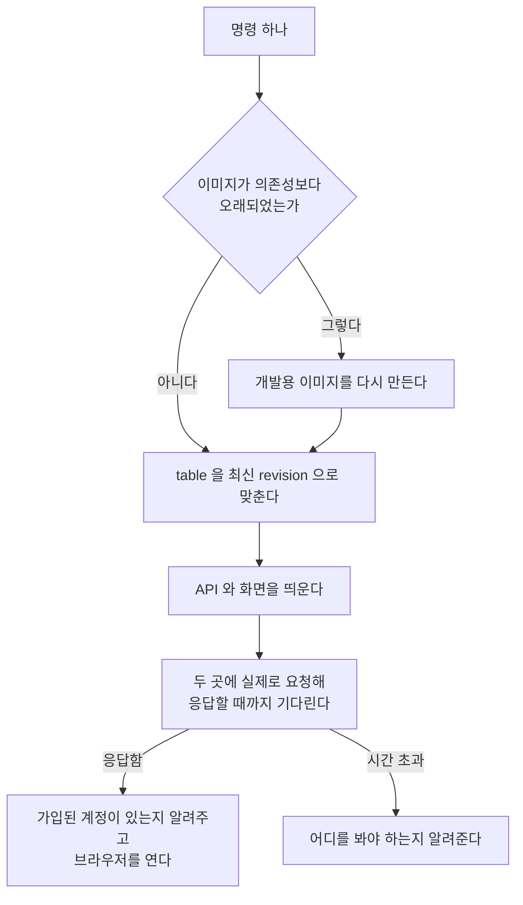

> 문서 버전: 1.1.1 draft



## Abstract

개발 환경 실행은 저장소를 받은 사람이 명령 하나로 동작하는 시스템에 도달하게 하는 기능입니다. 이미지(Docker 컨테이너를 실행하는 청사진)를 다시 빌드할지, 마이그레이션(데이터베이스 구조 변경)을 먼저 실행할지, 서비스가 실제로 요청에 응답하는지를 판단하는 모든 작업을 코드로 자동화했습니다. 가장 중요한 판단은 컨테이너 프로세스가 실행 중인 것과 애플리케이션이 실제로 요청에 응답하는 것을 구분하는 것인데, 이 기능은 컨테이너 상태가 아니라 실제 네트워크 응답을 근거로 준비 여부를 확인합니다.

## Introduction

이 시스템은 API 서버, 화면 서버, 자동 배정 계산 서비스, 그리고 데이터베이스 4개 서비스로 구성되며, 모든 실행이 container 내에서 일어납니다. 따라서 개발 환경을 준비하려면 순서가 정해진 여러 단계를 거쳐야 합니다.

문제는 순서를 지키지 않았을 때의 실패가 눈에 띄지 않는다는 것입니다. 마이그레이션보다 먼저 서비스를 실행하면 첫 조회에서 존재하지 않는 테이블(table)을 찾습니다. 의존성을 추가한 후 이미지를 다시 빌드하지 않으면 애플리케이션이 import 단계에서 중단됩니다. 두 경우 모두 container 목록에는 정상으로 표시됩니다.

```
사람이 판단하던 것                        현재 자동화된 방식
────────────────────────────────────────────────────────────
이미지를 다시 빌드해야 하는가?     →    의존성 파일과 이미지 생성 시각을 비교
마이그레이션을 먼저 실행하는가?    →    순서를 고정하고 자동으로 진행
서비스가 준비되었는가?              →    실제 요청을 보내 응답 확인
얼마나 기다려야 하는가?             →    준비될 때까지 제한 시간 내에서 대기
```

판단의 근거가 사람의 기억에만 있으면, 잊을 때마다 실패하고 실패 증상도 매번 다릅니다. 이 기능은 이러한 판단 전부를 코드로 자동화하는 것을 목표로 합니다.

## Related Work

- [배포](../deployment/README.md) — 같은 구성에서 개발용 덮개를 걷어낸 상태

- [Banblit 개요](../README.md) — 전체 기능 지도
- [데이터 저장소](../database-layer/README.md) — 기동 전에 최신으로 맞추는 table 과 그 규칙
- [스케줄링 API](../scheduling-api/README.md) — 응답을 확인하는 대상 중 하나
- [화면](../screens/README.md) — 브라우저로 열어 주는 대상
- [자동 배정](../auto-assignment/README.md) — 선택으로 함께 띄우는 계산 서비스
- [계정과 역할](../accounts-and-roles/README.md) — 데이터가 비어 있을 때 처음 만드는 계정이 받는 권한

## Description

### 순서는 고를 수 있는 것이 아닙니다

각 단계가 이전 단계의 결과에 의존하기 때문에 순서는 고정되어 있습니다.

```
이미지 검사 ──▶ 마이그레이션 ──▶ 서비스 시작 ──▶ 응답 대기 ──▶ 결과 안내
      │              │              │
      │              │              └─ table이 없으면 첫 조회에서 실패
      │              └─ 데이터베이스가 준비된 후에만 실행 가능
      └─ 의존성이 빠진 이미지로 시작하면 import에서 중단
```

이미지 검사가 첫 번째인 이유는 이 단계가 실패했을 때 증상이 가장 잘 숨기 때문입니다. container는 정상적으로 실행되고 목록에도 표시되는데 애플리케이션만 중단되어 있어서, 이후의 모든 단계가 정상으로 보이는 상태에서 실패합니다.

### 떠 있는 것과 응답하는 것은 다릅니다

container 목록은 프로세스가 살아 있는지만 표시합니다. 애플리케이션이 실제로 요청을 받을 수 있는지까지는 알려주지 않으므로, 이 기능은 두 개의 서비스에 실제 요청을 보내 응답할 때까지 대기합니다.

```
container 목록이 표시하는 것      실제로 확인해야 하는 것
────────────────────────────────────────────────────────
프로세스가 살아 있음         vs  상태 확인 endpoint(API의 요청 주소 단위)이 응답
포트가 매핑되어 있음         vs  그 포트로 보낸 요청이 응답을 반환
```

대기 제한 시간은 서비스마다 다릅니다. 화면 서버는 처음 시작할 때 container 내부에서 의존성 설치가 발생하여 몇 분이 걸리므로 훨씬 길게 설정했습니다. 제한 시간을 초과하면 확인할 위치를 안내하고 중단합니다.

### 이미지가 낡았는지는 시각으로 판단합니다

이미지를 매번 다시 빌드하면 느리고, 빌드하지 않으면 오류 메시지 없이 실패합니다. 따라서 의존성 파일, 잠금 파일, 빌드 정의의 수정 시각 3가지를 이미지 생성 시각과 비교하여, 하나라도 더 최신이면 다시 빌드합니다.

```
                       이미지 생성 시각
                              │
   의존성 목록 ───────────────┤
   잠금 파일   ───────────────┤  하나라도 이보다 최신이면
   빌드 정의   ───────────────┘  다시 빌드
```

변경 사항이 없으면 Docker layer 캐시가 대부분을 처리하므로 실제 시간 비용은 작습니다. 이 판단을 건너뛰고 항상 다시 빌드하도록 지시할 수도 있습니다.

### 데이터가 비어 있을 때는 가입 화면이 진입 경로입니다

이전에는 화면 표시용 데이터를 미리 채워 넣는 별도 도구가 있었으나, 제거하면서 현재는 가입 화면에서 처음 생성하는 계정이 진입 경로가 되었습니다.

```
데이터 없음
   │
   ▼
가입 화면에서 첫 계정 생성
   │
   ▼
그 계정이 모든 권한 항목을 받음 ──▶ 나머지 항목은 화면에서 생성
```

따라서 이 기능은 시작 완료 후 등록된 계정 개수를 세어 알려 줍니다. 목록에 있지만 아직 가입하지 않은 사람은 계정으로 카운트하지 않으므로, 계정이 0개라고 표시되면 다음에 생성하는 계정이 모든 권한을 받는다는 뜻입니다. 권한 항목의 정의와 첫 계정이 모든 권한을 받는 이유는 [계정과 역할](../accounts-and-roles/README.md)에서 설명합니다.

### 테스트는 판정만 남깁니다

테스트와 타입 검사에서 필요한 정보는 통과 여부와 실패 항목뿐인데, 실행 결과는 수백 줄입니다. 따라서 전체 출력은 파일로 저장하고, 화면에는 통과/실패 판정과 실패 항목만 표시합니다.

```
전체 출력 ──▶ 파일에 저장
    │
    └──▶ 통과/실패 판정 + 실패 항목 ──▶ 화면 표시
```

전체 내용이 필요하면 저장된 파일을 확인합니다. 하나라도 실패하면 실패 상태로 종료되므로 다음 단계에 진행되지 않습니다.

### 지우는 것은 명시적으로만 합니다

중단 명령은 기본적으로 데이터를 보존합니다. 데이터베이스와 첨부파일까지 삭제하려면 별도로 지시한 후 확인 문구를 직접 입력해야 합니다. 복구 불가능한 작업이 실수로 실행되지 않도록 두 단계의 확인을 요구합니다.

### 어느 경로에서나 부를 수 있게 등록합니다

이 기능은 저장소 내 스크립트이지만, 등록하면 다른 경로에서도 이름만으로 호출할 수 있습니다. 이때 별칭이 아니라 함수로 등록하는 이유는 별칭은 이름만 변경할 뿐 뒤따르는 인자를 전달하지 못하는 경우가 있기 때문입니다. 등록 내용은 표시 두 줄 사이에서만 작동하므로 여러 번 실행해도 중복되지 않습니다.

## Conclusion

이 기능의 가치는 명령어를 줄인 것이 아니라, 무엇을 먼저 실행해야 하고 다시 빌드할지, 준비가 완료되었는지를 판단하는 책임을 자동화한 것입니다. 특히 container 상태만 확인하지 않고 실제 네트워크 응답을 근거로 준비 여부를 확인하는 규칙이 가장 중요합니다. 이 규칙이 없으면 나머지 단계가 모두 정상으로 보이면서 실패합니다.

각 단계에서 실제로 호출되는 명령과 선택지는 COMMAND.md가 정본입니다. table 구조 변경 규칙은 [데이터 저장소](../database-layer/README.md)에서, 시작 후 표시되는 화면은 [화면](../screens/README.md)에서 설명합니다.
