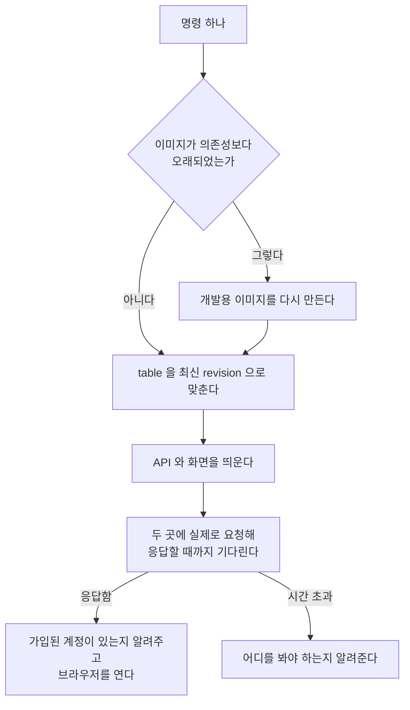

> 문서 버전: 1.1.0 draft



## Abstract

개발 환경 실행은 저장소를 받은 사람이 명령 하나로 동작하는 시스템에 도달하게 하는 기능입니다. 이미지를 다시 만들지, 마이그레이션을 먼저 돌릴지, 서비스가 실제로 응답하는지를 사람이 판단하지 않아도 되도록 그 판단을 전부 코드로 옮겼습니다. 그중 가장 중요한 것은 컨테이너가 떠 있는 것과 애플리케이션이 응답하는 것을 구분하는 판단인데, 이 기능은 컨테이너 상태가 아니라 실제 응답을 근거로 준비 여부를 확인합니다.

## Introduction

이 시스템은 서비스 네 개와 데이터베이스 하나로 이루어져 있고 모든 실행이 컨테이너 안에서 일어납니다. 그래서 환경을 띄우는 일은 명령 하나가 아니라 순서가 정해진 여러 단계였습니다.

문제는 그 순서를 지키지 않았을 때의 실패가 눈에 띄지 않는다는 것이었습니다. 마이그레이션보다 먼저 서비스를 띄우면 첫 조회에서 없는 table을 찾고, 의존성을 추가한 뒤 이미지를 다시 만들지 않으면 애플리케이션이 import 단계에서 죽습니다. 두 경우 모두 컨테이너 목록에는 정상으로 보입니다.

```
사람이 판단하던 것                     지금
──────────────────────────────────────────────────────────
이미지를 다시 만들어야 하나?      →   의존성 파일과 이미지 생성 시각을 비교합니다
마이그레이션이 먼저인가?          →   순서가 고정되어 있습니다
떴나?                             →   실제로 요청해 응답을 확인합니다
얼마나 기다려야 하나?             →   준비될 때까지, 상한을 두고 기다립니다
```

판단의 근거가 사람의 기억에 있으면 잊는 순간 실패하고, 그 실패의 모습도 매번 달라집니다. 그래서 이 기능은 그 판단을 코드로 옮기는 것을 목적으로 삼았습니다.

## Related Work

- [배포](../deployment/README.md) — 같은 구성에서 개발용 덮개를 걷어낸 상태

- [Banblit 개요](../README.md) — 전체 기능 지도
- [데이터 저장소](../database-layer/README.md) — 기동 전에 최신으로 맞추는 table 과 그 규칙
- [스케줄링 API](../scheduling-api/README.md) — 응답을 확인하는 대상 중 하나
- [화면](../screens/README.md) — 브라우저로 열어 주는 대상
- [자동 배정](../auto-assignment/README.md) — 선택으로 함께 띄우는 계산 서비스
- [계정과 역할](../accounts-and-roles/README.md) — 데이터가 비어 있을 때 처음 만드는 계정이 받는 권한

## Description

### 순서는 고를 수 있는 것이 아닙니다

각 단계가 앞 단계의 결과에 의존하기 때문에 순서는 하나로 고정되어 있습니다.

```
이미지 확인 ──▶ 마이그레이션 ──▶ 기동 ──▶ 응답 대기 ──▶ 안내
     │              │              │
     │              │              └─ table 이 없으면 첫 조회에서 실패합니다
     │              └─ 데이터베이스가 준비된 뒤에만 돌 수 있습니다
     └─ 의존성이 빠진 이미지로 띄우면 import 단계에서 죽습니다
```

이미지 확인이 맨 앞에 놓인 것은 이 단계가 틀렸을 때의 실패가 가장 잘 숨기 때문입니다. 컨테이너는 정상적으로 뜨고 목록에도 나오는데 애플리케이션만 죽어 있어서, 뒤의 모든 단계가 정상으로 보이는 채로 실패합니다.

### 떠 있는 것과 응답하는 것은 다릅니다

컨테이너 목록은 프로세스가 살아 있는지만 말해 줍니다. 애플리케이션이 요청을 받을 수 있는지까지는 알려주지 않으므로, 이 기능은 두 곳에 실제로 요청을 보내 응답할 때까지 기다립니다.

```
컨테이너 목록이 보는 것        실제로 확인해야 하는 것
──────────────────────────────────────────────────────
프로세스가 살아 있다      vs   상태 확인 경로가 응답한다
포트가 매핑되어 있다      vs   그 포트로 보낸 요청에 답이 온다
```

기다리는 상한은 두 곳이 다릅니다. 화면 쪽은 처음 띄울 때 컨테이너 안에서 의존성 설치가 일어나 몇 분이 걸리므로 훨씬 길게 잡아 뒀고, 상한을 넘기면 어디를 봐야 하는지 알려 주고 멈춥니다.

### 이미지가 낡았는지는 시각으로 판단합니다

이미지를 매번 다시 만들면 느리고, 만들지 않으면 조용히 실패합니다. 그래서 의존성 목록과 잠금 파일과 빌드 정의 세 가지의 수정 시각을 이미지 생성 시각과 비교해, 하나라도 더 새로우면 다시 만듭니다.

```
                       이미지 생성 시각
                              │
   의존성 목록 ───────────────┤
   잠금 파일   ───────────────┤  하나라도 이보다 새로우면
   빌드 정의   ───────────────┘  다시 만듭니다
```

바뀐 것이 없으면 계층 캐시가 대부분을 받아 내므로 실제 비용은 크지 않습니다. 판단을 건너뛰고 무조건 다시 만들도록 지시할 수도 있습니다.

### 데이터가 비어 있을 때는 가입 화면이 진입 경로입니다

이전에는 화면에 띄울 데이터를 미리 채워 넣는 별도의 장치가 있었지만, 그 장치를 제거하면서 지금은 가입 화면에서 처음 만드는 계정이 진입 경로가 되었습니다.

```
데이터가 비어 있음
      │
      ▼
가입 화면에서 첫 계정을 만듭니다
      │
      ▼
그 계정이 권한 항목 전부를 받습니다  ──▶  나머지는 화면에서 만듭니다
```

그래서 이 기능은 기동을 마친 뒤 가입된 계정이 몇 개인지 세어 알려 줍니다. 이때 명단에만 올라 있고 아직 가입하지 않은 사람은 계정으로 세지 않으므로, 계정이 없다고 나오면 그다음에 만드는 계정이 권한을 전부 받는다는 뜻입니다. 권한 항목이 무엇이고 왜 첫 계정이 전부를 받는지는 [계정과 역할](../accounts-and-roles/README.md)에서 이어집니다.

### 테스트는 판정만 남깁니다

테스트와 타입 검사에서 필요한 것은 통과 여부와 실패한 항목뿐인데 실행 결과는 수백 줄입니다. 그래서 전체 출력은 파일로 받고, 화면에는 판정과 실패 항목만 냅니다.

```
전체 출력 ──▶ 파일에 남깁니다
    │
    └──▶ 판정과 실패 항목만 ──▶ 화면
```

원문이 필요하면 남겨진 파일을 보면 됩니다. 하나라도 실패하면 실패한 상태로 끝나기 때문에 다른 절차에 이어 붙일 수 있습니다.

### 지우는 것은 명시적으로만 합니다

내리는 동작은 기본적으로 데이터를 남깁니다. 데이터베이스와 첨부파일까지 지우려면 따로 지시한 뒤 확인 문구를 직접 입력해야 하는데, 되돌릴 수 없는 동작이 실수로 실행되지 않게 두 단계를 둔 것입니다.

### 어느 경로에서나 부를 수 있게 등록합니다

이 기능은 저장소 안의 스크립트지만, 등록해 두면 다른 경로에서도 이름만으로 부를 수 있습니다. 이때 별칭이 아니라 함수로 등록하는 것은 별칭이 이름만 바꿔 줄 뿐 뒤따르는 인자를 넘기지 못하는 경우가 있기 때문입니다. 등록 내용은 표시 두 줄 사이에만 쓰이므로 여러 번 실행해도 쌓이지 않습니다.

## Conclusion

이 기능의 값은 명령을 줄인 데 있지 않습니다. 무엇을 먼저 해야 하는지, 다시 만들어야 하는지, 준비가 끝났는지를 사람이 기억하지 않아도 되도록 판단을 옮긴 데 있습니다. 그중에서도 컨테이너 상태를 믿지 않고 실제 응답으로 확인한다는 규칙이 가장 중요한데, 이 규칙이 없으면 나머지 단계가 전부 정상으로 보이면서 실패합니다.

각 단계가 실제로 어떤 명령을 부르고 어떤 선택지가 있는지는 명령어 문서가 정본입니다. 여기서 맞추는 table의 규칙은 [데이터 저장소](../database-layer/README.md)에서, 띄운 뒤 열리는 화면은 [화면](../screens/README.md)에서 이어집니다.
