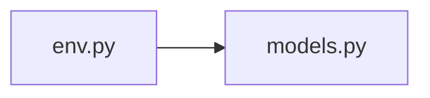

# env.py

저장소 경로 `backend/migrations/env.py` 의 관계 노트입니다. `scripts/codegraph.py` 가 생성하므로 직접 수정하지 않습니다.

## imports

- [[graph/backend/src/backend/db/models|models.py]]

## imported by

- 없음

## 함수와 호출

- `run_migrations_offline`
- `run_migrations_online`
