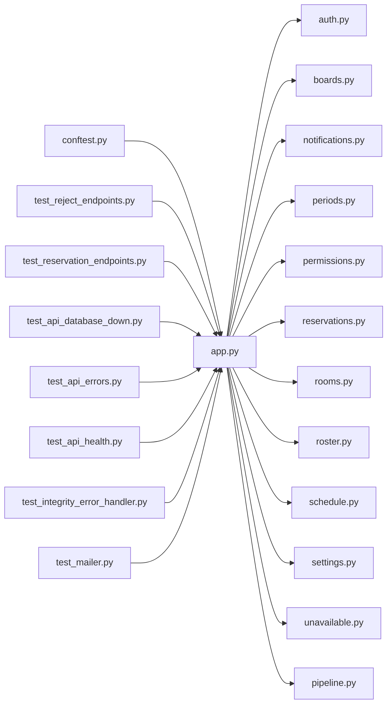

# app.py

저장소 경로 `backend/src/backend/api/app.py` 의 관계 노트입니다. `scripts/codegraph.py` 가 생성하므로 직접 수정하지 않습니다.

## imports

- [[graph/backend/src/backend/api/routers/auth|auth.py]]
- [[graph/backend/src/backend/api/routers/boards|boards.py]]
- [[graph/backend/src/backend/api/routers/notifications|notifications.py]]
- [[graph/backend/src/backend/api/routers/periods|periods.py]]
- [[graph/backend/src/backend/api/routers/permissions|permissions.py]]
- [[graph/backend/src/backend/api/routers/reservations|reservations.py]]
- [[graph/backend/src/backend/api/routers/rooms|rooms.py]]
- [[graph/backend/src/backend/api/routers/roster|roster.py]]
- [[graph/backend/src/backend/api/routers/schedule|schedule.py]]
- [[graph/backend/src/backend/api/routers/settings|settings.py]]
- [[graph/backend/src/backend/api/routers/unavailable|unavailable.py]]
- [[graph/backend/src/backend/db/pipeline|pipeline.py]]

## imported by

- [[graph/backend/tests/conftest|conftest.py]]
- [[graph/backend/tests/integration/db/test_reject_endpoints|test_reject_endpoints.py]]
- [[graph/backend/tests/integration/db/test_reservation_endpoints|test_reservation_endpoints.py]]
- [[graph/backend/tests/unit/test_api_database_down|test_api_database_down.py]]
- [[graph/backend/tests/unit/test_api_errors|test_api_errors.py]]
- [[graph/backend/tests/unit/test_api_health|test_api_health.py]]
- [[graph/backend/tests/unit/test_integrity_error_handler|test_integrity_error_handler.py]]
- [[graph/backend/tests/unit/test_mailer|test_mailer.py]]

## endpoint

| method | path | handler |
|---|---|---|
| GET | `/health` | `health` |

## 함수와 호출

- `_format_validation_error`
- `handle_database_down`
- `handle_integrity_error`
- `handle_value_error`
- `handle_permission_error`
- `handle_validation_error`
- `health`: `backend.db.pipeline`
