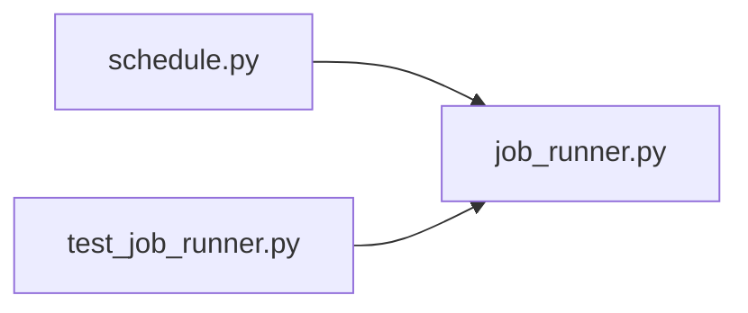

# job_runner.py

저장소 경로 `backend/src/backend/api/job_runner.py` 의 관계 노트입니다. `scripts/codegraph.py` 가 생성하므로 직접 수정하지 않습니다.

## imports

- 없음

## imported by

- [[graph/backend/src/backend/api/routers/schedule|schedule.py]]
- [[graph/backend/tests/unit/test_job_runner|test_job_runner.py]]

## 함수와 호출

- `max_concurrent_jobs_from_env`
