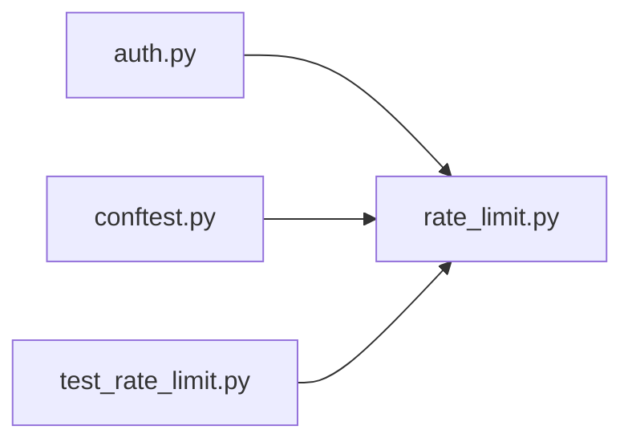

# rate_limit.py

저장소 경로 `backend/src/backend/api/rate_limit.py` 의 관계 노트입니다. `scripts/codegraph.py` 가 생성하므로 직접 수정하지 않습니다.

## imports

- 없음

## imported by

- [[graph/backend/src/backend/api/routers/auth|auth.py]]
- [[graph/backend/tests/conftest|conftest.py]]
- [[graph/backend/tests/unit/test_rate_limit|test_rate_limit.py]]

## 함수와 호출

- `reset_all`
- `_trusted_proxy_count`
- `caller_of`
- `limit_guesses`
