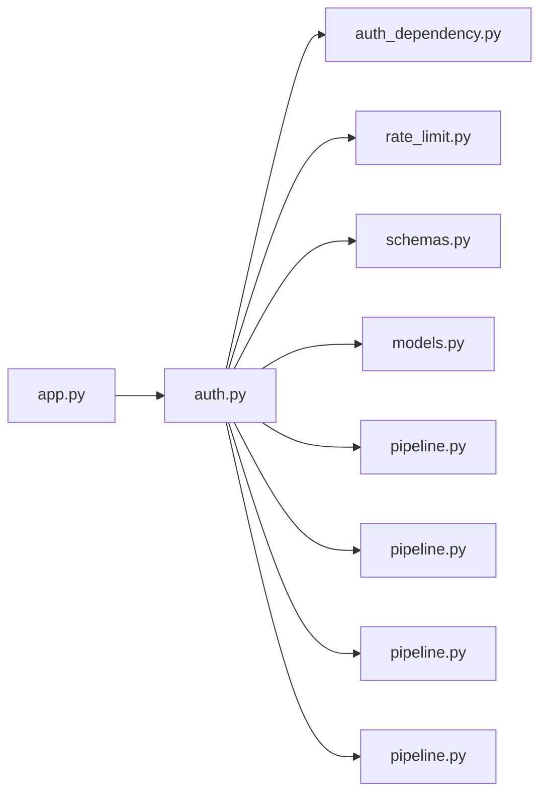

# auth.py

저장소 경로 `backend/src/backend/api/routers/auth.py` 의 관계 노트입니다. `scripts/codegraph.py` 가 생성하므로 직접 수정하지 않습니다.

## imports

- [[graph/backend/src/backend/api/auth_dependency|auth_dependency.py]]
- [[graph/backend/src/backend/api/rate_limit|rate_limit.py]]
- [[graph/backend/src/backend/api/schemas|schemas.py]]
- [[graph/backend/src/backend/db/models|models.py]]
- [[graph/backend/src/backend/db/pipeline|pipeline.py]]
- [[graph/backend/src/backend/services/auth/pipeline|pipeline.py]]
- [[graph/backend/src/backend/services/permission/pipeline|pipeline.py]]
- [[graph/backend/src/backend/services/roster/pipeline|pipeline.py]]

## imported by

- [[graph/backend/src/backend/api/app|app.py]]

## endpoint

| method | path | handler |
|---|---|---|
| POST | `/signup` | `signup` |
| POST | `/login` | `login` |
| PATCH | `/me` | `edit_me` |
| POST | `/me/avatar` | `upload_my_avatar` |
| DELETE | `/me/avatar` | `delete_my_avatar` |
| GET | `/members/{member_id}/avatar` | `show_avatar` |
| POST | `/me/password` | `edit_my_password` |
| DELETE | `/me` | `leave` |
| POST | `/logout` | `logout` |
| POST | `/find-id` | `find_id` |
| POST | `/password-reset` | `start_password_reset` |
| POST | `/password-reset/confirm` | `confirm_password_reset` |
| GET | `/me` | `read_me` |

## 함수와 호출

- `_cookie_secure`
- `_set_session_cookies`
- `_clear_session_cookies`
- `_account_out`: `backend.api.schemas`, `backend.services.permission.pipeline`
- `signup`: `backend.api.schemas`, `backend.services.auth.pipeline`
- `login`: `backend.api.schemas`, `backend.services.auth.pipeline`
- `edit_me`: `backend.api.schemas`, `backend.services.auth.pipeline`
- `upload_my_avatar`: `backend.api.schemas`, `backend.services.roster.pipeline`
- `delete_my_avatar`: `backend.services.roster.pipeline`
- `show_avatar`: `backend.services.roster.pipeline`
- `edit_my_password`: `backend.services.auth.pipeline`
- `leave`
- `logout`: `backend.services.auth.pipeline`
- `find_id`: `backend.api.schemas`, `backend.services.auth.pipeline`
- `start_password_reset`: `backend.api.schemas`, `backend.services.auth.pipeline`
- `confirm_password_reset`: `backend.api.schemas`, `backend.services.auth.pipeline`
- `read_me`: `backend.api.schemas`, `backend.services.roster.pipeline`
