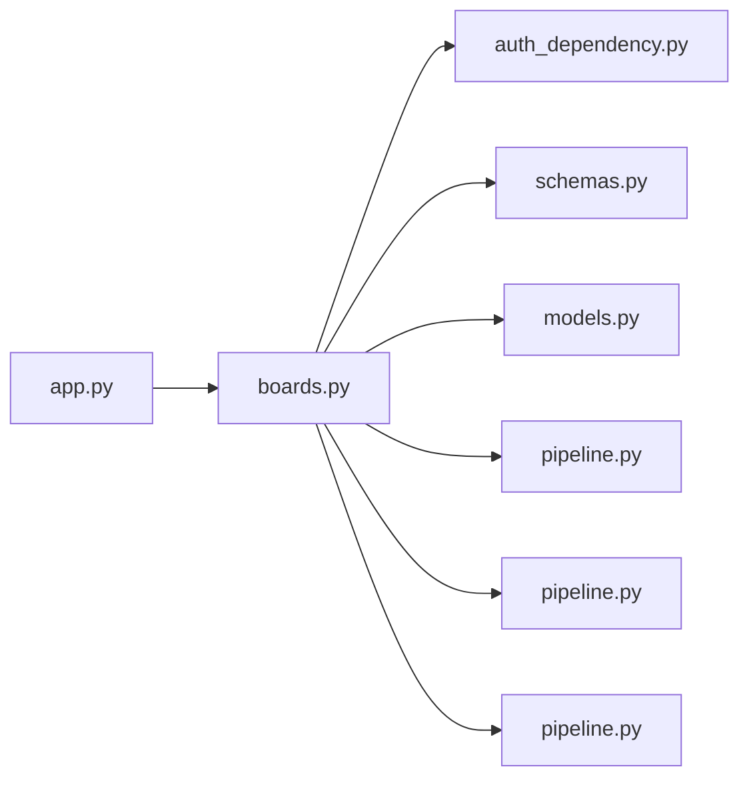

# boards.py

저장소 경로 `backend/src/backend/api/routers/boards.py` 의 관계 노트입니다. `scripts/codegraph.py` 가 생성하므로 직접 수정하지 않습니다.

## imports

- [[graph/backend/src/backend/api/auth_dependency|auth_dependency.py]]
- [[graph/backend/src/backend/api/schemas|schemas.py]]
- [[graph/backend/src/backend/db/models|models.py]]
- [[graph/backend/src/backend/db/pipeline|pipeline.py]]
- [[graph/backend/src/backend/services/board/pipeline|pipeline.py]]
- [[graph/backend/src/backend/services/validation/pipeline|pipeline.py]]

## imported by

- [[graph/backend/src/backend/api/app|app.py]]

## endpoint

| method | path | handler |
|---|---|---|
| GET | `/notices` | `read_notices` |
| POST | `/notices` | `create_notice_post` |
| POST | `/notices/drafts` | `start_notice_draft` |
| POST | `/teams/{team_id}/posts/drafts` | `start_team_post_draft` |
| POST | `/posts/{post_id}/publish` | `publish` |
| GET | `/blinded-posts` | `read_blinded_posts` |
| PUT | `/posts/{post_id}/blind` | `blind_post` |
| DELETE | `/posts/{post_id}/blind` | `unblind_post` |
| GET | `/teams/{team_id}/posts` | `read_team_posts` |
| POST | `/teams/{team_id}/posts` | `create_team_post_endpoint` |
| GET | `/posts/{post_id}` | `read_post_detail` |
| POST | `/posts/{post_id}/comments` | `create_post_comment` |
| PATCH | `/posts/{post_id}` | `edit_post` |
| PATCH | `/comments/{comment_id}` | `edit_comment` |
| DELETE | `/comments/{comment_id}` | `delete_comment_endpoint` |
| POST | `/posts/{post_id}/attachments` | `upload_attachment` |
| GET | `/posts/{post_id}/attachments` | `read_attachments` |
| GET | `/attachments/{attachment_id}` | `download_attachment` |
| GET | `/attachments/{attachment_id}/inline` | `view_attachment` |
| DELETE | `/attachments/{attachment_id}` | `delete_attachment_endpoint` |
| DELETE | `/posts/{post_id}` | `delete_post_endpoint` |

## 함수와 호출

- `_post_out`: `backend.api.schemas`, `backend.services.validation.pipeline`
- `_comment_out`: `backend.api.schemas`, `backend.services.validation.pipeline`
- `_attachment_out`: `backend.api.schemas`, `backend.services.validation.pipeline`
- `_posts_out`: `backend.api.schemas`
- `read_notices`: `backend.services.board.pipeline`
- `create_notice_post`: `backend.api.auth_dependency`, `backend.api.schemas`, `backend.services.board.pipeline`
- `start_notice_draft`: `backend.api.auth_dependency`, `backend.api.schemas`, `backend.services.board.pipeline`
- `start_team_post_draft`: `backend.api.schemas`, `backend.services.board.pipeline`
- `publish`: `backend.api.schemas`, `backend.services.board.pipeline`
- `read_blinded_posts`: `backend.api.auth_dependency`, `backend.services.board.pipeline`
- `blind_post`: `backend.api.auth_dependency`, `backend.services.board.pipeline`
- `unblind_post`: `backend.api.auth_dependency`, `backend.services.board.pipeline`
- `read_team_posts`: `backend.services.board.pipeline`
- `create_team_post_endpoint`: `backend.api.schemas`, `backend.services.board.pipeline`
- `read_post_detail`: `backend.api.schemas`, `backend.services.board.pipeline`
- `create_post_comment`: `backend.api.schemas`, `backend.services.board.pipeline`
- `edit_post`: `backend.api.schemas`, `backend.services.board.pipeline`
- `edit_comment`: `backend.api.schemas`, `backend.services.board.pipeline`
- `delete_comment_endpoint`: `backend.services.board.pipeline`
- `upload_attachment`: `backend.api.schemas`, `backend.services.board.pipeline`
- `read_attachments`: `backend.api.schemas`, `backend.services.board.pipeline`
- `download_attachment`: `backend.services.board.pipeline`
- `view_attachment`: `backend.services.board.pipeline`
- `delete_attachment_endpoint`: `backend.services.board.pipeline`
- `delete_post_endpoint`: `backend.services.board.pipeline`
