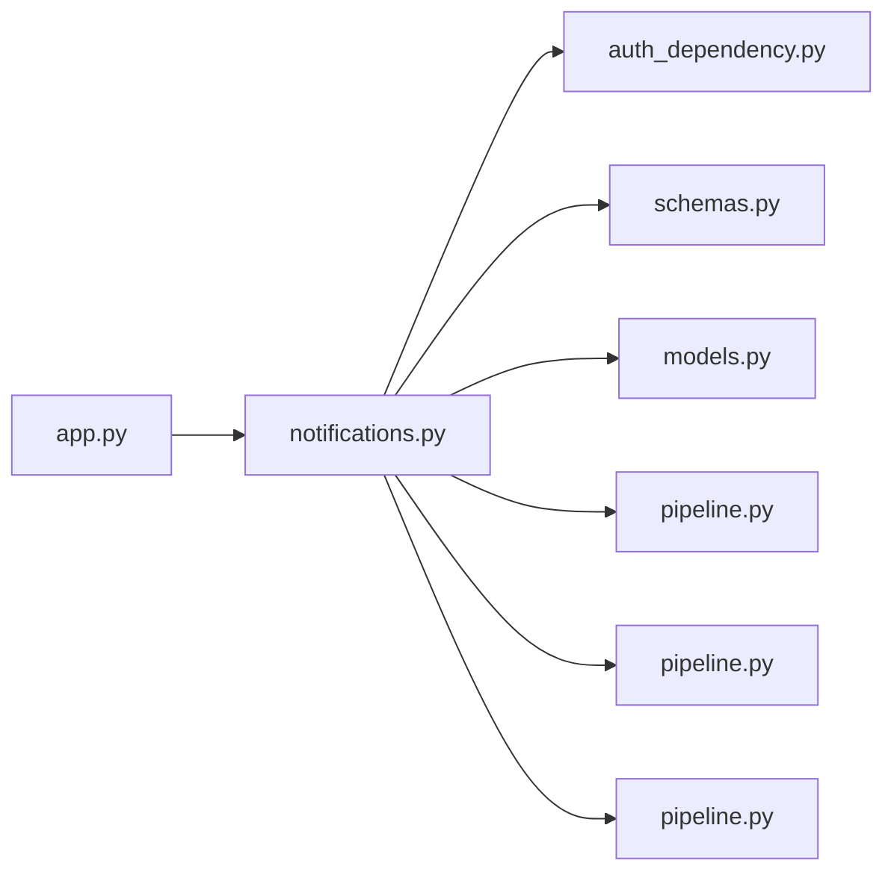

# notifications.py

저장소 경로 `backend/src/backend/api/routers/notifications.py` 의 관계 노트입니다. `scripts/codegraph.py` 가 생성하므로 직접 수정하지 않습니다.

## imports

- [[graph/backend/src/backend/api/auth_dependency|auth_dependency.py]]
- [[graph/backend/src/backend/api/schemas|schemas.py]]
- [[graph/backend/src/backend/db/models|models.py]]
- [[graph/backend/src/backend/db/pipeline|pipeline.py]]
- [[graph/backend/src/backend/services/notification/pipeline|pipeline.py]]
- [[graph/backend/src/backend/services/validation/pipeline|pipeline.py]]

## imported by

- [[graph/backend/src/backend/api/app|app.py]]

## endpoint

| method | path | handler |
|---|---|---|
| GET | `/notifications` | `read_notifications` |
| POST | `/notifications/read` | `mark_notifications_read` |

## 함수와 호출

- `_notification_out`: `backend.api.schemas`, `backend.services.validation.pipeline`
- `read_notifications`: `backend.api.schemas`, `backend.services.notification.pipeline`
- `mark_notifications_read`: `backend.services.notification.pipeline`
