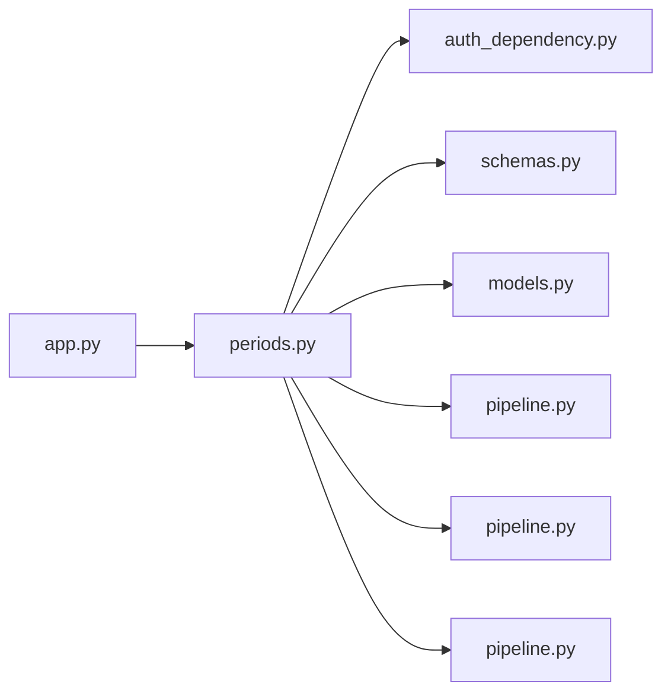

# periods.py

저장소 경로 `backend/src/backend/api/routers/periods.py` 의 관계 노트입니다. `scripts/codegraph.py` 가 생성하므로 직접 수정하지 않습니다.

## imports

- [[graph/backend/src/backend/api/auth_dependency|auth_dependency.py]]
- [[graph/backend/src/backend/api/schemas|schemas.py]]
- [[graph/backend/src/backend/db/models|models.py]]
- [[graph/backend/src/backend/db/pipeline|pipeline.py]]
- [[graph/backend/src/backend/services/period/pipeline|pipeline.py]]
- [[graph/backend/src/backend/services/validation/pipeline|pipeline.py]]

## imported by

- [[graph/backend/src/backend/api/app|app.py]]

## endpoint

| method | path | handler |
|---|---|---|
| GET | `/periods` | `read_periods` |
| POST | `/periods` | `create_period` |
| PATCH | `/periods/{period_id}` | `patch_period` |
| DELETE | `/periods/{period_id}` | `delete_period_endpoint` |
| PUT | `/periods/{period_id}/ensemble` | `put_ensemble` |
| DELETE | `/periods/{period_id}/ensemble` | `delete_ensemble_endpoint` |
| PUT | `/periods/{period_id}/ensemble/days/{day}` | `put_ensemble_day` |
| DELETE | `/periods/{period_id}/ensemble/days/{day}` | `delete_ensemble_day_endpoint` |

## 함수와 호출

- `_ensemble_out`: `backend.api.schemas`, `backend.services.validation.pipeline`
- `_window_out`: `backend.api.schemas`, `backend.services.validation.pipeline`
- `_window_in`: `backend.services.period.pipeline`
- `_period_out`: `backend.api.schemas`, `backend.services.validation.pipeline`
- `_envelope`: `backend.api.schemas`, `backend.services.period.pipeline`
- `read_periods`: `backend.api.schemas`, `backend.services.period.pipeline`
- `create_period`: `backend.api.auth_dependency`, `backend.services.period.pipeline`
- `patch_period`: `backend.api.auth_dependency`, `backend.services.period.pipeline`
- `delete_period_endpoint`: `backend.api.auth_dependency`, `backend.services.period.pipeline`
- `put_ensemble`: `backend.api.auth_dependency`, `backend.services.period.pipeline`
- `delete_ensemble_endpoint`: `backend.api.auth_dependency`, `backend.services.period.pipeline`
- `put_ensemble_day`: `backend.api.auth_dependency`, `backend.services.period.pipeline`
- `delete_ensemble_day_endpoint`: `backend.api.auth_dependency`, `backend.services.period.pipeline`
