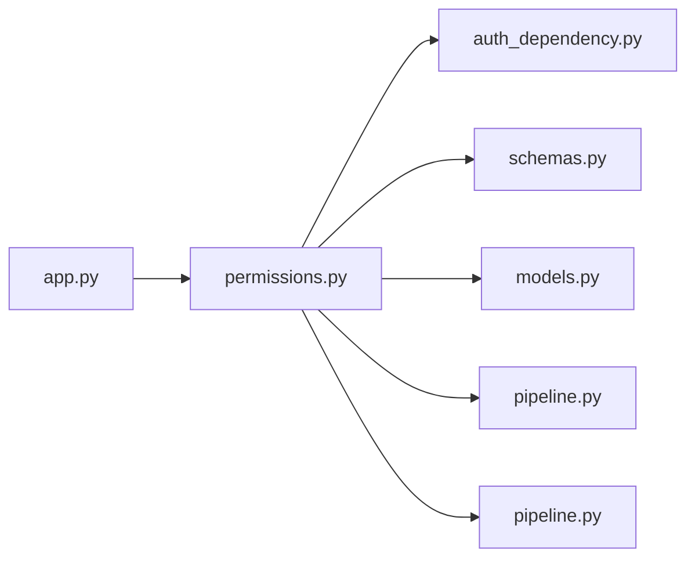

# permissions.py

저장소 경로 `backend/src/backend/api/routers/permissions.py` 의 관계 노트입니다. `scripts/codegraph.py` 가 생성하므로 직접 수정하지 않습니다.

## imports

- [[graph/backend/src/backend/api/auth_dependency|auth_dependency.py]]
- [[graph/backend/src/backend/api/schemas|schemas.py]]
- [[graph/backend/src/backend/db/models|models.py]]
- [[graph/backend/src/backend/db/pipeline|pipeline.py]]
- [[graph/backend/src/backend/services/permission/pipeline|pipeline.py]]

## imported by

- [[graph/backend/src/backend/api/app|app.py]]

## endpoint

| method | path | handler |
|---|---|---|
| GET | `/permission-sets` | `read_permission_sets` |
| POST | `/permission-sets` | `create_set` |
| PATCH | `/permission-sets/{set_id}` | `patch_set` |
| DELETE | `/permission-sets/{set_id}` | `delete_set` |
| POST | `/members/{member_id}/permission-sets/{set_id}` | `grant_set` |
| DELETE | `/members/{member_id}/permission-sets/{set_id}` | `revoke_set` |

## 함수와 호출

- `_set_out`: `backend.api.schemas`
- `read_permission_sets`: `backend.api.schemas`, `backend.services.permission.pipeline`
- `create_set`: `backend.api.schemas`, `backend.services.permission.pipeline`
- `patch_set`: `backend.api.schemas`, `backend.services.permission.pipeline`
- `delete_set`: `backend.services.permission.pipeline`
- `grant_set`: `backend.services.permission.pipeline`
- `revoke_set`: `backend.api.auth_dependency`, `backend.services.permission.pipeline`
