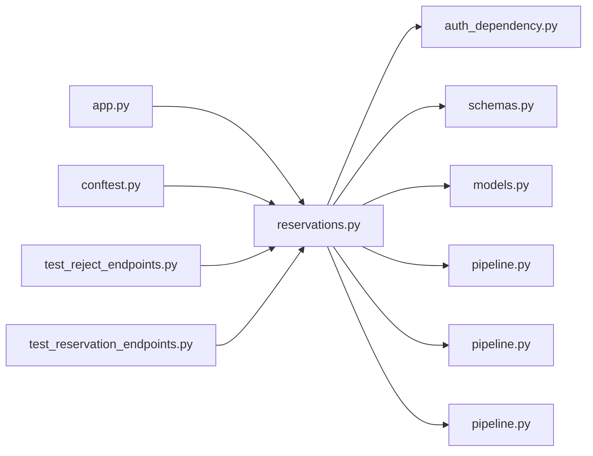

# reservations.py

저장소 경로 `backend/src/backend/api/routers/reservations.py` 의 관계 노트입니다. `scripts/codegraph.py` 가 생성하므로 직접 수정하지 않습니다.

## imports

- [[graph/backend/src/backend/api/auth_dependency|auth_dependency.py]]
- [[graph/backend/src/backend/api/schemas|schemas.py]]
- [[graph/backend/src/backend/db/models|models.py]]
- [[graph/backend/src/backend/db/pipeline|pipeline.py]]
- [[graph/backend/src/backend/services/reservation/pipeline|pipeline.py]]
- [[graph/backend/src/backend/services/validation/pipeline|pipeline.py]]

## imported by

- [[graph/backend/src/backend/api/app|app.py]]
- [[graph/backend/tests/conftest|conftest.py]]
- [[graph/backend/tests/integration/db/test_reject_endpoints|test_reject_endpoints.py]]
- [[graph/backend/tests/integration/db/test_reservation_endpoints|test_reservation_endpoints.py]]

## endpoint

| method | path | handler |
|---|---|---|
| GET | `/rooms/{room_id}/reservations` | `read_room_reservations` |
| GET | `/reservations/mine` | `read_my_reservations` |
| POST | `/reservations` | `create_reservation_endpoint` |
| PATCH | `/reservations/{reservation_id}` | `update_reservation_endpoint` |
| DELETE | `/reservations/{reservation_id}` | `cancel_reservation_endpoint` |
| POST | `/reservations/{reservation_id}/reject` | `reject_reservation_endpoint` |

## 함수와 호출

- `current_time`
- `_reservation_out`: `backend.api.schemas`
- `_rows_out`: `backend.api.schemas`
- `read_room_reservations`: `backend.services.reservation.pipeline`, `backend.services.validation.pipeline`
- `read_my_reservations`: `backend.services.reservation.pipeline`
- `create_reservation_endpoint`: `backend.services.reservation.pipeline`
- `update_reservation_endpoint`: `backend.services.reservation.pipeline`
- `cancel_reservation_endpoint`: `backend.services.reservation.pipeline`
- `reject_reservation_endpoint`: `backend.services.reservation.pipeline`
