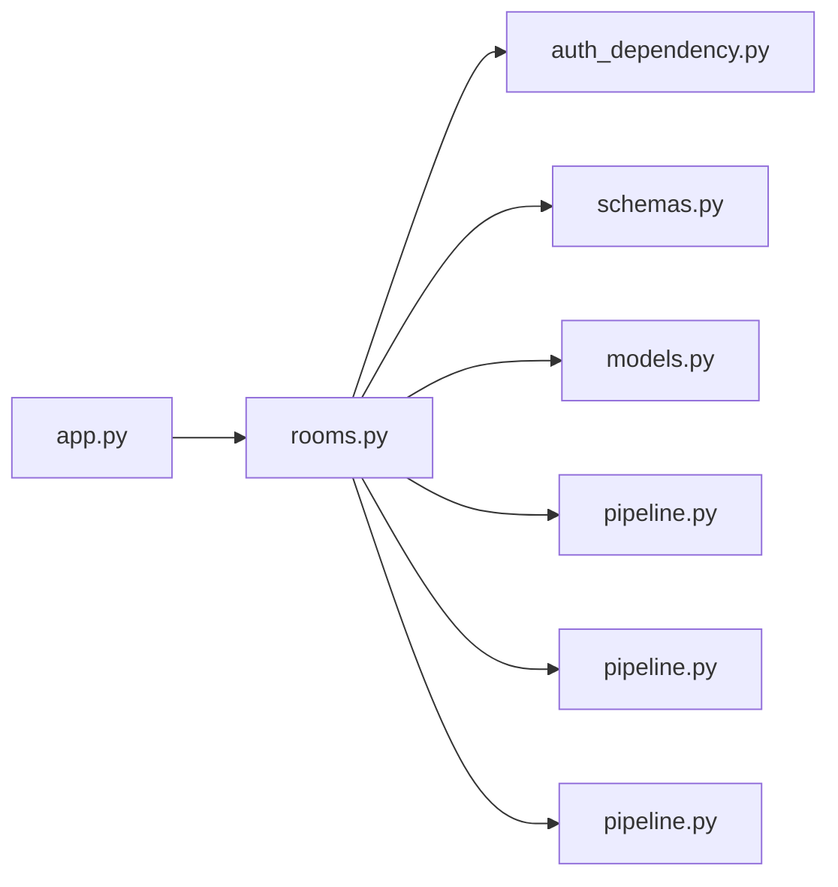

# rooms.py

저장소 경로 `backend/src/backend/api/routers/rooms.py` 의 관계 노트입니다. `scripts/codegraph.py` 가 생성하므로 직접 수정하지 않습니다.

## imports

- [[graph/backend/src/backend/api/auth_dependency|auth_dependency.py]]
- [[graph/backend/src/backend/api/schemas|schemas.py]]
- [[graph/backend/src/backend/db/models|models.py]]
- [[graph/backend/src/backend/db/pipeline|pipeline.py]]
- [[graph/backend/src/backend/services/room/pipeline|pipeline.py]]
- [[graph/backend/src/backend/services/validation/pipeline|pipeline.py]]

## imported by

- [[graph/backend/src/backend/api/app|app.py]]

## endpoint

| method | path | handler |
|---|---|---|
| GET | `/rooms` | `read_rooms` |
| POST | `/rooms` | `create_room` |
| DELETE | `/rooms/{room_id}` | `remove_room` |
| PATCH | `/rooms/{room_id}` | `patch_room` |

## 함수와 호출

- `_room_out`: `backend.api.schemas`, `backend.services.validation.pipeline`
- `read_rooms`: `backend.api.schemas`, `backend.services.room.pipeline`
- `create_room`: `backend.api.auth_dependency`, `backend.api.schemas`, `backend.services.room.pipeline`
- `remove_room`: `backend.api.auth_dependency`, `backend.services.room.pipeline`
- `patch_room`: `backend.api.auth_dependency`, `backend.api.schemas`, `backend.services.room.pipeline`
