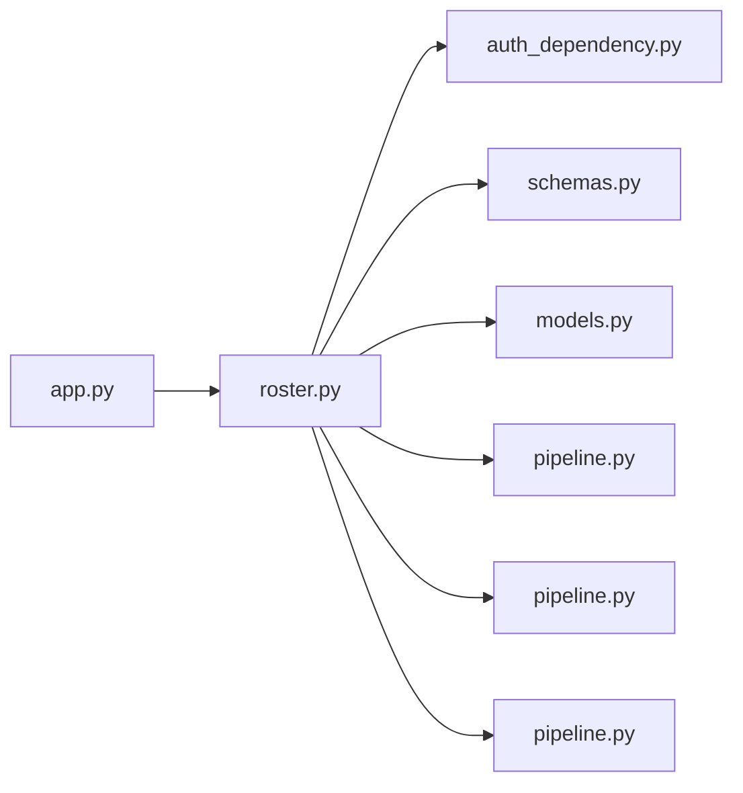

# roster.py

저장소 경로 `backend/src/backend/api/routers/roster.py` 의 관계 노트입니다. `scripts/codegraph.py` 가 생성하므로 직접 수정하지 않습니다.

## imports

- [[graph/backend/src/backend/api/auth_dependency|auth_dependency.py]]
- [[graph/backend/src/backend/api/schemas|schemas.py]]
- [[graph/backend/src/backend/db/models|models.py]]
- [[graph/backend/src/backend/db/pipeline|pipeline.py]]
- [[graph/backend/src/backend/services/permission/pipeline|pipeline.py]]
- [[graph/backend/src/backend/services/roster/pipeline|pipeline.py]]

## imported by

- [[graph/backend/src/backend/api/app|app.py]]

## endpoint

| method | path | handler |
|---|---|---|
| GET | `/teams` | `read_teams` |
| GET | `/teams/{team_id}/slots` | `read_team_slots` |
| GET | `/teams/{team_id}/members` | `read_team_members` |
| GET | `/members` | `read_members` |
| GET | `/members/search` | `search_member_list` |
| POST | `/teams` | `create_team` |
| PATCH | `/teams/{team_id}` | `patch_team` |
| DELETE | `/teams/{team_id}` | `delete_team_endpoint` |
| PUT | `/teams/{team_id}/slots` | `put_team_slots` |
| PUT | `/teams/{team_id}/slots/{slot_id}` | `put_slot_member` |
| PUT | `/teams/{team_id}/slot-members` | `put_team_slot_members` |
| DELETE | `/teams/{team_id}/slots/{slot_id}` | `delete_slot_member` |
| DELETE | `/members/{member_id}` | `expel_member` |

## 함수와 호출

- `_team_out`: `backend.api.schemas`
- `_member_out`: `backend.api.schemas`
- `_slot_out`: `backend.api.schemas`
- `read_teams`: `backend.api.schemas`, `backend.services.roster.pipeline`
- `read_team_slots`: `backend.api.schemas`, `backend.services.roster.pipeline`
- `read_team_members`: `backend.api.schemas`, `backend.services.roster.pipeline`
- `read_members`: `backend.api.schemas`, `backend.services.roster.pipeline`
- `search_member_list`: `backend.api.schemas`, `backend.services.roster.pipeline`
- `create_team`: `backend.api.auth_dependency`, `backend.api.schemas`, `backend.services.roster.pipeline`
- `patch_team`: `backend.api.auth_dependency`, `backend.api.schemas`, `backend.services.roster.pipeline`
- `delete_team_endpoint`: `backend.api.auth_dependency`, `backend.services.roster.pipeline`
- `put_team_slots`: `backend.api.auth_dependency`, `backend.api.schemas`, `backend.services.roster.pipeline`
- `put_slot_member`: `backend.api.auth_dependency`, `backend.api.schemas`, `backend.services.roster.pipeline`
- `put_team_slot_members`: `backend.api.schemas`, `backend.services.permission.pipeline`, `backend.services.roster.pipeline`
- `delete_slot_member`: `backend.services.permission.pipeline`, `backend.services.roster.pipeline`
- `expel_member`: `backend.api.auth_dependency`, `backend.services.roster.pipeline`
