# schedule.py

저장소 경로 `backend/src/backend/api/routers/schedule.py` 의 관계 노트입니다. `scripts/codegraph.py` 가 생성하므로 직접 수정하지 않습니다.

```mermaid
flowchart LR
  backend_src_backend_api_routers_schedule["schedule.py"]
  backend_src_backend_api_routers_schedule --> backend_src_backend_api_auth_dependency["auth_dependency.py"]
  backend_src_backend_api_routers_schedule --> backend_src_backend_api_job_runner["job_runner.py"]
  backend_src_backend_api_routers_schedule --> backend_src_backend_api_schemas["schemas.py"]
  backend_src_backend_api_routers_schedule --> backend_src_backend_db_models["models.py"]
  backend_src_backend_api_routers_schedule --> backend_src_backend_db_pipeline["pipeline.py"]
  backend_src_backend_api_routers_schedule --> backend_src_backend_scheduling_pipeline["pipeline.py"]
  backend_src_backend_api_routers_schedule --> backend_src_backend_services_notification_pipeline["pipeline.py"]
  backend_src_backend_api_routers_schedule --> backend_src_backend_services_period_pipeline["pipeline.py"]
  backend_src_backend_api_routers_schedule --> backend_src_backend_services_settings_pipeline["pipeline.py"]
  backend_src_backend_api_app["app.py"] --> backend_src_backend_api_routers_schedule
  backend_tests_integration_db_test_assign_jobs["test_assign_jobs.py"] --> backend_src_backend_api_routers_schedule
```

## imports

- [[graph/backend/src/backend/api/auth_dependency|auth_dependency.py]]
- [[graph/backend/src/backend/api/job_runner|job_runner.py]]
- [[graph/backend/src/backend/api/schemas|schemas.py]]
- [[graph/backend/src/backend/db/models|models.py]]
- [[graph/backend/src/backend/db/pipeline|pipeline.py]]
- [[graph/backend/src/backend/scheduling/pipeline|pipeline.py]]
- [[graph/backend/src/backend/services/notification/pipeline|pipeline.py]]
- [[graph/backend/src/backend/services/period/pipeline|pipeline.py]]
- [[graph/backend/src/backend/services/settings/pipeline|pipeline.py]]

## imported by

- [[graph/backend/src/backend/api/app|app.py]]
- [[graph/backend/tests/integration/db/test_assign_jobs|test_assign_jobs.py]]

## endpoint

| method | path | handler |
|---|---|---|
| GET | `/periods/{period_id}/schedule` | `read_schedule` |
| POST | `/periods/{period_id}/assign` | `assign_period_schedule` |
| POST | `/periods/{period_id}/proposals/{member_id}/confirm` | `confirm_period_proposal` |
| GET | `/jobs/{job_id}` | `read_job` |
| GET | `/periods/{period_id}/backups` | `read_period_backups` |
| GET | `/periods/{period_id}/backups/{saved_at}` | `read_period_backup_round` |
| POST | `/periods/{period_id}/rollback` | `rollback_period_schedule` |

## 함수와 호출

- `_period`: `backend.services.period.pipeline`
- `_row_out`: `backend.api.schemas`
- `read_schedule`: `backend.api.schemas`, `backend.services.period.pipeline`
- `_assignment_out`: `backend.api.schemas`
- `_result_out`: `backend.api.schemas`
- `_job_out`: `backend.api.schemas`
- `_submit`: `backend.api.schemas`, `backend.services.notification.pipeline`, `backend.services.period.pipeline`
- `assign_period_schedule`: `backend.api.auth_dependency`
- `confirm_period_proposal`: `backend.api.auth_dependency`
- `read_job`: `backend.api.auth_dependency`, `backend.api.schemas`
- `read_period_backups`: `backend.api.auth_dependency`, `backend.api.schemas`, `backend.db.pipeline`, `backend.services.settings.pipeline`
- `read_period_backup_round`: `backend.api.auth_dependency`, `backend.api.schemas`, `backend.services.period.pipeline`
- `rollback_period_schedule`: `backend.api.auth_dependency`, `backend.api.schemas`, `backend.db.pipeline`, `backend.services.notification.pipeline`
