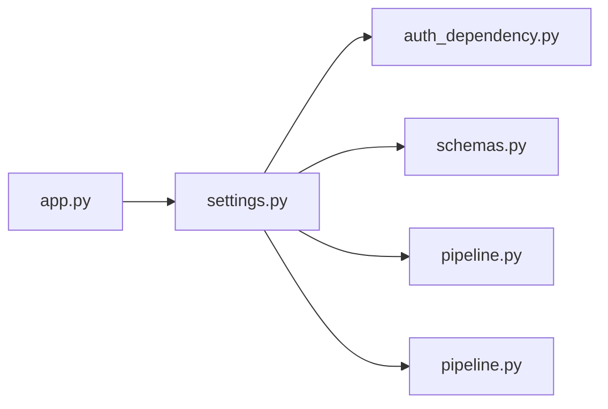

# settings.py

저장소 경로 `backend/src/backend/api/routers/settings.py` 의 관계 노트입니다. `scripts/codegraph.py` 가 생성하므로 직접 수정하지 않습니다.

## imports

- [[graph/backend/src/backend/api/auth_dependency|auth_dependency.py]]
- [[graph/backend/src/backend/api/schemas|schemas.py]]
- [[graph/backend/src/backend/db/pipeline|pipeline.py]]
- [[graph/backend/src/backend/services/settings/pipeline|pipeline.py]]

## imported by

- [[graph/backend/src/backend/api/app|app.py]]

## endpoint

| method | path | handler |
|---|---|---|
| GET | `/settings` | `read_settings` |
| PATCH | `/settings` | `update_settings` |

## 함수와 호출

- `read_settings`: `backend.api.schemas`, `backend.services.settings.pipeline`
- `update_settings`: `backend.api.auth_dependency`, `backend.services.settings.pipeline`
