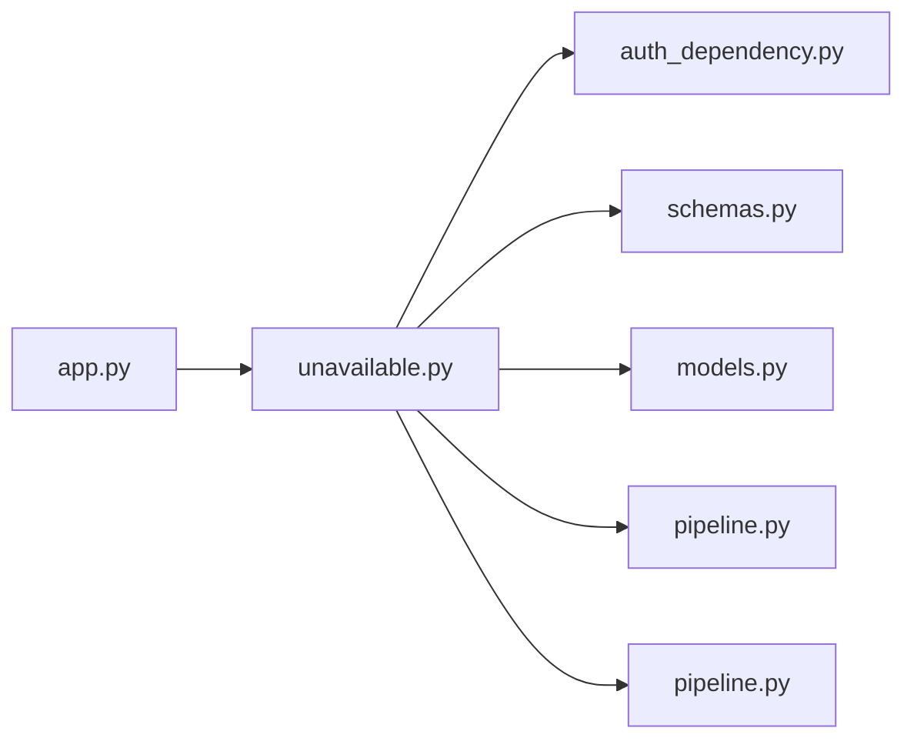

# unavailable.py

저장소 경로 `backend/src/backend/api/routers/unavailable.py` 의 관계 노트입니다. `scripts/codegraph.py` 가 생성하므로 직접 수정하지 않습니다.

## imports

- [[graph/backend/src/backend/api/auth_dependency|auth_dependency.py]]
- [[graph/backend/src/backend/api/schemas|schemas.py]]
- [[graph/backend/src/backend/db/models|models.py]]
- [[graph/backend/src/backend/db/pipeline|pipeline.py]]
- [[graph/backend/src/backend/services/unavailable/pipeline|pipeline.py]]

## imported by

- [[graph/backend/src/backend/api/app|app.py]]

## endpoint

| method | path | handler |
|---|---|---|
| GET | `/unavailable` | `read_all_unavailable` |
| GET | `/members/{member_id}/unavailable` | `read_unavailable` |
| POST | `/members/{member_id}/unavailable` | `create_unavailable_endpoint` |
| PATCH | `/members/{member_id}/unavailable/{time_id}` | `update_unavailable_endpoint` |
| POST | `/members/{member_id}/unavailable/{time_id}/reject` | `reject_unavailable_endpoint` |
| DELETE | `/members/{member_id}/unavailable/{time_id}` | `delete_unavailable_endpoint` |

## 함수와 호출

- `_unavailable_out`: `backend.api.schemas`
- `read_all_unavailable`: `backend.api.auth_dependency`, `backend.api.schemas`, `backend.services.unavailable.pipeline`
- `read_unavailable`: `backend.api.schemas`, `backend.services.unavailable.pipeline`
- `create_unavailable_endpoint`: `backend.api.schemas`, `backend.services.unavailable.pipeline`
- `update_unavailable_endpoint`: `backend.api.schemas`, `backend.services.unavailable.pipeline`
- `reject_unavailable_endpoint`: `backend.services.unavailable.pipeline`
- `delete_unavailable_endpoint`: `backend.services.unavailable.pipeline`
