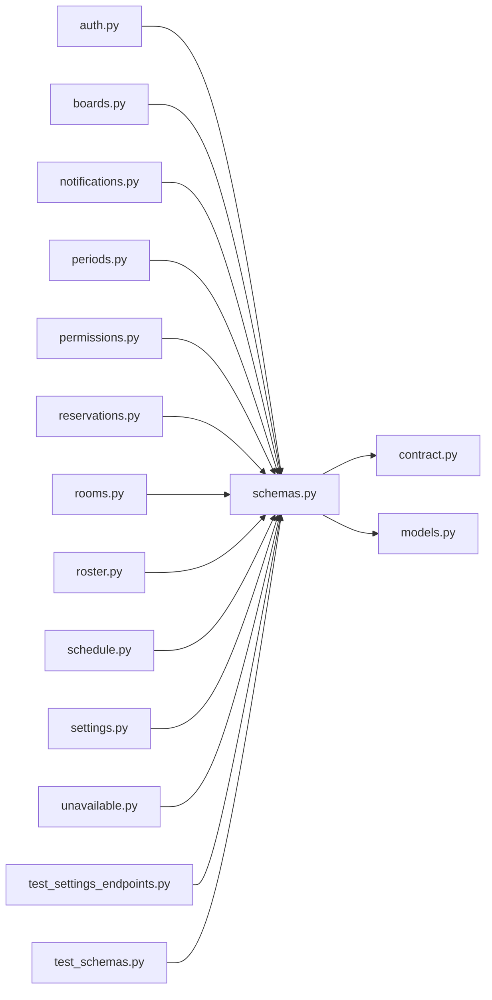

# schemas.py

저장소 경로 `backend/src/backend/api/schemas.py` 의 관계 노트입니다. `scripts/codegraph.py` 가 생성하므로 직접 수정하지 않습니다.

## imports

- [[graph/backend/src/backend/contract|contract.py]]
- [[graph/backend/src/backend/db/models|models.py]]

## imported by

- [[graph/backend/src/backend/api/routers/auth|auth.py]]
- [[graph/backend/src/backend/api/routers/boards|boards.py]]
- [[graph/backend/src/backend/api/routers/notifications|notifications.py]]
- [[graph/backend/src/backend/api/routers/periods|periods.py]]
- [[graph/backend/src/backend/api/routers/permissions|permissions.py]]
- [[graph/backend/src/backend/api/routers/reservations|reservations.py]]
- [[graph/backend/src/backend/api/routers/rooms|rooms.py]]
- [[graph/backend/src/backend/api/routers/roster|roster.py]]
- [[graph/backend/src/backend/api/routers/schedule|schedule.py]]
- [[graph/backend/src/backend/api/routers/settings|settings.py]]
- [[graph/backend/src/backend/api/routers/unavailable|unavailable.py]]
- [[graph/backend/tests/integration/db/test_settings_endpoints|test_settings_endpoints.py]]
- [[graph/backend/tests/unit/test_schemas|test_schemas.py]]
