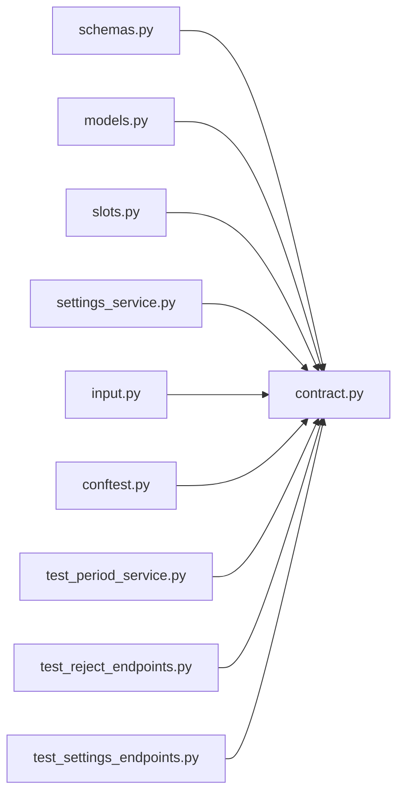

# contract.py

저장소 경로 `backend/src/backend/contract.py` 의 관계 노트입니다. `scripts/codegraph.py` 가 생성하므로 직접 수정하지 않습니다.

## imports

- 없음

## imported by

- [[graph/backend/src/backend/api/schemas|schemas.py]]
- [[graph/backend/src/backend/db/models|models.py]]
- [[graph/backend/src/backend/scheduling/slots|slots.py]]
- [[graph/backend/src/backend/services/settings/settings_service|settings_service.py]]
- [[graph/backend/src/backend/services/validation/input|input.py]]
- [[graph/backend/tests/conftest|conftest.py]]
- [[graph/backend/tests/integration/db/test_period_service|test_period_service.py]]
- [[graph/backend/tests/integration/db/test_reject_endpoints|test_reject_endpoints.py]]
- [[graph/backend/tests/integration/db/test_settings_endpoints|test_settings_endpoints.py]]
