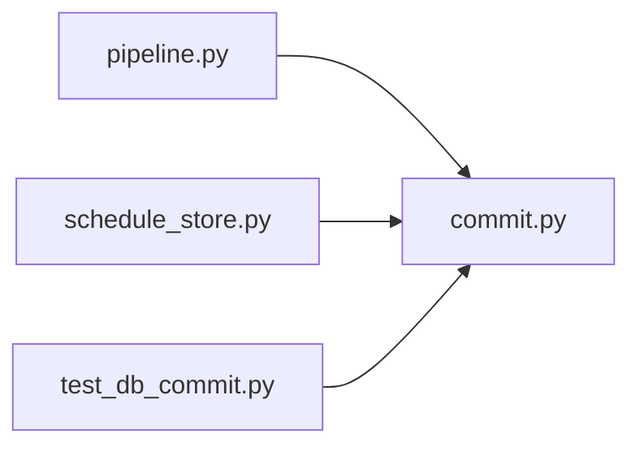

# commit.py

저장소 경로 `backend/src/backend/db/commit.py` 의 관계 노트입니다. `scripts/codegraph.py` 가 생성하므로 직접 수정하지 않습니다.

## imports

- 없음

## imported by

- [[graph/backend/src/backend/db/pipeline|pipeline.py]]
- [[graph/backend/src/backend/db/schedule_store|schedule_store.py]]
- [[graph/backend/tests/unit/test_db_commit|test_db_commit.py]]

## 함수와 호출

- `constraint_name`
- `commit_translating`
