# models.py

저장소 경로 `backend/src/backend/db/models.py` 의 관계 노트입니다. `scripts/codegraph.py` 가 생성하므로 직접 수정하지 않습니다.

```mermaid
flowchart LR
  backend_src_backend_db_models["models.py"]
  backend_src_backend_db_models --> backend_src_backend_contract["contract.py"]
  backend_migrations_env["env.py"] --> backend_src_backend_db_models
  backend_src_backend_api_auth_dependency["auth_dependency.py"] --> backend_src_backend_db_models
  backend_src_backend_api_routers_auth["auth.py"] --> backend_src_backend_db_models
  backend_src_backend_api_routers_boards["boards.py"] --> backend_src_backend_db_models
  backend_src_backend_api_routers_notifications["notifications.py"] --> backend_src_backend_db_models
  backend_src_backend_api_routers_periods["periods.py"] --> backend_src_backend_db_models
  backend_src_backend_api_routers_permissions["permissions.py"] --> backend_src_backend_db_models
  backend_src_backend_api_routers_reservations["reservations.py"] --> backend_src_backend_db_models
  backend_src_backend_api_routers_rooms["rooms.py"] --> backend_src_backend_db_models
  backend_src_backend_api_routers_roster["roster.py"] --> backend_src_backend_db_models
  backend_src_backend_api_routers_schedule["schedule.py"] --> backend_src_backend_db_models
  backend_src_backend_api_routers_unavailable["unavailable.py"] --> backend_src_backend_db_models
  backend_src_backend_api_schemas["schemas.py"] --> backend_src_backend_db_models
  backend_src_backend_db_schedule_store["schedule_store.py"] --> backend_src_backend_db_models
  backend_src_backend_jobs_auto_assign["auto_assign.py"] --> backend_src_backend_db_models
  backend_src_backend_services_auth_auth_service["auth_service.py"] --> backend_src_backend_db_models
  backend_src_backend_services_auth_auth_session["auth_session.py"] --> backend_src_backend_db_models
  backend_src_backend_services_auth_password_reset["password_reset.py"] --> backend_src_backend_db_models
  backend_src_backend_services_board_attachment_service["attachment_service.py"] --> backend_src_backend_db_models
  backend_src_backend_services_board_board_service["board_service.py"] --> backend_src_backend_db_models
  backend_src_backend_services_notification_notification_service["notification_service.py"] --> backend_src_backend_db_models
  backend_src_backend_services_period_ensemble_service["ensemble_service.py"] --> backend_src_backend_db_models
  backend_src_backend_services_period_period_crud_service["period_crud_service.py"] --> backend_src_backend_db_models
  backend_src_backend_services_period_period_input["period_input.py"] --> backend_src_backend_db_models
  backend_src_backend_services_period_period_service["period_service.py"] --> backend_src_backend_db_models
  backend_src_backend_services_permission_permission_service["permission_service.py"] --> backend_src_backend_db_models
  backend_src_backend_services_reservation_reservation_service["reservation_service.py"] --> backend_src_backend_db_models
  backend_src_backend_services_room_room_service["room_service.py"] --> backend_src_backend_db_models
  backend_src_backend_services_roster_avatar_service["avatar_service.py"] --> backend_src_backend_db_models
  backend_src_backend_services_roster_roster_service["roster_service.py"] --> backend_src_backend_db_models
  backend_src_backend_services_settings_settings_service["settings_service.py"] --> backend_src_backend_db_models
  backend_src_backend_services_unavailable_unavailable_service["unavailable_service.py"] --> backend_src_backend_db_models
  backend_src_backend_services_validation_input["input.py"] --> backend_src_backend_db_models
  backend_tests_conftest["conftest.py"] --> backend_src_backend_db_models
  backend_tests_integration_db_test_assign_jobs["test_assign_jobs.py"] --> backend_src_backend_db_models
  backend_tests_integration_db_test_attachment_endpoints["test_attachment_endpoints.py"] --> backend_src_backend_db_models
  backend_tests_integration_db_test_auth_endpoints["test_auth_endpoints.py"] --> backend_src_backend_db_models
  backend_tests_integration_db_test_auth_service_password_rehash["test_auth_service_password_rehash.py"] --> backend_src_backend_db_models
  backend_tests_integration_db_test_auto_assign["test_auto_assign.py"] --> backend_src_backend_db_models
  backend_tests_integration_db_test_avatar_endpoints["test_avatar_endpoints.py"] --> backend_src_backend_db_models
  backend_tests_integration_db_test_board_endpoints["test_board_endpoints.py"] --> backend_src_backend_db_models
  backend_tests_integration_db_test_db_core["test_db_core.py"] --> backend_src_backend_db_models
  backend_tests_integration_db_test_db_periods["test_db_periods.py"] --> backend_src_backend_db_models
  backend_tests_integration_db_test_db_policies["test_db_policies.py"] --> backend_src_backend_db_models
  backend_tests_integration_db_test_db_schedule_inputs["test_db_schedule_inputs.py"] --> backend_src_backend_db_models
  backend_tests_integration_db_test_focus_cancels_reservations["test_focus_cancels_reservations.py"] --> backend_src_backend_db_models
  backend_tests_integration_db_test_member_expel_endpoints["test_member_expel_endpoints.py"] --> backend_src_backend_db_models
  backend_tests_integration_db_test_migration_chain["test_migration_chain.py"] --> backend_src_backend_db_models
  backend_tests_integration_db_test_notifications["test_notifications.py"] --> backend_src_backend_db_models
  backend_tests_integration_db_test_password_reset_endpoints["test_password_reset_endpoints.py"] --> backend_src_backend_db_models
  backend_tests_integration_db_test_period_crud_endpoints["test_period_crud_endpoints.py"] --> backend_src_backend_db_models
  backend_tests_integration_db_test_period_endpoints["test_period_endpoints.py"] --> backend_src_backend_db_models
  backend_tests_integration_db_test_period_ensemble_endpoints["test_period_ensemble_endpoints.py"] --> backend_src_backend_db_models
  backend_tests_integration_db_test_period_service["test_period_service.py"] --> backend_src_backend_db_models
  backend_tests_integration_db_test_permission_endpoints["test_permission_endpoints.py"] --> backend_src_backend_db_models
  backend_tests_integration_db_test_reject_endpoints["test_reject_endpoints.py"] --> backend_src_backend_db_models
  backend_tests_integration_db_test_reservation_endpoints["test_reservation_endpoints.py"] --> backend_src_backend_db_models
  backend_tests_integration_db_test_room_endpoints["test_room_endpoints.py"] --> backend_src_backend_db_models
  backend_tests_integration_db_test_roster_endpoints["test_roster_endpoints.py"] --> backend_src_backend_db_models
  backend_tests_integration_db_test_schedule_store["test_schedule_store.py"] --> backend_src_backend_db_models
  backend_tests_integration_db_test_settings_endpoints["test_settings_endpoints.py"] --> backend_src_backend_db_models
  backend_tests_integration_db_test_unavailable_endpoints["test_unavailable_endpoints.py"] --> backend_src_backend_db_models
  backend_tests_unit_test_period_input["test_period_input.py"] --> backend_src_backend_db_models
```

## imports

- [[graph/backend/src/backend/contract|contract.py]]

## imported by

- [[graph/backend/migrations/env|env.py]]
- [[graph/backend/src/backend/api/auth_dependency|auth_dependency.py]]
- [[graph/backend/src/backend/api/routers/auth|auth.py]]
- [[graph/backend/src/backend/api/routers/boards|boards.py]]
- [[graph/backend/src/backend/api/routers/notifications|notifications.py]]
- [[graph/backend/src/backend/api/routers/periods|periods.py]]
- [[graph/backend/src/backend/api/routers/permissions|permissions.py]]
- [[graph/backend/src/backend/api/routers/reservations|reservations.py]]
- [[graph/backend/src/backend/api/routers/rooms|rooms.py]]
- [[graph/backend/src/backend/api/routers/roster|roster.py]]
- [[graph/backend/src/backend/api/routers/schedule|schedule.py]]
- [[graph/backend/src/backend/api/routers/unavailable|unavailable.py]]
- [[graph/backend/src/backend/api/schemas|schemas.py]]
- [[graph/backend/src/backend/db/schedule_store|schedule_store.py]]
- [[graph/backend/src/backend/jobs/auto_assign|auto_assign.py]]
- [[graph/backend/src/backend/services/auth/auth_service|auth_service.py]]
- [[graph/backend/src/backend/services/auth/auth_session|auth_session.py]]
- [[graph/backend/src/backend/services/auth/password_reset|password_reset.py]]
- [[graph/backend/src/backend/services/board/attachment_service|attachment_service.py]]
- [[graph/backend/src/backend/services/board/board_service|board_service.py]]
- [[graph/backend/src/backend/services/notification/notification_service|notification_service.py]]
- [[graph/backend/src/backend/services/period/ensemble_service|ensemble_service.py]]
- [[graph/backend/src/backend/services/period/period_crud_service|period_crud_service.py]]
- [[graph/backend/src/backend/services/period/period_input|period_input.py]]
- [[graph/backend/src/backend/services/period/period_service|period_service.py]]
- [[graph/backend/src/backend/services/permission/permission_service|permission_service.py]]
- [[graph/backend/src/backend/services/reservation/reservation_service|reservation_service.py]]
- [[graph/backend/src/backend/services/room/room_service|room_service.py]]
- [[graph/backend/src/backend/services/roster/avatar_service|avatar_service.py]]
- [[graph/backend/src/backend/services/roster/roster_service|roster_service.py]]
- [[graph/backend/src/backend/services/settings/settings_service|settings_service.py]]
- [[graph/backend/src/backend/services/unavailable/unavailable_service|unavailable_service.py]]
- [[graph/backend/src/backend/services/validation/input|input.py]]
- [[graph/backend/tests/conftest|conftest.py]]
- [[graph/backend/tests/integration/db/test_assign_jobs|test_assign_jobs.py]]
- [[graph/backend/tests/integration/db/test_attachment_endpoints|test_attachment_endpoints.py]]
- [[graph/backend/tests/integration/db/test_auth_endpoints|test_auth_endpoints.py]]
- [[graph/backend/tests/integration/db/test_auth_service_password_rehash|test_auth_service_password_rehash.py]]
- [[graph/backend/tests/integration/db/test_auto_assign|test_auto_assign.py]]
- [[graph/backend/tests/integration/db/test_avatar_endpoints|test_avatar_endpoints.py]]
- [[graph/backend/tests/integration/db/test_board_endpoints|test_board_endpoints.py]]
- [[graph/backend/tests/integration/db/test_db_core|test_db_core.py]]
- [[graph/backend/tests/integration/db/test_db_periods|test_db_periods.py]]
- [[graph/backend/tests/integration/db/test_db_policies|test_db_policies.py]]
- [[graph/backend/tests/integration/db/test_db_schedule_inputs|test_db_schedule_inputs.py]]
- [[graph/backend/tests/integration/db/test_focus_cancels_reservations|test_focus_cancels_reservations.py]]
- [[graph/backend/tests/integration/db/test_member_expel_endpoints|test_member_expel_endpoints.py]]
- [[graph/backend/tests/integration/db/test_migration_chain|test_migration_chain.py]]
- [[graph/backend/tests/integration/db/test_notifications|test_notifications.py]]
- [[graph/backend/tests/integration/db/test_password_reset_endpoints|test_password_reset_endpoints.py]]
- [[graph/backend/tests/integration/db/test_period_crud_endpoints|test_period_crud_endpoints.py]]
- [[graph/backend/tests/integration/db/test_period_endpoints|test_period_endpoints.py]]
- [[graph/backend/tests/integration/db/test_period_ensemble_endpoints|test_period_ensemble_endpoints.py]]
- [[graph/backend/tests/integration/db/test_period_service|test_period_service.py]]
- [[graph/backend/tests/integration/db/test_permission_endpoints|test_permission_endpoints.py]]
- [[graph/backend/tests/integration/db/test_reject_endpoints|test_reject_endpoints.py]]
- [[graph/backend/tests/integration/db/test_reservation_endpoints|test_reservation_endpoints.py]]
- [[graph/backend/tests/integration/db/test_room_endpoints|test_room_endpoints.py]]
- [[graph/backend/tests/integration/db/test_roster_endpoints|test_roster_endpoints.py]]
- [[graph/backend/tests/integration/db/test_schedule_store|test_schedule_store.py]]
- [[graph/backend/tests/integration/db/test_settings_endpoints|test_settings_endpoints.py]]
- [[graph/backend/tests/integration/db/test_unavailable_endpoints|test_unavailable_endpoints.py]]
- [[graph/backend/tests/unit/test_period_input|test_period_input.py]]

## 함수와 호출

- `_slot_minutes_sql`
- `_in_sql`
