# pipeline.py

저장소 경로 `backend/src/backend/db/pipeline.py` 의 관계 노트입니다. `scripts/codegraph.py` 가 생성하므로 직접 수정하지 않습니다.

```mermaid
flowchart LR
  backend_src_backend_db_pipeline["pipeline.py"]
  backend_src_backend_db_pipeline --> backend_src_backend_db_commit["commit.py"]
  backend_src_backend_db_pipeline --> backend_src_backend_db_engine["engine.py"]
  backend_src_backend_db_pipeline --> backend_src_backend_db_health["health.py"]
  backend_src_backend_db_pipeline --> backend_src_backend_db_schedule_store["schedule_store.py"]
  backend_src_backend_api_app["app.py"] --> backend_src_backend_db_pipeline
  backend_src_backend_api_auth_dependency["auth_dependency.py"] --> backend_src_backend_db_pipeline
  backend_src_backend_api_routers_auth["auth.py"] --> backend_src_backend_db_pipeline
  backend_src_backend_api_routers_boards["boards.py"] --> backend_src_backend_db_pipeline
  backend_src_backend_api_routers_notifications["notifications.py"] --> backend_src_backend_db_pipeline
  backend_src_backend_api_routers_periods["periods.py"] --> backend_src_backend_db_pipeline
  backend_src_backend_api_routers_permissions["permissions.py"] --> backend_src_backend_db_pipeline
  backend_src_backend_api_routers_reservations["reservations.py"] --> backend_src_backend_db_pipeline
  backend_src_backend_api_routers_rooms["rooms.py"] --> backend_src_backend_db_pipeline
  backend_src_backend_api_routers_roster["roster.py"] --> backend_src_backend_db_pipeline
  backend_src_backend_api_routers_schedule["schedule.py"] --> backend_src_backend_db_pipeline
  backend_src_backend_api_routers_settings["settings.py"] --> backend_src_backend_db_pipeline
  backend_src_backend_api_routers_unavailable["unavailable.py"] --> backend_src_backend_db_pipeline
  backend_src_backend_jobs_auto_assign["auto_assign.py"] --> backend_src_backend_db_pipeline
  backend_src_backend_services_auth_auth_service["auth_service.py"] --> backend_src_backend_db_pipeline
  backend_src_backend_services_period_period_crud_service["period_crud_service.py"] --> backend_src_backend_db_pipeline
  backend_src_backend_services_period_period_service["period_service.py"] --> backend_src_backend_db_pipeline
  backend_src_backend_services_permission_permission_service["permission_service.py"] --> backend_src_backend_db_pipeline
  backend_src_backend_services_reservation_reservation_service["reservation_service.py"] --> backend_src_backend_db_pipeline
  backend_src_backend_services_room_room_service["room_service.py"] --> backend_src_backend_db_pipeline
  backend_src_backend_services_roster_roster_service["roster_service.py"] --> backend_src_backend_db_pipeline
  backend_tests_conftest["conftest.py"] --> backend_src_backend_db_pipeline
  backend_tests_integration_db_test_db_connection["test_db_connection.py"] --> backend_src_backend_db_pipeline
  backend_tests_integration_db_test_room_endpoints["test_room_endpoints.py"] --> backend_src_backend_db_pipeline
  backend_tests_integration_db_test_roster_endpoints["test_roster_endpoints.py"] --> backend_src_backend_db_pipeline
  backend_tests_unit_test_api_database_down["test_api_database_down.py"] --> backend_src_backend_db_pipeline
  backend_tests_unit_test_db_pipeline["test_db_pipeline.py"] --> backend_src_backend_db_pipeline
```

## imports

- [[graph/backend/src/backend/db/commit|commit.py]]
- [[graph/backend/src/backend/db/engine|engine.py]]
- [[graph/backend/src/backend/db/health|health.py]]
- [[graph/backend/src/backend/db/schedule_store|schedule_store.py]]

## imported by

- [[graph/backend/src/backend/api/app|app.py]]
- [[graph/backend/src/backend/api/auth_dependency|auth_dependency.py]]
- [[graph/backend/src/backend/api/routers/auth|auth.py]]
- [[graph/backend/src/backend/api/routers/boards|boards.py]]
- [[graph/backend/src/backend/api/routers/notifications|notifications.py]]
- [[graph/backend/src/backend/api/routers/periods|periods.py]]
- [[graph/backend/src/backend/api/routers/permissions|permissions.py]]
- [[graph/backend/src/backend/api/routers/reservations|reservations.py]]
- [[graph/backend/src/backend/api/routers/rooms|rooms.py]]
- [[graph/backend/src/backend/api/routers/roster|roster.py]]
- [[graph/backend/src/backend/api/routers/schedule|schedule.py]]
- [[graph/backend/src/backend/api/routers/settings|settings.py]]
- [[graph/backend/src/backend/api/routers/unavailable|unavailable.py]]
- [[graph/backend/src/backend/jobs/auto_assign|auto_assign.py]]
- [[graph/backend/src/backend/services/auth/auth_service|auth_service.py]]
- [[graph/backend/src/backend/services/period/period_crud_service|period_crud_service.py]]
- [[graph/backend/src/backend/services/period/period_service|period_service.py]]
- [[graph/backend/src/backend/services/permission/permission_service|permission_service.py]]
- [[graph/backend/src/backend/services/reservation/reservation_service|reservation_service.py]]
- [[graph/backend/src/backend/services/room/room_service|room_service.py]]
- [[graph/backend/src/backend/services/roster/roster_service|roster_service.py]]
- [[graph/backend/tests/conftest|conftest.py]]
- [[graph/backend/tests/integration/db/test_db_connection|test_db_connection.py]]
- [[graph/backend/tests/integration/db/test_room_endpoints|test_room_endpoints.py]]
- [[graph/backend/tests/integration/db/test_roster_endpoints|test_roster_endpoints.py]]
- [[graph/backend/tests/unit/test_api_database_down|test_api_database_down.py]]
- [[graph/backend/tests/unit/test_db_pipeline|test_db_pipeline.py]]

## 함수와 호출

- `_engine_for`: `backend.db.engine`
- `get_engine`
- `get_session`
- `get_session_factory`
- `check_database`: `backend.db.health`
