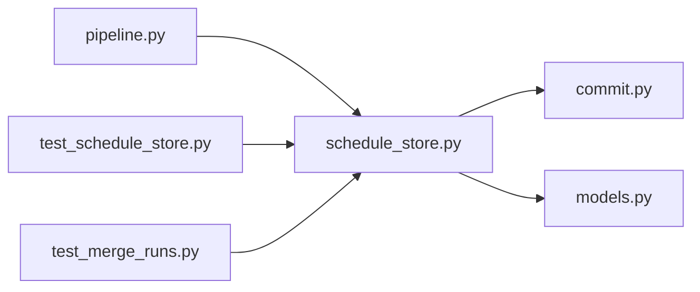

# schedule_store.py

저장소 경로 `backend/src/backend/db/schedule_store.py` 의 관계 노트입니다. `scripts/codegraph.py` 가 생성하므로 직접 수정하지 않습니다.

## imports

- [[graph/backend/src/backend/db/commit|commit.py]]
- [[graph/backend/src/backend/db/models|models.py]]

## imported by

- [[graph/backend/src/backend/db/pipeline|pipeline.py]]
- [[graph/backend/tests/integration/db/test_schedule_store|test_schedule_store.py]]
- [[graph/backend/tests/unit/test_merge_runs|test_merge_runs.py]]

## 함수와 호출

- `merge_runs`
- `save_schedule`: `backend.db.commit`, `backend.db.models`
- `_archive_current`: `backend.db.models`
- `_prune_backups`
- `list_backup_rounds`
- `rollback_schedule`: `backend.db.commit`, `backend.db.models`
