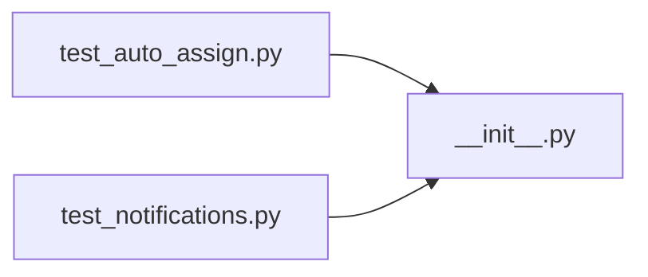

# __init__.py

저장소 경로 `backend/src/backend/jobs/__init__.py` 의 관계 노트입니다. `scripts/codegraph.py` 가 생성하므로 직접 수정하지 않습니다.

## imports

- 없음

## imported by

- [[graph/backend/tests/integration/db/test_auto_assign|test_auto_assign.py]]
- [[graph/backend/tests/integration/db/test_notifications|test_notifications.py]]
