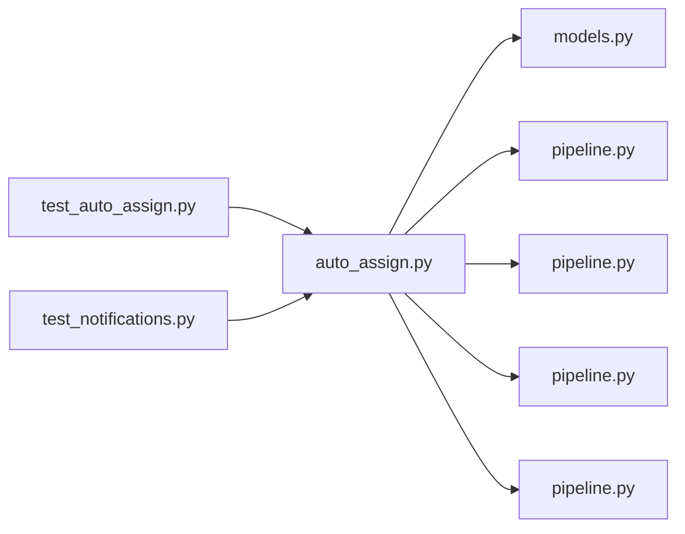

# auto_assign.py

저장소 경로 `backend/src/backend/jobs/auto_assign.py` 의 관계 노트입니다. `scripts/codegraph.py` 가 생성하므로 직접 수정하지 않습니다.

## imports

- [[graph/backend/src/backend/db/models|models.py]]
- [[graph/backend/src/backend/db/pipeline|pipeline.py]]
- [[graph/backend/src/backend/services/board/pipeline|pipeline.py]]
- [[graph/backend/src/backend/services/notification/pipeline|pipeline.py]]
- [[graph/backend/src/backend/services/period/pipeline|pipeline.py]]

## imported by

- [[graph/backend/tests/integration/db/test_auto_assign|test_auto_assign.py]]
- [[graph/backend/tests/integration/db/test_notifications|test_notifications.py]]

## 함수와 호출

- `due_slots`
- `run_due_assignments`: `backend.services.period.pipeline`
- `_ran_slots_today`
- `_run_one`: `backend.services.notification.pipeline`, `backend.services.period.pipeline`
- `_mark_ran`: `backend.db.models`
- `enabled_from_env`
- `interval_seconds_from_env`
- `main`: `backend.db.pipeline`, `backend.services.board.pipeline`
