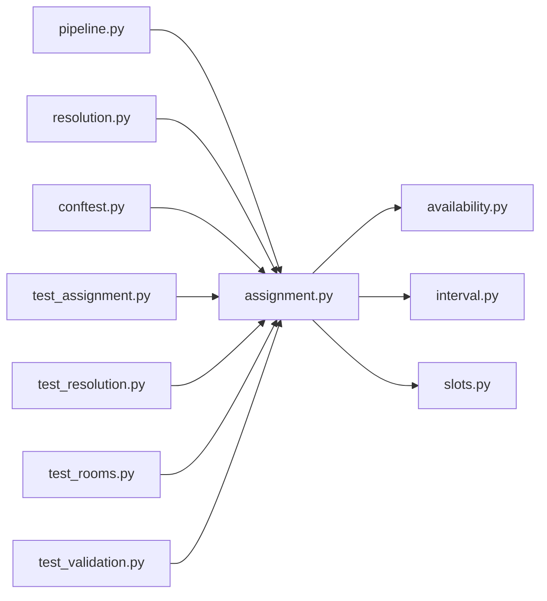

# assignment.py

저장소 경로 `backend/src/backend/scheduling/assignment.py` 의 관계 노트입니다. `scripts/codegraph.py` 가 생성하므로 직접 수정하지 않습니다.

## imports

- [[graph/backend/src/backend/scheduling/availability|availability.py]]
- [[graph/backend/src/backend/scheduling/interval|interval.py]]
- [[graph/backend/src/backend/scheduling/slots|slots.py]]

## imported by

- [[graph/backend/src/backend/scheduling/pipeline|pipeline.py]]
- [[graph/backend/src/backend/scheduling/resolution|resolution.py]]
- [[graph/backend/tests/conftest|conftest.py]]
- [[graph/backend/tests/unit/test_assignment|test_assignment.py]]
- [[graph/backend/tests/unit/test_resolution|test_resolution.py]]
- [[graph/backend/tests/unit/test_rooms|test_rooms.py]]
- [[graph/backend/tests/unit/test_validation|test_validation.py]]

## 함수와 호출

- `_build_room_slots`: `backend.scheduling.slots`
- `_build_room_sessions`: `backend.scheduling.slots`
- `_covered_slots`: `backend.scheduling.slots`
- `_validate`
- `assign`
- `_session_vars`: `backend.scheduling.availability`
- `_indices_by_slot`
- `_indices_by_interval`
- `_vars_of`
- `_one_team_per_slot`
- `_one_room_per_team`
- `_one_place_per_member`
- `_solve`
- `_picked_indices`
- `_limit_per_day`
- `_prefer_back_to_back`
- `_at_most_one`
