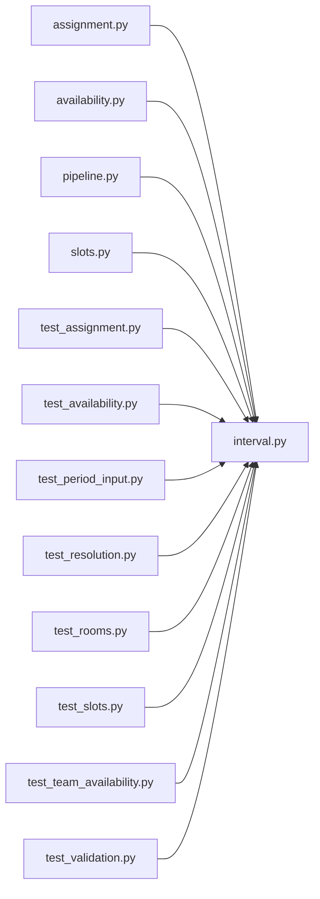

# interval.py

저장소 경로 `backend/src/backend/scheduling/interval.py` 의 관계 노트입니다. `scripts/codegraph.py` 가 생성하므로 직접 수정하지 않습니다.

## imports

- 없음

## imported by

- [[graph/backend/src/backend/scheduling/assignment|assignment.py]]
- [[graph/backend/src/backend/scheduling/availability|availability.py]]
- [[graph/backend/src/backend/scheduling/pipeline|pipeline.py]]
- [[graph/backend/src/backend/scheduling/slots|slots.py]]
- [[graph/backend/tests/unit/test_assignment|test_assignment.py]]
- [[graph/backend/tests/unit/test_availability|test_availability.py]]
- [[graph/backend/tests/unit/test_period_input|test_period_input.py]]
- [[graph/backend/tests/unit/test_resolution|test_resolution.py]]
- [[graph/backend/tests/unit/test_rooms|test_rooms.py]]
- [[graph/backend/tests/unit/test_slots|test_slots.py]]
- [[graph/backend/tests/unit/test_team_availability|test_team_availability.py]]
- [[graph/backend/tests/unit/test_validation|test_validation.py]]
