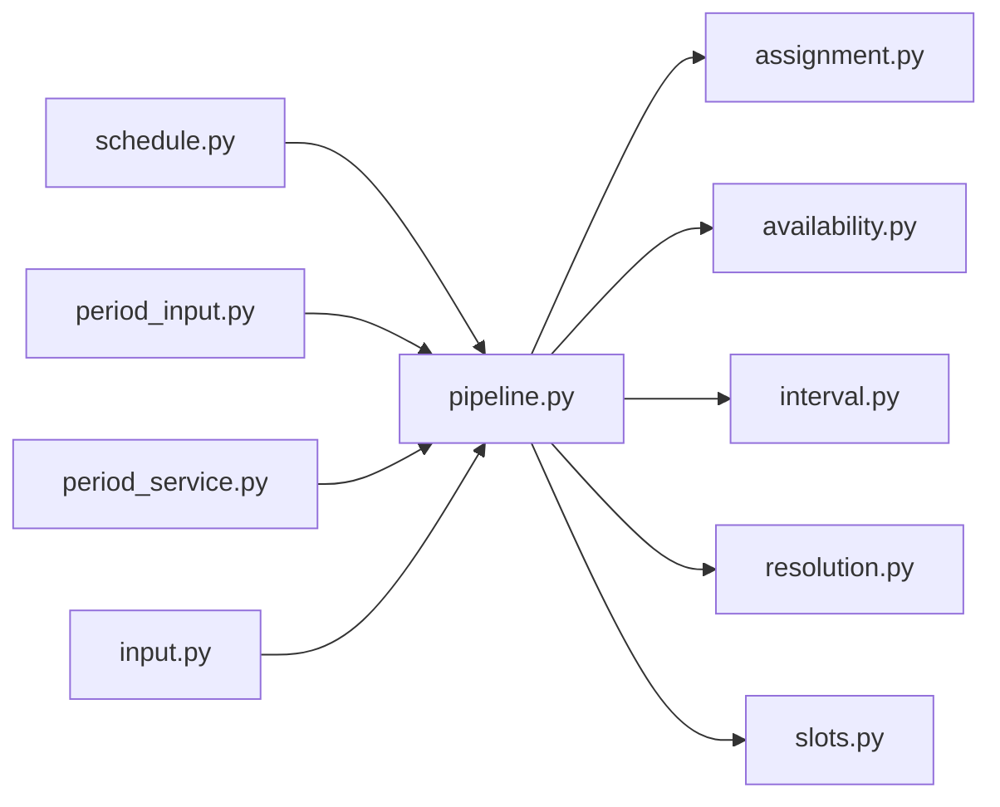

# pipeline.py

저장소 경로 `backend/src/backend/scheduling/pipeline.py` 의 관계 노트입니다. `scripts/codegraph.py` 가 생성하므로 직접 수정하지 않습니다.

## imports

- [[graph/backend/src/backend/scheduling/assignment|assignment.py]]
- [[graph/backend/src/backend/scheduling/availability|availability.py]]
- [[graph/backend/src/backend/scheduling/interval|interval.py]]
- [[graph/backend/src/backend/scheduling/resolution|resolution.py]]
- [[graph/backend/src/backend/scheduling/slots|slots.py]]

## imported by

- [[graph/backend/src/backend/api/routers/schedule|schedule.py]]
- [[graph/backend/src/backend/services/period/period_input|period_input.py]]
- [[graph/backend/src/backend/services/period/period_service|period_service.py]]
- [[graph/backend/src/backend/services/validation/input|input.py]]

## 함수와 호출

- `resolve`: `backend.scheduling.resolution`
