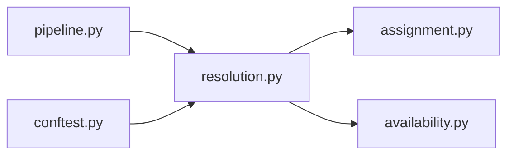

# resolution.py

저장소 경로 `backend/src/backend/scheduling/resolution.py` 의 관계 노트입니다. `scripts/codegraph.py` 가 생성하므로 직접 수정하지 않습니다.

## imports

- [[graph/backend/src/backend/scheduling/assignment|assignment.py]]
- [[graph/backend/src/backend/scheduling/availability|availability.py]]

## imported by

- [[graph/backend/src/backend/scheduling/pipeline|pipeline.py]]
- [[graph/backend/tests/conftest|conftest.py]]

## 함수와 호출

- `resolve`: `backend.scheduling.assignment`
- `_member_ids`
- `_teams_without`: `backend.scheduling.availability`
