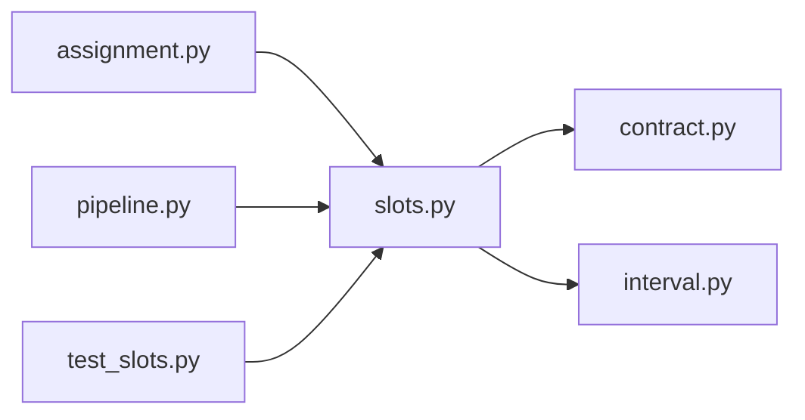

# slots.py

저장소 경로 `backend/src/backend/scheduling/slots.py` 의 관계 노트입니다. `scripts/codegraph.py` 가 생성하므로 직접 수정하지 않습니다.

## imports

- [[graph/backend/src/backend/contract|contract.py]]
- [[graph/backend/src/backend/scheduling/interval|interval.py]]

## imported by

- [[graph/backend/src/backend/scheduling/assignment|assignment.py]]
- [[graph/backend/src/backend/scheduling/pipeline|pipeline.py]]
- [[graph/backend/tests/unit/test_slots|test_slots.py]]

## 함수와 호출

- `_is_on_grid`
- `generate_slots`: `backend.scheduling.interval`
- `generate_sessions`: `backend.scheduling.interval`
