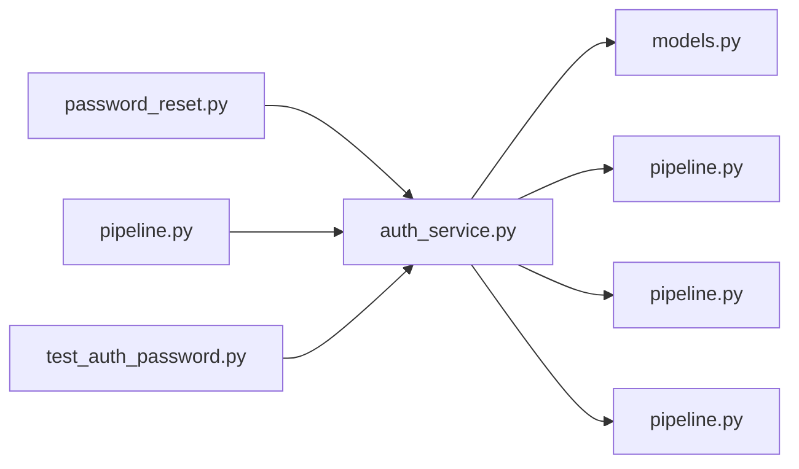

# auth_service.py

저장소 경로 `backend/src/backend/services/auth/auth_service.py` 의 관계 노트입니다. `scripts/codegraph.py` 가 생성하므로 직접 수정하지 않습니다.

## imports

- [[graph/backend/src/backend/db/models|models.py]]
- [[graph/backend/src/backend/db/pipeline|pipeline.py]]
- [[graph/backend/src/backend/services/permission/pipeline|pipeline.py]]
- [[graph/backend/src/backend/services/validation/pipeline|pipeline.py]]

## imported by

- [[graph/backend/src/backend/services/auth/password_reset|password_reset.py]]
- [[graph/backend/src/backend/services/auth/pipeline|pipeline.py]]
- [[graph/backend/tests/unit/test_auth_password|test_auth_password.py]]

## 함수와 호출

- `hash_password`
- `verify_password`
- `_needs_rehash`
- `_matches_admin_code`
- `signup`: `backend.db.models`, `backend.db.pipeline`, `backend.services.permission.pipeline`, `backend.services.validation.pipeline`
- `update_profile`: `backend.db.pipeline`, `backend.services.validation.pipeline`
- `change_password`: `backend.services.validation.pipeline`
- `login`
